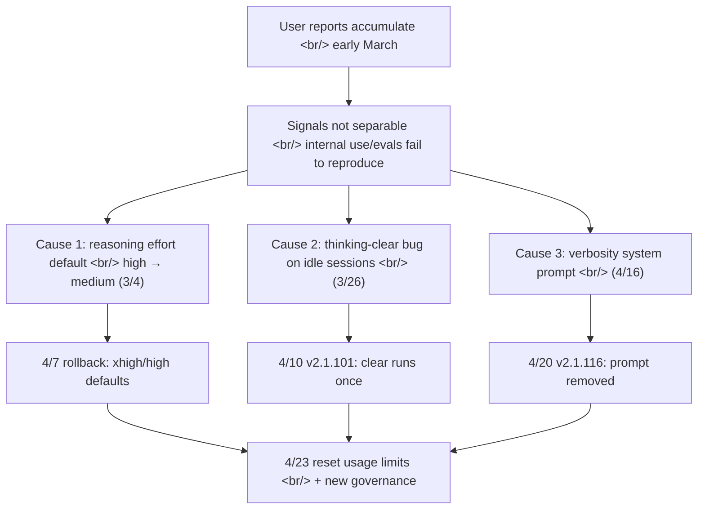

## Overview

[Anthropic's April 23 postmortem](https://www.anthropic.com/engineering/april-23-postmortem) attributes a month of Claude Code quality complaints to **three independent product-layer changes**, not to the API or inference fleet. It's not a capacity or region outage, but the failure modes — silent default changes, an off-by-N caching bug, and a single system-prompt line causing a 3% eval drop — are the LLM analogue of classic SRE failure patterns. Anyone building on shared model infrastructure should read it twice.

<!--more-->

All three issues hit [Claude Code](https://docs.claude.com/en/docs/claude-code/overview), the [Claude Agent SDK](https://docs.claude.com/en/docs/agent-sdk), and Claude Cowork. The [Messages API](https://docs.claude.com/en/api/messages) was untouched. That the signal stayed muddy for six weeks is the bigger story.

## 1. Default reasoning effort: high → medium (Mar 4)

When [Opus 4.6 shipped in Claude Code](https://www.anthropic.com/news/claude-opus-4-6) it defaulted to `high`. Tail-latency complaints (UI appearing frozen) accumulated. Anthropic's internal evals showed `medium` sitting at a better operating point on the latency-vs-intelligence curve:

> "In our internal evals and testing, medium effort achieved slightly lower intelligence with significantly less latency for the majority of tasks."

User feedback disagreed. As good UX dictates, most users stayed on the default rather than reaching for `/effort` — so a "slightly lower" eval delta translated into a much larger perceived quality drop in the wild. On April 7 the change was reverted; [Opus 4.7](https://www.anthropic.com/news/claude-opus-4-7) now defaults to `xhigh`, everything else to `high`.

**Takeaway.** Moving a default operating point on a model's [test-time compute curve](https://arxiv.org/abs/2408.03314) is one of the easiest ways to ship a silent quality regression. Internal evals undercount the human-perceived gap because most users never change defaults — defaults *are* the product promise.

## 2. A caching optimization that dropped thinking history every turn (Mar 26)

This is the most technically interesting failure. Anthropic leans hard on [prompt caching](https://docs.anthropic.com/en/docs/build-with-claude/prompt-caching) — the team literally wrote ["prompt caching is everything"](https://claude.com/blog/lessons-from-building-claude-code-prompt-caching-is-everything).

The intent was clean: when a session has been **idle for more than an hour** and is bound for a cache miss anyway, prune older thinking blocks to reduce uncached tokens at resume time. They reached for [the `clear_thinking_20251015` context-editing strategy](https://docs.claude.com/en/docs/build-with-claude/context-editing) with `keep:1`.

**The bug.** Instead of running once when an idle session resumed, the clear header was attached to **every subsequent request for the rest of the session**. Each request told the API to keep only the most recent reasoning block and discard the rest. If a follow-up arrived mid-tool-use, even the current turn's reasoning got dropped. Claude kept executing, but increasingly without memory of why it had picked the actions it had — surfacing as the forgetfulness, repetition, and odd tool choices users reported.

A secondary effect: every such request became a cache miss, which is what drove the parallel reports of **usage limits draining unexpectedly fast**.

### Why it slipped through

> "The changes it introduced made it past multiple human and automated code reviews, as well as unit tests, end-to-end tests, automated verification, and dogfooding."

Three coincidences combined:
1. An **internal-only message-queuing experiment** running concurrently muddied the signal
2. An **orthogonal change to thinking display** suppressed the bug in most CLI sessions
3. The trigger was a **stale-session corner case** that didn't reproduce in dogfooding

After the fact, Anthropic back-tested [Claude Code Review](https://code.claude.com/docs/en/code-review) on the offending PRs: **Opus 4.7 found the bug when given enough repo context, Opus 4.6 did not.** One of the committed follow-ups is to ship multi-repo context support in Code Review to customers.

**Takeaway.** Don't watch cache hit rate purely as a cost metric. A **sudden jump in cache misses** is a first-class signal of a context-management regression. Memory/reasoning-preservation code lures unit tests into false confidence — your multi-turn integration tests should explicitly assert how context evolves as turn count grows.

## 3. One system-prompt line cost 3% of evals (Apr 16)

[Opus 4.7's launch post](https://www.anthropic.com/news/claude-opus-4-7) calls out a verbose tendency in the new model — smarter on hard problems, more output tokens. Anthropic worked the problem across training, prompting, and product UX. One line in the system prompt did outsized damage:

> _"Length limits: keep text between tool calls to ≤25 words. Keep final responses to ≤100 words unless the task requires more detail."_

The eval set in use during pre-release testing showed no regression, so it shipped on April 16. Post-incident ablation against a broader eval suite showed a **3% drop on both Opus 4.6 and Opus 4.7**. Reverted in v2.1.116 on April 20.

**Takeaway.** A single system-prompt line is a [globally-applied config change](https://martinfowler.com/articles/feature-toggles.html), not an experiment. The same line affects each model differently — hence Anthropic's new CLAUDE.md guidance that **"model-specific changes are gated to the specific model they're targeting."**

## Why detection took a month — anatomy of a signal-separation failure

Three changes, three rollout schedules, three different traffic slices:

| Change | Affected models | Traffic slice | Time to find |
|---|---|---|---|
| effort default | Sonnet 4.6, Opus 4.6 | default-mode users (majority) | ~5 weeks |
| thinking-clear bug | Sonnet 4.6, Opus 4.6 | sessions resumed after 1hr idle | ~2 weeks |
| verbosity prompt | Sonnet 4.6, Opus 4.6, Opus 4.7 | everything after Opus 4.7 ship | ~4 days |

Each cohort suffered differently, and the aggregate looked like **"broad, inconsistent degradation"** — the worst pattern for an incident commander to disentangle. Alongside, the community surfaced detailed external audits (e.g., [Stella Laurenzo's analysis of 6,852 session files and 234,000 tool calls](https://venturebeat.com/technology/mystery-solved-anthropic-reveals-changes-to-claudes-harnesses-and-operating-instructions-likely-caused-degradation)) that became forcing functions.

The [Google SRE chapter on managing incidents](https://sre.google/sre-book/managing-incidents/) frames "distinguish signal from noise" as the first job; for LLM products it gets harder because user satisfaction is inherently distributional. Reports right after a change blend [confirmation bias](https://en.wikipedia.org/wiki/Confirmation_bias) with real regressions.

## What Anthropic committed to going forward

From the postmortem's "Going forward" section:

- **Have more internal staff use the exact public Claude Code build** rather than the feature-test build — closing the dogfooding gap
- **Ship the internal Code Review improvements** (additional repo context) to customers
- **Per-model evals required for every system-prompt change**, with ablation
- **New tooling to review and audit prompt changes**
- **CLAUDE.md guidance** to gate model-specific changes
- **Soak periods + gradual rollouts** for any change that could trade off against intelligence
- **[@ClaudeDevs on X](https://twitter.com/ClaudeDevs) and GitHub** as centralized comm channels

Compared with [OpenAI's public incident pattern on its status page](https://status.openai.com/history) — mostly availability and latency events — Anthropic is unusual in formally extending the incident surface to include **quality regressions**.

## What this means if you build on Claude (or any frontier API)

The blast radius of [shared infrastructure](https://en.wikipedia.org/wiki/Blast_radius_(software)) now includes **harness and system prompt**, not just model weights. As a downstream operator:

- **Regression-test the output distribution.** Beyond latency and error rate, baseline **token distribution, tool-call patterns, response lengths** and diff them daily. LLM eval platforms like [LangSmith](https://docs.smith.langchain.com/) and [Braintrust](https://www.braintrust.dev/) exist for this.
- **Feature-flag your own [prompt changes](https://martinfowler.com/articles/feature-toggles.html).** When your changes and the vendor's overlap in time, signal separation becomes nearly impossible.
- **Plan for multi-provider routing.** Tools like [LiteLLM](https://docs.litellm.ai/), [OpenRouter](https://openrouter.ai/), and [AWS Bedrock](https://aws.amazon.com/bedrock/) let you fail over models. Single-vendor dependence creates exactly this "all users simultaneously worse" pattern.
- **Elevate cache hit rate to a real SLI.** Sudden miss-rate jumps are both a cost signal and a **context-management regression signal**.
- **Idempotent retries + circuit breakers** still apply. [Polly](https://github.com/App-vNext/Polly) and [resilience4j](https://github.com/resilience4j/resilience4j) patterns work for LLM clients too — just budget for retries doubling token spend.
- **Combine user feedback with quantitative metrics.** Free-text reports are leading indicators of unseparated quality regressions, not noise to discard.

## Insights

All three causes are LLM-flavored versions of textbook operational failures. (1) A default change broke implicit user-behavior assumptions. (2) A classic [off-by-N bug](https://en.wikipedia.org/wiki/Off-by-one_error) sat deep in caching-optimization code and survived every layer of review and testing. (3) Eval-set coverage wasn't broad enough to catch a 3% regression from one system-prompt line. **Nothing here is new.** What's new is the diagnostic difficulty. The moment model, harness, and prompt ship as a single bundle to users, overlapping slice regressions don't light up a status page red dot. The controls Anthropic added — required per-model evals, automated ablation, soak periods, narrowing the dogfooding gap — all amount to **"apply infrastructure-grade change management to everything that ships besides the model weights."** Downstream builders should reach the same conclusion. The model is an external variable, but **prompts, routing, and retry policy are ours**. Without SRE-grade change discipline on our side of the line, we'll inflict our own six-week silent degradation on our own users.

## References

### Primary Anthropic sources

- [An update on recent Claude Code quality reports](https://www.anthropic.com/engineering/april-23-postmortem) — the postmortem itself
- [Lessons from building Claude Code — prompt caching is everything](https://claude.com/blog/lessons-from-building-claude-code-prompt-caching-is-everything)
- [Claude Opus 4.7 launch post](https://www.anthropic.com/news/claude-opus-4-7)
- [Engineering at Anthropic index](https://www.anthropic.com/engineering)

### Anthropic API docs

- [Extended thinking guide](https://platform.claude.com/docs/en/build-with-claude/extended-thinking)
- [Context editing — `clear_thinking_20251015`](https://platform.claude.com/docs/en/build-with-claude/context-editing)
- [Prompt caching docs](https://docs.anthropic.com/en/docs/build-with-claude/prompt-caching)
- [Messages API reference](https://docs.claude.com/en/api/messages)
- [Claude Code docs](https://docs.claude.com/en/docs/claude-code/overview)

### SRE / incident-response background

- [Google SRE Book — Managing Incidents](https://sre.google/sre-book/managing-incidents/)
- [Feature Toggles (Martin Fowler)](https://martinfowler.com/articles/feature-toggles.html)
- [Scaling Test-Time Compute (Snell et al., 2024)](https://arxiv.org/abs/2408.03314)

### External analysis / comparison

- [VentureBeat: Anthropic reveals harness changes likely caused degradation](https://venturebeat.com/technology/mystery-solved-anthropic-reveals-changes-to-claudes-harnesses-and-operating-instructions-likely-caused-degradation)
- [OpenAI status page history](https://status.openai.com/history) — pattern comparison
- [LiteLLM multi-provider routing](https://docs.litellm.ai/)
