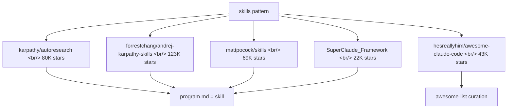

## Overview

Five [Claude Code](https://www.anthropic.com/claude-code) skill and agent collection repos surfaced around the same time on 2026-05-10. One is [Andrej Karpathy](https://x.com/karpathy)'s own autonomous research agent. One is [Matt Pocock](https://x.com/mattpocockuk)'s engineering-grade skill set. One is a full meta-framework called SuperClaude. This is not a coincidence — it is a sign that **"skill" has crystallized into the primary primitive for agent engineering**.

<!--more-->



## Why Skills Are Crystallizing

A skill is the pattern [Anthropic formalized in fall 2025](https://www.anthropic.com/news/skills). The format is dead simple — a folder, a `SKILL.md`, optional helper scripts. Claude Code looks at the user's task context and decides which skill to invoke itself.

That simplicity is the reason for the explosion.

- **Version-controllable** — it's just text. Review with `git diff`, accept PRs against it.
- **Composable** — one skill can call another. `/grill-me` → `/to-prd` → `/to-issues` → `/tdd` becomes a natural pipeline.
- **Model-agnostic in spirit** — Claude Code is the first mover, but the format is markdown, so it ports trivially. [SuperGemini](https://github.com/SuperClaude-Org/SuperGemini_Framework) and [SuperQwen](https://github.com/SuperClaude-Org/SuperQwen_Framework) forks already exist.
- **Shareable** — pull an entire repo into your agent with `/plugin marketplace add`.

These five repos are five facets of that pattern crystallizing.

## 1. karpathy/autoresearch — Skill as a Research Agent's program.md

[karpathy/autoresearch](https://github.com/karpathy/autoresearch) sits at 80,223 stars. Created 2026-03-06, *"AI agents running research on single-GPU nanochat training automatically."*

The idea is simple. Hand an AI agent a small but real LLM training setup and let it experiment overnight. Modify code → train 5 min → compare → keep or discard → repeat. You wake up to a log of experiments and (hopefully) a better model.

The structure is what matters.

```
prepare.py   — constants, data prep (do not modify)
train.py     — model/optimizer/training loop (agent edits this)
program.md   — agent instructions (human edits this)
```

[Karpathy himself states it in the README](https://github.com/karpathy/autoresearch#running-the-agent):

> The `program.md` file is essentially a super lightweight "skill".

That's the line. Karpathy chose the word "skill." Not a 10,000-line framework wrapping autonomous research orchestration on top of nanochat training code — **one markdown file**. The human evolves `program.md`. The agent evolves `train.py`. Two meta-evolution loops, cleanly separated.

Why this matters — Karpathy is the last person you'd expect to outsource a training setup. If he ends at one markdown file, everyone else has license to simplify harder.

## 2. forrestchang/andrej-karpathy-skills — Skills as Behavioral Correction

[forrestchang/andrej-karpathy-skills](https://github.com/forrestchang/andrej-karpathy-skills) has 123,691 stars. *"A single `CLAUDE.md` file to improve Claude Code behavior, derived from Andrej Karpathy's observations on LLM coding pitfalls."*

It distills four principles from [Karpathy's X post on LLM coding pitfalls](https://x.com/karpathy/status/2015883857489522876).

| Principle | Addresses |
|-----------|-----------|
| **Think Before Coding** | Wrong assumptions, hidden confusion, missing tradeoffs |
| **Simplicity First** | Overcomplication, bloated abstractions |
| **Surgical Changes** | Touching unrelated code, "improving" things you shouldn't |
| **Goal-Driven Execution** | Loop until verifiable success criteria |

Installation is two paths — [`/plugin marketplace add forrestchang/andrej-karpathy-skills`](https://docs.anthropic.com/en/docs/claude-code/plugins) for Claude Code, or curl the `CLAUDE.md` into your project. The same ruleset is committed as [`.cursor/rules/karpathy-guidelines.mdc`](https://github.com/forrestchang/andrej-karpathy-skills/blob/main/.cursor/rules/karpathy-guidelines.mdc) for Cursor.

The thesis quote:

> "LLMs are exceptionally good at looping until they meet specific goals... Don't tell it what to do, give it success criteria and watch it go." — Karpathy

This is skills used as **a ruleset that corrects model behavior**. Not adding capabilities — subtracting failure modes.

## 3. mattpocock/skills — Skills For Real Engineers

[mattpocock/skills](https://github.com/mattpocock/skills) sits at 69,128 stars, MIT, last pushed 2026-05-10. *"Skills for Real Engineers. Straight from my .claude directory."*

This repo stakes out an explicit position against full-process frameworks like [GSD](https://github.com/agentic-pm/gsd), [BMAD](https://github.com/bmad-org/bmad), and [Spec-Kit](https://github.com/github/spec-kit). The README is blunt:

> Approaches like GSD, BMAD, and Spec-Kit try to help by owning the process. But while doing so, they take away your control and make bugs in the process hard to resolve.
>
> These skills are designed to be small, easy to adapt, and composable. They work with any model.

Matt's four failure modes and their skills:

| Failure mode | Skill |
|--------------|------|
| #1 The Agent Didn't Do What I Want | [`/grill-me`](https://github.com/mattpocock/skills/blob/main/skills/productivity/grill-me/SKILL.md), [`/grill-with-docs`](https://github.com/mattpocock/skills/blob/main/skills/engineering/grill-with-docs/SKILL.md) |
| #2 The Agent Is Way Too Verbose | `CONTEXT.md` shared language (built into grill-with-docs) |
| #3 The Code Doesn't Work | [`/tdd`](https://github.com/mattpocock/skills/blob/main/skills/engineering/tdd/SKILL.md), [`/diagnose`](https://github.com/mattpocock/skills/blob/main/skills/engineering/diagnose/SKILL.md) |
| #4 We Built A Ball Of Mud | [`/to-prd`](https://github.com/mattpocock/skills/blob/main/skills/engineering/to-prd/SKILL.md), [`/zoom-out`](https://github.com/mattpocock/skills/blob/main/skills/engineering/zoom-out/SKILL.md), [`/improve-codebase-architecture`](https://github.com/mattpocock/skills/blob/main/skills/engineering/improve-codebase-architecture/SKILL.md) |

Installation goes through the [skills.sh](https://skills.sh/) installer:

```bash
npx skills@latest add mattpocock/skills
```

After install, `/setup-matt-pocock-skills` configures your issue tracker (GitHub / Linear / local files), your triage label vocabulary, and your doc storage path. From there, `to-issues`, `to-prd`, `triage`, `diagnose`, `tdd`, `improve-codebase-architecture`, and `zoom-out` all wire together against the same convention.

Pocock's reading list is itself a signal — [Pragmatic Programmer](https://www.amazon.co.uk/Pragmatic-Programmer-Anniversary-Journey-Mastery/dp/B0833F1T3V), [Domain-Driven Design](https://www.amazon.co.uk/Domain-Driven-Design-Tackling-Complexity-Software/dp/0321125215), [Extreme Programming Explained](https://www.amazon.co.uk/Extreme-Programming-Explained-Embrace-Change/dp/0321278658), [A Philosophy of Software Design](https://www.amazon.co.uk/Philosophy-Software-Design-2nd/dp/173210221X). The argument: **skills are not a new paradigm, they are an LLM-shaped interface to 30 years of software engineering practice**.

## 4. SuperClaude_Framework — A Meta-Programming Layer On Top of Skills

[SuperClaude-Org/SuperClaude_Framework](https://github.com/SuperClaude-Org/SuperClaude_Framework) has 22,726 stars, MIT, homepage [superclaude.netlify.app](https://superclaude.netlify.app/). Created 2025-06-22.

Opposite pole from skill minimalism.

| Metric | Count |
|--------|-------|
| Slash Commands | 30 |
| Specialized AI Agents | 20 |
| Behavioral Modes | 7 |
| MCP Servers | 8 |

Self-described as *"a meta-programming configuration framework that transforms Claude Code into a structured development platform through behavioral instruction injection and component orchestration."*

Install via PyPI:

```bash
pipx install superclaude
superclaude install
```

Headline commands — `/sc:research` (deep research, Tavily MCP), `/sc:brainstorm`, `/sc:implement`, `/sc:test`, `/sc:pm`. Optional MCP servers — [Serena](https://github.com/oraios/serena) (2-3x faster code understanding), [Sequential](https://github.com/sequentialdev/sequential) (30-50% fewer tokens), [Tavily](https://tavily.com), [Context7](https://context7.com) — all routed through [airis-mcp-gateway](https://github.com/agiletec-inc/airis-mcp-gateway).

v5.0 is in development, with a TypeScript plugin system tracked in [issue #419](https://github.com/SuperClaude-Org/SuperClaude_Framework/issues/419). Once shipped, install drops to `/plugin marketplace add SuperClaude-Org/superclaude-plugin-marketplace`.

What SuperClaude proves — **skills are stable enough that a meta-framework can rest on top of them without collapsing.** And the fact that the same format ports to [Gemini](https://github.com/SuperClaude-Org/SuperGemini_Framework) and [Qwen](https://github.com/SuperClaude-Org/SuperQwen_Framework) is empirical evidence of model-neutrality.

## 5. hesreallyhim/awesome-claude-code — The Curation Layer

[hesreallyhim/awesome-claude-code](https://github.com/hesreallyhim/awesome-claude-code) has 43,273 stars, created 2025-04-19 — the oldest of this set. *"A curated list of awesome skills, hooks, slash-commands, agent orchestrators, applications, and plugins for Claude Code by Anthropic."*

It follows the [awesome-list convention](https://github.com/sindresorhus/awesome). The repo's topic tags are revealing — `agentic-coding`, `agent-skills`, `ai-workflow-optimization`, `coding-agents`. The README currently notes *"the previous Table of Contents was no longer fit for purpose"* and is mid-reorganization — which is itself the message. **The Claude Code ecosystem has outgrown what one awesome-list can hold.**

Why this repo belongs in the set: the other four *provide* new skills. This repo solves *where to find them*. Curation is itself a meta-skill.

## Insights

**1. Skill is now the consensus primitive.** Five different people, five different angles, all settling on the same word. Karpathy's `program.md`, Matt Pocock's `SKILL.md`, SuperClaude's slash commands — all framed as "skills." The prior generation of terms ("prompt template", "agent rules", "system message") has collapsed into a single noun.

**2. Full-process frameworks vs. micro-skills is the live fault line.** SuperClaude (30 commands) and Matt Pocock (small, composable) surfacing the same day is coincidence, but the split is real. Both survive. The interesting move is Pocock explicitly naming GSD/BMAD/Spec-Kit as the opposition.

**3. Skills are used to subtract failure modes, not just add capabilities.** Forrest Chang's Karpathy guidelines give the model no new abilities. They prevent behaviors. What Anthropic does at the model level with [Constitutional AI](https://www.anthropic.com/research/constitutional-ai), users now do at the workflow level with skills.

**4. Skills are the substrate of model neutrality — Claude Code is just the first surface.** SuperClaude maintains SuperGemini and SuperQwen forks. Forrest Chang ships a Cursor `.mdc` in the same repo. Matt Pocock writes *"They work with any model"* as a top-line selling point. As the format standardizes, IDE/model lock-in weakens.

**5. The `program.md` pattern has reached training code.** In autoresearch, the *human-edited file* and the *agent-edited file* are physically separated. If that generalizes, every automated codebase trends toward a `human.md` + `agent-modifiable/` shape.

**6. What comes next — skill marketplaces, skill SDKs, skill evals.** [`/plugin marketplace`](https://docs.anthropic.com/en/docs/claude-code/plugins) exists. SuperClaude is listed on [Smithery](https://smithery.ai). [skills.sh](https://skills.sh) emerged as a separate installer. The missing pieces are quality evaluation (which skills actually improve model output) and a skill SDK (build/test skills as if they were code).

**7. Curation itself becomes a skill.** awesome-claude-code earning 43K stars is the symptom of *"there are too many skills to triage manually."* That's the cue for a meta layer.

## References

**Source repos**
- [karpathy/autoresearch](https://github.com/karpathy/autoresearch) — Single-GPU nanochat autonomous research agent. Calls `program.md` a "lightweight skill" explicitly.
- [forrestchang/andrej-karpathy-skills](https://github.com/forrestchang/andrej-karpathy-skills) — Four-principle `CLAUDE.md` derived from Karpathy's LLM coding pitfall observations.
- [mattpocock/skills](https://github.com/mattpocock/skills) — Small, composable engineering skills. Explicit counter to GSD/BMAD/Spec-Kit.
- [SuperClaude-Org/SuperClaude_Framework](https://github.com/SuperClaude-Org/SuperClaude_Framework) — Meta-framework with 30 slash commands, 20 agents, 8 MCP servers.
- [hesreallyhim/awesome-claude-code](https://github.com/hesreallyhim/awesome-claude-code) — Awesome-list for Claude Code resources.

**Background**
- [Anthropic: Introducing Skills](https://www.anthropic.com/news/skills) — Skill format formalization.
- [Claude Code docs: Plugins](https://docs.anthropic.com/en/docs/claude-code/plugins) — `/plugin marketplace` system.
- [Karpathy's LLM coding pitfalls tweet](https://x.com/karpathy/status/2015883857489522876) — Origin of the Forrest Chang guidelines.

**Related**
- [awesome-list convention](https://github.com/sindresorhus/awesome) — Format `awesome-claude-code` inherits.
- [skills.sh](https://skills.sh) — Matt Pocock skill installer.
- [Smithery](https://smithery.ai) — MCP/skill marketplace.
