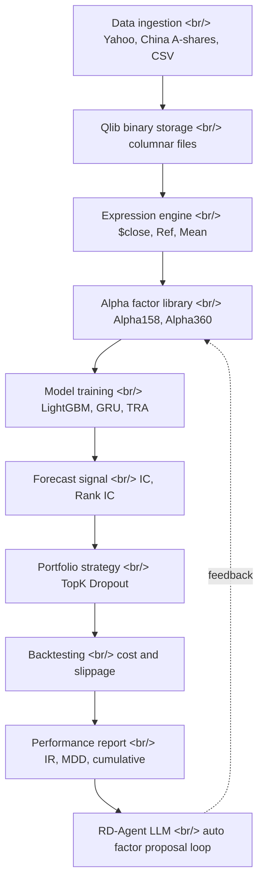

## Overview

[Microsoft qlib](https://github.com/microsoft/qlib) — first open-sourced in August 2020 — is an AI-oriented quantitative investment platform that just crossed 42K stars. It is not a new project, yet it is re-surfacing in 2026 for a specific reason: **LLM-based financial agents** (notably [microsoft/RD-Agent](https://github.com/microsoft/RD-Agent) and its [R&D-Agent-Quant](https://arxiv.org/abs/2505.15155) paper) now automatically **mine alpha factors and optimize models**, and the moment that loop becomes real, you need a **reproducible quant workflow** underneath to score what the LLM proposes. qlib happens to be the most actively maintained open-source one. The framing shift matters: qlib is no longer "yet another backtesting library" — it has become the **rails** the LLM agents are riding on.

<!--more-->

## 1. What qlib actually does

The [qlib README](https://github.com/microsoft/qlib/blob/main/README.md) phrases it as "exploring ideas to implementing productions". Decomposed, it is four layers.

**Layer 1 — data infrastructure.** qlib uses its own [columnar binary format](https://qlib.readthedocs.io/en/latest/component/data.html) to store time-series data. Daily and minute bars that would blow up a pandas DataFrame get compressed into a form that supports **fast slicing**. Data collectors cover both [Yahoo Finance](https://github.com/microsoft/qlib/tree/main/scripts/data_collector/yahoo) and the [China A-share ecosystem](https://github.com/microsoft/qlib/tree/main/scripts/data_collector), and the community-maintained [chenditc/investment_data](https://github.com/chenditc/investment_data) mirror has become a standard fallback.

**Layer 2 — expression engine.** Factors are declared with domain-specific syntax like `$close`, `Ref($close, 1)`, `Mean($close, 3)`, `$high-$low`. This looks trivial but is structurally important — factors are **declared as functions, not as data**, which means an LLM can learn the natural-language-to-qlib-expression translation. That is the first contact surface with RD-Agent.

**Layer 3 — model zoo.** Browse [examples/benchmarks](https://github.com/microsoft/qlib/tree/main/examples/benchmarks) and you find [LightGBM](https://lightgbm.readthedocs.io/), [XGBoost](https://xgboost.readthedocs.io/), [MLP](https://qlib.readthedocs.io/en/latest/component/model.html), [GRU](https://qlib.readthedocs.io/en/latest/component/model.html), [Transformer / Localformer](https://github.com/microsoft/qlib/pull/508), [TabNet](https://github.com/microsoft/qlib/pull/205), [DoubleEnsemble](https://github.com/microsoft/qlib/pull/286), [HIST / IGMTF](https://github.com/microsoft/qlib/pull/1040), [TRA (Temporal Routing Adaptor)](https://github.com/microsoft/qlib/pull/531), [TCTS](https://github.com/microsoft/qlib/pull/491), [ADARNN](https://github.com/microsoft/qlib/pull/689), [ADD](https://github.com/microsoft/qlib/pull/704), and [KRNN / Sandwich](https://github.com/microsoft/qlib/pull/1414) — most of the SOTA time-series architectures from academia sitting behind a single interface.

**Layer 4 — backtest and execution.** The [Nested Decision Framework](https://qlib.readthedocs.io/en/latest/component/highfreq.html) lets you stack a daily strategy and a minute-level execution policy in the same decision tree. [Online serving](https://github.com/microsoft/qlib/pull/290) automates model rolling. The [RL learning framework](https://qlib.readthedocs.io/en/latest/component/rl.html) models order execution as a continuous decision problem.

## 2. Why Microsoft open-sourced it

The original [qlib paper](https://arxiv.org/abs/2009.11189) came out of the time-series and finance group at [Microsoft Research Asia (MSRA)](https://www.microsoft.com/en-us/research/lab/microsoft-research-asia/). The surface reason is "open research". The actual motivators are three, stacked.

**Research credibility capital.** Time-series ML papers — [HIST](https://arxiv.org/abs/2110.13716), [DDG-DA](https://arxiv.org/abs/2201.04038), [ADARNN](https://arxiv.org/abs/2108.04443), [TRA](https://arxiv.org/abs/2106.12950) — are all reproducible on the same platform. The graphs in the paper match runnable code, so MSRA's time-series papers escape the "is the implementation actually real" suspicion.

**Talent pipeline.** Students and interns in [Jiang Bian's group](https://www.microsoft.com/en-us/research/people/jiabia/) write papers on top of qlib and then disperse to Microsoft, hedge funds, and big tech post-graduation. The open-source is a recruiting funnel.

**Azure ML adjacency.** qlib's workflow manager hooks directly into [MLflow](https://mlflow.org/) experiment tracking. The moment Azure ML standardized on MLflow compatibility, qlib became the most natural domain-specific ML stack to run on Azure.

## 3. How it compares to pyfolio / zipline / vectorbt

The legacy open-source quant stack is pre-ML in design.

- [zipline](https://github.com/quantopian/zipline) — Quantopian's backtest engine, now kept alive via the [zipline-reloaded](https://github.com/stefan-jansen/zipline-reloaded) fork after Quantopian shut down in 2020. Centered on **event-driven backtesting**; ML workflow lives outside.
- [pyfolio](https://github.com/quantopian/pyfolio) — **post-hoc analysis** of backtest results. IR, drawdown, factor exposure. Does not touch training.
- [vectorbt](https://vectorbt.dev/) — vectorized backtesting, great for **fast parameter sweeps**. Built for fast simulation of a single strategy, not ML-first.
- [backtrader](https://www.backtrader.com/) — event-driven, retail-friendly. Same constraint.

qlib's distinction is that it unifies the **entire time-series ML pipeline** under one interface. Data ingestion → factor expressions → model training → signal evaluation → backtest → analysis → online serving, all driven by a single `qrun` command against a [YAML workflow](https://github.com/microsoft/qlib/blob/main/examples/benchmarks/LightGBM/workflow_config_lightgbm_Alpha158.yaml). This shape is **easy for an LLM agent to call** — one natural-language command maps to one YAML, and the result metrics (IC, Rank IC, IR, MDD) come back as a single JSON.

## 4. LLM-meets-quant — enter RD-Agent

[RD-Agent](https://github.com/microsoft/RD-Agent) — released by Microsoft on Aug 8, 2024 and formalized in the [R&D-Agent-Quant paper](https://arxiv.org/abs/2505.15155) — is an **LLM-based autonomous evolving agent** framework. The name sounds generic, but the first concrete use case is precisely **automated alpha factor mining** on top of qlib.

The loop looks like this.

1. An LLM reads financial domain text — papers, reports, news — and proposes **factor hypotheses** in natural language
2. Each hypothesis is compiled into a [qlib expression](https://qlib.readthedocs.io/en/latest/component/data.html#feature-engineering)
3. qlib applies the factor to historical data and computes **IC / Rank IC**
4. Factors that score well survive; the rest go back to the LLM as feedback for the next round
5. A similar loop exists at the model layer — hyperparameter and architecture search

What is interesting structurally is that the LLM is **not imitating a human** — it sits in the slot where it can try orders of magnitude more candidates than a human quant. Where a human researcher might build and test five to ten factors per week, an LLM agent runs hundreds in the same time. It pushes the **bias-variance frontier** of backtesting beyond what a person can mentally track.

Microsoft has published three [RD-Agent demo videos](https://www.youtube.com/watch?v=X4DK2QZKaKY) — Quant Factor Mining, Factor Mining from Reports, and Quant Model Optimization. All three follow the same pattern: LLM generates hypotheses, qlib validates them, the evaluation signal feeds back into the LLM.

## 5. Why now

Three signals overlap.

**First, the project is alive.** [v0.9.7](https://github.com/microsoft/qlib/releases/tag/v0.9.7) shipped in August 2025, and the main branch had pushes into April 2026. By contrast [pyfolio](https://github.com/quantopian/pyfolio) and the original [zipline](https://github.com/quantopian/zipline) are effectively frozen. Actively maintained open-source quant stacks are rare.

**Second, BPQP for end-to-end learning** is en route as an [under-review PR](https://github.com/microsoft/qlib/pull/1863). Making the **quadratic-programming step of portfolio optimization differentiable** means alpha-to-position becomes a single trainable graph. This is not a routine library upgrade — it converts portfolio construction itself into a learnable layer.

**Third, the LLM tool-use path is obvious.** RD-Agent calls qlib as a tool, gets JSON back, generates the next hypothesis. The pattern maps cleanly to [Anthropic tool use](https://docs.claude.com/en/docs/agents-and-tools/tool-use/overview) and the [OpenAI Responses API](https://platform.openai.com/docs/api-reference/responses). The equation is simple: **one qlib YAML workflow = one LLM function call**.

## 6. The constraint — data, then more data

The [⚠️ banner at the top of the README](https://github.com/microsoft/qlib#data-preparation) — "Due to more restrict data security policy. The official dataset is disabled temporarily." The official dataset is paused, replaced by a community mirror. This is qlib's largest structural weakness: **good time-series data is not free**. Yahoo Finance is weak on minute bars and realtime, and China A-share data is bound to exchange policy.

Move to commercial data and the standards are [Bloomberg](https://www.bloomberg.com/professional/products/bloomberg-terminal/), [Refinitiv](https://www.lseg.com/en/data-analytics), and [WRDS](https://wrds-www.wharton.upenn.edu/), but licensing is expensive. qlib's [Arctic backend](https://github.com/microsoft/qlib/pull/744) and [Point-in-Time database](https://github.com/microsoft/qlib/pull/343) modules are designed so commercial data pipelines can be plugged in — but solving the data problem is on the user. What open-source can give you is **the rails**, and nothing further.

## Insight

Looked at in isolation, qlib reads as "a well-built time-series ML library". Looked at next to RD-Agent, the picture changes. An LLM generating factor hypotheses in natural language, qlib scoring them via backtest, the score flowing back into the LLM — the **automated alpha-mining loop** has just landed in production-grade open source for the first time, and this is where. Two consequences. First, **the barrier to entry for solo quants drops again** — without a PhD in time-series ML you can tell an LLM "build a momentum factor from earnings-call transcripts of the last three months" and let only the ones with IC above 0.05 through. Second, **the differentiation axis for hedge funds moves up one level** — once factor discovery itself is automated, edge shifts to **data (proprietary alternative datasets)**, **compute (scale of parallel agents)**, and **governance (meta-systems against overfitting)**. qlib is the baseline that this shift sits on top of. Over 2026 the "alpha-mining LLM agent + qlib" combination has a high probability of becoming the standard setup for both hedge funds and independent research groups. The fastest entry point — `pip install pyqlib`, pull data from [chenditc/investment_data](https://github.com/chenditc/investment_data/releases), and run the [LightGBM Alpha158 workflow](https://github.com/microsoft/qlib/blob/main/examples/benchmarks/LightGBM/workflow_config_lightgbm_Alpha158.yaml) with `qrun`. A single command gets you a baseline at roughly IR 2.0.

## References

**Repository and docs**
- [microsoft/qlib GitHub repository](https://github.com/microsoft/qlib)
- [qlib official docs (Read the Docs)](https://qlib.readthedocs.io/en/latest/)
- [PyPI — pyqlib](https://pypi.org/project/pyqlib/)
- [Qlib data module docs](https://qlib.readthedocs.io/en/latest/component/data.html)
- [Qlib workflow docs](https://qlib.readthedocs.io/en/latest/component/workflow.html)
- [Qlib RL component](https://qlib.readthedocs.io/en/latest/component/rl.html)
- [Qlib v0.9.7 release notes](https://github.com/microsoft/qlib/releases/tag/v0.9.7)

**Papers and related research**
- [Qlib: An AI-oriented Quantitative Investment Platform (arXiv:2009.11189)](https://arxiv.org/abs/2009.11189)
- [R&D-Agent-Quant paper (arXiv:2505.15155)](https://arxiv.org/abs/2505.15155)
- [HIST time-series model paper (arXiv:2110.13716)](https://arxiv.org/abs/2110.13716)
- [DDG-DA paper (arXiv:2201.04038)](https://arxiv.org/abs/2201.04038)
- [TRA temporal routing paper (arXiv:2106.12950)](https://arxiv.org/abs/2106.12950)
- [ADARNN paper (arXiv:2108.04443)](https://arxiv.org/abs/2108.04443)

**LLM-meets-quant ecosystem**
- [microsoft/RD-Agent GitHub](https://github.com/microsoft/RD-Agent)
- [RD-Agent Quant Factor Mining demo](https://www.youtube.com/watch?v=X4DK2QZKaKY)
- [Anthropic tool use guide](https://docs.claude.com/en/docs/agents-and-tools/tool-use/overview)
- [OpenAI Responses API](https://platform.openai.com/docs/api-reference/responses)

**Comparable open-source stacks**
- [zipline-reloaded](https://github.com/stefan-jansen/zipline-reloaded)
- [pyfolio](https://github.com/quantopian/pyfolio)
- [vectorbt](https://vectorbt.dev/)
- [backtrader](https://www.backtrader.com/)
- [chenditc/investment_data mirror](https://github.com/chenditc/investment_data)
