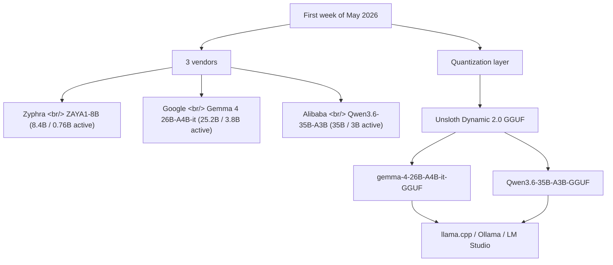
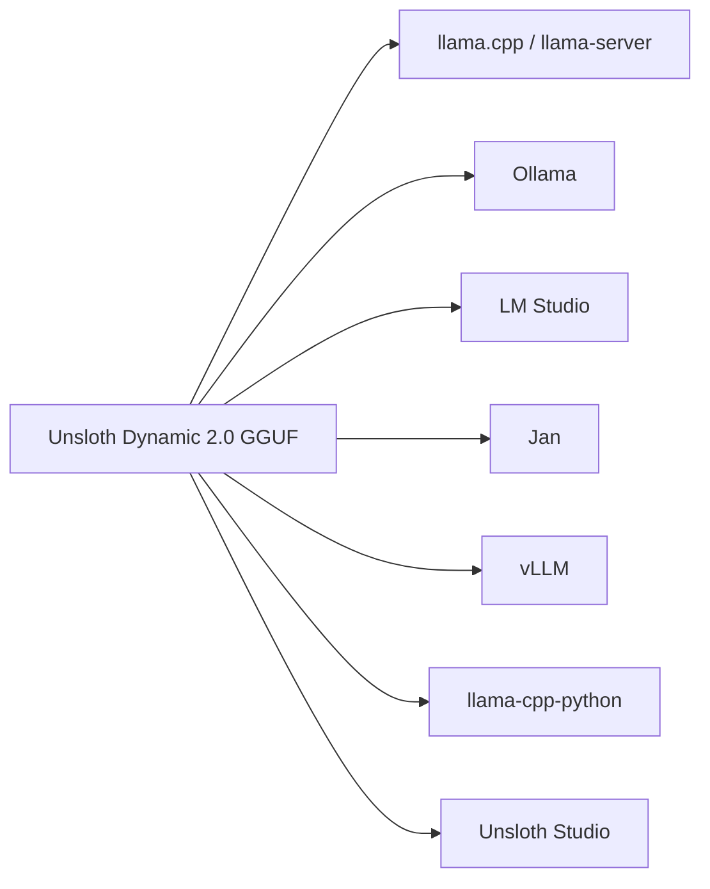

## Overview

The first week of May 2026 was a quietly heavy week for open weights. [Zyphra](https://www.zyphra.com/) shipped [ZAYA1-8B](https://huggingface.co/Zyphra/ZAYA1-8B) — 8B-class reasoning with only 760M active parameters. [Google](https://blog.google/innovation-and-ai/technology/developers-tools/gemma-4/) released [Gemma 4 26B-A4B-it](https://huggingface.co/google/gemma-4-26B-A4B-it), a 25.2B / 3.8B-active multimodal MoE. [Alibaba's Qwen team](https://huggingface.co/Qwen) followed with [Qwen 3.6 35B-A3B](https://huggingface.co/unsloth/Qwen3.6-35B-A3B-GGUF), 35B total / 3B active. And on top of that, [Unsloth](https://unsloth.ai/) had [Gemma 4 GGUF](https://huggingface.co/unsloth/gemma-4-26B-A4B-it-GGUF) and [Qwen 3.6 GGUF](https://huggingface.co/unsloth/Qwen3.6-35B-A3B-GGUF) builds running on [llama.cpp](https://github.com/ggerganov/llama.cpp) and [Ollama](https://ollama.com/) within days. Zoom out and the pattern is clear: **the 8B–35B class is now MoE with 1–4B active, and quantized builds ship at the same time as the reference weights.**

<!--more-->



## 1. Zyphra ZAYA1-8B — 760M active, the first AMD-native end-to-end result

[Zyphra](https://www.zyphra.com/) has been on the SSM-attention hybrid track since [Zamba-7B](https://www.marktechpost.com/2024/04/17/meet-zamba-7b-zyphras-novel-ai-model-thats-small-in-size-and-big-on-performance/) and [BlackMamba](https://github.com/Zyphra/BlackMamba) in 2024, hit unicorn status with a [$110M Series A](https://www.zyphra.com/) in June 2025, and shipped [ZAYA1-8B](https://huggingface.co/Zyphra/ZAYA1-8B) on 2026-05-06. The base is published separately as [ZAYA1-reasoning-base](https://huggingface.co/Zyphra/ZAYA1-reasoning-base).

The numbers:

| Field | Value |
|---|---|
| Total params | 8.4B |
| Active params | **760M** |
| License | [Apache 2.0](https://www.apache.org/licenses/LICENSE-2.0) |
| Training infra | [AMD Instinct MI300X](https://www.amd.com/en/products/accelerators/instinct/mi300/mi300x.html) × 1,024 + [AMD Pensando Pollara](https://www.amd.com/en/products/networking.html) networking, [IBM Cloud](https://www.ibm.com/cloud) |
| Tech report | [arXiv:2605.05365](https://arxiv.org/abs/2605.05365) · [Zyphra blog](https://www.zyphra.com/post/zaya1-8b) |

ZAYA1-8B posts 71.6 on [HMMT Feb 2026](https://www.hmmt.org/) and 89.1 on [AIME 2026](https://artofproblemsolving.com/wiki/index.php/AIME_Problems_and_Solutions). For comparison on the same chart: [Qwen3-4B](https://huggingface.co/Qwen/Qwen3-4B) lands at 77.5, [Gemma-4-E4B](https://huggingface.co/google/gemma-4-E4B-it) at 50.3. The claim is **a sub-1B-active model beating 4B-class peers**, made possible by post-training reasoning plus an SSM-MoE hybrid backbone. Serving is one line via the [Zyphra vLLM fork](https://github.com/Zyphra/vllm).

```bash
pip install "vllm @ git+https://github.com/Zyphra/vllm.git@zaya1-pr"
vllm serve Zyphra/ZAYA1-8B --port 8010 \
   --mamba-cache-dtype float32 --dtype bfloat16 \
   --reasoning-parser qwen3 --enable-auto-tool-choice --tool-call-parser zaya_xml
```

The industrial significance: this is the first reasoning-SOTA-class open model **trained end-to-end without [NVIDIA H100](https://www.nvidia.com/en-us/data-center/h100/)** — both [VentureBeat](https://venturebeat.com/technology/meet-zaya1-8b-a-super-efficient-open-reasoning-model-trained-on-amd-instinct-mi300-gpus/) and [HPCWire](https://www.hpcwire.com/aiwire/2026/05/07/zyphra-releases-zaya1-8b-reasoning-model/) lead with that angle.

## 2. Gemma 4 26B-A4B-it — Google's MoE multimodal

[Google DeepMind](https://deepmind.google/)'s [Gemma](https://ai.google.dev/gemma) line moved fast: [Gemma 1](https://blog.google/technology/developers/gemma-open-models/) (Feb 2024) → [Gemma 2](https://blog.google/technology/developers/google-gemma-2/) → [Gemma 3](https://blog.google/technology/developers/gemma-3/) → [Gemma 4](https://blog.google/innovation-and-ai/technology/developers-tools/gemma-4/). [Gemma 4 26B-A4B-it](https://huggingface.co/google/gemma-4-26B-A4B-it) is **the first official MoE entry** in the family.

| Field | Value |
|---|---|
| Total params | 25.2B |
| Active params | **3.8B** |
| Experts | 8 active of 128 + 1 shared |
| Layers | 30 |
| Context | 256K tokens |
| Vocab | 262K |
| Modalities | Text + Image (variable resolution) |
| Training cutoff | 2025-01 |
| Languages | 140+ trained, 35+ supported |
| License | [Apache 2.0](https://www.apache.org/licenses/LICENSE-2.0) |

The architecture is interesting: **local sliding window attention (1024) + a final global-attention layer**, unified KVs in the global layer, plus [proportional RoPE (p-RoPE)](https://arxiv.org/abs/2306.15595) to make the 256K window work. The vision encoder is ~550M and the token budget is configurable across 70/140/280/560/1120, exposing the latency-quality trade-off directly to the caller.

Benchmarks (instruct):

| Benchmark | Score |
|---|---|
| [MMLU Pro](https://github.com/TIGER-AI-Lab/MMLU-Pro) | 82.6 |
| [AIME 2026](https://artofproblemsolving.com/wiki/index.php/AIME_Problems_and_Solutions) (no tools) | 88.3 |
| [LiveCodeBench v6](https://livecodebench.github.io/) | 77.1 |
| [GPQA Diamond](https://github.com/idavidrein/gpqa) | 82.3 |
| [MMMU Pro](https://mmmu-benchmark.github.io/) | 73.8 |
| [Codeforces ELO](https://codeforces.com/) | 1718 |

[Gemma 4 docs](https://ai.google.dev/gemma/docs/core) spell out the `enable_thinking=True` flag and the recommendation to drop thinking blocks from multi-turn history. Combine this with [LiteRT-LM v0.11.0](https://github.com/google-ai-edge/LiteRT-LM/releases/tag/v0.11.0) shipping in the same week with Gemma-4 [Multi-token Prediction](https://blog.google/innovation-and-ai/technology/developers-tools/multi-token-prediction-gemma-4/) for 2× mobile-GPU decode, and Google has cloud weights + edge runtime + decode acceleration all aligned in a single quarter.

## 3. Qwen 3.6 35B-A3B — 256 experts, 1M context

The [Alibaba Qwen team](https://huggingface.co/Qwen) keeps a roughly six-month release tempo: [Qwen2](https://qwenlm.github.io/blog/qwen2/) → [Qwen2.5](https://qwenlm.github.io/blog/qwen2.5/) → [Qwen3](https://qwenlm.github.io/blog/qwen3/) → Qwen3.5 → Qwen3.6. The [Qwen 3.6 35B-A3B](https://huggingface.co/unsloth/Qwen3.6-35B-A3B-GGUF) card shows the most aggressive MoE design of the generation.

| Field | Value |
|---|---|
| Total params | 35B |
| Active params | **3B** |
| Experts | **256** (8 routed + 1 shared) |
| Layers | 40 |
| Hidden dim | 2048 |
| Context | 262K native / **[YaRN](https://arxiv.org/abs/2309.00071) extension to 1,010K** |

The attention layout reads as `10 × (3 × (Gated DeltaNet → MoE) → 1 × (Gated Attention → MoE))`. [Gated DeltaNet](https://arxiv.org/abs/2412.06464) uses 32 V-heads / 16 QK-heads / 128 head-dim; gated attention uses 16 Q-heads / 2 KV-heads / 256 head-dim. **A 3:1 mix of linear-time Mamba/DeltaNet-style mixers and full attention** — the cost advantage grows with context.

Benchmarks:
- [SWE-bench Verified](https://www.swebench.com/) 73.4
- [MMLU-Pro](https://github.com/TIGER-AI-Lab/MMLU-Pro) 85.2
- [LiveCodeBench v6](https://livecodebench.github.io/) 80.4
- [MMMU](https://mmmu-benchmark.github.io/) 81.7 (vision)

Recommended inference engines: [SGLang ≥0.5.10](https://github.com/sgl-project/sglang), [vLLM ≥0.19.0](https://github.com/vllm-project/vllm), [KTransformers](https://github.com/kvcache-ai/ktransformers).

## 4. Side-by-side — the 8B–35B class is now MoE

Drop the three into one table and the pattern sharpens.

| Model | Total / Active | Experts | Context | Multimodal | Training infra |
|---|---|---|---|---|---|
| [ZAYA1-8B](https://huggingface.co/Zyphra/ZAYA1-8B) | 8.4B / 0.76B | — (SSM-MoE) | n/a | Text | AMD MI300X × 1,024 |
| [Gemma 4 26B-A4B-it](https://huggingface.co/google/gemma-4-26B-A4B-it) | 25.2B / 3.8B | 128 (8+1) | 256K | Text+Image | [TPU](https://cloud.google.com/tpu) (internal) |
| [Qwen 3.6 35B-A3B](https://huggingface.co/unsloth/Qwen3.6-35B-A3B-GGUF) | 35B / 3B | 256 (8+1) | 262K → 1M | Text+Image | Alibaba internal |

Active params cluster tightly at **0.76B / 3B / 3.8B**. Both memory bandwidth and compute at inference time are sized for the 4B class — meaning **running 35B-class weights at 4-bit on a single 24GB card is the normal flow now**, not the edge case.

## 5. Unsloth's same-week quantization drop

[Unsloth](https://unsloth.ai/) ships [Dynamic 2.0 GGUF](https://unsloth.ai/blog/dynamic-v2) builds within days of any base release. The core idea: **pick a different quantization type per layer**, dynamically. The result is closer to Q5_K_M accuracy at Q4_K_M file size, with lower KL divergence than [imatrix](https://github.com/ggml-org/llama.cpp/pull/4861) or [QAT](https://arxiv.org/abs/1712.05877) baselines on the [Unsloth benchmarks](https://unsloth.ai/docs/basics/unsloth-dynamic-2.0-ggufs).

[gemma-4-26B-A4B-it-GGUF](https://huggingface.co/unsloth/gemma-4-26B-A4B-it-GGUF) quant ladder:

| Target VRAM | Recommended quant | File size |
|---|---|---|
| 12GB class | UD-IQ2_M / UD-Q2_K_XL | 10.0–10.5 GB |
| 16GB class | UD-IQ3_XXS / UD-Q3_K_M | 11.4–12.7 GB |
| 24GB class | UD-Q4_K_M / MXFP4_MOE | 16.6–16.9 GB |
| 32GB class | UD-Q5_K_M | 21.2 GB |
| 48GB+ workstation | UD-Q8_K_XL / BF16 | 27.6–50.5 GB |

[Qwen3.6-35B-A3B-GGUF](https://huggingface.co/unsloth/Qwen3.6-35B-A3B-GGUF) follows the same ladder — from a 1-bit `UD-IQ1_M` at 10 GB up to BF16 at 69.4 GB. **A 35B-class model that fits in 10 GB** is the striking endpoint.

The runtime matrix:



```bash
# llama.cpp
brew install llama.cpp
llama-server -hf unsloth/gemma-4-26B-A4B-it-GGUF:UD-Q4_K_M

# Ollama
ollama run hf.co/unsloth/gemma-4-26B-A4B-it-GGUF:UD-Q4_K_M
```

## 6. What this means for app developers — target the quant tier, not the FP16 reference

The real takeaway for the week is about deployment, not specs.

1. **MoE is no longer optional.** Every new model in the 8B–35B class is MoE. If your inference stack doesn't have MoE-aware kernels (sparse expert dispatch, batched MoE GEMM), you don't get the active-param win. [vLLM](https://github.com/vllm-project/vllm), [SGLang](https://github.com/sgl-project/sglang), and [llama.cpp](https://github.com/ggerganov/llama.cpp) all have MoE paths now — if you're on a homegrown inference layer, this is the moment to switch.

2. **Stop benchmarking on FP16/BF16.** ~90% of real-world deployments run [Q4_K_M](https://huggingface.co/docs/hub/gguf) or [MXFP4](https://www.microsoft.com/en-us/research/blog/mxfp4-bringing-fp4-precision-to-deep-learning/). Re-run evals on the quantized weights. Selective quantization like [Unsloth Dynamic 2.0](https://unsloth.ai/docs/basics/unsloth-dynamic-2.0-ggufs) narrows the gap, but it isn't zero.

3. **256K–1M context is the new baseline.** Even with [YaRN](https://arxiv.org/abs/2309.00071) extensions, KV cache memory explodes — on a 24GB card running Qwen 3.6 35B-A3B at 1M context, the KV cache outweighs the weights. [Paged attention](https://blog.vllm.ai/2023/06/20/vllm.html), [prefix caching](https://docs.vllm.ai/en/latest/automatic_prefix_caching/apc.html), and context pruning should be defaults.

4. **Vendor lock-in is dissolving at the training layer.** ZAYA1 was trained on AMD MI300X, Gemma 4 on Google TPUs, Qwen 3.6 on Alibaba's internal cluster — all ship in the same HF card format. Training infra fragments while inference infra (llama.cpp + Ollama + vLLM) consolidates.

## Insights

The first week of May 2026 is a small inflection. Four things ossified into a standard simultaneously: **1–4B active params, 8B–35B total, MoE, and same-week quantization**. ZAYA1-8B proved an AMD-native stack can produce a reasoning-SOTA model without NVIDIA; Gemma 4 26B-A4B-it pulled multimodal + 256K context down into a 26B-class MoE; Qwen 3.6 35B-A3B showed 256 experts + a DeltaNet hybrid + 1M context is buildable. Unsloth had all three runnable on consumer hardware within days. The action items for app developers are concrete: lock your evaluation to the quant tier (UD-Q4_K_M), make sure the inference stack is MoE-aware, and re-budget context in KV-cache memory rather than token counts. When the next batch ships in June — and it will — the same template will keep working.

## References

**Model cards**
- [Zyphra/ZAYA1-8B](https://huggingface.co/Zyphra/ZAYA1-8B) · [ZAYA1-reasoning-base](https://huggingface.co/Zyphra/ZAYA1-reasoning-base) · [Zyphra collection](https://huggingface.co/Zyphra)
- [google/gemma-4-26B-A4B-it](https://huggingface.co/google/gemma-4-26B-A4B-it) · [Gemma 4 docs](https://ai.google.dev/gemma/docs/core) · [Gemma 4 launch blog](https://blog.google/innovation-and-ai/technology/developers-tools/gemma-4/)
- [unsloth/gemma-4-26B-A4B-it-GGUF](https://huggingface.co/unsloth/gemma-4-26B-A4B-it-GGUF) · [unsloth/Qwen3.6-35B-A3B-GGUF](https://huggingface.co/unsloth/Qwen3.6-35B-A3B-GGUF) · [Unsloth Dynamic 2.0 Quants collection](https://huggingface.co/collections/unsloth/unsloth-dynamic-20-quants)

**Tech reports / blogs**
- [Zyphra: ZAYA1-8B blog](https://www.zyphra.com/post/zaya1-8b) · [ZAYA1 arXiv](https://arxiv.org/abs/2605.05365)
- [Google: Multi-token Prediction for Gemma 4](https://blog.google/innovation-and-ai/technology/developers-tools/multi-token-prediction-gemma-4/)
- [Unsloth: Dynamic v2.0 GGUFs](https://unsloth.ai/blog/dynamic-v2) · [Dynamic 2.0 documentation](https://unsloth.ai/docs/basics/unsloth-dynamic-2.0-ggufs)
- [VentureBeat: ZAYA1-8B on MI300X](https://venturebeat.com/technology/meet-zaya1-8b-a-super-efficient-open-reasoning-model-trained-on-amd-instinct-mi300-gpus/) · [HPCWire: Zyphra Releases ZAYA1-8B](https://www.hpcwire.com/aiwire/2026/05/07/zyphra-releases-zaya1-8b-reasoning-model/) · [HotHardware: AMD Zyphra GPU Cluster](https://hothardware.com/news/amd-zyphra-gpu-cluster-gives-birth-zaya-1-moe-ai-model)

**Runtimes / inference stacks**
- [llama.cpp](https://github.com/ggerganov/llama.cpp) · [Ollama](https://ollama.com/) · [LM Studio](https://lmstudio.ai/) · [Jan](https://jan.ai/) · [Unsloth Studio](https://unsloth.ai/)
- [vLLM](https://github.com/vllm-project/vllm) · [SGLang](https://github.com/sgl-project/sglang) · [KTransformers](https://github.com/kvcache-ai/ktransformers)
- [Zyphra vLLM fork](https://github.com/Zyphra/vllm)

**Background reading**
- [YaRN paper](https://arxiv.org/abs/2309.00071) · [Gated DeltaNet paper](https://arxiv.org/abs/2412.06464) · [Speculative decoding](https://arxiv.org/abs/2211.17192)
- [Zamba-7B (prior Zyphra model)](https://www.marktechpost.com/2024/04/17/meet-zamba-7b-zyphras-novel-ai-model-thats-small-in-size-and-big-on-performance/) · [BlackMamba](https://github.com/Zyphra/BlackMamba)
