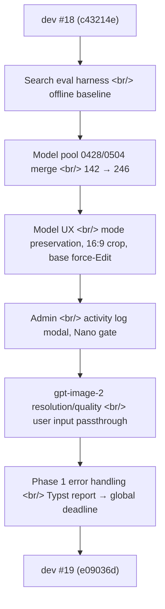
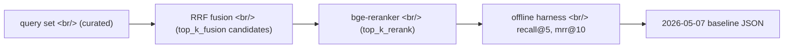
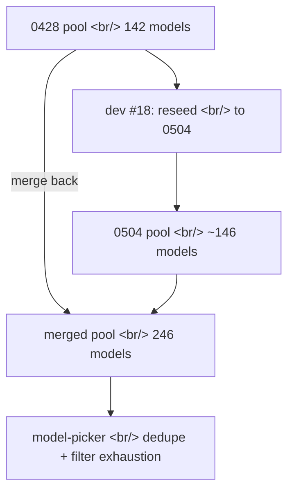
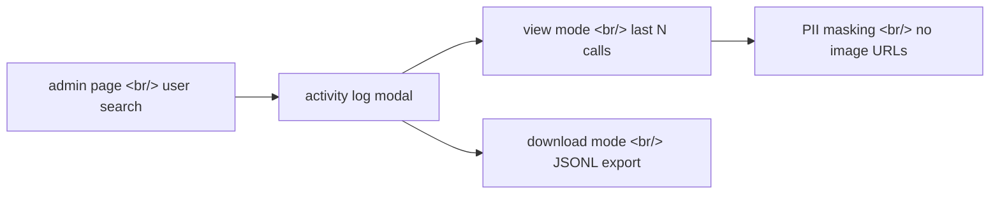
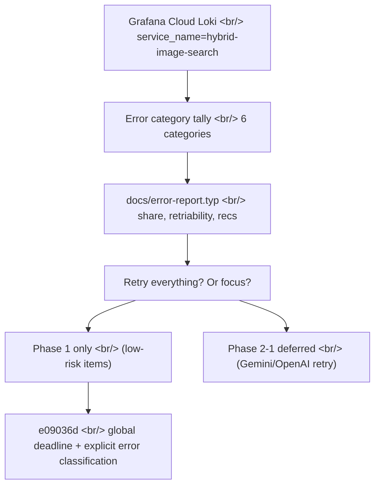

## Overview

If [#18](/posts/2026-05-07-hybrid-search-dev18/) routed OpenAI in as Side B, #19 is the cycle that smooths over the consequences of that decision. 21 commits, five PRs (#20–#24), and on the last day a Typst PDF error report built from Grafana Cloud Loki logs that drove the final code change.

<!--more-->



The big question this cycle: **"When Side B starts failing in production, what do you retry and what do you give up on quickly?"** The answer landed most clearly in the last commit.

---

## Search eval harness: rejecting top_k_fusion=64

The first cluster of commits set up evaluation infrastructure for the search side. Until now, reranker tweaks and fusion parameters were tested live in production — strong qualitative impressions, no quantitative numbers.



Key commits:

- **`feat(eval): offline search-quality harness + 2026-05-07 baseline`** — query set + ground truth + RRF→rerank pipeline wired into a CLI. Baseline JSON committed to the repo as a benchmark for future comparisons.
- **`docs(search): top_k_fusion=64 evaluated and rejected — eval harness wins`** — Intuition said a wider fusion candidate set should help, so 64 got tried. The harness measured +0.2% gain. The cost (reranker GPU time +30%) made it pointless. **First case where the harness overrode intuition** — documented in `docs/decisions/`.
- **`feat(search): request-level OTel span attrs + reranker-doc cleanup`** — Attached query, fusion candidates, rerank scores as span attrs in tracing. This becomes the analysis substrate for the next cycle.

---

## Modal portaling: pinning `position:fixed` to the viewport

A tiny CSS bug with a surprising side effect. Modals lived inside a parent with `transform: ...` applied, and per CSS spec, a transformed parent becomes the containing block for `position: fixed` children. So the modal was anchored to the parent's box, not the viewport.

```tsx
// before — modal rendered inside ImagePanel
function ImagePanel() {
  return (
    <div style={{ transform: "translateZ(0)" }}> {/* forces GPU layer */}
      {showModal && <Modal />}
    </div>
  );
}

// after — Portal to body
import { createPortal } from "react-dom";

function ImagePanel() {
  return (
    <>
      <div style={{ transform: "translateZ(0)" }}>...</div>
      {showModal && createPortal(<Modal />, document.body)}
    </>
  );
}
```

Commit message reads exactly that: `fix: portal modals to body so position:fixed pins to viewport`. Looked like one line, but pulled along two side effects — z-index reset and outside-click detection logic.

---

## Model pool: merging 0428 back into 0504 (142 → 246)

At the end of #18 the 0428 pool got reseeded to 0504 (with folder-hint labels). The April 28 catalog was swapped for the May 4 one. User feedback came fast — "Models I'd been using from the old pool disappeared."



Two commits closed the loop:

- **`feat(models): merge 0428 pool back into 0504 model pool (142 -> 246)`** — Combined so users keep access to both. After dedupe, settled at 246.
- **`feat(model-picker): dedupe re-picks and surface filter exhaustion`** — Same user never gets the same model twice in a row. Filters can narrow so far that no candidates match — the UI now surfaces "No more candidates — try loosening filters."

---

## Model UX: mode preservation, 16:9 crop, base force-Edit

PRs #20–#22 grouped here. Three calls:

**(1) Keep generation mode when closing the library panel.** Before this, closing the library reset mode to `auto`. Users said: "I explicitly chose Edit — why does closing the panel revert it?" Explicit choices should only be undone by explicit actions.

```tsx
// frontend/lib/state.ts
- const closeLibrary = () => {
-   setLibraryPanelCollapsed(false);
-   setActiveLibraryTab(null);
-   resetInjectionMode(); // ← removed
- };
+ const closeLibrary = () => {
+   setLibraryPanelCollapsed(false);
+   setActiveLibraryTab(null);
+ };
```

A separate commit (`fix(generation): reset injection mode to auto when closing library panel`) then made the reset explicit for the specific case where the panel is closed via the close button. Two commits framing the same decision from both sides — remove the unintentional reset, make the intentional one explicit.

**(2) gpt-image-2 16:9 crop.** gpt-image-2 only outputs `1024x1024`, `1024x1536`, or `1536x1024`. A user request for 16:9 returns 1536x1024. The UI now renders the prediction box at 16:9 and center-crops the result to 16:9 for display.

**(3) "Base" button forces Edit mode.** On the detail screen, the base-model button must enter Edit mode (not inherit from source). All other paths (auto-injection, model picker) still enter `auto`.

The follow-up commit `fix(generation): tighten model auto-injection + require base for Edit mode` enforces this all the way down: Edit-mode requests without a base image are rejected with 422.

---

## Admin: activity log modal, Nano Only gate

PRs #21 and #24 covered internal-ops features.

**Activity log modal** — Admins can view/download recent generate calls for a specific user. Essential for debugging and beta tester support.



**Nano Only mode** — New admin allowlist pattern. A specific admin user (`khk@diffs.studio`) gets a "Nano Only" mode that calls only the smaller, cheaper model. Production cost guard rail + safe mode for demos.

---

## gpt-image-2 resolution/quality passthrough

Today's first commit (2026-05-11) is small but had outsized production impact.

`feat(generation): pass user resolution + quality to gpt-image-2` — until now the backend silently ignored user-selected resolution/quality and called gpt-image-2 with default `1024x1024`, `quality=auto`. The user picks "high-res 16:9" and gets a 1024 square. The UI had setters; the backend wiring was missing.

```python
# backend/openai_service.py
- def _pick_size(aspect: str) -> str:
-     return "1024x1024"  # always square ← placeholder that got stuck
+ def _pick_size(aspect: str, requested_quality: str) -> str:
+     # gpt-image-2 hard-limits output to 1024x1024 / 1024x1536 / 1536x1024
+     # (max ~3:2). The size mapper picks the closest valid output.
+     if aspect == "16:9" or aspect == "21:9":
+         return "1536x1024"
+     if aspect == "9:16":
+         return "1024x1536"
+     return "1024x1024"
```

`b5a0ede — fix(generation-feed): keep each card at its A-image's natural aspect` belongs to the same theme — the generation feed grid now follows Side A's (Gemini's, more flexible) aspect ratio per card.

---

## Phase 1 error handling: Grafana Loki → Typst → code decision

The most interesting thread in this cycle was the last session (109 min, `1358feee`). Pull seven days of image generation error logs from Grafana Cloud Loki, build a Typst PDF report, then change code **based on what the report recommended.**



A single user question in the middle of the report shaped the final call:

> **"If we just blanket-apply retry logic, wouldn't it cascade into the same time-window's other image generation calls?"**

That insight went into report v2. If #1 (Gemini 503 retry) and #2 (OpenAI's own retry) both kick in, and then #3 (Gemini → OpenAI fallback) on top, a single user could in the worst case hit the multiplied retries of two APIs at the same time. That looks like a thundering herd — the bad-minute's throughput collapses on itself.

**Decision: Phase 1 only. Low-risk items — explicit error classification + global deadline.**

```python
# backend/service.py — global deadline pattern
async def generate_with_deadline(*args, deadline_s: float = 60.0):
    try:
        return await asyncio.wait_for(
            _generate_inner(*args),
            timeout=deadline_s,
        )
    except asyncio.TimeoutError:
        raise GenerationError(
            kind="timeout",
            retriable=False,  # ← user retries with a fresh request
            message="Image generation exceeded 60s deadline",
        )
    except gemini.ServerError as e:  # 503-class
        raise GenerationError(kind="upstream-503", retriable=False, ...)
    except openai.APIError as e:
        raise GenerationError(kind="openai-api", retriable=False, ...)
```

**Intentional design choice**: every classified error is `retriable=False`. The backend doesn't retry; the user explicitly resubmits. That's the safety boundary for phase 1. Phase 2's decision — which specific categories get auto-retry restored — waits on 1-2 more weeks of Loki data.

---

## Commit log

| Message | Area |
|---|---|
| chore: reseed model pool from 0428 to 0504 with folder-hint labels | data/model_pool/\*.json |
| fix: portal modals to body so position:fixed pins to viewport | frontend/components/Modal.tsx |
| feat(search): request-level OTel span attrs + reranker-doc cleanup | backend/search/\*.py, observability |
| feat(eval): offline search-quality harness + 2026-05-07 baseline | scripts/eval/, eval/baselines/\*.json |
| docs(search): top_k_fusion=64 evaluated and rejected — eval harness wins | docs/decisions/ |
| feat(models): merge 0428 pool back into 0504 model pool (142 -> 246) | data/model_pool/ |
| feat(ui): mode preservation, larger model preview, GPT 16:9 crop, model name in detail | frontend (PR #20) |
| feat(admin): user activity log modal with view/download | backend/admin/, frontend/admin/ (PR #21) |
| feat(model-picker): dedupe re-picks and surface filter exhaustion | frontend/components/ModelPicker.tsx |
| fix(generation): reset injection mode to auto when closing library panel | frontend/lib/state.ts |
| fix(detail): base button forces Edit mode instead of inheriting source mode | frontend (PR #22) |
| fix(generation): tighten model auto-injection + require base for Edit mode | backend/generation/, frontend (PR #23) |
| feat(admin): Nano Only mode + add khk@diffs.studio to admin allowlist | backend/auth/, admin (PR #24) |
| feat(generation): pass user resolution + quality to gpt-image-2 | backend/openai_service.py |
| fix(generation-feed): keep each card at its A-image's natural aspect | frontend/components/GenerationFeed.tsx |
| fix(generation): harden error handling (Phase 1 + global deadline) | backend/service.py, docs/error-report.typ |

---

## Insights

**(1) An eval harness with a baseline beats intuition.** The top_k_fusion=64 rejection is the smallest code change in #19 (a single docs file) but the biggest process change. From now on, any search-side parameter tweak gets measured against the baseline JSON before landing.

**(2) Modal portaling is the kind of small CSS defect that only surfaces with production data.** Adding `transform: translateZ(0)` to force a GPU layer wasn't wrong on its own. But that decision quietly changed `position: fixed`'s containing block — a fact invisible in React DevTools, only visible when a real browser puts the modal in the wrong spot.

**(3) Grafana Loki → Typst → code-decision flow turned out unexpectedly strong.** Normally I look at the dashboard and patch what's broken. This cycle, seven days of logs got categorized, rendered to PDF, and the code change was driven by the report's recommendation. The act of writing the report became the design doc — "Phase 1 only, Phase 2 deferred" lives in the report body.

**(4) The first rule of production error response is don't blindly add retries.** One retry feels safe; two retries multiplying turns into a thundering herd. A single user-posed question pulled the conclusion out into the open.

Next cycle #20 picks up Phase 2 — after 1-2 weeks of Loki data on the pure Gemini 503 rate, decide which categories get selective auto-retry.
