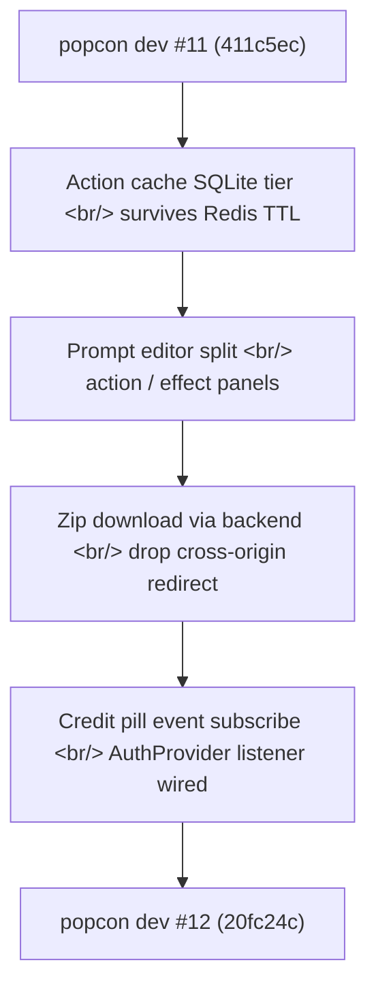
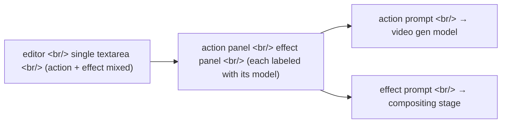

## Overview

Four days since [#11 — credits system, R2 migration, ToonOut, brutal redesign](/posts/2026-05-07-popcon-dev11/), popcon picked up five commits. No big milestone — just patching small cracks that appeared once the new infra started carrying real production traffic. The action cache wouldn't survive Redis TTL. The prompt editor was conflating two responsibilities. The zip download broke at the cross-origin redirect. The credit pill in the header refused to update without a page refresh.

<!--more-->



All five commits follow the same theme — **"survive one round in production, and even a tiny code path reveals its edges."**

---

## Action cache: outlive Redis TTL by spilling to SQLite

The popcon worker caches mask/composite results for each emoji action (wave, wink, etc.) in Redis. Right after the R2 migration, production logged cases where a user re-invoked the same action minutes after TTL expiry and triggered the full pipeline again.

The cause is mundane. Redis is a memory cache; TTLs are kept under a day to keep cost predictable. But the user workflow itself spans days (beta testers coming back over the weekend), so cache misses are inevitable.

Fix: keep Redis as the hot tier, add SQLite as a cold tier.

```python
# backend/cache.py — 2-tier cache adapter
class ActionCache:
    def __init__(self, redis: Redis, sqlite_path: Path):
        self.redis = redis
        self.sqlite = SQLitePersistor(sqlite_path)

    async def get(self, key: str) -> bytes | None:
        if (hot := await self.redis.get(key)) is not None:
            return hot
        if (cold := self.sqlite.get(key)) is not None:
            # Promote back to hot
            await self.redis.set(key, cold, ex=self.ttl)
            return cold
        return None

    async def set(self, key: str, value: bytes) -> None:
        await self.redis.set(key, value, ex=self.ttl)
        self.sqlite.set(key, value)
```

The commit subject is one line (`fix(worker): persist action cache to SQLite to survive Redis TTL`) but it forced a disk-usage monitor too. SQLite will grow without bound and fill the worker disk, so an LRU eviction job runs on the worker side via cron.

---

## Prompt editor: split action from effect

The popcon editor exposes a panel where users can hand-edit prompts. One component had two things bolted together:

1. **Action prompt** — what the character does (wave, jump)
2. **Effect prompt** — visual effect (glow, sparkles)

Functionally they feed different model calls — action goes to a video generation model, effect goes to the compositing stage. Cramming both into one textarea made it unclear which input maps to which call, and the prompt template had to branch on if/else just to split the string.



While refactoring, the legacy `end_prompt` field was deleted — no longer referenced anywhere. The redundant `Existing` prefix on 5 motion_effects presets came out in the same pass (`fix(presets): drop redundant 'Existing' prefix`).

---

## Zip download: cross-origin redirect → backend streaming

This was the main event of the day. Users hit "Download all emojis (zip)" and got a "failed to fetch" error.

Old flow:
1. Frontend → `GET /api/job/{id}/download`
2. Backend → 302 redirect to an R2 presigned URL
3. Browser → downloads directly from R2

The break is at step 2. R2 presigned URLs live on a different origin, and a fetch with `credentials: 'include'` won't follow a redirect to a different origin. The cookie carrying the auth session collides with cross-origin CORS rules.

Fix: **turn the backend into a streaming proxy for the zip.**

```python
# backend/storage.py — chunk streaming generator
def stream_object(key: str, chunk_size: int = 64 * 1024):
    """Stream an R2 object as (content_length, async generator) pair."""
    obj = s3_client.get_object(Bucket=R2_BUCKET, Key=key)
    length = obj["ContentLength"]

    async def chunks():
        for chunk in obj["Body"].iter_chunks(chunk_size):
            yield chunk

    return length, chunks()

# backend/main.py — StreamingResponse passthrough
@app.get("/api/job/{job_id}/download")
async def download_job(job_id: str, user: CurrentUser = Depends(current_user_required)):
    _assert_can_access(job_id, user)
    key = _zip_key_for(job_id)
    length, gen = stream_object(key)
    return StreamingResponse(
        gen,
        media_type="application/zip",
        headers={
            "Content-Length": str(length),
            "Content-Disposition": f'attachment; filename="popcon-{job_id}.zip"',
        },
    )
```

`StreamingResponse` doesn't load the whole zip into memory — it hands out 64KB chunks. And because the response stays on the same origin, the cookie/CORS problem disappears. The trade-off is honest: download traffic now passes through fly.io egress once more. With current zip sizes in the low-MB range, that's fine.

Tests went too — the old `test_download_object_returns_path` was replaced with `test_stream_object_yields_chunks_with_length`.

---

## Credit pill: stop the disappearing balance

The fifth commit was a UI bug. The credit balance pill in the top-right header would sometimes show, sometimes not. A beta tester reported it.

Two causes, twisted together.

**(1) `AuthProvider` initialization timing.** `AuthProvider` only calls `getCredits()` after the user fetch resolves. Meanwhile `CreditPill` has already mounted and rendered `null`. `null` renders nothing.

**(2) Missing subscription to `BALANCE_MAY_CHANGE_EVENT`.** Payment/usage flows dispatch `BALANCE_MAY_CHANGE_EVENT`, but `CreditPill` only consumed `AuthProvider`'s state — it didn't listen to the event. Without a refresh in `AuthProvider`, the pill stayed stale.

Fix:

```tsx
// frontend/components/AuthProvider.tsx
const refreshCredits = useCallback(async () => {
  if (!user) {
    setCredits(null);
    return;
  }
  try {
    setCredits(await getCredits());
  } catch (e) {
    // Don't overwrite balance with null on failure — keep the pill
    console.warn("getCredits failed", e);
  }
}, [user]);

useEffect(() => {
  if (!user) return;
  refreshCredits();  // initial
  const onBalanceMayChange = () => { refreshCredits(); };
  window.addEventListener(BALANCE_MAY_CHANGE_EVENT, onBalanceMayChange);
  return () => window.removeEventListener(BALANCE_MAY_CHANGE_EVENT, onBalanceMayChange);
}, [user, refreshCredits]);
```

Two principles:

- **Preserve last-known value on fetch failure** — never blank out. A stale pill beats a flickering empty one.
- **Centralize the listener** — `AuthProvider` is the single source of truth, `CreditPill` stays a read-only consumer.

---

## Commit log

| Message | Changes |
|---|---|
| fix(worker): persist action cache to SQLite to survive Redis TTL | backend/cache.py, worker/cron.py |
| refactor(presets): split action/effect, slim scaffolding, drop end_prompt | backend/presets/\*.py, frontend types |
| feat(panel): split prompt editor into action and effect | frontend/components/PromptEditor.tsx |
| fix(presets): drop redundant 'Existing' prefix on 5 motion_effects | data/motion_effects.json |
| fix(download): stream zip through backend, drop cross-origin redirect | backend/storage.py, backend/main.py, tests |

A 12-minute session on the credit pill (`AuthProvider.tsx` + `CreditPill.tsx`) didn't make this commit window — it will roll into #13.

---

## Insights

All five commits trace the same pattern — defects that only surface once code runs against real production traffic. **The big milestones through #11 were about laying infrastructure; #12 is about that infrastructure colliding with real user flows and discovering where it leaks.** Commits in this phase are short, low-diff, and disproportionately expensive in debugging hours.

The zip download bug had the most interesting after-thought. During the R2 migration in #11, exposing presigned URLs felt like the "correct" pattern — saves backend bandwidth. But the moment that pattern met the production auth flow, the quick fix (backend streaming) won. The extra redirection added to save cost cost two hours of debugging. Lesson, again: **every indirection costs you debugging time later.**

Next cycle in #13 picks up where this left off — phase two of the credit pill stabilization, and a SQLite cold-tier disk usage alert.
