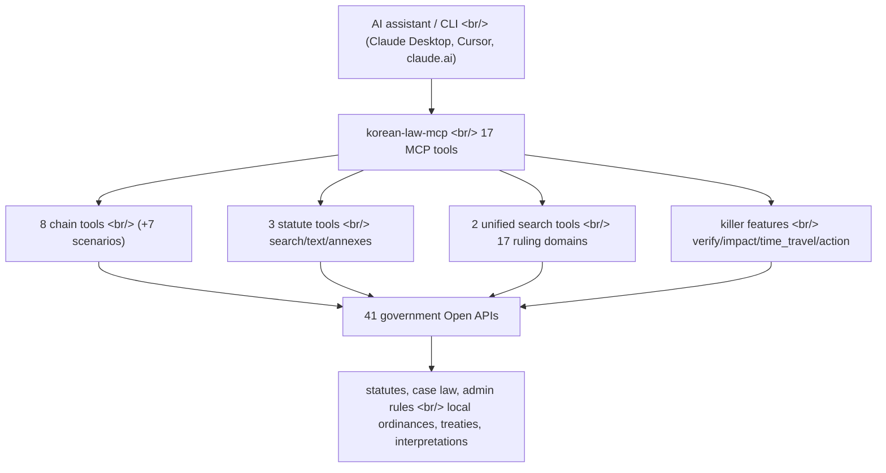

## Overview

[korean-law-mcp](https://github.com/chrisryugj/korean-law-mcp) is a [TypeScript](https://www.typescriptlang.org/) server that compresses 41 [Open APIs](https://open.law.go.kr/LSO/openApi/guideList.do) from Korea's [Ministry of Government Legislation](https://www.law.go.kr) into 17 [MCP](https://modelcontextprotocol.io) tools. It is not a thin API wrapper — it ships citation verification that catches statute numbers an LLM invented, an impact-graph analysis that traces the ripple effect of a single article, and an automatic diff between two points in legislative time. Built by a civil servant who got tired of "searching the legislation portal manually for the hundredth time," the project is an instructive case study of one MCP design principle: **tool count is not feature count**.

<!--more-->

## Why the project had to exist

South Korea has over 1,600 statutes in force, more than 10,000 [administrative rules](https://en.wikipedia.org/wiki/Administrative_law), and a sprawling body of rulings spanning the [Supreme Court](https://eng.scourt.go.kr/), the [Constitutional Court](https://english.ccourt.go.kr/), the [Tax Tribunal](https://www.tt.go.kr/), and the [Korea Customs Service](https://www.customs.go.kr/). All of it lives on one portal, but for a developer trying to reach the data programmatically the experience is rough. The legislation portal's [Open API](https://open.law.go.kr/LSO/openApi/guideList.do) exposes 41 endpoints behind a single free auth key (OC), but handling 41 endpoints is one problem and turning them into tools an LLM can use is a completely different one.

The [Model Context Protocol](https://modelcontextprotocol.io) is an open standard [Anthropic](https://www.anthropic.com/news/model-context-protocol) released in November 2024 — a "USB-C port" that connects AI applications to external data and tools. [Claude Desktop](https://claude.com/download), [Cursor](https://cursor.com/docs/context/mcp), [Visual Studio Code](https://code.visualstudio.com/docs/copilot/chat/mcp-servers), [Zed](https://zed.dev/), and [many other clients](https://modelcontextprotocol.io/clients) can call MCP servers. korean-law-mcp layers an MCP server on top of the legislation APIs, turning a one-line natural-language question into a chain of calls across those 41 endpoints.

## From 89 tools down to 17 — the compression idea

The project's central design decision happened in the move from v2 to v3. v2 took the intuitive route — **one tool per API** — so 41 APIs fanned out into 89 tools. The problem is the LLM's point of view. An MCP client loads every tool's [JSON Schema](https://json-schema.org/) into context at session start, and 89 schemas weighed in around 110 KB, **burning half the context window on the tool list alone**.

v3's reframe is a **dispatch table plus domain enum** pattern: collapse tools that share a shape behind a single `domain` parameter. Seventeen ruling domains — case law, the Constitutional Court, the Tax Tribunal, the Fair Trade Commission, labor commissions, and more — merged into just two tools, `search_decisions(domain)` and `get_decision_text(domain)`. The count dropped from 89 to 15 (now 17), and context cost fell from roughly 110 KB to 20 KB, an 82% cut. The notable part: **not a single existing handler function was modified** — only a new dispatch layer went on top.

| | Government APIs | v2 | v3 |
|---|:---:|:---:|:---:|
| API / tool count | 41 | 89 | 17 |
| AI context cost | - | ~110 KB | ~20 KB |
| Feature coverage | - | 100% | 100% |

The remaining specialist tools (legal terminology, annexes and forms, amendment histories) did not disappear. A `discover_tools` → `execute_tool` proxy pattern lets the LLM search and call them only when needed. That is the [MCP tool-discovery](https://modelcontextprotocol.io/docs/learn/architecture) pattern applied to the legal domain — keep the exposed surface small while holding feature coverage at 100%.

## Anti-hallucination — verify_citations

`verify_citations`, added in v3.5, is the most domain-native feature in the project. Legal answers generated by [ChatGPT](https://chatgpt.com/) or [Claude](https://claude.ai) easily mix in plausible-but-nonexistent statute numbers — the familiar [hallucination](https://en.wikipedia.org/wiki/Hallucination_(artificial_intelligence)) problem. `verify_citations` extracts article citations from user text with a regex, looks back 30 characters to recover the statute name, then cross-checks against the official government database in parallel. Results sort into three buckets: ✓ (exists), ✗ (does not exist, with the valid range shown), and ⚠ (statute name ambiguous).

What is interesting is the bugs that surfaced while empirically validating the feature. The v3.5.3 release notes describe testing five citations against the live government API and finding three false negatives. A substring mismatch where "Civil Act" matched "Refugee Act"; a parsing failure where the API returns paragraph numbers as [enclosed Unicode numerals](https://en.wikipedia.org/wiki/Enclosed_Alphanumerics) like `"① "` and `parseInt` stripped them into `NaN`; a short statute name ("Commercial Act") buried at result 34 and dropped. The tool built to catch hallucinations nearly hallucinated itself — and the README keeps the full debugging trail that pushed it back to 5-out-of-5 accuracy.

v3.5.4 went further, introducing **machine-parseable markers** like `[NOT_FOUND]` and `[HALLUCINATION_DETECTED]` on every failure response. The trigger was real-world feedback: "in practice the AI keeps not finding things and then just answers however it wants." The root cause was that some tools did not set the `isError` flag on a failed lookup, so the LLM never detected the failure and generated an answer anyway. It is a sharp reminder that getting an MCP tool to clearly signal *failure* to an LLM is harder than it sounds.

## v4.0's three killer features

v4.0, the most recent major version, added three analysis tools at once.

`impact_map` draws the ripple effect of a single article as a graph. Ask for "cases citing Article 103 of the Civil Act" and it does a **reverse traversal** across Supreme Court rulings, Constitutional Court decisions, legal interpretations, administrative appeals, and local ordinances, then a **forward traversal** over the other statutes that article cites — and auto-generates [mermaid](https://mermaid.js.org/) graph code that renders directly in [claude.ai](https://claude.ai).

`time_travel` diffs a statute across two points in time. Give it "Personal Information Protection Act 2020-01-01 vs 2025-11-01" and it pulls the text in force at each date, classifies additions (+), deletions (-), and changes (△) per article, and shows the before/after text plus character-count deltas. It is especially useful for frequently amended laws.

`action_plan` turns a citizen's plain-language situation into a five-step guide. Type "I can't get my rental deposit back" and it unfolds into STEP 1 situation diagnosis (auto-identifying the [Housing Lease Protection Act](https://en.wikipedia.org/wiki/Korean_Housing_Lease_Protection_Act)) → STEP 2 rights and remedies (case law) → STEP 3 filing bodies and deadlines → STEP 4 required documents and forms → STEP 5 pitfalls and cautions, including a pointer to the [Korea Legal Aid Corporation](https://www.klac.or.kr/).

## Operational details

The README's release notes are refreshingly candid about the pains of running a remote server. In v3.3.0, the remote server hosted on [fly.dev](https://fly.io/) was periodically [OOM](https://en.wikipedia.org/wiki/Out_of_memory)-killed and restarted, invalidating session IDs — fixed by switching to MCP's official [stateless pattern](https://modelcontextprotocol.io/docs/develop/build-server), which builds a fresh `Server + Transport` per request and releases it immediately on completion. API keys are isolated per request with [AsyncLocalStorage](https://nodejs.org/api/async_context.html) to prevent [race conditions](https://en.wikipedia.org/wiki/Race_condition).

The v3.5.5 hotfix is just as telling. The government Open API began classifying [Node.js](https://nodejs.org)'s default User-Agent (`undici/...`) as a bot and rejecting it, killing the tools across all cloud hosting. The error message — "please register the correct server IP address" — made it look like IP-whitelist blocking, but the real cause was UA inspection. A one-line patch injecting a normal browser UA into the default headers restored everything. Annex and form parsing is handled by [kordoc](https://github.com/chrisryugj/kordoc), an engine by the same author that auto-converts HWPX, HWP, PDF, XLSX, and DOCX into [Markdown](https://en.wikipedia.org/wiki/Markdown).

Installation paths are plentiful: a one-line [Claude Code plugin](https://claude.com/claude-code) install, a [claude.ai](https://claude.ai) custom connector (`https://korean-law-mcp.fly.dev/mcp?oc=...`), a desktop-app config file, an [npm](https://www.npmjs.com/package/korean-law-mcp) global install, and direct CLI use — five in all. It is [MIT-licensed](https://opensource.org/license/mit) and has over 1,700 stars on GitHub.

## Insights

korean-law-mcp is interesting not because it is a legal search tool but because it is a record of empirically probing **the right abstraction level for MCP tool design**. v2's "one API equals one tool" was intuitive but wasted the scarce resource of LLM context; v3 folded 89 tools into 17 with a domain enum and dispatch table while holding feature coverage at 100%. That runs exactly opposite to the [REST API](https://en.wikipedia.org/wiki/REST) habit of slicing endpoints ever finer — and shows that when the consumer is an LLM rather than a human, the cost function of abstraction changes.

The second lesson is that anti-hallucination is not a single feature but a **system-wide signaling problem**. `verify_citations` exists to catch fake statutes, yet the tool itself produced false negatives, and more fundamentally other tools were *causing* hallucinations by not clearly signaling failure to the LLM. The `[NOT_FOUND]` machine markers, the bulk fix of `isError` flags, the removal of silent-drop patterns in the chain tools — all of it serves one goal: making a tool say "I don't know" when it doesn't. Anyone building an MCP server for a domain where accuracy is everything will hit this.

Third, the project shows the value of repackaging public data to be LLM-friendly. The legislation API was already free and open, but it only becomes usable from a one-line natural-language question once domain knowledge is layered on: automatic abbreviation resolution, article-number conversion between human and API forms, unified search across 17 ruling domains. The gap between a government agency *opening* an API and that API actually *getting used* was closed here, in open source, by a single civil servant. The same pattern — public API plus MCP wrapper plus domain knowledge — transfers cleanly to other public-data areas like tax, patents, and statistics.

## References

**Project**
- [korean-law-mcp (GitHub)](https://github.com/chrisryugj/korean-law-mcp) — the MCP server discussed here, MIT-licensed
- [korean-law-mcp (npm)](https://www.npmjs.com/package/korean-law-mcp) — `npm install -g korean-law-mcp`
- [kordoc (GitHub)](https://github.com/chrisryugj/kordoc) — same author's HWPX/HWP/PDF/XLSX/DOCX to Markdown conversion engine

**Model Context Protocol**
- [Model Context Protocol official site](https://modelcontextprotocol.io) — protocol documentation
- [MCP announcement (Anthropic)](https://www.anthropic.com/news/model-context-protocol) — released November 2024
- [MCP architecture](https://modelcontextprotocol.io/docs/learn/architecture) — server, client, and tool concepts
- [Building MCP servers](https://modelcontextprotocol.io/docs/develop/build-server) — including the stateless pattern
- [MCP client list](https://modelcontextprotocol.io/clients) — Claude Desktop, Cursor, VS Code, Zed, and more

**Legal data sources**
- [Ministry of Government Legislation](https://www.law.go.kr) — Korea's national legal information center
- [Legislation Open API registration](https://open.law.go.kr/LSO/openApi/guideList.do) — free auth key (OC) issuance
- [Supreme Court](https://eng.scourt.go.kr/) · [Constitutional Court](https://english.ccourt.go.kr/) · [Tax Tribunal](https://www.tt.go.kr/) · [Korea Customs Service](https://www.customs.go.kr/) — sources of case law and rulings
- [Korea Legal Aid Corporation](https://www.klac.or.kr/) — the body action_plan points citizens to

**Background concepts**
- [LLM hallucination](https://en.wikipedia.org/wiki/Hallucination_(artificial_intelligence)) — the problem verify_citations addresses
- [JSON Schema](https://json-schema.org/) — the MCP tool schema format
- [TypeScript](https://www.typescriptlang.org/) · [Node.js](https://nodejs.org) — the implementation stack
- [mermaid](https://mermaid.js.org/) — the graph format impact_map generates
