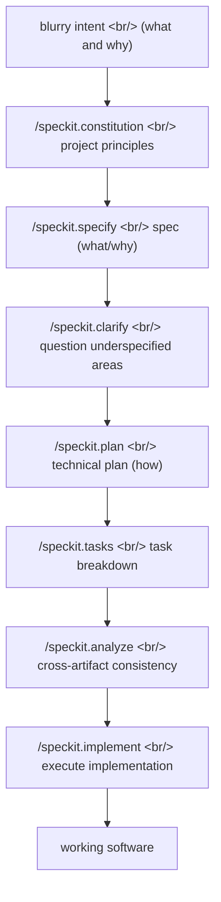

## Overview

[Spec Kit](https://github.com/github/spec-kit), released by [GitHub](https://github.com/), is a [Spec-Driven Development (SDD)](https://github.github.io/spec-kit/) toolkit that gathered 98k stars in eight months. Its core claim compresses into one sentence: **a specification is not scaffolding to discard once coding begins — it is an executable artifact that directly generates the implementation.** Where [vibe coding](https://en.wikipedia.org/wiki/Vibe_coding) pulls code out of a single prompt, Spec Kit installs the opposite as slash commands on top of an [AI coding agent](https://en.wikipedia.org/wiki/AI-assisted_software_development): a multi-step refinement chain of intent to spec to plan to tasks to implementation.

<!--more-->

## Not vibe coding — spec-driven development

For the past two years the default of [LLM](https://en.wikipedia.org/wiki/Large_language_model)-based coding has been "write a good prompt, get code back." Tools like [Cursor](https://cursor.com/) and [GitHub Copilot](https://github.com/features/copilot) accelerated this, and the term "vibe coding," coined by [Andrej Karpathy](https://karpathy.ai/), captured the sentiment precisely — development where you accept code by feel without reading it. The problem: this is magical for small demos, but as requirements grow complex it becomes a black box where you cannot trace what was built or why.

Spec Kit's [core philosophy](https://github.com/github/spec-kit#-core-philosophy) inverts this default, organized around four pillars — **intent-driven development** (specs define the "what" before the "how"), **rich specification creation** using guardrails, **multi-step refinement** rather than one-shot generation, and **heavy reliance on advanced AI model capabilities** for spec interpretation. That last pillar matters. SDD is a workflow that was impossible when AI was weak. Only once models became good enough to carry a sufficiently detailed spec into a sufficiently accurate implementation did the equation "spec = source code" become a realistic option.

## The six-step workflow — a pipeline implemented as slash commands

Spec Kit's entry point is `specify`, a [Python](https://www.python.org/)-based CLI. Install it with [uv](https://docs.astral.sh/uv/) or [pipx](https://pypa.github.io/pipx/), run `specify init`, and slash-command prompt files get written into your agent's directory (`.claude/commands/` and the like). From there everything happens inside the agent through `/speckit.*` commands.

There are six [core commands](https://github.com/github/spec-kit#available-slash-commands).

| Command | Role | Artifact |
|---|---|---|
| `/speckit.constitution` | Establish project governing principles | `.specify/memory/constitution.md` |
| `/speckit.specify` | Define what to build and why (no tech stack) | `specs/NNN-feature/spec.md` |
| `/speckit.plan` | Decide tech stack and architecture | `plan.md`, `research.md`, `data-model.md`, `contracts/` |
| `/speckit.tasks` | Generate an actionable task list | `tasks.md` |
| `/speckit.taskstoissues` | Convert tasks into [GitHub Issues](https://docs.github.com/en/issues) | GitHub Issues |
| `/speckit.implement` | Execute all tasks in dependency order | working code |

Three optional commands attach for quality reinforcement — `/speckit.clarify` (fills underspecified areas with structured questions, recommended before `/speckit.plan`), `/speckit.analyze` (cross-artifact consistency and coverage check, run after `/speckit.tasks`), and `/speckit.checklist` (generates requirement-completeness checklists, described as "unit tests for English").

This separation is the point. `specify` forces you to **deliberately exclude the tech stack** during the spec definition step (`/specify`). If the "what" and "why" mix with the "how," the spec gets contaminated with implementation detail — and that kills the ability to explore different stacks from the same spec, what Spec Kit calls "[creative exploration](https://github.com/github/spec-kit#-development-phases)."

## 30+ agents and skills mode

Spec Kit is not tied to a single agent. It supports [30+ AI coding agents](https://github.github.io/spec-kit/reference/integrations.html) including [Claude Code](https://www.anthropic.com/claude-code), [Gemini CLI](https://github.com/google-gemini/gemini-cli), [Cursor](https://cursor.com/), Qwen CLI, [opencode](https://opencode.ai/), [Codex CLI](https://developers.openai.com/codex/cli/), and GitHub Copilot. Run `specify init` interactively and it detects installed agents to offer choices; in non-interactive contexts like CI it falls back to GitHub Copilot.

The interesting part is [skills mode](https://www.anthropic.com/news/skills). Run it as `--integration codex --integration-options="--skills"` and it installs agent skills instead of slash-command prompt files. In that mode the command names become `$speckit-specify` rather than `/speckit.specify`. The "reusable unit of procedural knowledge" abstraction Anthropic is pushing with [Claude Skills](https://www.anthropic.com/news/skills) gets absorbed by Spec Kit as a distribution channel for its own workflow.

## Extensibility — a four-tier priority stack

The reason Spec Kit can be called a "toolkit" rather than a prompt collection is its [extension system](https://github.com/github/spec-kit#-making-spec-kit-your-own-extensions--presets). Templates and commands resolve through a four-tier priority stack.

| Priority | Layer | Location |
|---|---|---|
| 1 (highest) | Project-local overrides | `.specify/templates/overrides/` |
| 2 | Presets — customize core and extensions | `.specify/presets/templates/` |
| 3 | Extensions — add new capabilities | `.specify/extensions/templates/` |
| 4 (lowest) | Spec Kit core | `.specify/templates/` |

**Extensions** expand *what Spec Kit can do* — they introduce new commands and new development phases. **Presets** change *how Spec Kit works* — they override the templates and commands of the core and installed extensions without adding new capability. Templates are resolved at runtime by walking the stack top-down for the first match; extension and preset commands are written into agent directories at install time.

The result this structure produced is telling. The [community extension catalog](https://speckit-community.github.io/extensions/) already lists close to a hundred extensions — [Jira](https://github.com/mbachorik/spec-kit-jira) and [Azure DevOps](https://github.com/pragya247/spec-kit-azure-devops) integration, post-implementation code review, [V-Model](https://en.wikipedia.org/wiki/V-model_(software_development)) test traceability, [brownfield](https://en.wikipedia.org/wiki/Brownfield_(software_development)) bootstrap, token cost tracking, [OWASP LLM threat modeling](https://owasp.org/www-project-top-10-for-large-language-model-applications/). There is even a bridge extension that wires the [obra/superpowers](https://github.com/obra/superpowers) skill collection into the SDD workflow. The core is kept deliberately thin, and domain-specific complexity is pushed out to the extension ecosystem.

## Three development phases and experimental goals

Spec Kit frames itself not as a finished product but as an [experiment](https://github.com/github/spec-kit#-experimental-goals). The hypothesis it wants to validate is explicit — **SDD is a process not tied to any specific technology, language, or framework**. So it covers all [three development phases](https://github.com/github/spec-kit#-development-phases): 0-to-1 (greenfield, generate from scratch), creative exploration (parallel implementations of the same spec across stacks and architectures), and iterative enhancement (brownfield, legacy modernization).

The [detailed workflow document](https://github.com/github/spec-kit/blob/main/spec-driven.md) makes clear this is not "run the commands in order." It repeatedly stresses: don't treat the spec right after `/speckit.specify` as final — refine it in conversation with the agent; have the agent audit its own `/speckit.plan` output; cross-check for over-engineered pieces. What Spec Kit actually sells is not commands but **the disciplined procedure of collaborating with an AI agent** itself.

## Insights

What makes Spec Kit interesting is not the code — the body is a single Python CLI, a collection of markdown templates, and slash-command prompt files. The real bet is in **raising the abstraction layer by one notch**. The unit of the last round was the "prompt." The unit Spec Kit pushes is a verifiable artifact chain: spec to plan to tasks. Prompts evaporate; specs land in git, get diffed, get reviewed, get re-executed. This is a move to restore exactly the traceability [Karpathy](https://karpathy.ai/)'s vibe coding deliberately threw away.

Second observation — Spec Kit treats agent neutrality not as compatibility marketing but as an architectural principle. 30+ agents, support for both slash-command and skills mode, a CI fallback. This is [GitHub](https://github.com/) signaling it will not bet on a single model vendor, and a design decision that makes clear SDD is a layer laid on top of models, not within them. Swap the model out and the specs and workflow remain.

Third — 98k stars in eight months and close to a hundred community extensions show the thin-core, open-priority-stack design hit the mark. From [Jira](https://github.com/mbachorik/spec-kit-jira) integration to [OWASP](https://owasp.org/www-project-top-10-for-large-language-model-applications/) threat modeling, the ecosystem fills a domain diversity GitHub could never have caught up with building in-house. But as the README itself warns — community extensions are not reviewed, audited, or endorsed. The cost of a thin core is a blurred trust boundary.

Finally, it is worth taking the "experiment" self-framing seriously. For SDD to work, the model must carry a spec into an implementation accurately enough — and that assumption breaks with domain and complexity. Spec Kit's value lies less in offering "the answer" than in **explicitly drawing, through the spec as an artifact, the line between what a human writes directly and what gets delegated in AI-era software development**. If the keyword of the next round is not prompt engineering but spec engineering, Spec Kit will be remembered as one of its first reference implementations.

## References

**Spec Kit**
- [github/spec-kit](https://github.com/github/spec-kit) — main repository (MIT, Python, 98k stars, released 2025-08)
- [Spec Kit official docs](https://github.github.io/spec-kit/) — workflow, CLI reference, integration guides
- [Spec-Driven Development methodology doc](https://github.com/github/spec-kit/blob/main/spec-driven.md) — deep dive into the full process
- [v0.8.9 release](https://github.com/github/spec-kit/releases/tag/v0.8.9) — 2026-05-12, latest release
- [Supported agent integrations](https://github.github.io/spec-kit/reference/integrations.html) — 30+ agents
- [Community extension catalog](https://speckit-community.github.io/extensions/) · [community presets](https://github.github.io/spec-kit/community/presets.html)

**Background concepts**
- [Vibe coding](https://en.wikipedia.org/wiki/Vibe_coding) — the development style Spec Kit positions against
- [AI-assisted software development](https://en.wikipedia.org/wiki/AI-assisted_software_development) · [Large language model](https://en.wikipedia.org/wiki/Large_language_model)
- [V-Model](https://en.wikipedia.org/wiki/V-model_(software_development)) · [Brownfield development](https://en.wikipedia.org/wiki/Brownfield_(software_development))
- [Claude Skills](https://www.anthropic.com/news/skills) — the abstraction Spec Kit's skills mode absorbs
- [OWASP Top 10 for LLM Applications](https://owasp.org/www-project-top-10-for-large-language-model-applications/) — basis for community threat-model extensions

**Tools and ecosystem**
- [Claude Code](https://www.anthropic.com/claude-code) · [Gemini CLI](https://github.com/google-gemini/gemini-cli) · [GitHub Copilot](https://github.com/features/copilot) · [Cursor](https://cursor.com/) · [Codex CLI](https://developers.openai.com/codex/cli/) · [opencode](https://opencode.ai/)
- [uv](https://docs.astral.sh/uv/) · [pipx](https://pypa.github.io/pipx/) — Specify CLI installation tools
- [obra/superpowers](https://github.com/obra/superpowers) — skill collection bridged into the SDD workflow
- [GitHub Issues](https://docs.github.com/en/issues) — output target of `/speckit.taskstoissues`
