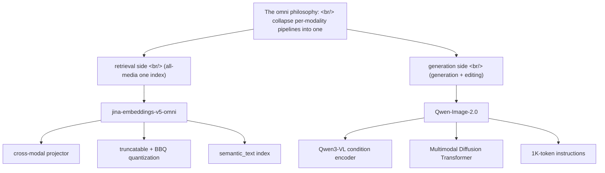
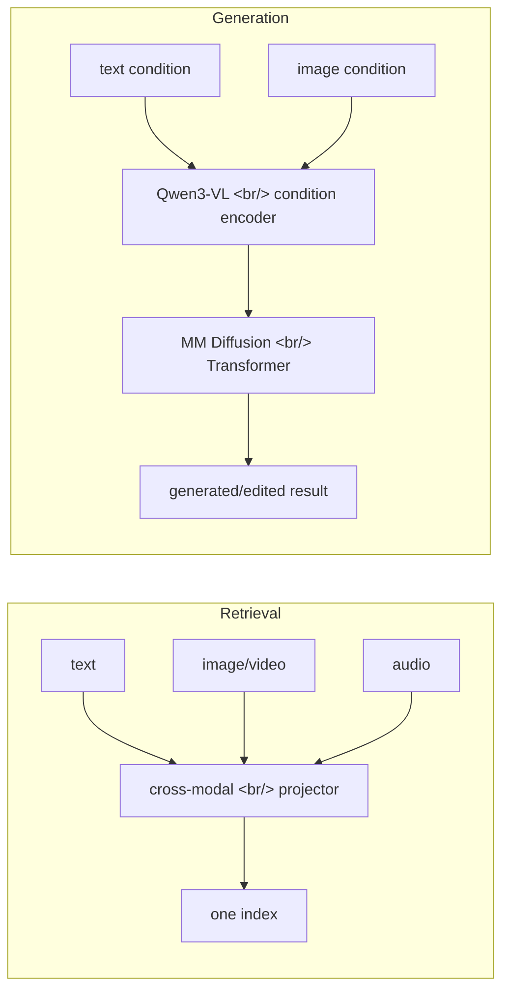

## Overview

Two systems that surfaced around the same time both lead with the same word — **"omni"**. One is an [embedding](https://en.wikipedia.org/wiki/Sentence_embedding) model that puts text, image, video, and audio into [a single index](https://en.wikipedia.org/wiki/Search_engine_indexing) and searches them together ([jina-embeddings-v5-omni](https://www.elastic.co/search-labs/blog/jina-embeddings-v5-omni-all-media-one-index)); the other is an image-generation [foundation model](https://en.wikipedia.org/wiki/Foundation_model) that folds high-fidelity generation and precise editing into one framework ([Qwen-Image-2.0](https://arxiv.org/abs/2605.10730)). Retrieval and generation point in opposite directions, yet both stand on the same design philosophy: **drop the default of "a separate pipeline per modality" and merge it into one.**

<!--more-->

## 1. jina-embeddings-v5-omni — all media, one index

This is the launch post for [jina-embeddings-v5-omni](https://www.elastic.co/search-labs/blog/jina-embeddings-v5-omni-all-media-one-index), published May 11, 2026 by [Scott Martens](https://www.elastic.co/search-labs/author/scott-martens) on [Elastic Search Labs](https://www.elastic.co/search-labs).

### Core

The long-standing pain in [multimodal retrieval](https://en.wikipedia.org/wiki/Multimedia_information_retrieval) is that every modality runs its own indexing pipeline. Text gets a text embedder, images get something [CLIP](https://en.wikipedia.org/wiki/Contrastive_Language-Image_Pre-training)-shaped, audio gets yet another model — and cross-modal search is stitched together by hand. v5-omni puts text (~100 languages), images, video, and audio into **one [Elasticsearch](https://en.wikipedia.org/wiki/Elasticsearch) index** and queries them at once.

### How

Not a full retrain but **modular assembly**. The designers lift encoders straight out of pretrained models — [SigLIP2](https://arxiv.org/abs/2502.14786)-family vision encoders, [Whisper-large-v3](https://github.com/openai/whisper) for audio — and attach them as preprocessors in front of the existing jina-embeddings-v5-text backbone. The key piece is a trained **cross-modal projector**: a small adapter that translates each media encoder's output into the text model's embedding space. For the small version that is roughly 5.5 million new parameters.

- **small**: 1024-dim embeddings, 32,768-token context, 1.66B parameters with all extensions
- **nano**: 768-dim embeddings, 8,192-token context, 1.004B parameters fully loaded
- Both swap in task-specific [LoRA](https://arxiv.org/abs/2106.09685) adapters for retrieval, clustering, classification, and semantic similarity

### A sense of storage reality

In large-scale [vector search](https://en.wikipedia.org/wiki/Vector_database), embedding dimensionality is cost. v5-omni answers two ways. First, **truncation** — in the style of [Matryoshka representation learning](https://arxiv.org/abs/2205.13147), embeddings collapse from native dimension down to 32 dimensions, cutting storage by 93% at a 64-byte size. Second, [Better Binary Quantization](https://www.elastic.co/search-labs/blog/better-binary-quantization-lucene-elasticsearch) (BBQ) compatibility — meshing with Elasticsearch's quantization for "near-identical performance" at lower precision. And crucially, the **text embeddings v5-omni produces are identical** to jina-embeddings-v5-text. An existing text index can be promoted to a multimedia index in place.

### Benchmarks

- Text retrieval: top of its size class on the [MMTEB](https://github.com/embeddings-benchmark/mteb) suite
- Visual similarity: "only beaten by a model three times its size"; nano surpasses models 10-25x larger
- Visual document retrieval: competitive with 3-7B models while staying under 1B
- Audio: among the top on [MAEB](https://huggingface.co/datasets/mteb/MAEB) audio retrieval
- Video temporal grounding: 55.57 on [Charades-STA](https://github.com/jiyanggao/TALL) (vs ByteDance Seed 1.6 at 29.30), 58.93 on MomentSeeker

### Why it matters now

This is not "one more embedding model." It **simplifies an abstraction layer in search infrastructure by a notch.** In Elasticsearch you create an index with `type: semantic_text`, drop the model name into `inference_id`, and non-text inputs get Base64-encoded into the same fields. The modality-branching logic disappears from the application layer. Anyone who has built a [RAG](https://en.wikipedia.org/wiki/Retrieval-augmented_generation) pipeline knows exactly which operational cost that simplification removes.

## 2. Qwen-Image-2.0 — generation and editing in one framework

[arxiv 2605.10730](https://arxiv.org/abs/2605.10730), authored by 75 contributors from the [Alibaba Qwen](https://qwenlm.github.io/) team, May 11, 2026, [cs.CV](https://arxiv.org/list/cs.CV/recent).

### Core

**Qwen-Image-2.0** is an omni-capable image-generation foundation model that unifies high-fidelity generation and precise image editing within a single framework. It targets exactly where existing models stay weak — ultra-long text rendering, multilingual [typography](https://en.wikipedia.org/wiki/Typography), high-resolution [photorealism](https://en.wikipedia.org/wiki/Photorealism), robust instruction following, and efficient deployment — especially in text-rich, compositionally complex scenes.

### How

The core structure couples two parts. It uses **[Qwen3-VL](https://qwenlm.github.io/) as the condition encoder** and stacks a **Multimodal [Diffusion Transformer](https://arxiv.org/abs/2212.09748)** on top for joint condition-target modeling. It is a [DiT](https://www.wpeebles.com/DiT)-family design — a [diffusion model](https://en.wikipedia.org/wiki/Diffusion_model) that takes its denoising backbone as a transformer instead of a [U-Net](https://en.wikipedia.org/wiki/U-Net) — backed by large-scale data curation and a customized multi-stage training pipeline. That structure keeps strong [multimodal understanding](https://en.wikipedia.org/wiki/Multimodal_learning) while moving flexibly between generation and editing.

### Contributions

- Supports **instructions up to 1K tokens** for text-rich content like slides, posters, infographics, and comics
- Substantially improves multilingual text fidelity and typography
- Strengthens photorealistic generation with richer detail, more realistic textures, and coherent lighting
- Follows complex prompts more reliably across diverse styles
- Extensive [human evaluation](https://en.wikipedia.org/wiki/Human_evaluation_of_machine_translation) shows it substantially outperforms previous Qwen-Image models on both generation and editing

### Why it matters now

The history of generative image models has been **the separation of generation and editing**. You make something with [Stable Diffusion](https://en.wikipedia.org/wiki/Stable_Diffusion), then fix it separately with [ControlNet](https://github.com/lllyasviel/ControlNet) or [inpainting](https://en.wikipedia.org/wiki/Inpainting) tools. Qwen-Image-2.0 puts both inside one model via joint condition-target modeling. That the condition encoder is a [VLM](https://en.wikipedia.org/wiki/Vision-language_model) matters too — the same encoder understands image conditions as well as text prompts, so "change this image like so" travels the same path as generation.

## Reading the cluster

A retrieval model and a generation model, opposite tasks — yet the design decisions mirror each other.

| Aspect | jina-embeddings-v5-omni | Qwen-Image-2.0 |
|---|---|---|
| Direction | multimodal → embedding (retrieval) | condition → image (generation/editing) |
| What's unified | per-modality indexing pipelines | a generation model + an editing model |
| Means of unification | cross-modal projector | Qwen3-VL condition encoder |
| Backbone | jina-embeddings-v5-text | Multimodal Diffusion Transformer |
| Reuse strategy | pretrained encoders + small adapters | a VLM repurposed as condition encoder |
| Deployment lens | truncation & BBQ for storage savings | up to 1K tokens, efficient deployment emphasized |

Three shared patterns. First, **reuse of pretrained assets** — jina pulls in SigLIP2 and Whisper encoders, Qwen pulls in all of Qwen3-VL. Neither trains from scratch. Second, **projection into a shared representation space** — jina's projector funnels every medium into the text embedding space; Qwen's condition encoder funnels text and image conditions into the same diffusion input. Third, **deployment cost as a first-class design element** — jina with truncation and [quantization](https://en.wikipedia.org/wiki/Quantization_(signal_processing)), Qwen with efficient deployment as an explicit goal. These are designs that assume a production system, not a research demo.

## Insights

It is no accident that `omni` got pinned to both systems at once. The first generation of multimodal AI was **a dedicated model per modality** — CLIP for images, Whisper for audio, [BERT](https://en.wikipedia.org/wiki/BERT_(language_model))-family for text. The second generation stitched them together with [late fusion](https://en.wikipedia.org/wiki/Multimodal_learning). What we are watching now is the third generation — **one representation space, one framework**. jina-v5-omni reaches that point from the retrieval side, Qwen-Image-2.0 from the generation side. The interesting part is that neither is *full unification* but *clever reassembly*: lift pretrained encoders, bind them with a small adapter or a joint-modeling layer. Training an omni model from scratch is still astronomically expensive, so practical omni comes from module reuse. And both cases **bake deployment cost into the design at the research stage** — truncation, BBQ quantization, 1K-token instructions, efficient deployment. That is the signal that multimodal has moved past demos and become infrastructure. The next round's question is not "more modalities" but "how cheaply and how reliably do you run this unification."

## References

**Primary sources**
- [One index, all media: Introducing jina-embeddings-v5-omni](https://www.elastic.co/search-labs/blog/jina-embeddings-v5-omni-all-media-one-index) — [Scott Martens](https://www.elastic.co/search-labs/author/scott-martens), [Elastic Search Labs](https://www.elastic.co/search-labs) (2026-05-11)
- [Qwen-Image-2.0 Technical Report (2605.10730)](https://arxiv.org/abs/2605.10730) — 75 contributors from the [Alibaba Qwen](https://qwenlm.github.io/) team (2026-05-11, [cs.CV](https://arxiv.org/list/cs.CV/recent))

**Models & components**
- [SigLIP2 (2502.14786)](https://arxiv.org/abs/2502.14786) — the vision encoder family jina-v5-omni borrows
- [Whisper](https://github.com/openai/whisper) — the audio encoder jina-v5-omni borrows
- [Qwen](https://qwenlm.github.io/) — home of the Qwen3-VL that Qwen-Image-2.0 uses as condition encoder
- [LoRA: Low-Rank Adaptation (2106.09685)](https://arxiv.org/abs/2106.09685) — the basis of the task-specific adapters
- [Matryoshka Representation Learning (2205.13147)](https://arxiv.org/abs/2205.13147) — the principle behind truncatable embeddings
- [Scalable Diffusion Models with Transformers — DiT (2212.09748)](https://arxiv.org/abs/2212.09748) — the lineage of the Multimodal Diffusion Transformer

**Background**
- [Multimedia information retrieval](https://en.wikipedia.org/wiki/Multimedia_information_retrieval) · [Vector database](https://en.wikipedia.org/wiki/Vector_database) · [Sentence embedding](https://en.wikipedia.org/wiki/Sentence_embedding)
- [Diffusion model](https://en.wikipedia.org/wiki/Diffusion_model) · [Vision-language model](https://en.wikipedia.org/wiki/Vision-language_model) · [Multimodal learning](https://en.wikipedia.org/wiki/Multimodal_learning)
- [Contrastive Language-Image Pre-training (CLIP)](https://en.wikipedia.org/wiki/Contrastive_Language-Image_Pre-training) — the first-generation multimodal staple
- [Retrieval-augmented generation](https://en.wikipedia.org/wiki/Retrieval-augmented_generation) — the canonical pipeline multimodal retrieval slots into
- [Better Binary Quantization](https://www.elastic.co/search-labs/blog/better-binary-quantization-lucene-elasticsearch) — Elasticsearch BBQ explainer
- [MTEB / MMTEB](https://github.com/embeddings-benchmark/mteb) — the embedding benchmark suite
