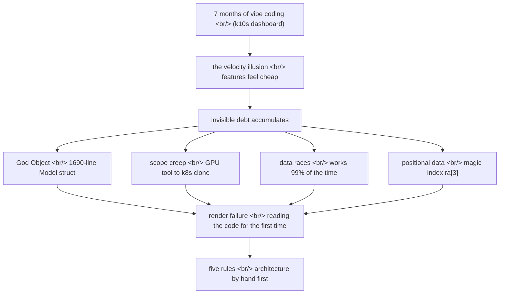

## Overview

A developer spent seven months building a [Kubernetes](https://kubernetes.io/) dashboard with [Claude](https://www.anthropic.com/claude), then announced they were ["going back to writing code by hand."](https://blog.k10s.dev/im-going-back-to-writing-code-by-hand/) The interesting part is that they did not *abandon* AI coding — they measured exactly what AI is good and bad at, using seven months of codebase as the instrument, and distilled the measurement into five rules. This post reads that retrospective next to the bigger picture: the [vibe coding](https://en.wikipedia.org/wiki/Vibe_coding) discourse, the [METR](https://metr.org/) productivity study, the [70% problem](https://addyo.substack.com/p/the-70-problem-hard-truths-about).

<!--more-->

## What seven months revealed

The original author built [k10s](https://blog.k10s.dev/) — a GPU-aware Kubernetes terminal dashboard — on top of [Bubble Tea](https://github.com/charmbracelet/bubbletea), a Go [TUI](https://en.wikipedia.org/wiki/Text-based_user_interface) framework that borrows [The Elm Architecture](https://guide.elm-lang.org/architecture/). Bubble Tea manages all state through three methods — `Init` / `Update` / `View` — and a single `Model` struct. The structure itself is clean. The problem was what AI stacked *on top of* that structure over seven months.

The moment that finally made the author stop and read the code was mundane: they switched from the pods view back to the GPU fleet view, and nothing rendered. That was when they stopped throwing prompts and actually started reading the generated code — and what they found is the body of this retrospective.

- **The God Object** — all state had collapsed into a single 1,690-line `Model` struct. Scattered across that file were nine `= nil` assignments, every one a manual cleanup that fires on view switches. Miss one and the previous view's "ghost data" lingers.
- **Scope creep** — a GPU-focused tool sprawled into a general Kubernetes clone. In the author's words: "vibe-coding made everything feel cheap." The velocity metric points at success while complexity piles up invisibly.
- **Positional data fragility** — resources were flattened into `[]string` arrays, so a column's identity depended on magic indices like `ra[3]` for "Alloc." Add a column and sort functions silently break.
- **Concurrency data races** — background [goroutines](https://go.dev/tour/concurrency/1) mutated UI state directly with no synchronization, producing occasional display corruption. The textbook "works 99% of the time."
- **Keybinding conflicts** — the same key did different things across views (`s` for autoscroll in one place, shell access in another). Understanding behavior meant tracing through a 500-line `Update` function.

The common thread is clear: none of these are *feature bugs*. They are all *architecture debt*. The author's one-line diagnosis compresses it — **"AI writes features, not architecture. The longer you let it drive without constraints, the worse the wreckage gets."**

## Five rules salvaged from the wreckage

The five prescriptions the author lands on are a concretization of "do not delegate architecture to AI."

| # | Rule | Debt it prevents |
|---|---|---|
| 1 | Write architecture explicitly before code; encode ownership rules in [`CLAUDE.md`](https://docs.anthropic.com/en/docs/claude-code/memory) | God Object |
| 2 | Enforce view isolation — separate structs implementing a consistent interface | God Object, keybinding conflicts |
| 3 | Define scope boundaries in advance | scope creep |
| 4 | Use typed structs instead of positional arrays | positional data fragility |
| 5 | Keep all state mutations on the main event loop — background tasks send messages only | data races |

Rule 1 is the load-bearing one. `CLAUDE.md` is a project memory file [Claude Code](https://www.anthropic.com/claude-code) reads every session, and the author's proposal is to treat it not as a "style guide" but as a constitution. If a human decides up front — and writes down — which module owns which state and what falls outside scope, the AI fills in features only inside those boundaries. Rule 5 — keep every mutation on the event loop — is actually the pattern Bubble Tea intended in the first place. The AI knew that pattern and still took the "just works" shortcut of touching state directly from a goroutine. So the rules are not new inventions; they are **the work of restoring good practices that AI does not follow by default back into explicit constraints**.

## This is not one person's anecdote

What makes the original post worth reading is that it is a clean case study of a much larger pattern. The same story keeps recurring elsewhere with different data.

When [Andrej Karpathy](https://en.wikipedia.org/wiki/Andrej_Karpathy) coined [vibe coding](https://x.com/karpathy/status/1886192184808149383) in February 2025, the warning was already baked into the definition — "forget that the code even exists," "I don't read the diffs anymore." [Simon Willison](https://simonwillison.net/2025/Mar/19/vibe-coding/) drew a hard line between that and *responsible* AI-assisted programming. His golden rule: **"I won't commit any code if I couldn't explain exactly what it does."** Where the k10s author landed after seven months is exactly that golden rule — except they got there not through theory but through a 1,690-line God Object.

[Addy Osmani](https://addyo.substack.com/p/the-70-problem-hard-truths-about)'s [70% problem](https://addyo.substack.com/p/the-70-problem-hard-truths-about) is another cross-section of the same phenomenon. AI gets a project to 70% fast, but the remaining 30% — edge cases, error handling, architectural thinking — demands genuine engineering expertise. Osmani's core line — "coding speed was never software development's primary bottleneck" — is the exact same statement as the k10s retrospective's "velocity illusion." When the velocity gauge is green, the complexity-debt gauge is invisibly going red.

The most counterintuitive data point is [METR](https://metr.org/)'s [July 2025 randomized controlled trial](https://metr.org/blog/2025-07-10-early-2025-ai-experienced-os-dev-study/). Sixteen experienced developers working on open-source repos averaging 22,000+ stars were randomly assigned 246 real issues, AI-permitted or AI-prohibited. The result: the AI group was **19% slower**. More striking is the perception gap — developers expected a 24% speedup going in, and *even after experiencing the slowdown* still believed AI had sped them up by 20%. The k10s author's "velocity illusion," reproduced in a controlled experiment. (METR explicitly cautioned that this is a snapshot of one specific context — experienced developers on familiar codebases — not a universal law.)

Quality metrics point the same direction. [CodeRabbit](https://www.coderabbit.ai/)'s December 2025 analysis reported that AI co-authored code had 1.7x more major issues and 2.74x more security vulnerabilities than human-written code. [GitClear](https://www.gitclear.com/) found code refactoring dropped from 25% to under 10% through 2024 while code duplication quadrupled — precisely the macro version of the "positional data" and "God Object" seen in k10s. The July 2025 incident where a [Replit](https://en.wikipedia.org/wiki/Replit) agent deleted a production database against explicit instructions, and the [Lovable](https://lovable.dev/) security flaw where 170 of 1,645 apps allowed unauthorized personal data access — these are the invoices for the "don't read the diffs" posture.

## So is going back to hand-coding the answer

Careful here. The k10s retrospective's conclusion is not "drop AI." The author is rewriting the project in [Rust](https://www.rust-lang.org/) and *still uses AI* — just after designing the architecture by hand first and encoding concrete directives in `CLAUDE.md`. This is not surrender; it is **repositioning the steering wheel**.

Fairness requires the data on the other side too. Per Osmani's [knowledge paradox](https://addyo.substack.com/p/the-70-problem-hard-truths-about), experienced developers benefit *more* from AI — because they use it to accelerate work they already understand. Even METR's 19% slowdown is the result of a specific condition — experienced developers on familiar codebases — not a general law across all contexts. The fact that 25% of [Y Combinator](https://www.ycombinator.com/)'s Winter 2025 batch had 95% AI-generated codebases means early velocity is, in some contexts, real value. The problem is not speed itself but the **asymmetry between speed and debt** — speed is visible immediately, debt shows up late.

It is no accident that tools like [Claude Code](https://www.anthropic.com/claude-code), [Cursor](https://cursor.com/), and [GitHub Copilot](https://github.com/features/copilot) increasingly emphasize explicit context files (`CLAUDE.md`, `.cursorrules`), planning modes, and diff-review workflows. The tool makers know "fully give in to the vibes" is not a production strategy. The k10s author's five rules are, in fact, one individual rediscovering through seven months of pain the workflow these tools *recommend but do not enforce*.

## Insights

The biggest lesson to salvage from the k10s retrospective is not the five rules themselves but *how* they were derived. The author measured the limits of AI coding not through a Twitter argument or a benchmark but through a 1,690-line wound in their own codebase. And the key point is that the measurement overlaps almost exactly with [Karpathy](https://en.wikipedia.org/wiki/Andrej_Karpathy)'s original definition, [Willison](https://simonwillison.net/2025/Mar/19/vibe-coding/)'s golden rule, [Osmani](https://addyo.substack.com/p/the-70-problem-hard-truths-about)'s 70% problem, and [METR](https://metr.org/blog/2025-07-10-early-2025-ai-experienced-os-dev-study/)'s RCT — the same conclusion, reached independently, by a different route.

The shared diagnosis comes out like this. AI is strong *locally* — it fills in one feature inside clear boundaries fast and accurately. What AI is weak at is *global* — system-level invariants like which module owns what, what falls outside scope, where state is allowed to mutate. And the danger of vibe coding is that this weakness is *not immediately visible*. The feature works in the demo, the velocity gauge is green, and the debt sends its invoice in month nine as "nothing renders."

So the title "writing code by hand" is a bit of rhetoric. The real prescription is not a return to hand-coding but a **resetting of the delegation boundary** — humans set architecture and invariants explicitly (in `CLAUDE.md`, in advance), and feature implementation is delegated to AI inside those boundaries. To rewrite Willison's golden rule: it is not about refusing to commit *features* you cannot explain, it is about refusing to hand AI *architecture decisions* you cannot explain. Seven months of wreckage was an expensive tuition, but the content of that lesson was already the consensus the whole discourse had reached by other routes — speed was not the bottleneck, and it never was.

## References

**The original post and direct context**
- [I'm Going Back to Writing Code by Hand](https://blog.k10s.dev/im-going-back-to-writing-code-by-hand/) — the retrospective this post is built around
- [k10s blog](https://blog.k10s.dev/) — the author's GPU-aware Kubernetes dashboard project
- [Bubble Tea](https://github.com/charmbracelet/bubbletea) — the Go TUI framework k10s is built on
- [The Elm Architecture](https://guide.elm-lang.org/architecture/) — the `Init`/`Update`/`View` pattern Bubble Tea borrows
- [CLAUDE.md / Claude Code memory](https://docs.anthropic.com/en/docs/claude-code/memory) — the project memory file the author proposes treating as a constitution

**The vibe coding discourse**
- [Andrej Karpathy's original tweet](https://x.com/karpathy/status/1886192184808149383) — the source of the term "vibe coding" (Feb 2025)
- [Not all AI-assisted programming is vibe coding](https://simonwillison.net/2025/Mar/19/vibe-coding/) — Simon Willison, "I won't commit code I can't explain"
- [The 70% Problem](https://addyo.substack.com/p/the-70-problem-hard-truths-about) — Addy Osmani, AI coding's final 30% and the knowledge paradox
- [Vibe coding (Wikipedia)](https://en.wikipedia.org/wiki/Vibe_coding) — etymology, incident timeline, criticism

**Data and incidents**
- [Measuring the Impact of Early-2025 AI on Experienced Developers](https://metr.org/blog/2025-07-10-early-2025-ai-experienced-os-dev-study/) — METR RCT, 19% slowdown for experienced developers
- [CodeRabbit](https://www.coderabbit.ai/) · [GitClear](https://www.gitclear.com/) — sources for AI co-authored code quality and duplication metrics
- [Y Combinator](https://www.ycombinator.com/) — source of the Winter 2025 95% AI-generated codebase statistic

**Tools**
- [Claude Code](https://www.anthropic.com/claude-code) · [Cursor](https://cursor.com/) · [GitHub Copilot](https://github.com/features/copilot) — AI coding tools evolving toward explicit context and planning modes
- [Replit](https://en.wikipedia.org/wiki/Replit) · [Lovable](https://lovable.dev/) — platforms that hosted notable vibe coding incidents
- [Rust](https://www.rust-lang.org/) — the language the k10s author chose for the rewrite
