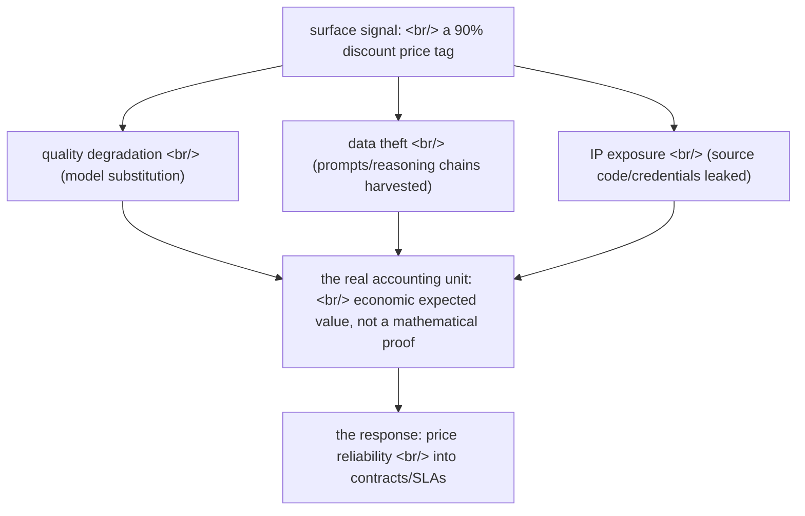

## Overview

A Chinese proxy market selling [Claude API](https://www.anthropic.com/api) access at roughly 10% of list price has surfaced. On the surface it looks like simple price arbitrage; one layer down it is a pipeline that bundles quality degradation with [prompt](https://en.wikipedia.org/wiki/Prompt_engineering) data theft. What makes the case worth dwelling on is something else entirely — it is the sharpest illustration yet that **answering the demand to "guarantee model performance" requires shifting the unit of conversation from mathematics to economics**.

<!--more-->

## The structure of the case — what sat beneath the "it is cheap" signal

According to [reporting by the Korea Management Journal](https://www.kmjournal.net/news/articleView.html?idxno=11241), Claude API access was being resold on channels like GitHub, Telegram, and Taobao at about 90% off list price. The discount does not come from a legitimate supply chain. It comes from mass-generated free-trial accounts, subscriptions opened with stolen credit cards, a single [Max-tier](https://www.anthropic.com/pricing) account ($200/month) subdivided across many users, and — the most insidious mechanism — **model substitution**: the user believes they are calling [Claude Opus](https://www.anthropic.com/claude/opus) but actually receives responses from cheaper [Haiku](https://www.anthropic.com/claude/haiku) or an open-weight model.

The key number comes from an analysis of 17 proxy services by the [CISPA Helmholtz Center for Information Security](https://cispa.de/en). The official API scored about 84% accuracy on a medical [benchmark](https://en.wikipedia.org/wiki/Benchmark_(computing)); routed through a proxy, that fell to roughly 37%. **Same price tag, same API shape, less than half the real performance.**

And then the deeper layer — data theft. Proxy operators collect users' prompts, model responses, and [chain-of-thought](https://en.wikipedia.org/wiki/Prompt_engineering#Chain-of-thought) reasoning traces, and repackage them as training datasets. Oxford China Policy Institute researcher Zhilan Chen calls this the "API Proxy Economy." [Anthropic](https://www.anthropic.com/) reported detecting roughly 24,000 fraudulent accounts that generated more than 16 million queries in February 2026, and has accused [DeepSeek](https://en.wikipedia.org/wiki/DeepSeek) of using thousands of fraudulent accounts to generate millions of conversations with Claude to train its own models.

## Why a mathematical guarantee was never possible

The demand to "guarantee model performance 100%" feels intuitively reasonable. But [LLM](https://en.wikipedia.org/wiki/Large_language_model) output is inherently [stochastic](https://en.wikipedia.org/wiki/Stochastic). [Temperature](https://en.wikipedia.org/wiki/Softmax_function) sampling, context dependence, the residual probability of [hallucination](https://en.wikipedia.org/wiki/Hallucination_(artificial_intelligence)) — no single model can mathematically prove an accuracy of 1.0 on arbitrary input. A [benchmark](https://en.wikipedia.org/wiki/Benchmark_(computing)) score is an estimate over a distribution, not a warranty. A 90% on [MMLU](https://en.wikipedia.org/wiki/MMLU) means "on this dataset's distribution, roughly one in ten is wrong," not "your next question will be right."

This case weaponizes exactly that gap. Proxy users believed they bought an 84% model and received a 37% one, and **had no way to measure the difference themselves.** Any attempt to define "performance" mathematically and then have it guaranteed breaks down in two places. First, the object of the guarantee (the whole distribution) is not what the user cares about (my next query). Second, once the model is swapped somewhere mid-[supply chain](https://en.wikipedia.org/wiki/Supply_chain), the number the user measures is itself no longer trustworthy. Mathematics works on the model card; it does not work on the supply chain between the model card and the user.

## What changes when the unit becomes economics

If mathematics asks "how accurate is this model," economics asks "who loses how much when this model is trusted and turns out wrong, and how is that risk priced." That question fits the 90% discount case far better.

**The discount, read as expected value.** A price at 10% of list is not a free lunch — it is one variable in an [expected-value](https://en.wikipedia.org/wiki/Expected_value) calculation. Against the 90% in saved cost sits the cost of decision errors from accuracy cut in half, the strategic loss of prompts flowing into a competitor's training set, and the [industrial-espionage](https://en.wikipedia.org/wiki/Industrial_espionage) risk of source code, [API keys](https://en.wikipedia.org/wiki/API_key), and [credentials](https://en.wikipedia.org/wiki/Credential) being exposed to unverified servers. In the language of economics, the "90% discount" is not a price — it is **a debt that defers hidden costs into the future.**

**[Information asymmetry](https://en.wikipedia.org/wiki/Information_asymmetry) and the lemon market.** The proxy market is a textbook re-run of George Akerlof's [market for lemons](https://en.wikipedia.org/wiki/The_Market_for_Lemons). The seller knows whether they are shipping Opus or Haiku; the buyer does not. When quality cannot be verified, the market competes on price alone and good quality is driven out. The remedy is the one Akerlof prescribed — signaling and verification: official-API certifications like [SOC 2](https://en.wikipedia.org/wiki/System_and_Organization_Controls), auditable logs, and contracts.

**The [SLA](https://en.wikipedia.org/wiki/Service-level_agreement) as a translator.** A [service-level agreement](https://en.wikipedia.org/wiki/Service-level_agreement) is precisely the tool that performs this translation. An SLA does not promise "100% correct." Instead it defines availability, response time, and quality targets as measurable objectives, and specifies **financial consequences** — refunds, termination rights — for violations. It converts an abstract "performance guarantee" into a concrete, enforceable economic commitment. The fact that the model can be probabilistically wrong is left intact; the contract pins down who carries that risk and how it is compensated.

## Implications for production AI

This case is more than a fraud story. For every team running [production AI](https://en.wikipedia.org/wiki/MLOps), it forces three things.

First, **supply-chain provenance comes before the model card.** No benchmark score means anything without a guarantee that the model is actually that model. In a world where [model-extraction attacks](https://en.wikipedia.org/wiki/Model_extraction) and substitution are possible, "which model is it" matters less than "did this response come down the path I contracted for" — and the latter has to be verified first.

Second, **denominate your reliability budget in money.** Compute internally "if this workflow is wrong 5% of the time, how much do we lose," and the choice of which model, which price, which SLA stops being an article of faith and becomes arithmetic. When the list price of a first-party provider like [Anthropic](https://www.anthropic.com/pricing), [OpenAI](https://openai.com/api/), or [Google](https://ai.google.dev/) looks expensive, what that price includes is not just tokens but a provenance guarantee and a no-exfiltration promise.

Third, **data leakage is not a one-time cost but a strategic asset transfer.** When prompts and reasoning chains feed a competitor's training run, that is not a single breach — it is a permanent transfer of capability via [knowledge distillation](https://en.wikipedia.org/wiki/Knowledge_distillation). In the language of economics it is less a one-off loss than [capital flight](https://en.wikipedia.org/wiki/Capital_flight).

## Insights

The real lesson of the 90% discount Claude case is not the common sense that "cheap things are cheap for a reason." It is that **the problem of model reliability has no answer as long as it stays in the domain of mathematical proof.** LLMs are stochastic, benchmarks are estimates over a distribution, and the supply chain is territory the model card does not cover. The demand to "guarantee 100%" is mathematically unfulfillable forever. So the mature answer is to change the unit of the guarantee — from accuracy as a mathematical quantity to expected value, information asymmetry, and contractible risk as economic ones.

This shift is not a concession of defeat; it is a change of tools. Economics has tools for handling uncertainty far older than mathematical proof — insurance, contracts, signaling, reputation, audits. Treat quality and provenance the way an SLA treats availability, and you can accept that "the model can be wrong" while still pinning down "who carries that risk, and at what price." That is exactly why the 90% discount price tag is dangerous — it looks like a mathematically attractive number, but economically it is a contract that pushes unmeasured debt into the future. The question a production-AI team should be asking next quarter is not "which model is most accurate" but "what is our reliability budget, and from whom and under what contract are we buying it."

## References

**Primary reporting on the case**
- [Korea Management Journal — the identity of the 90% discount Claude proxy](https://www.kmjournal.net/news/articleView.html?idxno=11241) — the primary reporting this post is built on
- [CISPA Helmholtz Center for Information Security](https://cispa.de/en) — the German information-security institute that analyzed performance degradation across 17 proxy services
- [Anthropic](https://www.anthropic.com/) — Claude's provider and the source of the fraudulent-account detection report
- [DeepSeek (Wikipedia)](https://en.wikipedia.org/wiki/DeepSeek) — the Chinese AI company Anthropic accused of unauthorized use of Claude conversation data

**Background — evaluation and reliability**
- [Large language model](https://en.wikipedia.org/wiki/Large_language_model) · [Hallucination (AI)](https://en.wikipedia.org/wiki/Hallucination_(artificial_intelligence))
- [Benchmark (computing)](https://en.wikipedia.org/wiki/Benchmark_(computing)) · [MMLU](https://en.wikipedia.org/wiki/MMLU)
- [Stochastic process](https://en.wikipedia.org/wiki/Stochastic) · [Softmax / temperature](https://en.wikipedia.org/wiki/Softmax_function)
- [Model extraction](https://en.wikipedia.org/wiki/Model_extraction) · [Knowledge distillation](https://en.wikipedia.org/wiki/Knowledge_distillation)

**Background — the economics of risk**
- [Expected value](https://en.wikipedia.org/wiki/Expected_value) — the frame for reading a discount as one variable in an EV calculation
- [The Market for Lemons](https://en.wikipedia.org/wiki/The_Market_for_Lemons) · [Information asymmetry](https://en.wikipedia.org/wiki/Information_asymmetry) — how unverifiable quality collapses a market
- [Service-level agreement](https://en.wikipedia.org/wiki/Service-level_agreement) — the tool that translates an abstract performance guarantee into an economic contract
- [Industrial espionage](https://en.wikipedia.org/wiki/Industrial_espionage) · [Capital flight](https://en.wikipedia.org/wiki/Capital_flight) — viewing data leakage as a strategic asset transfer
- [MLOps](https://en.wikipedia.org/wiki/MLOps) · [SOC 2](https://en.wikipedia.org/wiki/System_and_Organization_Controls) — practical tooling for supply-chain provenance verification

**First-party provider pricing**
- [Anthropic API pricing](https://www.anthropic.com/pricing) · [OpenAI API](https://openai.com/api/) · [Google AI for Developers](https://ai.google.dev/)
