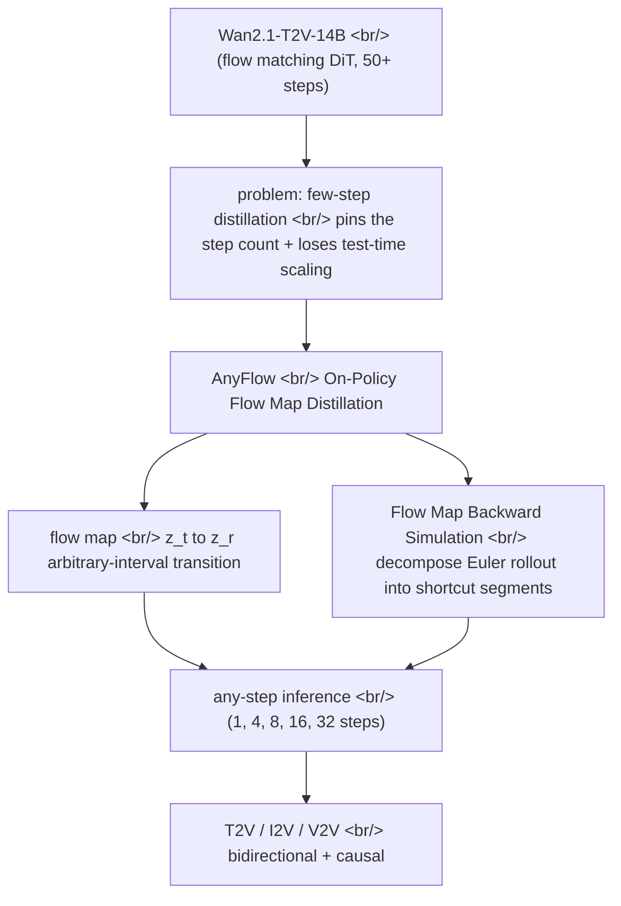

## Overview

[AnyFlow](https://nvlabs.github.io/AnyFlow), released by [NVIDIA](https://www.nvidia.com/), is a framework that distills video [diffusion models](https://en.wikipedia.org/wiki/Diffusion_model) so they are **not locked to a fixed inference step count**. Conventional few-step distilled models are pinned — a 4-step model does 4 steps, an 8-step model does 8. AnyFlow runs anywhere from 1 step to dozens from a single set of weights, and quality climbs steadily as you add steps. Starting from the [`nvidia/AnyFlow-Wan2.1-T2V-14B-Diffusers`](https://huggingface.co/nvidia/AnyFlow-Wan2.1-T2V-14B-Diffusers) model card, this post looks at the **On-Policy Flow Map Distillation** underneath it, and why it departs from conventional [consistency distillation](https://arxiv.org/abs/2303.01469).

<!--more-->



## The base model — Wan2.1

AnyFlow is not trained from scratch; it is a distillation layer on top of Alibaba's open-source video model [Wan2.1](https://github.com/Wan-Video/Wan2.1). The base, [`Wan-AI/Wan2.1-T2V-14B-Diffusers`](https://huggingface.co/Wan-AI/Wan2.1-T2V-14B-Diffusers), is a 14B-parameter [Diffusion Transformer](https://arxiv.org/abs/2212.09748) built on the [Flow Matching](https://arxiv.org/abs/2210.02747) framework: it takes text through a multilingual [T5 encoder](https://huggingface.co/docs/transformers/model_doc/t5) and injects the condition via [cross-attention](https://en.wikipedia.org/wiki/Attention_(machine_learning)) in every transformer block. Temporal compression is handled by **Wan-VAE**, a 3D causal [VAE](https://en.wikipedia.org/wiki/Variational_autoencoder) designed specifically for video.

Wan2.1's weakness is the weakness of diffusion models generally: **it is slow**. Producing one 480P five-second clip takes roughly 50 steps of [ODE](https://en.wikipedia.org/wiki/Ordinary_differential_equation) integration, and at 14B each step is heavy. That is what few-step distillation is for — and that is where the conventional approach shows its limits.

## The problem — why few-step distillation is pinned

The standard tool for few-step sampling is distillation in the [consistency model](https://arxiv.org/abs/2303.01469) family. The core idea is to learn a mapping that jumps straight from any noisy point `z_t` to the clean output `z_0` — an endpoint consistency mapping. The catch is that this **replaces the original [probability-flow ODE](https://arxiv.org/abs/2011.13456) trajectory wholesale with a consistency-sampling trajectory**.

Two things break as a result. First, the model is optimized for a particular step count and degrades at other budgets. Second, and more damaging — **test-time scaling disappears**. Ordinary diffusion sampling gets better as you add steps; consistency-distilled models do not improve, and can even get worse, with more steps. That is the price of discarding the ODE trajectory's "more compute means more accuracy" property. The [AnyFlow paper](https://arxiv.org/abs/2605.13724) takes exactly this failure as its starting point.

## AnyFlow's answer — on-policy flow map distillation

AnyFlow's shift compresses to one line: **drop the endpoint mapping (`z_t → z_0`) and learn a flow-map transition over arbitrary time intervals (`z_t → z_r`).** Because it learns transitions between any two points on the trajectory rather than a single endpoint `z_0`, the same model handles whatever way inference chooses to slice the steps. That is the technical basis of "any-step."

The key training technique is **Flow Map Backward Simulation**. It decomposes a full [Euler rollout](https://en.wikipedia.org/wiki/Euler_method) into several shortcut flow-map segments, so the model trains on the intermediate states it produces itself — that is, **on-policy**. This decomposition addresses two error sources at once:

- **Discretization error** — the integration error that accumulates when few-step sampling takes large jumps
- **Exposure bias** — the mismatch between training and inference distributions that compounds in causal (autoregressive) generation

This is the decisive difference from [consistency distillation](https://arxiv.org/abs/2303.01469). Consistency distillation **replaces** the original trajectory; AnyFlow **preserves the original [ODE](https://en.wikipedia.org/wiki/Ordinary_differential_equation) trajectory and decomposes it into segments**. Because the trajectory is left intact, the "more steps means more accurate" property survives — AnyFlow matches or beats consistency-based methods in the few-step regime, and uniformly lifts quality across the whole trajectory as steps increase.

## What it supports — architectures and tasks

AnyFlow is not a single model but a lineup released as a [HuggingFace collection](https://huggingface.co/collections/nvidia/anyflow).

| Model | Tasks | Architecture | Resolution |
|---|---|---|---|
| [AnyFlow-Wan2.1-T2V-14B-Diffusers](https://huggingface.co/nvidia/AnyFlow-Wan2.1-T2V-14B-Diffusers) | T2V | bidirectional | 480P |
| [AnyFlow-Wan2.1-T2V-1.3B-Diffusers](https://huggingface.co/nvidia/AnyFlow-Wan2.1-T2V-1.3B-Diffusers) | T2V | bidirectional | 480P |
| [AnyFlow-FAR-Wan2.1-14B-Diffusers](https://huggingface.co/nvidia/AnyFlow-FAR-Wan2.1-14B-Diffusers) | T2V / I2V / V2V | causal | 480P |
| [AnyFlow-FAR-Wan2.1-1.3B-Diffusers](https://huggingface.co/nvidia/AnyFlow-FAR-Wan2.1-1.3B-Diffusers) | T2V / I2V / V2V | causal | 480P |

The `FAR` variants put AnyFlow on top of [Show Lab](https://sites.google.com/view/showlab)'s [FAR](https://github.com/showlab/FAR) (Long-Context Autoregressive Video Modeling, [arXiv 2503.19325](https://arxiv.org/abs/2503.19325)) — a next-frame-prediction causal video model — and handle Image-to-Video and Video-to-Video alongside [Text-to-Video](https://en.wikipedia.org/wiki/Text-to-video_model) in one model. AnyFlow is validated on both bidirectional (Wan2.1 proper) and causal (FAR) architectures and across scales from 1.3B to 14B. The backward simulation that targets exposure bias matters most on the causal side.

## Trying it — Diffusers

The [🤗 Diffusers](https://github.com/huggingface/diffusers) integration is done, so the barrier to entry is low. It loads with the standard `DiffusionPipeline`, and for step-count control you use the dedicated `WanAnyFlowPipeline`.

```python
import torch
from diffusers.utils import export_to_video
from far.pipelines.pipeline_wan_anyflow import WanAnyFlowPipeline

model_id = "nvidia/AnyFlow-Wan2.1-T2V-14B-Diffusers"
pipeline = WanAnyFlowPipeline.from_pretrained(model_id).to('cuda', dtype=torch.bfloat16)

video = pipeline(
    prompt="CG game concept digital art, a majestic elephant running towards a herd.",
    height=480, width=832, num_frames=81,
    num_inference_steps=4,           # raise 4 -> 8 -> 16 and quality goes up
    generator=torch.Generator('cuda').manual_seed(0)
).frames[0]

export_to_video(video, "output.mp4", fps=16)
```

`num_inference_steps` is the whole point. From the same checkpoint, changing only this value lets you pick any point on the speed-quality curve — something a few-step distilled model simply cannot do. Training, inference, and [VBench](https://github.com/Vchitect/VBench) evaluation configs live in the [NVlabs/AnyFlow](https://github.com/NVlabs/AnyFlow) repository, and running in [`bfloat16`](https://en.wikipedia.org/wiki/Bfloat16_floating-point_format) with [accelerate](https://huggingface.co/docs/accelerate) and [transformers](https://huggingface.co/docs/transformers) is recommended.

The license needs care. The GitHub code is [Apache 2.0](https://www.apache.org/licenses/LICENSE-2.0), but the **model weights on HuggingFace are under the NVIDIA One-Way Noncommercial License (NSCLv1)** — noncommercial use only. That contrasts with the Wan2.1 base itself, which is Apache 2.0.

## Insights

AnyFlow is interesting not just because it is "a faster video model." The work **rewrites the default of distillation itself**. For the past few years the implicit premise of few-step distillation has been that the inference budget is fixed at training time — [LCM](https://arxiv.org/abs/2310.04378), [consistency models](https://arxiv.org/abs/2303.01469), and assorted step-distilled checkpoints were all shipped that way. AnyFlow dissolves that premise simply by learning a flow map instead of an endpoint mapping. The result is that "speed or quality" stops being a fixed choice made at deployment and becomes **a slider at inference time**.

The deeper insight is about *what gets preserved*. Consistency distillation bought speed by discarding the original ODE trajectory, and in doing so lost test-time scaling — one of diffusion's core assets. AnyFlow chooses instead to preserve the trajectory and cut it into segments, keeping that asset intact. It is a design that asks "what must be preserved" before asking "what can be thrown away to approximate." That on-policy backward simulation catches discretization error and exposure bias with a single mechanism is the same theme: not two separate patches, but one property that falls out naturally once the trajectory is decomposed correctly.

The limitations are clear too. The public model card and project page do not yet state quantitative [VBench](https://github.com/Vchitect/VBench) scores — the comparisons are qualitative and relative — resolution is capped at 480P, and the weight license is noncommercial. Still, the direction is unmistakable: the next round of differentiation in video generation comes not from model size but from **how wide a speed-quality spectrum a single set of weights can cover**. AnyFlow is the first case to move that spectrum from deployment into inference.

## References

**Models & code**
- [nvidia/AnyFlow-Wan2.1-T2V-14B-Diffusers](https://huggingface.co/nvidia/AnyFlow-Wan2.1-T2V-14B-Diffusers) — the model card this post covers
- [AnyFlow HuggingFace collection](https://huggingface.co/collections/nvidia/anyflow) — full 1.3B/14B, bidirectional/causal lineup
- [NVlabs/AnyFlow](https://github.com/NVlabs/AnyFlow) — training, inference, evaluation code (Apache 2.0)
- [AnyFlow project page](https://nvlabs.github.io/AnyFlow) · [demo](https://nvlabs.github.io/AnyFlow/demo)
- [Wan-AI/Wan2.1-T2V-14B-Diffusers](https://huggingface.co/Wan-AI/Wan2.1-T2V-14B-Diffusers) · [Wan-Video/Wan2.1](https://github.com/Wan-Video/Wan2.1) — the base model

**Papers**
- [AnyFlow: Any-Step Video Diffusion Model with On-Policy Flow Map Distillation (arXiv 2605.13724)](https://arxiv.org/abs/2605.13724) — Gu, Fang, Jiang, Mao, Han, Cai, Shou (NVIDIA / Show Lab NUS / MIT, 2026)
- [Long-Context Autoregressive Video Modeling with Next-Frame Prediction — FAR (arXiv 2503.19325)](https://arxiv.org/abs/2503.19325) — Gu, Mao, Shou (2025) — base of the causal variants
- [Consistency Models (arXiv 2303.01469)](https://arxiv.org/abs/2303.01469) — the distillation paradigm AnyFlow contrasts with
- [Latent Consistency Models (arXiv 2310.04378)](https://arxiv.org/abs/2310.04378) — a representative few-step distillation case
- [Flow Matching for Generative Modeling (arXiv 2210.02747)](https://arxiv.org/abs/2210.02747) — the generative framework under Wan2.1 and AnyFlow
- [Score-Based Generative Modeling through SDEs (arXiv 2011.13456)](https://arxiv.org/abs/2011.13456) — origin of the probability-flow ODE
- [Scalable Diffusion Models with Transformers — DiT (arXiv 2212.09748)](https://arxiv.org/abs/2212.09748) — the Wan2.1 backbone architecture

**Background & tools**
- [🤗 Diffusers](https://github.com/huggingface/diffusers) — the library the model is integrated into
- [FAR](https://github.com/showlab/FAR) · [Self-Forcing](https://github.com/guandeh17/Self-Forcing) · [TiM](https://github.com/WZDTHU/TiM) — prior work AnyFlow credits as build foundations
- [VBench](https://github.com/Vchitect/VBench) — video generation evaluation benchmark
- [Diffusion model](https://en.wikipedia.org/wiki/Diffusion_model) · [Text-to-video model](https://en.wikipedia.org/wiki/Text-to-video_model) — conceptual background
