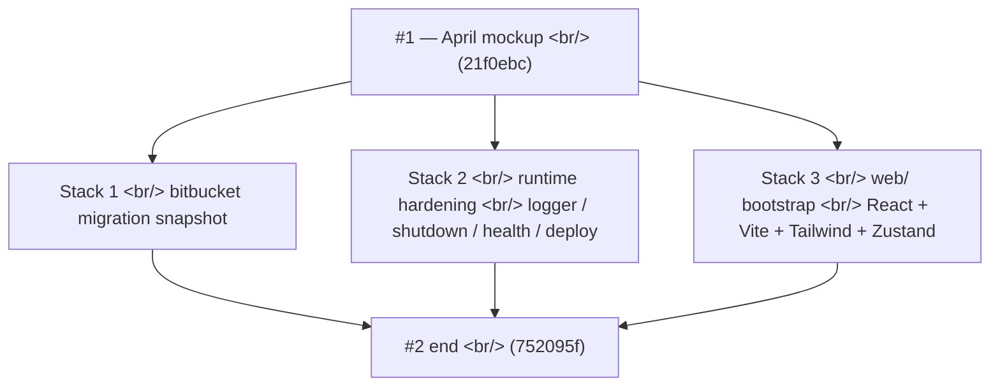

## Overview

[Previous post: #1 — the mockup era and Creative Warmth theme](/posts/2026-04-07-creative-agent-studio-dev1/) shipped six weeks ago. After a long quiet stretch, 2026-05-18 detonated with **27 commits in a single day** — and they fell into three clean stacks. First, a bitbucket migration snapshot to mark the repo's relocation. Second, **a production-readying pass on the Node runtime** — structured JSON logging, graceful worker shutdown via `AbortSignal`, `/api/health` + `/api/metrics`, single-EC2 deploy assets (systemd, nginx, litestream), and three refactors splitting the monolithic queue. Third, **the React+Vite+TypeScript bootstrap that would replace the mockup entirely within 72 hours** — Tailwind with Creative Warmth tokens carried over verbatim from April, a Zustand store with 5 empty slices, the `<T>` i18n component, and the first design primitives.

<!--more-->



The day's running theme: **stop treating this as a prototype.**

---

## Stack 1 — The Bitbucket Migration Snapshot

The first commit of the day (`9d414f2 chore: snapshot project state for bitbucket migration`) wasn't a code change — it was a marker. Repos move for reasons beyond engineering, and the snapshot commit made the cutover legible: this is the state shipped from the old home, and everything after is the new home.

Worth noting because future "what changed?" investigations can stop at this commit when looking for "code that survived the move" vs "code added after."

---

## Stack 2 — Production-Readying the Runtime

### Structured JSON logger + adoption

Commits `ead6854` and `d0b9ea4` introduced a structured JSON logger and adopted it in the chat route + worker lifecycle paths. The pre-existing pattern was `console.log` strings, which would not survive an actual deploy to a log aggregator.

```js
// runtime/observability/logger.js (paraphrased shape)
function createLogger({ component }) {
  return {
    info:  (msg, ctx) => emit({ level: "info",  component, msg, ...ctx, ts: Date.now() }),
    warn:  (msg, ctx) => emit({ level: "warn",  component, msg, ...ctx, ts: Date.now() }),
    error: (msg, ctx) => emit({ level: "error", component, msg, ...ctx, ts: Date.now() }),
  };
}
```

The contract was deliberately minimal — one severity, one message string, one context object. The chat route was the first adopter because that's where SSE frames are emitted, and any unstructured `console.log` there would interleave with frame headers in stdout and corrupt logs.

### Graceful worker shutdown via AbortSignal

Commit `d9bf640`. The pre-existing worker loop was an infinite `while (true)` claim-and-run. `kill -TERM` on the worker process would kill it mid-job, leaving the SQLite `jobs` row in `running` state with a stale `worker_lock` — eventually reclaimed by the stale-timeout mechanism, but with a delay measured in minutes.

The fix wired an `AbortSignal` through the loop:

```js
// runtime/workers/worker-loop.js
export async function startWorkerLoop({ role, signal }) {
  while (!signal.aborted) {
    const job = await claimNextJob(db, role);
    if (!job) {
      await sleep(POLL_INTERVAL_MS, { signal });
      continue;
    }
    try {
      await runJob(job, { signal });
    } catch (err) {
      if (signal.aborted) {
        await releaseJobForReclaim(db, job.id);  // explicit unlock
        return;
      }
      throw err;
    }
  }
}
```

Combined with a `SIGTERM` handler in `server/index.js` that calls `controller.abort()` and waits for workers to settle, this turns a 5-minute reclaim window into an immediate clean shutdown — important for any rolling deploy.

### Daily maintenance + /api/health + /api/metrics

Three more commits closed the operational gaps:

- `3ac2dfa` — periodic event-log retention. The `events` table grows monotonically as SSE frames are persisted. Without retention, a long-running deploy fills disk. Cron-like job runs daily, deletes events older than N days.
- `89c7b05` — `/api/health` (boot probe) and `/api/metrics` (Prometheus-style counters). A load balancer can now do its job, and a Grafana dashboard can finally exist.
- `d0b9ea4` — wired all three (shutdown, maintenance, logger) into `server/index.js` boot.

The Grafana setup itself got its own doc (`4236122 docs: add Grafana Cloud setup guide for EC2 deployment`) because the metric set was small enough to deploy once and forget — the runtime's only telemetry concerns were queue depth, job duration, and gate-time-to-approval.

### Single-EC2 deploy assets

Commit `9ac967f` added the entire single-EC2 deploy stack: systemd unit files for the Node server + workers, an nginx config that terminates TLS and proxies to `:7878`, and a Litestream configuration that replicates `data/runtime.sqlite` to S3 continuously. Litestream is the linchpin — it makes SQLite a defensible production choice for a small-team app by giving you continuous point-in-time backup without changing application code.

### Runtime refactors

Three companion refactors made the codebase ready for the upcoming PR0–PR4 spree:

- `1cf3bce refactor: split runtime/queue/jobs.js into runs/jobs/events modules` — `jobs.js` had become a god-module conflating run lifecycle, job claiming, and event persistence. Split into three single-responsibility modules.
- `4ee661e refactor: extract stage state machine + route events through persistEvent` — the "what stage is the run in, and what can transition out of it" logic was sprinkled across the worker. Extracted into a single state machine module; all event writes now route through `persistEvent` so a missing event can't be a silent bug.
- `c7291af refactor: consolidate Google AI SDK on @google/genai` — the codebase had been straddling two Google SDK packages. Consolidated on `@google/genai`.

The runtime SQLite was also relocated to `data/` (`2e3ac8a`) so the `.gitignore`-by-intent file could live in a dedicated subdir alongside the WAL/SHM journals.

---

## Stack 3 — Bootstrapping the React Rewrite

The mockup's days were numbered. A design spec (`253f83d docs: add design spec for mockup → web/ (React + Vite + TS) rebuild`) and an implementation plan (`c81b248 docs: add PR0 implementation plan for web/ infra bootstrap`) declared the target. Twenty commits then materialized it.

### Package + tooling

```
web/package.json          React 18 + Vite + TypeScript
web/tsconfig.{json,app.json,node.json}   Vite-standard 3-file split
web/vite.config.ts        /api proxy → :7878 (matches Express port)
web/tailwind.config.ts    Creative Warmth tokens
web/vitest.config.ts      jsdom + RTL setup
```

The Tailwind config (`17aecd9`) is worth calling out — every Creative Warmth token from April's mockup CSS was hand-translated into Tailwind extensions:

```ts
// web/tailwind.config.ts (paraphrased)
export default {
  theme: {
    extend: {
      colors: {
        'warm-white': '#FAF7F2',  // body bg
        'warm-paper': '#F5F1EA',  // raised surfaces
        'text-primary': '#2A2622', // not pure black
      },
      fontFamily: {
        display: ['"DM Serif Display"', 'serif'],
        hand: ['Caveat', 'cursive'],
      },
    },
  },
};
```

Zero design tokens were re-derived; they were lifted verbatim. The mockup was throwaway code, but the design system was load-bearing.

### Store scaffold

Commit `0b469b8 feat(web): scaffold Zustand store with 5 empty slices` set up the state architecture before any feature code:

```ts
// web/src/store/index.ts
type Store = UiSlice & ProjectsSlice & WorkspaceSlice & FeedSlice & PipelineSlice;

export const useStore = create<Store>()((set, get, api) => ({
  ...createUiSlice(set, get, api),
  ...createProjectsSlice(set, get, api),
  ...createWorkspaceSlice(set, get, api),
  ...createFeedSlice(set, get, api),
  ...createPipelineSlice(set, get, api),
}));
```

Five slices — `ui`, `projects`, `workspace`, `feed`, `pipeline` — declared *empty* on day 1, with a test (`9543922 test(web): assert store init exposes all five slices`) that locked the shape so subsequent commits could add fields without forgetting a slice. That decision would pay back across the next three days when 100+ commits added fields to those slices in parallel.

### The `<T>` i18n component

Commit `24ff23e feat(web): add <T> i18n component with KO/EN toggle + tests`. The app's primary language is Korean, but launching with English support up front meant the bilingual prop pattern was established before any component was written:

```tsx
<T ko="키 컨셉을 선택하세요" en="Select a key concept" />
```

A small choice — two props vs. an i18n key lookup — but it kept the source-of-truth co-located with the consumer. For a single-developer creative tool, that beat any framework-level i18n abstraction.

### Design primitives

Three primitives shipped on day 1 to anchor everything that came after:

- `bf3ebaa feat(web): add cn() helper + minimal Button primitive` — the `cn()` utility for conditional classnames + a Button that already wore Creative Warmth.
- `a0cc67e feat(web): add Radix-backed Dialog primitive with warm scrim` — Radix for accessibility, custom warm scrim (`rgba(42, 38, 34, 0.4)` — translucent of `text-primary`, not pure black) to match the design language.
- `c2ee60f feat(web): add Input primitive with Creative Warmth styling` — input field with the soft-edged warm-paper background.

### Shared event schemas

Commit `0c37093 feat(shared): add SSE event Zod schemas + type re-exports` — moved the SSE event types into `shared/events/index.mjs` so backend (Express) and frontend (React) could import the same Zod schema. Type-safe SSE on both ends, validated at the parser layer.

### The PR1 prelude

The day ended with the PR1 planning docs (`558e7ec docs: add PR1 (Launcher) implementation plan`) and the first launcher building blocks: a `Project` type, filter/sort/progress helpers (`752095f`). The Launcher page itself — the screen users would see first — was implementation tomorrow.

---

## Commit Log (selected, 27 total)

| Stack | Commits |
|---|---|
| Bitbucket migration | snapshot project state |
| Runtime hardening | structured JSON logger; AbortSignal shutdown; event-log retention; /api/health + /api/metrics; wire all three at boot |
| Deploy stack | single-EC2 systemd/nginx/litestream; Node ≥ 22.5 engines field; relocate SQLite to data/; consolidate @google/genai |
| Refactor | split queue/jobs into runs/jobs/events; extract stage state machine; rename agents to snake_case; archive April plans |
| Docs | Grafana Cloud setup; web/ rebuild design spec; PR0 implementation plan; PR1 launcher plan |
| web/ bootstrap | package.json + Vite + tsconfig; Tailwind with Creative Warmth tokens; Vitest + jsdom + RTL; Zustand 5-slice store; T i18n component; cn() + Button + Dialog + Input primitives; SSE Zod schemas in shared/; React Router shell |

---

## Insights

A single 27-commit day did three things that would look unrelated in commit messages but were one decision: **commit to the production target.** The runtime got the observability and shutdown semantics it needed to survive a deploy. The deploy stack itself was drafted as code instead of a wiki page. And the React rewrite started on day 0 with the same design tokens, type-checked SSE, and architectural seams the production version would need.

What's instructive is what *didn't* happen on this day. No feature code. No new agents. No prompt tuning. The principle was: harden the floor first, build features on top of a hardened floor next. The next day's 134-commit megapush would have been unsafe without this one — running PR1 → PR4 in a single day on top of a god-module queue, a `console.log` codebase, and a worker that didn't shut down cleanly would have buried genuine bugs under operational noise.

Next: 134 commits in one day — PR1 Launcher, PR2 Workspace shell, PR3 SSE + chat flow, PR4 ApproveGate, and the database layer underneath all of it.
