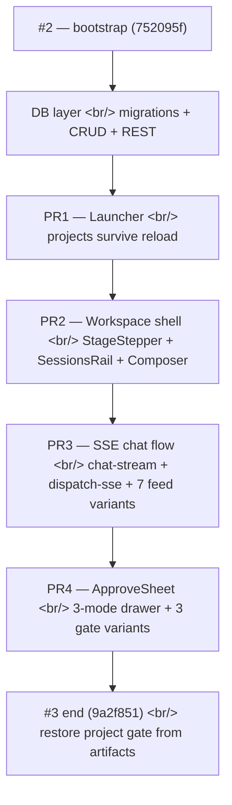

## Overview

[Previous post: #2 — Bitbucket migration, production-readying, React rewrite begins](/posts/2026-05-18-creative-agent-studio-dev2/) ended with the React infrastructure bootstrapped: empty Zustand store, Vite + Tailwind + TS, three primitives, a `<T>` i18n component, and a PR1 plan. Twenty-four hours later, **134 non-merge commits** had landed four PRs in sequence and produced a working React frontend with real database persistence and live SSE streaming.

The work fell into four PRs and one stack underneath:

- **PR1 — Launcher** (projects CRUD, ProjectCard, NewProjectCard, CreateProjectModal, ProjectGrid)
- **PR2 — Workspace shell** (StageStepper, ProjectSubbar, SessionsRail, Composer, ChatPanel, CanvasPanel placeholder)
- **PR3 — SSE + chat flow** (chat-stream parser, dispatch-sse mapper, useChatStream hook, AgentAvatar, all 7 FeedItem variants, ChatFeed)
- **PR4 — ApproveSheet + Gates** (3-mode drawer, ApproveGateCopy / Scenario / ResearchInput variants)
- **Underneath** — `projects`, `artifacts`, `diff_history` tables; CRUD operations; full REST API; soft-delete semantics

<!--more-->



One running theme — **build the surface bottom-up, and never let a commit cross a layer it shouldn't.**

---

## The Database Layer — Same Day as the UI

Three migrations and a small handful of CRUD modules made `projects`, `artifacts`, and `diff_history` first-class. The first commit (`feat(db): add projects, artifacts, diff_history tables via migrations`) set the shape:

```sql
CREATE TABLE projects (
    id          INTEGER PRIMARY KEY,
    title       TEXT NOT NULL,
    brand       TEXT,
    gate        TEXT,        -- which gate the project last paused at
    created_at  INTEGER NOT NULL,
    updated_at  INTEGER NOT NULL,
    deleted_at  INTEGER      -- soft delete
);

CREATE TABLE artifacts (
    id            INTEGER PRIMARY KEY,
    project_id    INTEGER REFERENCES projects(id),
    stage         TEXT NOT NULL,
    kind          TEXT NOT NULL,
    payload       TEXT NOT NULL,   -- JSON
    evidence_uri  TEXT,            -- §8.2 — provenance
    created_at    INTEGER NOT NULL
);

CREATE TABLE diff_history (
    id            INTEGER PRIMARY KEY,
    project_id    INTEGER REFERENCES projects(id),
    gate          TEXT NOT NULL,
    before        TEXT,            -- JSON (nullable for first selection)
    after         TEXT NOT NULL,   -- JSON
    created_at    INTEGER NOT NULL
);
```

Three commits later, the CRUD module landed: `createProject`, `listProjects` (active only, updated_at desc), `getProject` (returns deleted rows for audit), `renameProject` (partial patch semantics), `softDeleteProject` (idempotent — no double-flip of `deleted_at`).

The idempotency rule was specifically tested in `fix(db): softDeleteProject preserves deleted_at on idempotent re-call`. The original implementation called `UPDATE ... SET deleted_at = ?` which would overwrite an earlier deletion timestamp if called twice. The fix: `UPDATE ... SET deleted_at = ? WHERE deleted_at IS NULL`. Small bug, larger principle — soft-delete is a tombstone, not a flag.

Then the REST API came up on top in five commits:

```
POST   /api/projects        → createProject
GET    /api/projects        → listProjects
GET    /api/projects/:id    → getProject (404 if deleted — fix(api))
PATCH  /api/projects/:id    → renameProject
DELETE /api/projects/:id    → softDeleteProject
```

A separate fix made GET and PATCH treat soft-deleted projects as 404 (audit-visible via the lower-level CRUD path, but invisible at the REST surface). The diff_history module added `appendDiff` with a guard against storing literal `'null'` strings when `after` was `null` — the kind of bug that's only obvious when you find someone's project history showing the string `"null"` rendered in the UI.

---

## PR1 — The Launcher

The user's first screen. Project list, create-new affordance, search.

A handful of structural commits set up the page architecture:

- `feat(web): real projects slice (CRUD)` — `useProjects` hook with sort-by-updated
- `feat(web): add userName + setUserName to ui slice` — persisted user name shown in the bilingual greeting
- `feat(web): add AppTopbar with logo + lang toggle` — site chrome
- `feat(web): add LauncherTopbar + LauncherHero with bilingual greeting`
- `feat(web): add SessionsRail hidden-mode stub (PR2 fills workspace mode)`

Then the actual list and creation flow:

- `feat(web): add ProjectsSearch with bilingual placeholder and count kicker`
- `feat(web): add ProjectCard with progress bar and brand/status`
- `feat(web): add NewProjectCard with dashed border and accent hover`
- `feat(web): add CreateProjectModal with title + optional brand + validation`
- `feat(web): wire ProjectGrid — search filter, modal, navigation`

The card progress bar reads from the same `gate` field the project advanced to — so the launcher card is a live snapshot of how far along each project is. Click → navigate to `/projects/:projectId`. Done.

What's clean about this PR is its strict layering: every interactive piece reads from the store, the store reads from the REST API, the REST API reads from the CRUD module, the CRUD module reads from SQLite. No shortcuts. The component itself only knows about the slice.

---

## PR2 — The Workspace Shell

The screen users land on after clicking a project card. Three columns: sessions rail on the left, chat in the middle, canvas placeholder on the right. The actual stage-by-stage workflow lives inside this shell.

Eleven commits, structural:

- `feat(web): add stage-labels lib (gate ↔ stage + ko/en short/long labels)` — the canonical mapping of stages to their bilingual labels, used by both the stepper and the canvas
- `feat(web): add Session type` + `real workspace slice (sessions + composer)` + `store-init test`
- `feat(web): add sessionsPanelOpen + toggleSessionsPanel to ui slice` — the rail collapses
- `feat(web): add StageStepper (6 dots + bilingual long-form label)` — the stage progress indicator
- `feat(web): add ProjectSubbar wrapping StageStepper`
- `feat(web): fill SessionsRail workspace mode (project header + sessions list + new + back)`
- `feat(web): add Composer (pill input + send button, console-log submit only)` — chat input, no submission wiring yet
- `feat(web): add ChatPanel skeleton (header + welcome bubble + Composer)`
- `feat(web): add CanvasPanel placeholder (PR5 fills variants)` — explicit deferral
- `feat(web): assemble WorkspacePage (.shell grid) + swap workspace route`

The placeholder pattern is worth noticing. `CanvasPanel` was added as a placeholder that explicitly said "PR5 fills variants" in the commit message. That deferred a large piece of work without leaving a hole in the layout — the layout was done, the slot was wired, the actual content was a stub that wouldn't ship to users yet. PR5 could land cleanly because PR2 had reserved its address.

---

## PR3 — SSE Plumbing, Chat Flow, and the Seven Feed Variants

This is the PR that turned a static shell into a live app. Twenty-something commits across three layers — store, plumbing, components.

### Store layer

```ts
// web/src/store/slices/feed.ts (paraphrased)
type FeedItem =
  | { kind: "user", text: string }
  | { kind: "assistant", text: string }
  | { kind: "streaming", text: string }
  | { kind: "agent_progress", agent: string, status: string }
  | { kind: "stage_complete", stage: string }
  | { kind: "system_error", message: string }
  | { kind: "task_update_note", text: string };

type FeedSlice = {
  feed: FeedItem[];
  appendChunk: (text: string) => void;      // streaming
  splitParagraphs: () => void;              // streaming → final
  pushAgentProgress: (agent, status) => void;
  pushStageComplete: (stage) => void;
  // ...
};
```

A discriminated union for the seven feed item types, with per-kind reducers on the slice. Plus a `pipeline` slice for the gate/stage/context/lastSubmit state, and a `workspace` slice that gained `tasks` + `activeSubAgents` (sink for `agent_activity` envelopes).

### Plumbing layer

Three pure modules and one hook:

- `feat(web): add chat-stream lib (POST /api/chat + SSE parse + Zod-validated envelopes)` — the wire-level parser
- `feat(web): add dispatch-sse mapper (SSEEnvelope → store actions)` — pure mapper, no DOM
- `feat(web): add useChatStream hook (submit/cancel + AbortController lifecycle)` — lifecycle owner

```ts
// web/src/hooks/use-chat-stream.ts (paraphrased)
export function useChatStream() {
  const controllerRef = useRef<AbortController | null>(null);

  const submit = useCallback(async (text: string, context: ChatContext) => {
    controllerRef.current?.abort();
    const controller = new AbortController();
    controllerRef.current = controller;

    for await (const envelope of streamChat({ text, context, signal: controller.signal })) {
      dispatchSse(envelope);   // store action
    }
  }, []);

  const cancel = useCallback(() => controllerRef.current?.abort(), []);

  return { submit, cancel };
}
```

The split was: chat-stream parses, dispatch-sse maps, useChatStream owns the lifecycle. Three things, three modules — no module ever did more than one job. Tests for each (`tighten test fetch types` etc) shipped on the same day.

### Component layer

Once envelopes could land in the store, the components rendered them:

- `feat(web): add AgentAvatar + fix shared/events runtime exports`
- `feat(web): add User/Assistant/Streaming bubble components`
- `feat(web): add AgentProgress + StageComplete + SystemError + TaskUpdateNote`
- `feat(web): add FeedItem discriminated dispatcher (7 variants)`
- `feat(web): add AgentStrip ('Running now' active sub-agents)`
- `feat(web): add ChatFeed (auto-scroll + FeedItem map + welcome empty state)`
- `feat(web): wire ChatPanel to AgentStrip + ChatFeed (replaces static welcome bubble)`

The `FeedItem` dispatcher is the discriminated-union pattern paying off — one place that maps every variant to its component, with exhaustiveness enforced by TS.

The `AgentStrip` was the materialization of decision 2 from `interaction-model.md` — "one-line status, no full dashboard." It shows only the currently-running sub-agents as a horizontal strip across the top of the chat. Not a side panel, not a dashboard, just an inline strip that appears when work is happening and disappears when it isn't.

---

## PR4 — The ApproveSheet and the Three Gate Variants

The piece that turned the chat-only flow into a chat + approval flow.

The ApproveSheet is a bottom drawer with three modes — collapsed (just the gate prompt), half-open (gate + summary), full (gate + everything). Drag-to-resize via pointer events. Esc collapses. Three gate variants drop into the same shell — each gate stage gets its own variant component.

Twelve commits, structural again:

- `feat(web): add ApproveGate payload types`
- `feat(web): add approveSheetMode + setApproveSheetMode to ui slice`
- `feat(web): pipeline slice gains copy/scenario history + idx setters` — the back-pointer state for switching between historical drafts
- `feat(web): projects slice gains bumpProjectGate + assert PR4 fields in store-init`
- `feat(web): dispatch-sse pushes copy/scenario history + bumps project gate on stage_complete` — the SSE → store glue for gate advance

Then the drawer mechanics:

- `feat(web): add useApproveSheetDrag hook + PointerEvent jsdom polyfill` — the drag-handle hook. PointerEvent isn't in jsdom by default, so a polyfill shipped alongside.
- `feat(web): add ApproveSheet base (3-mode drawer + collapse toggle + drag handle)`

And the three gate variants:

- `feat(web): add ApproveGateCopy (grid + select + approve / request-edit)` — the user picks one of N copy drafts
- `feat(web): add ApproveGateScenario (acts list + approve / request-edit)` — the user approves or revises a multi-act scenario
- `feat(web): add ApproveGateResearchInput (question + answer + send)` — a different shape: the agent asks the user a research question and waits for a typed answer

Wired together by `ApproveGate` dispatcher (variant selection + submit wiring), then mounted inside `ChatPanel` with submit forwarded from `WorkspacePage`. The user's flow is now: ask in chat → agent runs → drawer rises with the artifact → approve or revise. Decision 3 from `interaction-model.md` (gate-based auto-run between stages) is alive.

---

## The End-of-Day State

The last commit of the day (`9a2f851 feat(web): restore project gate from artifacts on workspace mount (Slice K)`) closed an important loop: when the user reloads the workspace page, the project's gate state is restored from its persisted artifacts. The day's work survives a refresh.

Between the underneath stack and PR1–PR4, the React frontend at end-of-day had:

- A working launcher (real projects, persisted across reloads)
- A workspace shell with a three-column layout
- Live chat with SSE streaming
- All 7 feed variants rendering
- An ApproveSheet drawer with 3 gate variants
- Project state surviving reload

The mockup wasn't deleted yet, but everything it was supposed to demonstrate now ran in React.

---

## Insights

The day worked because every commit respected its layer. The store slices were declared in PR2 with the shape they'd need for PR4. The SSE plumbing in PR3 was three modules — parser, mapper, lifecycle — that could each be tested independently. The ApproveGate variants in PR4 plugged into a dispatcher pattern matching the FeedItem dispatcher from PR3.

The thing that didn't happen — and was the reason 134 commits in a day was not chaos — was *cross-layer commits*. No commit added a `<button>` and a SQL column at the same time. No commit reached up from a CRUD module into a slice. When a commit needed to span layers, it was either preceded by a foundation commit one layer below or followed by an adopter commit one layer above. The discipline turned what would otherwise be a sprint of patchwork into a clean stack of additions.

The mental model worth keeping: **fast does not mean shortcut.** This day shipped four PRs because of the discipline that let each PR exist, not in spite of it.

Next: the canvas panel, the 5-gate workflow, the key-concept planner, and the revise-mode multi-select pattern that would let users surgically re-run a single card instead of the whole stage.
