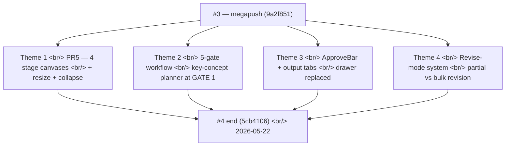

## Overview

[Previous post: #3 — the 134-commit megapush](/posts/2026-05-19-creative-agent-studio-dev3/) ended with PR4 (ApproveSheet + three gate variants) merged and project state surviving reload. Three days later, **153 more commits** had completed every remaining piece of the four-stage agent workflow: a four-variant canvas panel that materialized the stage outputs (PR5), a workflow consolidation from three gates to **five** with the key-concept planner at the new GATE 1, a UI re-architecture that replaced the bottom-drawer ApproveSheet with a slim ApproveBar plus output tabs, and the **revise-mode multi-select system** that lets users surgically re-run a single key concept, copy draft, cut, or storyboard panel instead of redoing an entire stage.

Underneath, the runtime gained the Planner-Generator-Evaluator loop, continuity anchors authored from user feedback, evolution notes injected into prompts, an HTML template set for the planning report and storyboard, and session isolation so a single project can carry multiple parallel attempts.

<!--more-->



Four themes, one recurring shape — **the workflow stopped being "all or nothing" at every layer it touched.**

---

## Theme 1 — PR5: The Canvas Panel With Four Stage Variants

PR2 reserved a `CanvasPanel` placeholder. PR5 filled it. The canvas is the right-hand column of the workspace; it shows the *current artifact* of the current stage, rendered with a stage-specific component.

```ts
// web/src/components/canvas/stage-canvas.tsx (paraphrased)
function StageCanvas({ stage }: { stage: PresentationStage }) {
  switch (stage) {
    case "research":   return <ResearchCanvas />;
    case "copy":       return <CopyCanvas />;
    case "scenario":   return <ScenarioCanvas />;
    case "storyboard": return <StoryboardCanvas />;
  }
}
```

Each variant reads its data from the `pipeline` slice and renders a stage-appropriate layout:

| Stage | Variant | What it shows |
|---|---|---|
| research | `ResearchCanvas` | `AdBriefRecap` + `ResearchSummaryCards` from `pipelineContext` + active task list |
| copy | `CopyCanvas` | `ConceptGrid` of `CopyOptions` from `copyHistory` |
| scenario | `ScenarioCanvas` | `SceneStrip` per Act + `CutChip` strip from `scenarioHistory` |
| storyboard | `StoryboardCanvas` | 1 `StoryboardPage` per scene from `storyboardImageUrls` |

Storyboard image handling needed a small architectural choice. Base64 PNG payloads arrive via `storyboard_image` SSE events. The pipeline slice converts each to a blob URL (`URL.createObjectURL`) with a revoke-on-replace step so a re-generation doesn't leak the previous image. The `addStoryboardImage` reducer holds the revoke logic:

```ts
addStoryboardImage: (scene, base64) => set(s => {
  const old = s.storyboardImageUrls[scene];
  if (old) URL.revokeObjectURL(old);
  const blob = base64ToBlob(base64, "image/png");
  return { storyboardImageUrls: { ...s.storyboardImageUrls, [scene]: URL.createObjectURL(blob) } };
}),
```

### Resize + collapse

Two commits added the resize affordance:

- `feat(web): add useCanvasResizer hook (pointer capture + clamped delta -> ui.canvasWidth)` — `ui.canvasWidth` is clamped to 360..800px in the ui slice
- `feat(web): add CanvasResizer component (vertical drag handle + warm hover tint)` — the visual handle, hover tint follows Creative Warmth (a subtle warm gradient, no pure highlight)
- `feat(web): WorkspacePage grid column reads ui.canvasWidth + respects canvasCollapsed` — the grid actually responds to the width

`CanvasHeader` got a collapse toggle so power users can hide the canvas entirely when they want to focus on chat.

### PR6 — Polish + backend swap + mockup deletion

PR6 was the bridge between "everything in React works" and "we're actually serving React to users":

- `feat(web): ui slice gains fatalError + setFatalError`
- `feat(web): add ErrorScreen (vercel_unsupported + unexpected kinds, ko/en)`
- `feat(web): add AppErrorBoundary class component (catches descendants -> ErrorScreen)`
- `feat(web): useChatStream detects Vercel 503 -> ui.fatalError = vercel_unsupported`
- `feat(server): serve web/dist instead of mockup/ (MOCKUP_DIR -> WEB_DIST_DIR)`
- `feat(deploy): vercel buildCommand + outputDirectory point to web/dist`
- `chore: remove legacy mockup/ vanilla-JS SPA` — the mockup, six weeks after birth, was deleted in one commit

The `vercel_unsupported` error is a specific kind: Vercel's serverless functions can't host long-lived SSE connections, so deploying the backend there produces a 503 on the chat route. The frontend detects it explicitly and shows a screen explaining the EC2-only constraint instead of a generic network error.

---

## Theme 2 — The Workflow Consolidates to Five Gates

Through PR4, the workflow had three approval points — one after copy, one after scenario, one at the end of storyboard. May 21 introduced **GATE 1 (key concept selection)** and made the gate count five.

### Why GATE 1 needed to exist

The pre-existing flow ran `research → copy directly`. The user submitted a brief, research happened, and then the copy stage emitted four parallel drafts (one each for 감성/직설/유머/하이브리드 angles). The problem: the copy drafts inherited the research agent's interpretation of the brief without ever asking the user *which direction* they wanted. Two days of revisions per project were going into pushing the copy stage back to a different angle the user hadn't asked for.

The fix was a new specialist between research and copy:

```
research → [key_concept_planner produces 10 candidate concepts: 3-3-2-2 distribution]
         → GATE 1 (user picks one)
         → copy stage runs anchored to selected concept
```

The 3-3-2-2 distribution (3 commercial, 3 emotional, 2 narrative, 2 conceptual) came from `CATEGORY_PLAN`. A later refactor (`refactor(agents): derive key_concept distribution from CATEGORY_PLAN`) made the distribution computed from the plan rather than hardcoded, so adjusting the mix in one place propagates.

### Frontend — ApproveGateKeyConcept

The 10-card selection UI shipped as `ApproveGateKeyConcept`:

- `feat(web): add KeyConcept gate types`
- `feat(web): ApproveGateKeyConcept 10-card selection drawer`
- `feat(web): wire GATE 1 key-concept gate into ApproveGate`

Backend pieces:

- `feat(runtime): emit GATE 1 key-concept gate after research stage`
- `fix(runtime): only block key_concept_planner re-enqueue while job is in flight` — prevented a race where a slow re-render dispatch was being filtered out
- `feat(runtime): route selectedKeyConcept to copy and feedback re-entry` — copy stage receives the selected concept
- `feat(agents): copywriter_agent anchors copy to the selected key concept`
- `feat(runtime): persist key_concept_set artifacts` + `record GATE 1 key-concept selections in diff_history`

### GATE 3 (concept approval) and GATE 5 (final approval)

Two more gates filled the workflow:

- `feat(runtime): add GATE 3 컨셉 승인 — two-phase scenario stage` — scenario got split into concept-approval-then-full-scenario
- `feat: add GATE 5 (최종 승인) to the storyboard stage` — the final approval before the project is considered done

Combined with GATE 2 (copy) and GATE 4 (full scenario), this gave the canonical 5-gate flow that all the UI labels would refer to from this point on.

### gate_state — 12-state live transitions

`feat(runtime): wire gate_state 12-state live transitions` split the gate lifecycle from job lifecycle. The 12 states encode every meaningful transition (pending → emitted → awaiting_user → user_approved → user_revising → rerunning → reapproved → ...), each surfaced to the frontend so the UI can render a meaningful "what's happening with this gate" without polling for inferred state.

### The planning report at GATE 1

`feat: add report_writer agent + 리서치 분석 보고서 at GATE 1` added a second specialist that runs alongside key_concept_planner — it produces a structured 리서치 분석 보고서 (research analysis report) that gives the user the *context* behind the 10 key concepts. Without this, the user is picking from concepts cold; with it, they see the underlying reasoning.

Then a follow-up — `feat: add report_writer planning mode for 최종 기획 보고서` — taught the same agent to produce a different *kind* of report at the end of the workflow (a planning report summarizing the entire project).

### HTML template set

The reports needed to *look* like documents, not chat bubbles. A whole HTML template set arrived in successive commits:

- `feat: add base.css slide canvas and primitives`
- `feat: add storyboard cover and continuity-grid templates`
- `feat: add deck.css and four simple deck templates`
- `feat: add photo-caption and fullbleed-caption deck templates`
- `feat: add annotated-photo, product-lineup, info-card, creative-board templates`
- `feat: add report_writer HTML conversion design spec` + `implementation plan`
- `feat: add template gallery index` + `LLM-facing template catalog`

The template catalog is the LLM-facing piece — the agent gets a structured list of templates to choose from when assembling a multi-page document. That's how it can produce a storyboard cover, continuity grid, treatment grid, and conti sequence all from one prompt without hand-coding a layout per page.

---

## Theme 3 — ApproveBar Replaces the Drawer; Output Tabs Replace the Inline Render

By 2026-05-21 the bottom drawer pattern (`ApproveSheet`) had become a UX problem: opening it covered the canvas, and the canvas was where the *result* lived. The user had to keep collapsing the drawer to look at the storyboard they were approving.

Three commits killed the drawer:

- `feat(web): add slim ApproveBar, replace ApproveGate in ChatPanel` — a horizontal bar at the bottom of the chat panel
- `refactor(web): remove ApproveSheet/StageCanvas drawer stack`
- `feat(web): show output panel on active gate + scenario gate advances`

The ApproveBar is just two buttons (Approve / 수정요청) plus the gate context — minimal, no drawer to drag. The actual artifact to inspect lives in the canvas (right column), where it always did.

### Output tabs — canvas pivots from "show current stage" to "tabbed history of all stages"

Right after the ApproveBar landed, the canvas itself was re-architected:

- `feat(web): add output-tabs definitions and visibility logic`
- `feat(web): add activeOutputTab to ui slice`
- `feat(web): add output fields to pipeline slice`
- `feat(web): hydrate output slots from artifacts`
- `feat(web): route gate/planning outputs into pipeline slice`
- `feat(web): add analysis/keyConcept/planning/concept tab bodies`
- `feat(web): add selectable copy tab body`
- `feat(web): add OutputTabs container`
- `feat(web): swap CanvasPanel body to OutputTabs`

Previously the canvas only ever showed the *current* stage's artifact. Now it has tabs across the top — Analysis, Key Concept, Concept, Copy, Scenario, Storyboard — and the user can flip back to look at any prior artifact while still working on the current stage. That changes the UX entirely: the canvas became a project workspace, not just a current-state display.

### The Planner-Generator-Evaluator loop

The runtime equivalent of this UX move is the **Planner-Generator-Evaluator loop**:

- `feat: Planner-Generator-Evaluator loop + BDI structure`
- `feat(web): register copy_evaluator in agent-copy map`
- `feat(runtime): extend the evaluator loop to the scenario stage (§3.4)`
- `feat(runtime): extend the evaluator loop to the storyboard stage (§3.4)`
- `fix(runtime): re-assess regenerations in the evaluator loop`

The pattern: every generation stage now runs Planner → Generator → Evaluator. The Evaluator decides whether the output meets quality bars; if not, the loop re-runs Generator with feedback. The user sees the *final* output after the loop converges (or hits a max iteration cap). This is also what made the output tabs valuable — the planning artifact and evaluation notes for each stage are visible if the user wants to dig in.

---

## Theme 4 — The Revise-Mode System

This is the biggest UX commitment in this window. Before this work, "I want to redo just one card" meant "redo the whole stage" — the user had no way to surgically pin everything except the piece they wanted regenerated.

### Intent classification

The first piece (`feat: add revision-intent — classify chat revision as bulk/partial`) is a small classifier on chat input. When the user types in a gate context, the system asks: is this a *bulk* request ("make all the copy more emotional") or a *partial* request ("change just the third one")? The output drives different runtime paths:

- **Bulk** → re-run the entire stage with the feedback as context
- **Partial** → enter "revise mode" in the UI, let the user pick which items to regenerate

```js
// runtime/orchestration/revision-intent.js (paraphrased)
function classifyRevisionIntent(message, gateContext) {
  if (hasPartialMarkers(message)) return { kind: "partial", confidence: high };
  if (hasBulkMarkers(message))    return { kind: "bulk",    confidence: high };
  return { kind: "ambiguous" };  // UI nudges the user to clarify
}
```

### Revise-mode UI

The frontend gained a revise-mode toggle on the ApproveBar and multi-select checkboxes on every selectable tab:

- `feat: pipeline store — reviseMode + reviseSelection state`
- `feat: add RevisionContext type + ChatContext.revision field`
- `feat: ApproveBar revise-mode toggle with selection count`
- `feat: KeyConceptTab multi-select checkboxes in revise mode`
- `feat: CopyTab multi-select checkboxes in revise mode`
- `feat: ScenarioCanvas cut-level revise checkboxes`
- `feat: StoryboardCanvas panel-level revise checkboxes`

`reviseSelection` is a `Set<id>` per artifact kind. The user toggles individual cards; the count appears live in the ApproveBar so they always know how many items will be regenerated.

### Revision-merge — the index splice

The runtime side needed a way to actually *merge* the regenerated subset back into the existing set. That's the `revision-merge` module:

```js
// runtime/orchestration/revision-merge.js (paraphrased)
function mergeRevision(originalSet, regeneratedSubset, selectedIndices) {
  const merged = [...originalSet];
  regeneratedSubset.forEach((newItem, i) => {
    merged[selectedIndices[i]] = newItem;
  });
  return merged;
}
```

Pure function — splice at the indices that were selected, leave the rest frozen. Tested end-to-end: `test: end-to-end partial revision keeps frozen items + 3-3-2-2`.

### Each agent learned partial regeneration

Five specialist agents learned to regenerate only the selected slots:

- `feat: key_concept_planner regenerates selected slots (category-preserving)` — preserves the 3-3-2-2 distribution
- `feat: copywriter_agent regenerates selected copy drafts`
- `feat: concept_anchor applies revision feedback (GATE 3, whole-doc)` — GATE 3 is whole-doc only because concept anchor is itself a single artifact
- `feat: scene_designer cut-level revision (structure + cut count preserved)` — preserves total cut count
- `feat: storyboard_generator regenerates selected panels + images`

Each agent had to know what its frozen-item constraints were. Storyboard could regenerate just panel 3 without recomputing the cut count, but scene_designer had to preserve total cut count because the scenario's structural contract is the cut count.

### Routing layer

Two routing commits put it together:

- `feat: root-planner routes context.revision to single target agent` — backend only enqueues the one specialist needed
- `feat: route chat revision intent — bulk runs, partial nudges revise mode` — frontend dispatches to the right path
- `feat: dispatch revise_mode_hint — open revise mode on partial chat intent` — backend can *suggest* revise mode to the frontend via a hint event, so a partial intent auto-opens the UI

The hint event was a careful boundary — backend never forces the frontend; it suggests. The frontend can override if its local state has reason to.

---

## Theme 5 — Session Isolation (multi-attempt per project)

On 2026-05-22 the workspace went from one-session-per-project to multi-session-per-project. A project can now hold parallel attempts — a single creative brief might be tried three different ways, each as its own session, with their own pipeline state.

Key commits:

- `Isolate workspace sessions and restore state per session`
- `server: project sessions list endpoint`
- `web: session restore and run recovery`
- `Start a fresh pipeline for a new session's first brief`
- `launcher: show per-session states on project cards`
- `launcher/workspace: deletable sessions + per-session gate`
- `web: scope workspace canvas to the active session`
- `web: honor session routes and preserve revision scopes`

The launcher card now shows per-session gates — a project that had three sessions, two at storyboard and one at copy, renders all three states. Sessions can be deleted individually. The workspace canvas, the revise mode, and the gate state all scope to the active session.

The biggest invisible commit: `Lock the session after final storyboard approval`. Once GATE 5 is approved, the session is read-only. This prevents accidental edits to a sealed deliverable, and forces the user to consciously start a new session if they want to iterate further.

---

## Insights

Four themes in three days, but the recurring shape is the same: **collapse of "all-or-nothing" into something granular.**

- The drawer-or-canvas binary became the output-tabs continuum (you can see every artifact at once)
- The three gates became five (with the new gate guarding the most expensive downstream cost: copy + scenario + storyboard run on a chosen direction)
- The whole-stage-re-run became partial revision (you regenerate exactly what you want)
- The one-session-per-project became multi-session-per-project (a project can hold parallel ideas)

Each of these moves cost more code than the binary version would have — partial revision alone required intent classification, frozen-item preservation logic in five agents, a Set-of-IDs in the store, and an index-splice merge function — but each one removed a class of frustration the user had been quietly bearing. The 153-commit count looks heroic; the through-line is more modest: every time the system said "all or nothing," replace it with "exactly what you meant."

Next: polish week — observability instrumentation, per-project state isolation under refresh, inline past-gate rewind from chat, and the revision-request affordance pass that finally unified the visual treatment across every tab.
