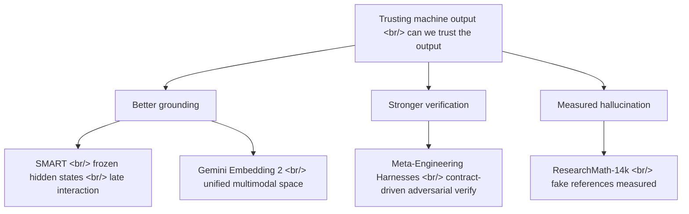

## Overview

Four papers that hit arXiv around the same time look scattered on the surface — embeddings, multimodal representation, agent engineering, a math dataset — but three of them converge on one question: can we trust what the model produced? [SMART](https://arxiv.org/abs/2605.24938) and [Gemini Embedding 2](https://arxiv.org/abs/2605.27295) firm up the retrieval and representation substrate that grounds RAG; [Meta-Engineering Harnesses](https://arxiv.org/abs/2605.25665) verifies agent output adversarially; and [ResearchMath-14k](https://arxiv.org/abs/2605.28003) turns fabricated citations into a measured failure mode.

<!--more-->

## Grounding: What the Embedding Already Knew

The claim in [SMART](https://arxiv.org/abs/2605.24938) ("Your Embedding Model is SMARTer Than You Think") is provocative: the standard single-vector embedding models we already deploy contain a dormant multi-vector capability, and waking it up requires no retraining. Instead of training the model further, SMART applies [ColBERT](https://github.com/stanford-futuredata/ColBERT)-style late interaction (the [original paper](https://arxiv.org/abs/2004.12832)) at inference time over **frozen hidden states**. By pulling out the token-level representations that exist *before* they get squashed into a single vector, it reportedly beats SOTA multi-vector approaches on [multimodal retrieval](https://en.wikipedia.org/wiki/Information_retrieval) without any multi-vector training — and it does so while staying efficient. Code and weights are open-sourced, so the claim is reproducible right away.

What makes this interesting is that it pushes back on the assumption that better retrieval requires training a heavier model from scratch. In a RAG pipeline, retrieval quality *is* grounding quality, and weak grounding lets anything built on top drift into hallucination. SMART says there is free signal still sitting inside embedding models that are already in production.

## Grounding: Video, Audio, Image, Text in One Space

[Gemini Embedding 2](https://arxiv.org/abs/2605.27295) reinforces the same substrate by the opposite route. Where SMART squeezes more out of existing models, this one trains a multimodal embedding model head-on that natively maps video, audio, image, and text into a single **unified representation space**. Layering a multi-task, multi-stage recipe onto large-scale contrastive training, it claims SOTA with 62.9 R@1 on [MSCOCO](https://cocodataset.org/) image-text and 69.9 on [MTEB](https://huggingface.co/spaces/mteb/leaderboard) multilingual. Since the [MTEB benchmark](https://github.com/embeddings-benchmark/mteb) is the de facto yardstick for embedding quality, those numbers land on comparable coordinates.

The emphasis falls on zero-shot generalization: this [Gemini](https://deepmind.google/models/gemini/)-family model reportedly transfers well to tasks and languages it never saw in training. SMART's "unlock latent capability from a frozen state" and Gemini Embedding 2's "native multimodal training" run in opposite directions but arrive at the same destination — a firmer floor for RAG to stand on.

## Verification: Compile the Contract, Then Check It Adversarially

If grounding is trust on the input side, [Meta-Engineering Harnesses](https://arxiv.org/abs/2605.25665) is about trust on the output side. The paper proposes a **contract-driven adversarial verification** architecture for AI-native software production. It compiles product requirements into explicit contracts, routes tasks to specialized [agents](https://huggingface.co/papers), and then re-checks their output through an **independent verification** stage. Generation and verification are deliberately split so the two adversarially keep each other honest.

On top of that sit persistent memory and failure classification: which task failed and why is accumulated, classified, and fed back into the next routing decision. The authors frame this as "CTO-as-a-service" and report early deployment across 17 features. The core move is refusing to trust a single agent's self-confidence and externalizing verification into a separate step — a system-design acknowledgment that an LLM's self-evaluation is hard to rely on.

## Measured Hallucination: Fake Citations as a Failure Mode

[ResearchMath-14k](https://arxiv.org/abs/2605.28003) ([HF Papers](https://huggingface.co/papers/2605.28003)) quantifies the trust problem most sharply. It is 14,056 research-level math problems built through a multi-agent pipeline — the largest of its kind to date ([dataset](https://huggingface.co/datasets/amphora/ResearchMath-14k)) — accompanied by ResearchMath-Reasoning, 220K teacher trajectories.

The most striking finding is about citation behavior. Newer open models produce 5.6x more references per trace — but they also generate **5.0x more *fake* references**. In other words, the model that looks smarter fabricates more, and more convincingly: hallucination is not shrinking, it is getting more polished. Fortunately, after agentic filtering removes those fake references, fine-tuning [Qwen3](https://github.com/QwenLM/Qwen3) 4B-30B ([Qwen](https://huggingface.co/Qwen)) improves the average by +9.2 points over base — direct evidence that verification and filtering lift data quality. The authors are from [Seoul National University](https://en.snu.ac.kr/), [OneLineAI](https://onelineai.com), and Yonsei University.

## Insights

Set side by side, the four papers decompose one question — can we trust machine output — into three layers. First, input grounding: [SMART](https://arxiv.org/abs/2605.24938) extracts stronger retrieval signal from embeddings you already own without retraining, while [Gemini Embedding 2](https://arxiv.org/abs/2605.27295) unifies modalities into one space and widens the floor RAG stands on. Second, output verification: [Meta-Engineering Harnesses](https://arxiv.org/abs/2605.25665) splits generation from verification and declines to trust a single agent's confidence. Third, quantifying failure: [ResearchMath-14k](https://arxiv.org/abs/2605.28003) nails hallucination to a measurable figure — "5x more fake citations." Better grounding plus harder verification plus measured hallucination is the same week's single answer. The lessons of SMART and ResearchMath-14k are notably complementary: the former says "there is free signal to extract," the latter says "even on top of that signal, the output can still fabricate." So the practical takeaway is simple — strengthen grounding, externalize verification, and track failures in numbers. One caveat: the SOTA and improvement figures across three of the papers are author-reported, so they are safest read as directional until independently reproduced.

## References

**Retrieval / Representation (Grounding)**
- [SMART — Your Embedding Model is SMARTer Than You Think](https://arxiv.org/abs/2605.24938) — late interaction over frozen hidden states unlocks multi-vector capability, no retraining
- [Gemini Embedding 2](https://arxiv.org/abs/2605.27295) — unified representation space for video/audio/image/text, MSCOCO 62.9 / MTEB 69.9
- [ColBERT (GitHub)](https://github.com/stanford-futuredata/ColBERT) · [ColBERT original paper](https://arxiv.org/abs/2004.12832) — foundation of late-interaction retrieval
- [MTEB leaderboard](https://huggingface.co/spaces/mteb/leaderboard) · [MTEB (GitHub)](https://github.com/embeddings-benchmark/mteb) — embedding evaluation standard
- [MSCOCO](https://cocodataset.org/) — image-text retrieval benchmark
- [Google DeepMind Gemini](https://deepmind.google/models/gemini/) — the Gemini model family

**Agent Verification**
- [Meta-Engineering Harnesses for AI-Native Software Production](https://arxiv.org/abs/2605.25665) — contract-driven adversarial verification, specialized agent routing, persistent memory and failure classification

**Hallucination / Evaluation**
- [ResearchMath-14k (arXiv)](https://arxiv.org/abs/2605.28003) · [HF Papers](https://huggingface.co/papers/2605.28003) — 14,056 research-level math problems, 5x increase in fake citations finding
- [ResearchMath-14k dataset](https://huggingface.co/datasets/amphora/ResearchMath-14k) — open dataset
- [Qwen3 (GitHub)](https://github.com/QwenLM/Qwen3) · [Qwen (Hugging Face)](https://huggingface.co/Qwen) — fine-tuned base models
- [Seoul National University](https://en.snu.ac.kr/) · [OneLineAI](https://onelineai.com) — author affiliations
- [Information retrieval overview](https://en.wikipedia.org/wiki/Information_retrieval) — background
