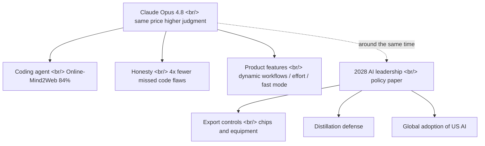

## Overview

[Anthropic](https://www.anthropic.com) shipped [Claude Opus 4.8](https://www.anthropic.com/news/claude-opus-4-8): an incremental upgrade that lifts coding, reasoning, and agentic performance while holding pricing flat ($5/$25 per million input/output tokens). What makes the week interesting is that, around the same time, Anthropic also published something that is not a model at all — the policy paper [2028: Two Scenarios for Global AI Leadership](https://www.anthropic.com/research/2028-ai-leadership). One release on capability, one on policy. Read side by side, they make it much clearer what game a frontier lab is actually playing right now.

<!--more-->

## Same Price, Higher Judgment

The headline message of [Opus 4.8](https://www.anthropic.com/claude/opus) is "we raised judgment, not the price." The [official announcement](https://www.anthropic.com/news/claude-opus-4-8) touts gains across coding, reasoning, and agentic tasks, but it leads with **honesty** rather than benchmark numbers. Early testers praised the model for flagging its own uncertainties and avoiding unsupported claims, and Anthropic reports it is roughly four times less likely than the previous generation, Opus 4.7, to overlook a code flaw. In agentic coding, a "plausible but wrong" answer costs more than an incorrect refusal — this improvement aims squarely at that asymmetry.

Holding the price is itself a signal. On the [Anthropic pricing page](https://www.anthropic.com/pricing), the Opus tier sits at $5 in / $25 out per million tokens — identical to 4.7. Against a backdrop of frontier labs raising prices generation over generation, layering capability onto a flat price reads as positioning that is acutely aware of per-token cost comparisons with [competing models](https://openai.com).

## Opus as an Agent: Benchmarks and New Features

Among the benchmarks called out, the web-agent evaluation stands out. Anthropic reports 84% on [Online-Mind2Web](https://huggingface.co/datasets/osunlp/Online-Mind2Web), the live-web benchmark in the [Mind2Web](https://osu-nlp-group.github.io/Mind2Web/) family. Because it runs multi-step tasks against real websites, it speaks more directly to "how usable is this as an agent" than static QA does.

The product layer changed too. [Claude Code](https://github.com/anthropics/claude-code) gained **dynamic workflows** that split large tasks into parallel subagents ([Claude Code docs](https://docs.claude.com/en/docs/claude-code/overview)). [claude.ai](https://claude.ai) added an **effort control** that lets users trade quality against speed directly, alongside a **fast mode** priced three times cheaper than before. In effect, the dial for making one model "think harder" or "answer faster" now sits in the user's hands.

The announcement frames Opus 4.8 as a "modest improvement" and positions it as a preview of Mythos-class models slated for broader release within weeks. Explicitly staging an incremental release lines up with the recent cadence visible in the [Anthropic newsroom](https://www.anthropic.com/news).

## The Policy Paper Placed Right Beside It

The real story of the week is that the [2028 AI leadership scenarios](https://www.anthropic.com/research/2028-ai-leadership) paper sat right next to the capability release. Its core claim: "the political systems in which the most advanced AI is created will shape the rules and norms for how the technology is developed and deployed." The paper sketches two futures — one where the US holds a 12-to-24-month intelligence lead and democracies set global AI norms, and one where the gap closes and authoritarian surveillance becomes possible at scale.

The recommendations compress to three. First, tighten [export controls](https://www.bis.doc.gov/) on advanced chips and manufacturing equipment. Second, defend against **distillation** attacks that illegally harvest US models to replicate their capabilities. Third, promote global adoption of American AI systems. The paper goes further, naming compute as the decisive variable and grounding the argument in more than a decade of "model capability scaling with compute."

## Insights

Read together, the two releases make it clear that a frontier lab's strategy runs on more than one axis. On one side is **product competition** — pricing held flat while honesty and agentic performance climb, as in [Opus 4.8](https://www.anthropic.com/news/claude-opus-4-8). On the other is **policy competition** running in parallel — [export controls and distillation defense](https://www.anthropic.com/research/2028-ai-leadership). The honesty gains on the model card and the "democracies should lead" thesis in the policy paper grow from the same root: who builds trustworthy AI, and under whose norms.

For practitioners, the more consequential shift is the product-layer dial. The [effort control](https://www.anthropic.com/claude/opus), [fast mode](https://www.anthropic.com/news/claude-opus-4-8), and [Claude Code](https://github.com/anthropics/claude-code) dynamic workflows break the "one model, one speed" assumption. Cost, latency, and quality trade-offs are likely to migrate from *which model you pick* to *how you set the dial within the same model*. If the claim of catching four times more code flaws holds, the distribution of human review time across an agentic coding pipeline changes shape. That said, the honesty and benchmark figures are all vendor-reported, so a number like 84% on [Online-Mind2Web](https://huggingface.co/datasets/osunlp/Online-Mind2Web) is safest treated as directional until independently reproduced. And as the [2028 scenarios](https://www.anthropic.com/research/2028-ai-leadership) suggest, which [compute](https://deepmind.google/models/gemini/) and which norms that dial spins on will increasingly turn on variables that are not technical at all.

## References

**Official announcement / product**
- [Claude Opus 4.8 announcement](https://www.anthropic.com/news/claude-opus-4-8) — flat price, improved coding/reasoning/honesty, new features (dynamic workflows / effort / fast mode)
- [Claude Opus model page](https://www.anthropic.com/claude/opus) — Opus tier overview
- [Anthropic pricing](https://www.anthropic.com/pricing) — Opus $5/$25 per million tokens
- [Claude Code](https://github.com/anthropics/claude-code) — agentic coding CLI that gained dynamic workflows / parallel subagents
- [Claude Code docs](https://docs.claude.com/en/docs/claude-code/overview) — feature and workflow reference
- [claude.ai](https://claude.ai) — consumer interface exposing the effort control

**Policy / research**
- [2028: Two Scenarios for Global AI Leadership](https://www.anthropic.com/research/2028-ai-leadership) — export controls, distillation defense, global adoption of US AI
- [Anthropic Responsible Scaling Policy](https://www.anthropic.com/responsible-scaling-policy) — background on capability/risk scaling policy
- [US BIS export controls](https://www.bis.doc.gov/) — agency overseeing semiconductor and equipment controls

**Benchmarks / background**
- [Mind2Web](https://osu-nlp-group.github.io/Mind2Web/) — web-agent evaluation project
- [Online-Mind2Web dataset](https://huggingface.co/datasets/osunlp/Online-Mind2Web) — live-web multi-step agent benchmark
- [Anthropic newsroom](https://www.anthropic.com/news) — recent release cadence
- [OpenAI](https://openai.com) · [Google DeepMind Gemini](https://deepmind.google/models/gemini/) — frontier labs for per-token cost and compute comparison
