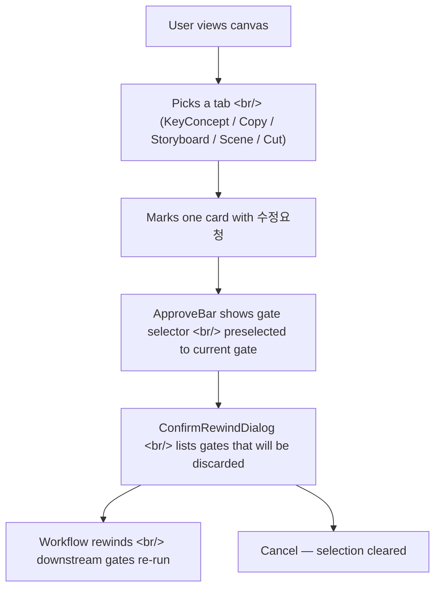

## Overview

This is the first dev log for **Creative Agent Studio** — a desktop canvas that orchestrates a chain of writing, key-concept, storyboard, and cut-planning agents into one approval workflow. Each agent emits an artifact into its own tab; the user gates each step, can mark specific cards with a "revision request" (수정요청) and rewind the workflow.

Today's four commits are all frontend polish work on the gate/revision interaction — visual unification of the marked-card affordance, softer rewind dialog copy, and a small state-management fix so the gate selector remembers what you just clicked.

<!--more-->



Four commits, one running theme: **make a destructive action (rewinding the workflow) feel deliberate, not scary.**

---

## Softening the Rewind Dialog Copy

The first commit (`e27316a`) attacked the most jarring piece of copy in the app. When you marked a card with 수정요청 and confirmed, a dialog asked:

> "이 결정을 되돌릴까요?" (Do you want to undo this decision?)
> "카피 검토 단계부터 다시 진행합니다." (We will redo this from the copy-review stage.)
> "아래 후속 결정이 새 버전으로 대체됩니다:" (The following downstream decisions will be replaced:)
> – 컨셉 확정 결정
> – 시나리오 검토 결정
> – 최종 승인 결정

Two problems jumped out from screen recordings:

1. The discard list included the *final* approval gate — but that gate is what you would re-confirm at the end. Listing it as "will be replaced" implied the work itself would vanish.
2. "결정" (decision) felt corporate. The actual artifact is a creative judgment about a draft, not a board-level decision.

The fix:

```tsx
// web/src/components/approve/ConfirmRewindDialog.tsx
// before
<ul data-testid="confirm-rewind-discard-list">
  {gates.map(g => <li key={g.id}>{g.title}</li>)}
</ul>

// after
<ul data-testid="confirm-rewind-discard-list">
  {gates
    .filter(g => g.kind !== 'final-approval')
    .map(g => <li key={g.id}>{g.softTitle}</li>)}
</ul>
```

Two changes: filter `final-approval` gates out of the discard preview, and use `softTitle` (e.g., "콘티 검토" instead of "콘티 검토 결정"). Both come from the same `Gate` interface but rendered differently in destructive vs. informational contexts.

---

## ApproveBar Gate Preselection

The second commit (`c55891b`) fixed a small but irritating state bug. When the user clicked 수정요청 on a card, the ApproveBar slid up with a gate selector — but the selector started empty, so the user had to re-click the same gate they just marked.

The root cause was that `ApproveBar` treated `gateSelection` as user-driven state only, ignoring the implicit selection from the card click.

```tsx
// web/src/components/approve/ApproveBar.tsx
useEffect(() => {
  if (mode === '수정요청' && activeCard) {
    setGateSelection(activeCard.gateId);
  }
  if (mode === 'idle') {
    setGateSelection(null);  // clear on 닫기
  }
}, [mode, activeCard]);
```

A two-line `useEffect` synced the implicit context (which card opened the bar) into the explicit selection. Clearing on `mode === 'idle'` (the close transition) prevented stale selection from leaking into the next interaction.

A security-review pass was run on this change before commit, which surfaced one note: the gate id flows from a user-controlled DOM event into a state field that gets passed to a server-side mutation. Since `gateId` is validated server-side against the current workflow's gate set anyway, no additional client-side validation was needed — but the review made that invariant explicit.

---

## Gate Titles in the Rewind Dialog

Commit `4ddff68` was a one-file change with a disproportionate impact on comprehension. The rewind dialog had been using machine-generated gate ids (`g-2`, `g-3`) as titles, leaving users to guess which step they were rewinding to.

The fix mapped each gate to its phase label:

```ts
const GATE_LABELS: Record<GateKind, string> = {
  'concept-confirm':   '컨셉 검토',
  'scenario-review':   '시나리오 검토',
  'storyboard-approve':'콘티 검토',
  'cut-finalize':      '컷 검토',
  'final-approval':    '최종 승인',
};
```

The dialog now reads "콘티 검토 단계부터 다시 진행합니다" — a phrase that matches the canvas tab labels exactly, so users can see in advance which tab they will land on after rewinding.

---

## Unifying the 수정요청 Marked-Card Visual

The biggest commit (`2804420`) was the visual unification pass across five tab components.

Before this change, each tab implemented its own marked-card style:

| Tab | Old marked-card style |
|---|---|
| `CopyTab.tsx` | Yellow background + 수정요청 chip |
| `KeyConceptTab.tsx` | Red dashed border |
| `StoryboardPage.tsx` | Blue left-edge bar (only this one) |
| `SceneStrip.tsx` | No visual treatment — just chip |
| `CutChip.tsx` | Inline outline only |

Result: every tab "felt" slightly different when revision mode was active, and the user kept asking *"why does only 콘티 (Storyboard) show this blue mark?"*

The unified treatment lives in a single design token:

```tsx
// design-system / marked-card.css
.marked-card {
  position: relative;
  outline: 2px solid var(--color-revision);
  outline-offset: -2px;
}
.marked-card::before {
  content: '';
  position: absolute;
  top: 0; bottom: 0; left: 0;
  width: 3px;
  background: var(--color-revision);
}
```

And every tab component now wraps the card in:

```tsx
<div className={cn('card', card.marked && 'marked-card')}>
  {card.marked && <RevisionLabel kind={card.kind} />}
  {/* tab-specific content */}
</div>
```

`RevisionLabel` was also extracted — previously each tab built its own label inline with different copy ("수정 요청됨", "리비전", "Edit Pending"). Now there is one component, one string.

---

## Insights

Four commits, a few hours of work, all in the `web/src/components/approve` and `web/src/components/canvas` trees. None of it added new functionality — it all closed gaps between what the agent workflow already did and what users perceived it was doing.

The recurring lesson: **destructive workflow actions need three layers of clarity in the UI**.

1. **Visual unity** — the same kind of decision should look the same wherever it appears.
2. **Honest copy** — list what will actually change, omit what will not.
3. **State preservation** — don't force the user to re-state context the app already knows.

The Creative Agent Studio's value proposition is that you can rewind any decision and the downstream agents will re-run. That's a powerful guarantee, but it only feels safe when the dialog asking for confirmation tells you the truth about what you'll lose. Today closed the gap between the truth and what the dialog was saying.

Next session: the equivalent pass on the chat-side task updates (`task-update-storyboard`, `task-update-cut`) — those still use ad-hoc copy and don't share the new label component.
