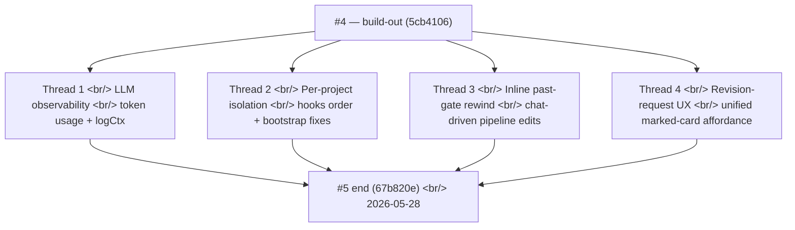

## Overview

[Previous post: #4 — five gates, four canvases, and the revise-mode system](/posts/2026-05-22-creative-agent-studio-dev4/) ended the build-out push. Six days later, **23 commits over four working days** closed out polish week — the kind of work that turns a feature-complete system into something that holds up in production under a real user's hands.

Four threads ran in parallel through the week. First, **LLM-call observability** — every model invocation now emits structured logs with token usage and a propagated logCtx, plus the runtime got `LOG_LEVEL` threshold control. Second, **per-project state isolation under refresh** — eight commits on 2026-05-26 hunted down hooks-order bugs, stranded bootstraps, and crypto.randomUUID gaps that surfaced once the multi-session work landed. Third, **inline past-gate rewind** — a single feat commit shipped the affordance that lets users say "change the third copy back at GATE 2" from inside an active storyboard session without leaving. Fourth, **the revision-request affordance pass** — five commits unified the marked-card visual across every canvas tab, softened the rewind dialog copy, and fixed a state bug where the gate selector forgot which card the user just clicked.

<!--more-->



One running theme — **the features were done; what remained was making them honest under refresh, under load, and under a confused user.**

---

## Thread 1 — LLM-Call Observability

The structured logger that landed in #2 was the foundation; this week wired it through every LLM call site so production telemetry actually means something.

Two commits did the heavy lifting:

- `feat(logger): add LOG_LEVEL threshold, silence node:sqlite warning` — a `LOG_LEVEL` env var so production can drop the `info` chatter and keep only `warn`/`error`. The companion change suppressed the `node:sqlite` experimental-warning that printed on every worker fork.
- `feat(observability): emit structured logs across worker + lifecycle paths` — `runtime/workers/worker-loop.js` and `runtime/orchestration/run-lifecycle.js` now log structured events at each meaningful transition (job claimed, run started, gate emitted, stage advanced, run completed/errored).
- `feat(observability): instrument LLM calls with token usage + logCtx` — this is the load-bearing one. Every model call now logs:

```js
// runtime/agents/_llm-instrument.js (paraphrased)
async function callModelWithLogging(model, prompt, logCtx) {
  const start = Date.now();
  try {
    const result = await model.generate(prompt);
    logger.info("llm_call", {
      ...logCtx,
      model: result.model,
      prompt_tokens: result.usage?.input_tokens,
      output_tokens: result.usage?.output_tokens,
      duration_ms: Date.now() - start,
      cached_tokens: result.usage?.cached_input_tokens ?? 0,
    });
    return result;
  } catch (err) {
    logger.error("llm_call_failed", { ...logCtx, error: err.message, duration_ms: Date.now() - start });
    throw err;
  }
}
```

`logCtx` is propagated from `worker-loop.js` and carries `{ runId, projectId, stage, role }`. So a single LLM call's log line tells you which project, which session, which gate, which agent, which model — and how many tokens it cost. The Grafana dashboard set up back in #2 now has actual data flowing into it.

The infra-side companion was `feat(terraform): widen EC2 start cron to every day` + `fix(terraform): update daily stop schedule to 03:00 KST`. The EC2 instance had been running on a weekday-only schedule from the prototype days; the cron now starts the box every day and stops it at 03:00 KST. Operational, not feature work.

---

## Thread 2 — Per-Project State Isolation Under Refresh

The multi-session work in #4 introduced an entire class of refresh-time bugs. When the user hard-refreshes inside a workspace, the React tree mounts before any data is loaded — and the multi-session logic was making assumptions that only held if the user had navigated *into* the workspace from the launcher (where the bootstrap had already happened).

Eight commits on 2026-05-26 hunted down the edge cases:

**`fix(web): bootstrap projects on workspace refresh, fix hooks order`** — the workspace page assumed `projects` was already loaded. It wasn't on a refresh. The fix added a bootstrap call inside the workspace effect — but that triggered a React hooks-order violation because the bootstrap call was conditionally inside a `useEffect`. Both got fixed in one commit.

**`fix(web): isolate per-project state on switch, show loader during session hydration`** — switching from project A to project B was leaving A's session list visible while B was loading. The fix: when `projectId` changes, immediately clear the per-project slices and show a loader, then hydrate B's data. The user sees a brief loader instead of mistakenly attributing A's sessions to B.

**`fix(web): don't strand /sessions bootstrap behind a stale ref guard`** — there was a "don't re-bootstrap if already bootstrapping" guard implemented with a ref. The ref was being set to `true` and then never cleared on certain error paths, so subsequent navigations got stranded. Fix: track the bootstrap state in the slice instead of in a ref, and clear it on success *and* failure.

**`fix(web): make Composer first-brief-only, flip ApproveBar toggle label`** — the Composer (chat input) had been the entry point for *every* user turn. But once a session was past the first brief, the gate-based flow took over — the Composer's role should be hidden. The fix made the Composer visible only before the first brief is submitted; after that, the ApproveBar is the user's surface.

**`fix(web): make bootstrap dep stable so /sessions can't be cancelled forever`** — `useChatStream` was using an AbortController whose dependency array was unstable, causing it to abort on every re-render. The fix stabilized the dep so the controller only aborted on actual user cancel or unmount.

**`fix(web): polyfill crypto.randomUUID so HTTP prod can create projects/sessions`** — the production EC2 was serving over plain HTTP for some clients (an intermediate proxy stripped HTTPS), and `crypto.randomUUID` is only available in secure contexts. Projects and sessions couldn't be created. The polyfill restores it.

The last one is the most "production reveals what your dev environment hid" of the week. Localhost is a secure context. The deploy target isn't always. A one-line polyfill kept the EC2 build usable.

**`fix: preserve 분석 보고서 across key-concept revisions`** — the runtime fix companion. When the user revised the key-concept selection at GATE 1, the analysis report (도서 단계의 산출물) was being recomputed alongside, which was unnecessary work and produced a slightly different report each time. The fix kept the original analysis frozen across key-concept revisions.

And `docs(claude): register Diffs Runtime harness pointer in CLAUDE.md` added a pointer so Claude Code sessions could find the runtime's harness conventions automatically.

---

## Thread 3 — Inline Past-Gate Rewind From Chat

A single commit shipped a major UX move: `feat(web): add inline past-gate rewind for chat-driven pipeline edits`.

The setup: by polish week, the user had ApproveBar with revise-mode for the current gate, and the workflow advanced one stage at a time. But what if the user wanted to change a *past* decision? "Actually, go back to the second key concept" while sitting in the storyboard stage?

Previously this required leaving the canvas, navigating back to GATE 1 manually, reselecting, and walking forward through every subsequent gate again. Painful, and a violation of the chat-first principle.

The inline rewind detects past-gate intent in chat:

```ts
// (paraphrased — combined chat-stream + dispatch-sse path)
// Backend classifies the chat message:
//   "두 번째 키 컨셉으로 다시 가자" → rewind_intent: { gate: "GATE_1", selection: 2 }
// Frontend receives a rewind_proposal SSE event:
{
  kind: "rewind_proposal",
  fromGate: "GATE_5",
  toGate: "GATE_1",
  affectedDownstreamGates: ["GATE_2", "GATE_3", "GATE_4", "GATE_5"],
}
// UI shows the inline ConfirmRewindDialog (the one polished in Thread 4)
```

The dialog explicitly lists what will be discarded — copy approval at GATE 2, scenario approval at GATE 4, etc. — so the user knows the cost before confirming. On confirm, the runtime walks the project back to the target gate, regenerates everything downstream, and the user lands at the target gate's approval surface ready to make the new choice.

This is the natural extension of the gate-based-auto-run principle (decision 3 in `interaction-model.md`) — but in *reverse*. The principle says: each stage advances to the next on user approval. The rewind says: each stage can also walk *back*, and the runtime knows what to invalidate.

The companion `docs(claude): add triage-prod-bug skill trigger to enforce browser-first debugging` is a harness rule — when a bug is reported, look at the browser first (devtools, network, console) before reading any code. The chat-first product principle has a debugging analogue: see-first, code-second.

---

## Thread 4 — The Revision-Request Affordance Pass

The final five commits unified the revision-request UI across every canvas tab. Before this work, every tab had implemented its own marked-card style — yellow background on Copy, red dashed border on KeyConcept, blue left-edge bar on Storyboard (only this one), no visual treatment at all on Scene — and users kept asking *"why does only 콘티 (Storyboard) show this blue mark?"*

### Soften rewind dialog copy + hide final gate from discard list

Commit `e27316a`. The first attack was the most jarring piece of copy. The rewind dialog read:

> "이 결정을 되돌릴까요?"
> "카피 검토 단계부터 다시 진행합니다."
> "아래 후속 결정이 새 버전으로 대체됩니다:"
> – 컨셉 확정 결정
> – 시나리오 검토 결정
> – **최종 승인 결정** ← shouldn't be in this list

Two problems: the discard list included the *final* approval gate (but that gate is what you would re-confirm at the end, not something that vanishes), and "결정" felt corporate when the actual artifact is a creative judgment about a draft.

```tsx
// web/src/components/approve/ConfirmRewindDialog.tsx
<ul data-testid="confirm-rewind-discard-list">
  {gates
    .filter(g => g.kind !== 'final-approval')
    .map(g => <li key={g.id}>{g.softTitle}</li>)}
</ul>
```

Filter `final-approval` gates out of the discard preview, and use `softTitle` (e.g., "콘티 검토" instead of "콘티 검토 결정"). Both come from the same `Gate` interface but rendered differently in destructive vs. informational contexts.

### Gate titles in the rewind dialog

Commit `4ddff68`. The dialog had been using machine-generated gate ids (`g-2`, `g-3`) as titles. A small label map fixed comprehension:

```ts
const GATE_LABELS: Record<GateKind, string> = {
  'concept-confirm':   '컨셉 검토',
  'scenario-review':   '시나리오 검토',
  'storyboard-approve':'콘티 검토',
  'cut-finalize':      '컷 검토',
  'final-approval':    '최종 승인',
};
```

Now the dialog reads "콘티 검토 단계부터 다시 진행합니다" — a phrase that matches the canvas tab labels exactly, so users see in advance which tab they'll land on after rewinding.

### ApproveBar gate preselection on 수정요청 enter

Commit `c55891b`. When the user clicked 수정요청 on a card, the ApproveBar slid up with a gate selector — but the selector started empty, so the user had to re-click the same gate they just marked. A two-line `useEffect` synced the implicit context into the explicit selection:

```tsx
// web/src/components/approve/ApproveBar.tsx
useEffect(() => {
  if (mode === '수정요청' && activeCard) {
    setGateSelection(activeCard.gateId);
  }
  if (mode === 'idle') {
    setGateSelection(null);  // clear on 닫기
  }
}, [mode, activeCard]);
```

A security-review pass on this change surfaced one note: the gate id flows from a user-controlled DOM event into a state field that gets passed to a server-side mutation. Since `gateId` is validated server-side against the current workflow's gate set anyway, no additional client-side validation was needed — but the review made that invariant explicit.

### Unifying the marked-card visual across five tabs

Commit `2804420`. The visual unification pass. The unified treatment lives in a single design token:

```tsx
// design-system / marked-card.css
.marked-card {
  position: relative;
  outline: 2px solid var(--color-revision);
  outline-offset: -2px;
}
.marked-card::before {
  content: '';
  position: absolute;
  top: 0; bottom: 0; left: 0;
  width: 3px;
  background: var(--color-revision);
}
```

And every tab component now wraps the card in:

```tsx
<div className={cn('card', card.marked && 'marked-card')}>
  {card.marked && <RevisionLabel kind={card.kind} />}
  {/* tab-specific content */}
</div>
```

`RevisionLabel` was also extracted — previously each tab built its own label inline with different copy ("수정 요청됨", "리비전", "Edit Pending"). Now there is one component, one string.

### Show every gate marker once and reflect live gate state

The very last commit of the day (`67b820e`). The StageStepper at the top of the workspace was showing duplicate gate markers in some states (a re-emitted gate event would add a second dot) and was lagging behind the actual gate_state transitions. Two bugs in one fix:

- Deduplicate by gate id so each gate renders exactly once
- Wire the live `gate_state` from the pipeline slice (the 12-state field from #4) so the stepper reflects whatever transition just happened

The 12-state gate_state field had been in place for a week, but the stepper had still been using the older "last completed gate" inference. This commit closed that gap.

---

## Commit Log (23 total)

| Date | Message |
|---|---|
| 2026-05-25 | fix stale approve gates during storyboard runs |
| 2026-05-25 | feat(terraform): widen EC2 start cron to every day |
| 2026-05-25 | refactor(canvas): drop submit prop drilling, polish selected-copy card |
| 2026-05-25 | feat(logger): add LOG_LEVEL threshold, silence node:sqlite warning |
| 2026-05-25 | feat(observability): emit structured logs across worker + lifecycle paths |
| 2026-05-25 | feat(observability): instrument LLM calls with token usage + logCtx |
| 2026-05-25 | chore: refresh lockfile peer-dep flags |
| 2026-05-26 | fix(web): bootstrap projects on workspace refresh, fix hooks order |
| 2026-05-26 | docs(claude): register Diffs Runtime harness pointer in CLAUDE.md |
| 2026-05-26 | fix: preserve 분석 보고서 across key-concept revisions |
| 2026-05-26 | fix(web): isolate per-project state on switch, show loader during session hydration |
| 2026-05-26 | fix(web): don't strand /sessions bootstrap behind a stale ref guard |
| 2026-05-26 | fix(web): make Composer first-brief-only, flip ApproveBar toggle label |
| 2026-05-26 | fix(web): make bootstrap dep stable so /sessions can't be cancelled forever |
| 2026-05-26 | fix(web): polyfill crypto.randomUUID so HTTP prod can create projects/sessions |
| 2026-05-27 | docs(claude): add triage-prod-bug skill trigger to enforce browser-first debugging |
| 2026-05-27 | feat(web): add inline past-gate rewind for chat-driven pipeline edits |
| 2026-05-27 | fix(terraform): update daily stop schedule to 03:00 KST in variables |
| 2026-05-27 | fix(gitignore): add harnesskit session-logs to .gitignore |
| 2026-05-28 | fix(web): soften rewind dialog copy and hide final gate from discard list |
| 2026-05-28 | fix(web): update gate titles in ConfirmRewindDialog for clarity |
| 2026-05-28 | fix(web): preselect gateSelection on 수정요청 enter, clear it on 닫기 |
| 2026-05-28 | fix(web): unify 수정요청 marked-card visual and label across all tabs |
| 2026-05-28 | fix(web): show every gate marker once and reflect live gate state |

---

## Insights

Polish week's pattern: **observability and isolation were both about exposing state that had been quietly assumed.**

The LLM token telemetry exposed *what was actually costing money* — the prior dashboards showed queue depth and job duration, both important, but a slow agent might be cheap and a fast agent might be expensive depending on token usage. Wiring `logCtx` through every call surfaced the per-project, per-stage, per-agent breakdown the cost analysis needs.

The multi-session refresh fixes exposed *what the workspace was assuming about its bootstrap*. The features worked when the user navigated in from the launcher because the launcher's bootstrap was a precondition that happened to be satisfied. When refresh broke that precondition, the bugs surfaced — but they had been there all along, latent.

The inline past-gate rewind is the same idea applied to the user's mental model — the user *thinks* "I want to change something back at GATE 1." The rewind feature exposed that intent to the system instead of forcing the user to translate it into navigation steps. The chat-first principle isn't just an input mechanism; it's a commitment that the system will understand intent.

The revision-request affordance pass is the small visible tip of the same iceberg. Three layers of clarity — visual unity, honest copy, state preservation — applied to a destructive workflow action, so the dialog asking for confirmation tells the truth about what will be lost.

Next: from here forward, the system is feature-complete enough that future dev logs will tilt toward production lessons rather than feature additions — agent prompt tuning, cost trending, the next round of UX patterns that emerge from real user sessions. The five-post backfill closes a clean arc: mockup, production-readying, megapush, gate workflow, polish. The product is real now.
