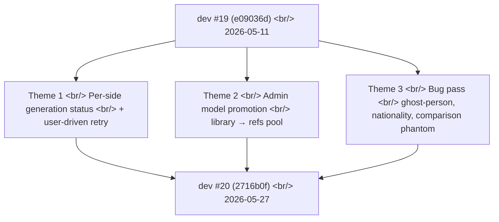

## Overview

[Previous post: #19 — model pool consolidation, admin permissions, gpt-image-2 resolution, error handling Phase 1](/posts/2026-05-11-hybrid-search-dev19/) shipped on 2026-05-11. Seventeen days and seventy commits later, three themes dominate this update.

First, **the paired A/B generation pipeline was split into two independently-tracked sides** — each with its own status, retry budget, and user-driven manual retry. This is the largest architectural change since the model pool consolidation in #19. Second, **admins can now promote any generated image into the shared model reference pool** with one click, closing the loop between "users discover great references through experimentation" and "those references benefit everyone." Third, **a long tail of prompt-injection and UI fixes** — ghost-person hallucination, nationality keyword race triggers, comparison phantom-toggle bugs, and credit accounting that ignored failed sides.

<!--more-->



Seventy commits — but every one fell into one of these three baskets.

---

## Theme 1: Per-Side Generation Status & User-Driven Retry

The biggest piece of work in this window (roughly 2026-05-15) was rewriting how the paired A/B generation pipeline tracks state.

### Background

The original pipeline ran A and B sides concurrently inside one Celery task, used `asyncio.gather(..., return_exceptions=True)` to collect results, and returned only when both sides finished. This had three production failure modes:

1. **The slow side blocked the fast side.** If A completed in 4 seconds and B took 80 seconds, the user waited 80 seconds to see anything.
2. **Retries were all-or-nothing.** If A succeeded and B hit a policy block, retrying the comparison re-ran A too — wasting credits.
3. **Wall-clock runaway.** Without a hard deadline, one stuck OpenAI call could pin a worker for minutes.

### Implementation

The pipeline was restructured around `FIRST_COMPLETED` semantics with per-side state pinned server-side:

```python
# backend/src/generation/pipeline.py
async def generate_pair(batch_id: str, prompts: tuple[str, str]) -> None:
    a_task = asyncio.create_task(_run_side(batch_id, 'A', prompts[0]))
    b_task = asyncio.create_task(_run_side(batch_id, 'B', prompts[1]))

    done, pending = await asyncio.wait(
        {a_task, b_task},
        return_when=asyncio.FIRST_COMPLETED,
        timeout=USER_BUDGET_SECONDS,  # capped at 5min
    )

    # first to finish: surface immediately, pin the other server-side
    for task in done:
        await mark_side_complete(batch_id, task.result())

    # pending sides keep running but the frontend stops blocking on them
    for task in pending:
        await persist_pending_side(batch_id, task)
```

The frontend then polls a new endpoint:

```python
# backend/src/routes/generation.py
@router.get("/api/generation-status")
async def get_generation_status(batch_id: str) -> GenerationStatusItem:
    return await get_per_side_status(batch_id)
```

`GenerationStatusItem` is a typed dataclass with `side_a_state`, `side_b_state`, `retry_available`, `last_error_kind` — enough for the frontend to render a three-state per-side toggle (pending / done / failed) and conditionally show a Retry button.

User-driven retry got its own endpoint:

```python
@router.post("/api/generate-side")
async def regenerate_single_side(req: GenerateSideRequest) -> dict:
    """User-initiated single-side retry. Does NOT charge if previous side succeeded."""
    return await retry_one_side(req.batch_id, req.side, req.prompt_override)
```

The corresponding frontend pieces shipped in `f4465ec` (`api.ts` types + `getGenerationStatus` + `generateSide`), `ecb5596` (pending-side polling + `beforeunload` block), and `fc55dd3` (detail-modal 3-state per-side toggle + retry/loading panels).

### Hardening

Three follow-ups closed the remaining edge cases:

- `cc0a2d2` — cap user budget at 5min, drop late-arriving images, fix stuck loader when both sides time out
- `a30feb8` — enforce a hard 270-second wall-clock timeout on OpenAI calls (the SDK's own retry-with-backoff could push past 300s without it)
- `f376973` / `00d94f8` — disable both the OpenAI SDK and Gemini SDK's automatic retries. Single attempt per side, with the user driving retries explicitly.

The last one was the conceptual unlock — once auto-retry was off, *every* failure became visible and *every* retry became a user decision. That mapped cleanly onto the new per-side UI.

---

## Theme 2: Admin Model Promotion

The second major thread (2026-05-18) added a pipeline for admins to promote generated images into the shared model reference pool.

### Background

The persona index is the canonical source of "tone references" — example images shown to the diffusion models to anchor style and subject. It was a static, manually-curated set. But users were generating images that *would* make great references — and there was no path from "great generated image" to "shared reference everyone can use."

### Implementation

A new database table captured promotions as first-class entities, separate from regular `LibraryAsset` rows:

```sql
-- backend/src/db/migrations/2026-05-18_model_ref_entries.sql
CREATE TABLE model_ref_entries (
    id              BIGSERIAL PRIMARY KEY,
    source_asset_id BIGINT REFERENCES library_assets(id),
    promoted_by     BIGINT REFERENCES users(id),
    persona_slug    TEXT NOT NULL,
    s3_ref_key      TEXT NOT NULL,
    promoted_at     TIMESTAMPTZ DEFAULT NOW()
);

ALTER TABLE library_assets ADD COLUMN promoted_ref_filename TEXT;
```

The promotion handler ran three steps:

```python
# backend/src/admin/promote_model.py
async def promote_to_refs_pool(asset_id: int, persona_slug: str, admin_id: int) -> int:
    asset = await get_library_asset(asset_id)
    ref_key = build_ref_key(persona_slug, asset.id)

    # 1. Server-side S3 copy (no download/re-upload)
    await s3_client.copy_object(
        bucket=REFS_BUCKET,
        key=ref_key,
        copy_source=f"{LIBRARY_BUCKET}/{asset.storage_key}",
    )

    # 2. Insert promotion row + stamp source asset
    entry_id = await create_model_ref_entry(asset_id, admin_id, persona_slug, ref_key)
    await update_library_asset_ref_filename(asset_id, ref_key)

    # 3. Hot-reload personas index — no service restart
    await hot_load_model_ref_entries()
    return entry_id
```

S3 server-side copy (`f419171`) was important — promoted images can be tens of MB, and a download-then-upload would double network cost. The `copy_object` API does it inside the AWS network.

Hot-loading (`8efb27b`, `9a5c83f`) was the other win — `hot_load_model_ref_entries` reads the new rows on each generation request rather than at startup, so a promoted image becomes available within seconds without a restart. The same path also handles the UI → persona vocab translation, so admins promote against the user-facing display name and the backend resolves to the canonical persona slug.

### UX

The frontend surface was `PromoteModelModal` (`2837ff6`) with the persona dropdown, asset preview, and a "promote" button gated by `user.is_internal` (`2f46fb3`). The library cards got a "등록됨" badge (`181ece6`) so admins could see at a glance which assets were already in the refs pool — avoiding duplicate promotions.

One asyncio quirk had to be fixed in `67b5c56`: the original handler used `asyncio.new_event_loop()` to invoke the hot-load, which deadlocked under the FastAPI worker. Switching to `asyncio.get_running_loop()` resolved it.

---

## Theme 3: The Long Tail of Bug Fixes

The remaining ~40 commits formed a steady drumbeat of small surgical fixes. The five most consequential:

### Ghost-person hallucination

Commit `91fb8a8`. Prompts mentioning a single subject (e.g., "a woman walking") were sometimes returning images with a second, ghostly figure in the background. The fix added negative prompt language *conditionally* — only when the user prompt didn't mention multiple people:

```python
# backend/src/generation/prompt_builder.py
def assemble_prompt(user_prompt: str, scene_kind: SceneKind) -> str:
    base = user_prompt
    if scene_kind == 'single-subject' and not mentions_multiple_people(user_prompt):
        base += " (single subject only, no other people in background)"
    return base
```

Adding the negative unconditionally hurt scene-typed prompts where ambient background crowd was desired (commit `e00072b` came right after to *allow* ambient crowd in `scene` contexts).

### Nationality keyword race trigger

Commit `4d6beed`. The pipeline normally picks one model based on tone analysis — but when a prompt contained an explicit nationality keyword ("Korean", "Japanese", etc.), single-model selection produced inconsistent ethnicity. The fix forced a *model race* (run multiple candidates, pick the best) whenever such keywords appeared:

```python
if has_nationality_keyword(prompt):
    return RaceStrategy.FORCE_MULTI_MODEL
```

### Comparison phantom-toggle

Commit `7ea64d5`. The comparison view had a toggle to switch between A and B sides. After a failed-then-retried B side, the toggle was getting stuck in a "phantom" state where it showed B as available but the underlying state had no B image. Root cause: a stale local state was not invalidated on the polling path. The fix:

```ts
// frontend/src/components/Comparison.tsx
useEffect(() => {
  if (status.side_b_state === 'failed' && localState.side_b_visible) {
    setLocalState(s => ({ ...s, side_b_visible: false }));
  }
}, [status.side_b_state]);
```

Sister commit `e4473d8` added the retry-in-flight loading state on the toggle and history badge so users could see *that* B was retrying.

### Header credit total

Commit `afa4fdc` + `1ddb784`. The header pill showed "today's generation count" loaded from the current page's session, not the user's lifetime total. After signups complained that the number reset on hard refresh, the source switched to counting successful images (A+B independently) live from `generation_logs`:

```sql
SELECT COUNT(*) FROM generation_logs
WHERE user_id = $1
  AND (side_a_state = 'success' OR side_b_state = 'success');
```

### Tone-ref location matching (today's deploy)

Commit `2716b0f` (the most recent). Tone references were being picked uniformly from the pool regardless of location context. If a user prompted for "Seoul street photography," tone refs from Manhattan kept slipping in. The fix added a location filter:

```python
# backend/src/generation/injection.py
def pick_tone_refs(prompt: str, available: list[ToneRef]) -> list[ToneRef]:
    location = extract_location_keyword(prompt)
    if location:
        matched = [r for r in available if r.location == location]
        if matched:
            return rank_by_relevance(matched)
    return rank_by_relevance(available)
```

The fallback to the full pool when no location matches preserves coverage — the change is additive, not restrictive.

---

## Commit Log

| Date | Message | Files |
|---|---|---|
| 2026-05-27 | fix(generation): prefer location-matched tone refs | 3 |
| 2026-05-27 | fix(ui): keep pending comparison sides loading | 2 |
| 2026-05-22 | fix(auth): count each successful image live from generation_logs | — |
| 2026-05-22 | fix(injection): force model race when prompt has nationality keyword | — |
| 2026-05-22 | fix(history): show fresh comparison image on hover after retry | — |
| 2026-05-19 | fix(generation): enforce hard 270s wall-clock timeout on OpenAI calls | — |
| 2026-05-19 | fix(prompt): block ghost-person hallucination unless prompt mentions them | — |
| 2026-05-18 | feat(admin): POST /api/admin/library/promote-model + frontend client | — |
| 2026-05-18 | feat(storage): S3 server-side copy_object helper | — |
| 2026-05-18 | feat(db): add model_ref_entries table | — |
| 2026-05-15 | feat(generation): GET /api/generation-status — per-batch poll | — |
| 2026-05-15 | feat(generation): POST /api/generate-side — user-driven single-side retry | — |
| 2026-05-15 | feat(generation): return fast side immediately, pin slow side server-side | — |
| 2026-05-15 | fix(openai): disable SDK auto-retry — single attempt per side | — |
| 2026-05-15 | fix(generation): drop Gemini 503 auto-retry — single attempt per side | — |
| _(+55 more)_ | | |

---

## Insights

Seventy commits over seventeen days, and the through-line is the same as the recent deploy: **stop hiding state from the user**. The per-side generation rewrite is the clearest example — for two months the pipeline was hiding the fact that A and B had independent lifecycles behind a single "loading" spinner, and every downstream UX bug was a consequence of that lie. Once the API exposed per-side state, the UI could finally tell the truth, and the user could make informed retry decisions instead of refreshing the page and hoping.

The admin model promotion thread is a quieter version of the same idea — exposing the seam between "user-generated content" and "shared infrastructure" so that a human can make the curation decision explicitly. Before this work, the only way a generated image could influence the refs pool was through a manual file copy by the backend dev. That seam now has a button.

The bug-fix pass is, in retrospect, the receipts. Once the per-side and promotion architectures landed cleanly, the secondary bugs (ghost-person, phantom toggle, header total) became cheap to fix because the underlying state was finally trustworthy.

Next focus: extend the per-side retry model to support per-side prompt overrides — right now retry uses the same prompt that originally failed, which is fine for transient errors but useless when the prompt itself triggered a policy block.
