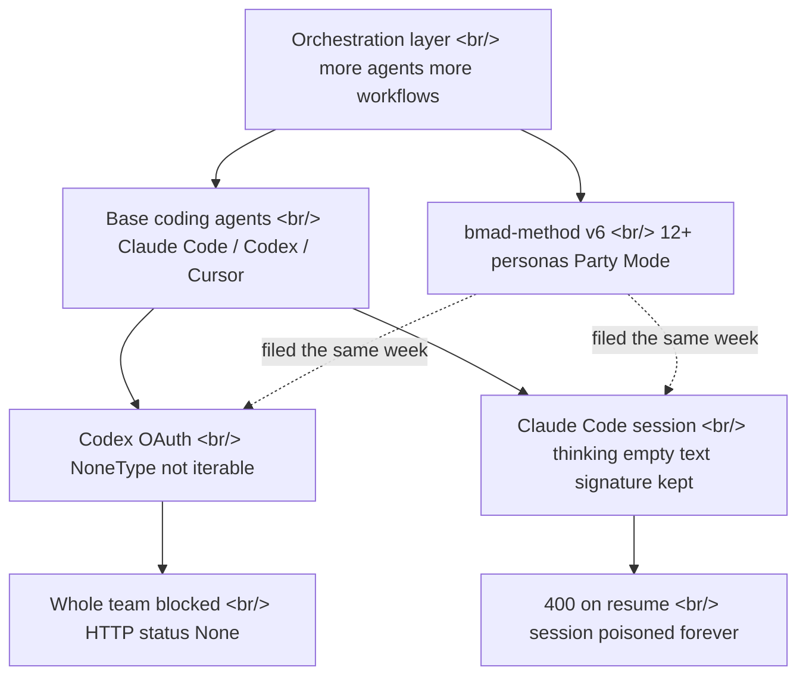

## Overview

The agentic coding ecosystem is moving in two directions at once. Frameworks like [bmad-method](https://github.com/bmad-code-org/bmad-method) pile more personas and workflows on top of a base coding agent, growing the orchestration layer. Yet two bugs filed the same week — an OAuth crash in [OpenAI Codex](https://github.com/openai/codex) and permanent session corruption in [Claude Code](https://github.com/anthropics/claude-code) — show that the primitives underneath are still brittle.

<!--more-->



## Building Up: bmad-method's Orchestration

[bmad-method](https://github.com/bmad-code-org/bmad-method) — short for "Breakthrough Method for Agile AI-Driven Development" — is an MIT-licensed [JavaScript](https://nodejs.org) project with more than 48,000 GitHub stars. Instead of calling a single coding agent, the core idea is to make multiple role-separated AI personas collaborate. It defines 12-plus specialized personas — PM, Architect, Developer, UX, and others — and even offers a **Party Mode** where several personas talk in one session.

V6 leads with **scale-adaptive planning** that tunes planning depth to the size of the task. The module ecosystem is broad too: a BMM core packing 34-plus workflows ships alongside BMad Builder, Test Architect, Game Dev, and a Creative Intelligence Suite. Installation is a single `npx bmad-method install`, which drops the framework into a base agent such as [Claude Code](https://github.com/anthropics/claude-code) or [Cursor](https://cursor.com). The package lives on [npm](https://www.npmjs.com/package/bmad-method), and the docs sit at [docs.bmad-method.org](https://docs.bmad-method.org).

The key point is that bmad-method does *not replace* the base agent — it is a coordination layer stacked on top. For 12 personas and 34 workflows to run smoothly, the model calls and session-state handling beneath them have to be solid first. And it is precisely down there that two failures surfaced the same week.

## Breaking Below, Part 1: Codex OAuth Spits a NoneType

[OpenAI Codex issue #24665](https://github.com/openai/codex/issues/24665) (now CLOSED) is a case where an entire team lost access to [Codex](https://github.com/openai/codex) at once. The auth path is central: the setup used ChatGPT/Codex **OAuth**, not an API key. The logs showed provider `openai-codex`, model `gpt-5.5`, endpoint `["chatgpt.com/backend-api/codex"]`, and this error:

```
TypeError: 'NoneType' object is not iterable
HTTP status: None
Non-retryable client error (HTTP None). Aborting.
```

The shape of the symptom is telling. The HTTP status is not a number but `None`, and the error is classified non-retryable, so it aborts immediately. This is the classic pattern of **the backend returning null/malformed data, or the client failing to handle a missing field**, then blowing up at parse time when it tries to iterate over `None`. That the HTTP layer never even populated a status code suggests the failure happened before body validation — at the stage of constructing the response object itself.

The most painful part is the blast radius. Not one user, but the whole team sharing the OAuth was blocked simultaneously. No matter how cleanly an orchestration framework partitions personas, if all of those personas ultimately call the model through the same OAuth backend, a single mishandled `None` from that backend stalls the entire stack above it.

## Breaking Below, Part 2: How Claude Code Poisons a Session Forever

The technically more interesting one is [Claude Code issue #63147](https://github.com/anthropics/claude-code/issues/63147) (OPEN, Claude Code 2.1.153). A session that combined extended thinking with tool calls becomes **permanently broken when you resume or continue it.** Once it starts, a new prompt — even a no-op — returns the identical 400.

```
API Error: 400 messages.1.content.5: `thinking` or `redacted_thinking` blocks in the
latest assistant message cannot be modified.
```

The root cause is in how the transcript is persisted. Claude Code stores thinking blocks in the session transcript jsonl (`["projects/<slug>/<id>.jsonl"]`), but it **empties the `thinking` text to `""` while retaining the original `signature` field.** A block on disk looks like this:

```json
{ "type": "thinking", "thinking": "", "signature": "<base64, ~600-4000 chars>" }
```

On resume, Claude Code replays this block to the API verbatim — `{type:"thinking", thinking:"", signature:<original>}`. But the signature was **computed over the original, non-empty thinking text.** The API validates the signature against the (now empty) text, the two no longer match, and it returns 400. Because the original text is already gone from disk, there is no way to reconstruct the request into a valid form — **the session is permanently poisoned.**

The reporter dumps a broken transcript with `jq` and shows every thinking block has text length 0 but a signature of hundreds to thousands of characters:

```
$ jq ... 'select(.type=="thinking")|[(.thinking|length),(.signature|length)]'
0    3932
0    1196
0    620
```

The scarier detail: across many seemingly healthy sessions, the *trailing* thinking block is also frequently stored in the same "empty text plus retained signature" state. In other words, a large number of perfectly fine-looking sessions are **latent landmines that detonate the moment they are resumed.** The proposed fixes split three ways — (1) persist the full signed thinking text so the signed block round-trips intact, (2) drop thinking blocks entirely from reconstructed prior turns (the API permits omitting earlier-turn thinking), or (3) add a defensive guard at request-build time that detects empty-text-with-signature blocks and strips them before sending.

## Insights

Set the two bugs side by side and one tension comes into focus: the orchestration layer races ahead while the reliability of the primitives it rides on cannot keep pace. [bmad-method](https://github.com/bmad-code-org/bmad-method) coordinates 12 personas and 34 workflows, but every one of those calls ultimately runs on a thin foundation — one OAuth token and one transcript file. The [Codex](https://github.com/openai/codex) `None` crash is about *a client failing to die gracefully when the backend breaks its promised shape*; the [Claude Code](https://github.com/anthropics/claude-code) thinking bug is about *a client irreversibly mis-serializing its own state*. The former is input validation, the latter is state persistence — neither is a flashy agent feature, just the 30-year-old fundamentals of software engineering.

The Claude Code bug in particular compresses a classic distributed-systems trap. A signature is an integrity promise about some data; erase the data while keeping the signature and the promise becomes a lie. And because the failure surfaces *at resume time, not at save time*, the user loses an entire long working session with no warning and no recovery path. The more orchestration encourages long, complex sessions, the larger the blast radius of these latent mines. The honest conclusion: before stacking more agents, the code that refreshes a token and the code that serializes a conversation transcript have to be boringly robust first. More than a flashy Party Mode, what is urgent right now is a parser that does not die when it meets a `None`, and a persistence layer that round-trips signatures together with their text.

## References

**Framework / orchestration**
- [bmad-method (GitHub)](https://github.com/bmad-code-org/bmad-method) — 12+ personas, Party Mode, scale-adaptive planning, MIT, 48k+ stars
- [bmad-method docs](https://docs.bmad-method.org) — module and workflow reference
- [bmad-method (npm)](https://www.npmjs.com/package/bmad-method) — package shipped via `npx bmad-method install`
- [bmad-code-org](https://github.com/bmad-code-org) — the org maintaining the project

**Bug reports (same week)**
- [OpenAI Codex issue #24665](https://github.com/openai/codex/issues/24665) — OAuth NoneType crash, whole team blocked (CLOSED)
- [Claude Code issue #63147](https://github.com/anthropics/claude-code/issues/63147) — session permanently poisoned by empty-text-but-signed thinking blocks (OPEN, 2.1.153)

**Base agents / runtimes**
- [Claude Code](https://github.com/anthropics/claude-code) · [Claude Code docs](https://docs.claude.com/en/docs/claude-code/overview) — agent CLI supporting extended thinking and tool calls
- [OpenAI Codex](https://github.com/openai/codex) — gpt-5.5-based coding agent
- [Cursor](https://cursor.com) — editor-based agent that bmad-method installs into
- [Node.js](https://nodejs.org) · [uv](https://docs.astral.sh/uv/) — JS/Python agent-toolchain runtimes
- [Anthropic](https://www.anthropic.com) · [OpenAI](https://openai.com) — base model providers
