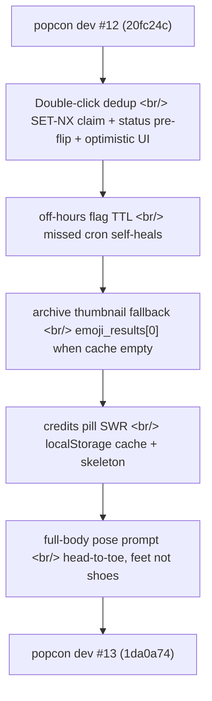

## 개요

[Previous post: #12 — download zip streaming, action cache SQLite persistence, and credits display](/posts/2026-05-11-popcon-dev12/) shipped 17 days ago. Five small commits since — but every one came out of a production incident.

The biggest is a three-layer dedup on retry/regenerate/approve. The second is a TTL on the off-hours flag so a missed cron self-heals instead of wedging `/api/generate-set` on 429s. The remaining three are surgical: an archive-card thumbnail fallback when the denormalized cache is empty, stale-while-revalidate caching for the credits pill, and a one-character prompt tightening for the full-body pose generator.

<!--more-->



Five commits, one running theme — **every fix here was a response to a real production page that fired in the past two weeks.**

---

## Three-Layer Dedup for Retry / Regenerate / Approve

The largest commit (`1da0a74`) was the most expensive bug in this window — rapid double-clicks on the Retry, Regenerate, and Approve buttons were charging credits and dispatching a fresh GPU job on each click. At popcon's per-job cost, two unintended clicks per user meant real money.

The single-status-check pattern wasn't enough because of a small but reliably-hit race window:

```
T0: User clicks Retry — handler reads status='pending', proceeds to charge + dispatch
T0+5ms: User clicks Retry again — second handler reads status='pending' (worker hasn't flipped it yet), proceeds
T0+50ms: Worker picks up job 1, flips to 'running'
T0+55ms: Worker picks up job 2, flips to 'running' again — both already paid for
```

Three layers closed it:

### Layer 1 — Atomic Redis SET-NX claim

```python
# backend/job_store.py
async def try_claim_emoji_action(job_id: str, action: str) -> bool:
    """Atomic claim using SET key value NX EX 30. True = acquired, False = duplicate."""
    key = f"popcon:claim:{job_id}:{action}"
    return await redis.set(key, "1", nx=True, ex=30)
```

`SET key value NX EX 30` is the canonical Redis primitive for "first one wins, expires in 30s." The claim is taken *before* the charge and held across the entire handler. The 30s TTL is the safety net — if the handler crashes mid-flight, the claim self-clears so the user can retry within half a minute.

### Layer 2 — Synchronous status pre-flip after charge

```python
# backend/main.py — inside /retry, /regenerate, /approve
@router.post("/retry/{job_id}")
async def retry_emoji(job_id: str, idx: int):
    if not await try_claim_emoji_action(job_id, f"retry-{idx}"):
        return {"status": "duplicate", "deduped": True}

    job = await get_job(job_id)
    if job.emoji_results[idx].status != "failed":
        return {"status": "wrong_state", "deduped": True}

    try:
        await charge_credits(job.user_id, RETRY_COST)
        # synchronous pre-flip — frontend's next poll sees 'pending' immediately
        await mark_emoji_pending(job_id, idx)
        await retry_emoji_task.delay(job_id, idx)
    except Exception:
        # compensating rollback if dispatch failed
        await refund_credits(job.user_id, RETRY_COST)
        await release_claim(job_id, f"retry-{idx}")
        raise
```

The pre-flip is the subtle piece. Without it, the frontend's next poll (1-3 seconds later) still sees status='failed' because the Celery worker hasn't picked up the job yet — so the user clicks Retry *again*, hits the still-failed status check, and gets through a second time before the worker flips it. Flipping synchronously inside the handler closes that hole.

### Layer 3 — Optimistic frontend patch + busy guard

```tsx
// frontend/components/FramesAnimatePanel.tsx
const onRetry = async (idx: number) => {
  if (busy) return;  // React commit race guard
  setBusy(true);
  patchResult(idx, { status: "pending" });  // optimistic — before await
  try {
    await api.retry(jobId, idx);
  } catch (err) {
    patchResult(idx, { status: "failed", error: String(err) });
  } finally {
    setBusy(false);
  }
};
```

The `if (busy) return` guard closes the React commit race — between `setBusy(true)` being dispatched and the next render committing, a second click could still get through. Combined with the backend layers, this gives three independent points of dedup; any one failing alone isn't enough to spawn a duplicate job.

The `/approve` endpoint had a partial version of this since launch (the commit body notes "Frontend double-clicks used to spawn parallel Wan calls") but the status check alone was racy. Same pattern now applied uniformly.

### Compensating rollback

The other production gotcha was fly.io's SIGTERM behavior. If the handler crashes between `charge_credits` and `retry_emoji_task.delay()`, the user is charged with no work scheduled. The `try/except` now refunds the charge and releases the claim before re-raising, so a mid-handler crash leaves the user back where they started instead of out of pocket.

Test coverage in `test_retry_idempotency.py` is nine cases: concurrent double-click, status-based dedup, claim primitive semantics, `.delay()` failure rollback, and approve-all bulk dedup.

---

## Off-Hours Flag TTL — Self-Healing on Cron Skip

Commit `4d131ba` came out of a real incident. The daily evening-down GitHub Actions cron sets `popcon:off_hours=true` at 14:55 UTC to disable expensive operations during off-hours, and the evening-up cron clears it at 09:30 UTC. On 2026-05-11 the morning cron was severely delayed (GHA scheduled triggers sometimes skip under load), and `/api/generate-set` returned 429s for hours until someone manually cleared the flag.

The fix is a TTL on the flag itself:

```python
# backend/job_store.py
_OFF_HOURS_TTL_SECONDS = 20 * 3600  # 20 hours

async def set_off_hours(value: bool) -> None:
    if value:
        await redis.set("popcon:off_hours", "true", ex=_OFF_HOURS_TTL_SECONDS)
    else:
        await redis.delete("popcon:off_hours")
```

Both write paths got the TTL — the backend admin endpoint (`job_store.py`) and the scheduler GHA path (`.github/scripts/scheduler.py`). The intended off-window is 18h 35m (14:55 → 09:30 UTC), so 20h gives ~85min buffer for cron lateness. If evening-up is missed entirely, the flag self-clears by ~10:55 UTC the next day instead of wedging the API indefinitely.

The regression test asserts `set_off_hours(True)` calls `set(...)` with `ex=_OFF_HOURS_TTL_SECONDS`. Pre-fix it fails with `Expected: set('popcon:off_hours', 'true', ex=72000); Actual: set('...', 'true')` — exactly the shape of bug that should be impossible to silently regress.

The shape of this fix is worth noting: **the system that sets the flag and the system that clears it are different (admin endpoint vs scheduler cron), so they can fail independently. The TTL bridges them.** Any flag whose lifecycle spans two independently-failing systems should have a TTL bound by the maximum acceptable wedge time.

---

## Archive Card Thumbnail Fallback

Commit `252569f`. The archive list was rendering broken images for a small slice of jobs.

The root cause: `jobs.thumbnail_path` and `jobs.thumbnail_key` is a denormalized cache populated by the bulk start-frame task. Under a SQLite race (concurrent regenerate on emoji index 0 — the source for the thumbnail), the bulk task could fail to write either column. When both were empty, `list_jobs` was returning `/api/job/{id}/reference` — a *dead* URL with no row to serve — and the archive card rendered a broken image.

The fix changed the read path to read `emoji_results[0]` as the canonical source whenever the cache was empty:

```python
# backend/db/operations.py
def get_thumbnail_url(job: Job) -> str:
    if job.thumbnail_path:
        return job.thumbnail_path
    if job.thumbnail_key:
        return r2_signed_url(job.thumbnail_key)
    # cache miss — fall back to first emoji as canonical source
    if job.emoji_results and job.emoji_results[0].url:
        return job.emoji_results[0].url
    return PLACEHOLDER_THUMBNAIL_URL
```

The denormalized cache stays — it's there for query performance — but the fallback chain means a cache write failure no longer surfaces as a broken UI. The placeholder at the end is the floor; a fresh job with no emoji results yet still renders something.

---

## Credits Pill: Stale-While-Revalidate

Commit `5f785aa`. The header's credit balance pill was flickering on every reload while the API call was in flight — a small but persistent UX irritant.

Two related fixes:

```tsx
// frontend/components/CreditPill.tsx
function CreditPill() {
  const cached = localStorage.getItem("popcon:credits");
  const [balance, setBalance] = useState<number | null>(
    cached ? Number(cached) : null
  );

  useEffect(() => {
    api.getCredits().then(b => {
      setBalance(b);
      localStorage.setItem("popcon:credits", String(b));
    });
  }, []);

  if (balance === null) return <PulsingSkeleton width={40} />;
  return <span>{balance}</span>;
}
```

Render the cached value immediately, replace with the fresh value once the network returns — classic stale-while-revalidate. On true first visit (no cache), show a pulsing skeleton so the `SignInButton` next to the pill doesn't jump when the balance lands. The companion `AuthProvider.tsx` change made sure the cache invalidates on sign-out so a different user doesn't briefly see the previous user's balance.

---

## Full-Body Pose Prompt — Head-to-Toe, Feet Not Shoes

Commit `cad14bc` is a one-line change with disproportionate impact. The full-body pose generator was producing images that often cropped the feet — or rendered shoes when the user wanted bare feet. The prompt wording tweak:

```python
# backend/pipeline/pose_generator.py
# before
"full body shot of the subject"
# after
"head-to-toe shot of the subject, feet visible (not shoes)"
```

"Head-to-toe" is more literal than "full body" for diffusion models — they interpret it as an explicit framing instruction rather than a vague intent. "Feet visible (not shoes)" was the second half of the fix; "full body" prompts were defaulting to shoes when feet were intended.

The smallest commit in this window, but the kind of change that closes a flood of "why does it always show shoes?" complaints.

---

## Commit Log

| Date | Message | Diff |
|---|---|---|
| 2026-05-13 | fix: dedup retry/regen/approve to prevent duplicate-click GPU spend | 4 files, +664/-37 |
| 2026-05-11 | fix(off-hours): add 20h TTL to popcon:off_hours flag | 3 files, +48/-3 |
| 2026-05-11 | fix(archive): fall back to first emoji row when jobs.thumbnail_* is empty | 2 files, +22/-2 |
| 2026-05-11 | fix(credits): cache balance in localStorage, show skeleton on first paint | 2 files, +57/-9 |
| 2026-05-11 | fix(pose): tighten full-body prompt wording (head-to-toe, feet not shoes) | 1 file, +1/-1 |

---

## Insights

Five commits, four production cracks. Two of them — the dedup and the off-hours TTL — share a deeper shape: **a system fails because two components that were assumed to be in lockstep are not.** The retry handler assumed the worker had already flipped status; it hadn't. The off-hours-set cron assumed the off-hours-clear cron would always run on time; it didn't.

The first failure mode is fixed with synchronous serialization (claim + pre-flip). The second is fixed with a timeout (TTL). Both are the same shape — explicit handling of the gap between two systems that previously coordinated implicitly through hope.

The archive thumbnail and credits pill fixes are the same idea at a smaller scale — a denormalized cache and a network call were both being treated as authoritative when they should have been treated as best-effort. Adding an explicit fallback (emoji_results[0]) and a stale-while-revalidate pattern (localStorage cache) made the optimistic paths still fast while removing the failure modes when they didn't pan out.

The pose prompt fix is the outlier, but it's worth keeping in this post because it makes the same point in miniature: a vague prompt ("full body") relied on the diffusion model's *interpretation* of intent. Replacing it with a literal framing instruction removed the interpretation step — exactly like replacing implicit coordination with explicit serialization.

Next session: bulk-action dedup needs the same audit (`/approve-all` has dedup but not the optimistic-frontend layer), and the SQLite race on the bulk start-frame task that left `jobs.thumbnail_*` empty in the first place should be traced and fixed at the source.
