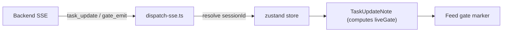

## Overview

What actually merged in Creative Agent Studio (the diffs chat pipeline) today was six commits fixing the **live gate marker**. While the multi-agent pipeline advances through its gate stages, the feed UI was showing "which gate is in progress" a beat too late — I chased that to the root and fixed it. Two more threads are in flight: an **export-pipeline R&D** (turning planning reports and storyboards into pptx/pdf — on the working tree, not yet committed) and a **Firebase auth** feature parked on a separate branch.

[Previous: #5 — Observability & UX Patterns](/posts/2026-05-28-creative-agent-studio-dev5/)

<!--more-->

---

## Live Gate Marker: a UI Running a Beat Behind

### Background

The pipeline advances through GATE 1–5, and the backend streams `task_update` and `gate_emit` events over SSE. The feed's `TaskUpdateNote` component reads these to render a marker for "the gate currently in progress." But a screenshot caught the bug: while Gate 5 (storyboard) was *generating*, Gate 4 kept showing as `ready`.



### Fix 1 — sessionId drift

The display logic itself was correct; the *inputs* were not. The culprit was one line, `dispatch-sse.ts:128`:

```ts
// before
const sessionId = opts.sessionId ?? store.activeSessionId ?? undefined
```

When `opts.sessionId` is `undefined` and `store.activeSessionId` flips from `null` to a real id *between two emissions*, the marker id changes mid-stream — drift. Tracing it to the bottom: right after `addSession`, `selectSession(created.id)` runs **synchronously**, so `activeSessionId` is set immediately. That means once a session exists, every subsequent submit captures the real id, and only the very first stream started in the instant *before* session creation captures `undefined`. So the bug only fires in the split-second after a brand-new session is created — loaded past sessions are never affected.

The fix was a one-liner: drop the fallback entirely.

```ts
// after — remove the activeSessionId fallback
const sessionId = opts.sessionId ?? undefined
```

I wrote a regression test (`dispatch-sse-storyboard.test.ts`) that reproduced the scenario first, then fixed it. Full suite: 79 files / 489 tests pass, typecheck clean.

### Fix 2 — liveGate lagging a beat

Even after that fix, the screenshot still showed Gate 4 as `ready` while Gate 5 generated. Tracing it surfaced the real gap: during storyboard generation the `final` `gate_emit` hasn't fired yet, and `session.gate`/`project.gate` are still stuck at 4 (the scenario-approval value). So my `liveGate = max(gate_emit values)` never reached 5, and Gate 4 never advanced. In short, **`liveGate` was running a beat behind.**

The fix: once a Gate 5 (storyboard) `task_update` marker exists, read the Gate 4 marker as "Done" even with no `final` `gate_emit` and the gate stuck at 4. I added regression tests for that exact scenario (`live-gate-marker-regression.test.tsx`, `FeedItem.test.tsx`), and also hardened `use-chat-stream.ts` and the `workspace` slice to finalize lingering agents when the stream ends at a gate.

---

## In Flight: Export Pipeline (Typst over LibreOffice)

The longest session today (~2.5h) was R&D on an **export pipeline** that turns planning reports and storyboards into an LLM-friendly form and converts them to pptx/pdf. After comparing WeasyPrint, Slidev, Typst, and LibreOffice — LibreOffice dropped as too heavy a dependency — I settled on **Typst** as the PDF typesetting backend with a python-pptx-style path for native pptx. The working tree now holds `runtime/export/` (render-pptx.js, render-typst.js, planning-deck.js, convert-pdf.js, pack.js), token packs under `templates/` (creative-warmth, keynote-minimal-fullbleed, consulting-precision-grid, conti-grid), plus `ExportMenu.tsx` and `server/routes/export.js`. It's uncommitted, so it's absent from #6's commit log. (This dovetails exactly with [today's slide-generation tooling post](/posts/2026-05-29-the-ai-slide-generation-rabbit-hole/).)

## In Flight: Firebase Auth

The other thread is bolting on login and per-user data management via Firebase. I planned it with `/plan`, started the implementation, and parked it on a separate branch to keep main clean before returning to main. A short final session ran a security review over the auth middleware (`tests/api-auth-middleware.test.js` and the auth components). Branch work, so not in #6's commit log either.

## Infra: EventBridge / EC2 Cron Verification

The day opened with verifying that the EC2 cron schedule wired into EventBridge via Terraform was applied correctly — confirming how long EC2 stayed up yesterday and that the schedule behaved as intended.

---

## Commit Log

| Message | Files |
|---------|-------|
| show live gate marker for the in-progress stage before its gate | TaskUpdateNote.tsx, pipeline.ts, +2 regression tests |
| finalize lingering agents when the live stream ends at a gate | use-chat-stream.ts, workspace slice, +test |
| enhance TaskUpdateNote logic to accurately reflect live gate | TaskUpdateNote.tsx, FeedItem.test.tsx |
| enhance TaskUpdateNote and FeedItem tests for accurate gate | TaskUpdateNote.tsx, dispatch-sse.ts, FeedItem.test.tsx |
| enhance storyboard tests to validate gate-5 marker behavior | dispatch-sse-storyboard.test.ts |
| update agent working hints for clarity | ApproveBar.tsx |

---

## Insights

The gate-marker bug was not "the UI is wrong" but "the UI's inputs arrive a beat late or change mid-flight" — the classic trap of SSE-driven real-time UIs. Both bugs were about *the timing of state*, not display logic: one a race where `activeSessionId` gets filled mid-stream, the other a lag where `gate_emit`'s `final` arrives late so the derived state (`liveGate`) trails the truth. The lesson for real-time derived state is to compute from "the running max of events already received" rather than "the current value" — but also to make explicit *when* that max can be trusted (i.e., which marker's presence licenses the conclusion). Separately, dropping LibreOffice for Typst in the export pipeline landed on the exact conclusion I reached independently in today's browsing — pulled twice into the same gravity well of tool choice.
