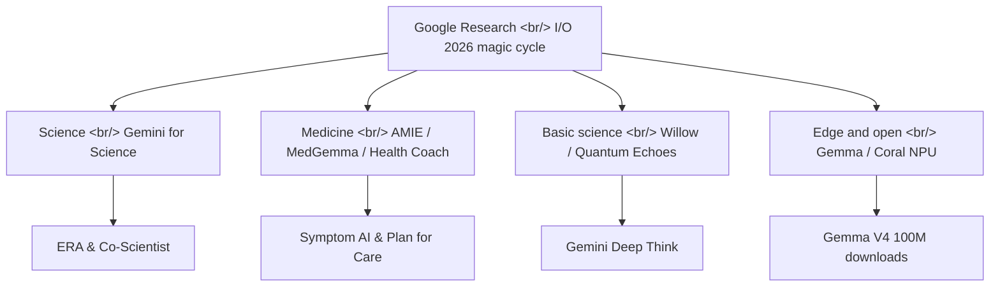

## Overview

[Google Research](https://research.google) bundled a year of work into a single post for [I/O 2026](https://io.google), titled [A new era of innovation](https://research.google/blog/a-new-era-of-innovation-google-research-at-io-2026). The framing it leans on is "the magic cycle from research to reality" — a loop that, powered by models like [Gemini](https://deepmind.google/models/gemini/), keeps getting faster. The announcements span science, medicine, quantum computing, and the edge, all on one canvas. Here is a thematic read.

<!--more-->

## Gemini for Science: Agents That Automate Research

The heaviest announcement is a cluster of agents built to assist scientific research. [Gemini for Science](https://research.google/blog/a-new-era-of-innovation-google-research-at-io-2026) shipped as a suite of experimental tools, anchored by two [Nature](https://www.nature.com/articles/s41586-026-10658-6) papers. One is **ERA (Empirical Research Assistance)**, a research engine that optimizes its own code while solving scientific problems; the other is [Co-Scientist](https://www.nature.com/articles/s41586-026-10644-y), a multi-agent research partner.

On top of those sit tools real users can pick up. Via [labs.google/science](https://labs.google/science), Computational Discovery is an agentic research engine drawing on ERA and AlphaEvolve, Hypothesis Generation runs a multi-agent idea tournament to surface hypotheses, and Literature Insights synthesizes large volumes of scientific literature. The signal here is that research "tooling" is moving past search and summarization into directly generating hypotheses and optimizing code.

On the academic-ecosystem side, the [Paper Assistant Tool (PAT)](https://research.google/blog/gemini-provides-automated-feedback-for-theoretical-computer-scientists-at-stoc-2026/) stands out: it reportedly delivered automated feedback on more than 10,000 papers across ICML, STOC, and NeurIPS — an experiment in having AI absorb part of the peer-review load.

## Medical AI: From Diagnostic Dialogue to Everyday Coaching

Medicine had the densest set of announcements. The multi-agent diagnostic system [AMIE](https://www.nature.com/articles/s41591-026-04371-0) landed in Nature Medicine, while [Symptom AI](https://arxiv.org/abs/2605.04012), a conversational agent for symptom reasoning, was validated in a study of roughly 14,000 participants through the [Fitbit](https://blog.google/products-and-platforms/products/google-health/google-health-coach/) app. The headline claim: its diagnostic suggestions were significantly more accurate than independent clinicians reviewing the same conversations (OR = 2.56, p < 0.001).

On foundation models, [MedGemma](https://research.google/blog/next-generation-medical-image-interpretation-with-medgemma-15-and-medical-speech-to-text-with-medasr/) for medical image interpretation has passed 5M+ cumulative downloads, and MedASR for medical speech-to-text shipped alongside it. At the product layer, [Google Health Coach](https://blog.google/products-and-platforms/products/google-health/google-health-coach/) is rolling out personalized coaching to Fitbit users. In a Plan for Care pilot, Google reports "15% more users felt better prepared" and "13% more users felt confident."

## Basic Science: Quantum Computing and Mathematical Discovery

In the basic-science track, quantum computing took the headline. The error-correcting quantum chip [Willow](https://www.nature.com/articles/s41586-025-09526-6) was presented alongside [Quantum Echoes](https://blog.google/innovation-and-ai/technology/research/quantum-echoes-willow-verifiable-quantum-advantage/), which is said to demonstrate verifiable quantum advantage via an OTOC algorithm. Willow carries a claim of running that OTOC algorithm "13,000 times faster" than classical supercomputers.

For mathematical and scientific discovery, the advanced agentic reasoning model [Gemini Deep Think](https://deepmind.google/blog/accelerating-mathematical-and-scientific-discovery-with-gemini-deep-think/) featured prominently. In the environmental and climate space, [WeatherNext](https://deepmind.google/blog/how-weathernext-helped-the-national-hurricane-center-better-predict-hurricane-melissas-historic-landfall-in-jamaica) contributed to forecasting Hurricane Melissa's landfall, and [Groundsource](https://research.google/blog/introducing-groundsource-turning-news-reports-into-data-with-gemini/) — which turns news reports into flood-prediction data — produced 2.6M urban flood records. That data feeds Flood Hub, which covers 2 billion people across 150 countries.

## Edge and Open Models: Smaller, Spreading Wider

The final axis is making models smaller and pushing them further. The open model [Gemma V4](https://deepmind.google/models/gemma/gemma-4/) lifted reasoning and coding ability and surpassed 100 million downloads in a single month, and the ultra-small edge model [Gemma 3 270M](https://developers.googleblog.com/en/introducing-gemma-3-270m) shipped too. On hardware, the edge-AI ML accelerator [Coral NPU](https://developers.google.com/coral/guides/intro) and Coralboard — an edge-AI prototyping board from Synaptics, due summer 2026 — were announced.

[Gemini](https://deepmind.google/models/gemini/) expanded to more than 70 languages across more than 230 countries, and WAXAL, an open dataset for African speech technology, also got a mention. The picture is one where giant cloud models and palm-sized open models coexist within the same announcement.

## Insights

The real message here is not any single model but the *cycle*. [Google Research](https://research.google) tied the flow from research (Nature papers) through tools ([labs.google/science](https://labs.google/science)) into products ([Health Coach](https://blog.google/products-and-platforms/products/google-health/google-health-coach/), [Ask Maps](https://blog.google/products-and-platforms/products/maps/ask-maps-immersive-navigation/)) into one narrative. The most striking shift is that science tooling has climbed past search and summarization to directly generating hypotheses and optimizing code, as in [ERA](https://www.nature.com/articles/s41586-026-10658-6) and [Co-Scientist](https://www.nature.com/articles/s41586-026-10644-y). In medicine, the concrete statistic behind [Symptom AI](https://arxiv.org/abs/2605.04012) — OR=2.56 — is the kind of validation that is only possible on a large user base like Fitbit, which is a reminder that data access is increasingly the moat.

That said, many of the figures are Google-reported and should be read accordingly. Willow's "13,000x" quantum-advantage claim carries some validation by way of [Nature](https://www.nature.com/articles/s41586-025-09526-6) publication, but it is a comparison scoped to a specific OTOC algorithm — read it with that caveat. For practitioners, the more immediately tangible change is the edge-deployment trend embodied by [Gemma V4](https://deepmind.google/models/gemma/gemma-4/)'s 100M downloads, [Gemma 3 270M](https://developers.googleblog.com/en/introducing-gemma-3-270m), and [Coral NPU](https://developers.google.com/coral/guides/intro). The frontier-model race still grabs the headlines, but an era is arriving in which small open models running in your palm decide the actual breadth of deployment.

## References

**Science research tools**
- [A new era of innovation — Google Research at I/O 2026](https://research.google/blog/a-new-era-of-innovation-google-research-at-io-2026) — the post bundling all the announcements
- [ERA (Empirical Research Assistance) — Nature](https://www.nature.com/articles/s41586-026-10658-6) — code-optimizing research engine
- [Co-Scientist — Nature](https://www.nature.com/articles/s41586-026-10644-y) — multi-agent research partner
- [labs.google/science](https://labs.google/science) — Computational Discovery / Hypothesis Generation / Literature Insights
- [Paper Assistant Tool (PAT)](https://research.google/blog/gemini-provides-automated-feedback-for-theoretical-computer-scientists-at-stoc-2026/) — automated feedback at STOC 2026

**Medical AI**
- [AMIE — Nature Medicine](https://www.nature.com/articles/s41591-026-04371-0) — multi-agent diagnostic system
- [Symptom AI — arXiv](https://arxiv.org/abs/2605.04012) — conversational symptom-reasoning agent
- [MedGemma 1.5 & MedASR](https://research.google/blog/next-generation-medical-image-interpretation-with-medgemma-15-and-medical-speech-to-text-with-medasr/) — medical image and speech models
- [Google Health Coach](https://blog.google/products-and-platforms/products/google-health/google-health-coach/) — personalized Fitbit coaching

**Basic science / environment**
- [Willow — Nature](https://www.nature.com/articles/s41586-025-09526-6) — error-correcting quantum chip
- [Quantum Echoes — blog.google](https://blog.google/innovation-and-ai/technology/research/quantum-echoes-willow-verifiable-quantum-advantage/) — verifiable quantum advantage
- [Gemini Deep Think](https://deepmind.google/blog/accelerating-mathematical-and-scientific-discovery-with-gemini-deep-think/) — reasoning model for math and science discovery
- [WeatherNext](https://deepmind.google/blog/how-weathernext-helped-the-national-hurricane-center-better-predict-hurricane-melissas-historic-landfall-in-jamaica) — cyclone forecasting
- [Groundsource](https://research.google/blog/introducing-groundsource-turning-news-reports-into-data-with-gemini/) — flood data from news reports

**Edge / open models / background**
- [Gemma V4](https://deepmind.google/models/gemma/gemma-4/) — 100M downloads in one month
- [Gemma 3 270M](https://developers.googleblog.com/en/introducing-gemma-3-270m) — ultra-small edge model
- [Coral NPU](https://developers.google.com/coral/guides/intro) — edge-AI ML accelerator
- [Gemini](https://deepmind.google/models/gemini/) · [Google DeepMind](https://deepmind.google) · [AI for Developers](https://ai.google.dev) · [blog.google](https://blog.google) · [Ask Maps](https://blog.google/products-and-platforms/products/maps/ask-maps-immersive-navigation/) · [Ask YouTube](https://blog.youtube/news-and-events/youtube-news-google-io-2026/)
