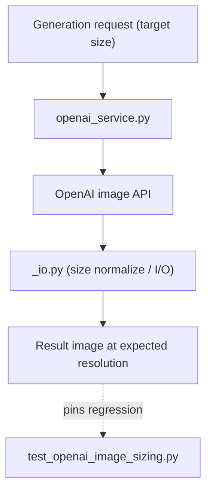

## Overview

hybrid-image-search-demo had a light day — commits only, no coding sessions (so this entry is reconstructed from commits, with no conversation narrative). The substance is two PRs — **OpenAI generated image sizing** (#43, `fix/openai-b-side-resolution`) and **prefer location-matched tone refs** (#42, `fix/location-aware-tone-refs`) — plus the direct commit "Fix OpenAI generated image sizing" between them.

[Previous: #20](/posts/2026-05-28-hybrid-search-dev20/)

<!--more-->

---

## OpenAI Generated Image Sizing

The direct commit "Fix OpenAI generated image sizing" touched three files in the generation backend:

```
backend/src/generation/_io.py
backend/src/generation/openai_service.py
backend/tests/test_openai_image_sizing.py
```

From the branch name (`fix/openai-b-side-resolution`) and the file layout, this corrects a mismatch between the resolution/size the OpenAI image service returns and the expected value — fixed in `openai_service.py`, with the I/O helper logic (`_io.py`) aligned, and a dedicated test (`test_openai_image_sizing.py`) added to pin the behavior. Adding a separate sizing regression test is a tell that this class of bug tends to creep back in quietly.



## Location-Aware Tone Refs (#42)

PR #42 (`fix/location-aware-tone-refs`, "prefer location-matched tone refs") changes generation to prefer the tone reference **matched to the location** rather than a random or generic pick among candidates — the apparent intent being to raise color/mood consistency in the output by aligning the reference with the target location. (The PR body could not be fetched this run — the Bitbucket PR fetch returned HTTP 404. The reading above is based on the branch name, commit message, and changed files.)

---

## Commit Log

| Message | Change |
|---------|--------|
| Merged in fix/openai-b-side-resolution (PR #43) | merge into generation path |
| Fix OpenAI generated image sizing | _io.py, openai_service.py, +sizing test |
| Merged in fix/location-aware-tone-refs (PR #42) | merge tone-ref selection |

---

## Insights

A commits-only day makes for a thin narrative, but the grain of the two fixes is clear — both are about *consistency of the generated result*. One is geometric consistency (does the image size match what was asked?), the other is semantic consistency (does the tone reference match the location?). Quality debt in an image-generation pipeline usually accumulates in exactly these "quiet mismatches," and pinning a dedicated regression test (`test_openai_image_sizing.py`) is the cheapest defense against recurrence.
