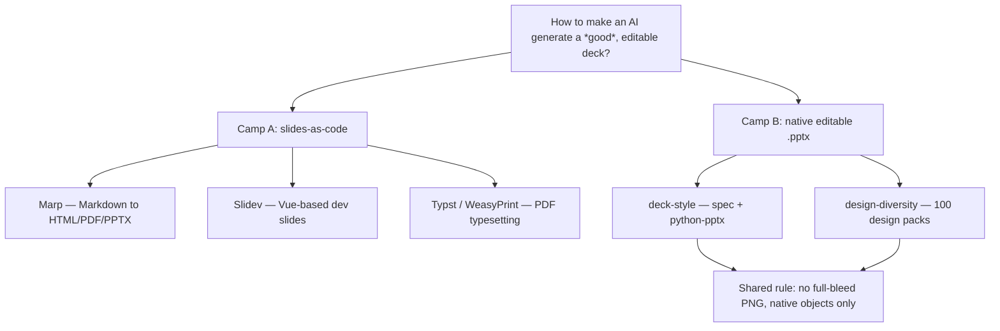
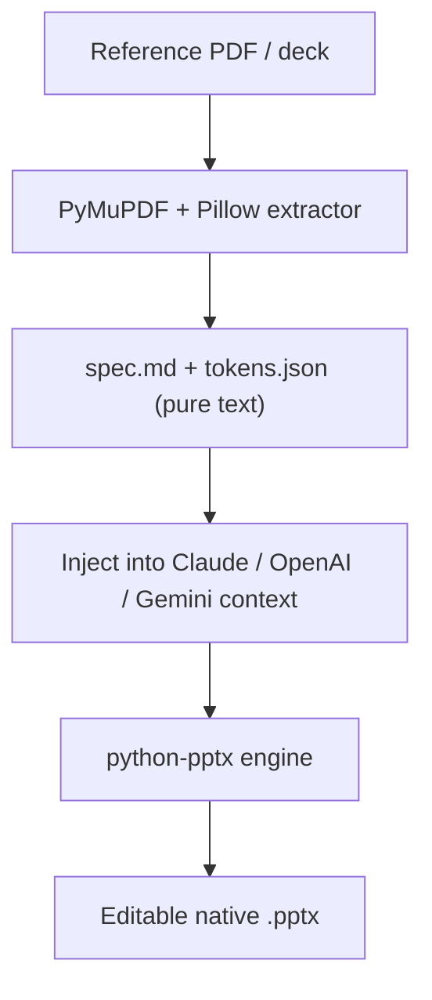
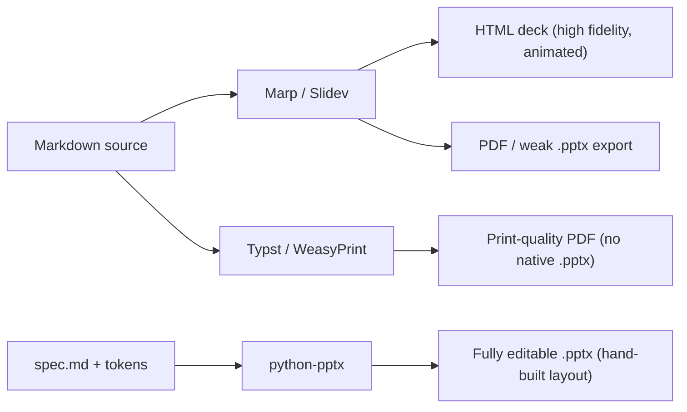

## Overview

Today turned into a single-minded chase: how do you get an AI to produce a *good* slide deck — one you can actually open and edit, not a screenshot pretending to be a presentation? The trail ran through two of my own repos, a 123-star design-pack catalog, the Marp and Slidev ecosystems, Typst and WeasyPrint as rendering backends, and a Korean dev YouTuber arguing you should ditch PowerPoint for HTML/CSS entirely. Underneath the tool sprawl there was one recurring fault line.

<!--more-->

## Today's Exploration Map



## The Fault Line: Full-Bleed PNG vs Native Objects

Every tool I looked at today sorts into two camps, and the dividing line is not "Markdown vs GUI" — it is **what the final artifact actually contains**. One camp renders a slide as a single full-bleed image (or an HTML canvas), which looks pixel-perfect but is dead on arrival the moment someone wants to fix a typo. The other camp emits *native objects* — real text frames, shape nodes, editable tables — at the cost of design fidelity being harder to nail.

This matters more for AI generation than for humans, because the failure mode of a language model asked to "make a slide" is to reach for the safe average: a gradient background, a rounded card, one sans-serif font, and — when it can — a single baked-in image per slide. That image is the trap. It demos beautifully and is useless as a deliverable.

What was striking is that two repos I read today, built by different people, independently codified *the exact same rule* to fight this: full-bleed PNG is banned, native objects are mandatory. That convergence is the real story of the day.

## deck-style: Style as Text, Output as python-pptx

[`ice-ice-bear/deck-style`](https://github.com/ice-ice-bear/deck-style) is my own platform for generating editable native `.pptx` files (기획서/planning decks and 콘티/storyboards) by distilling a reference's design into a **specification plus tokens**. The architecture is explicitly two-layer, and that split is the whole point:

- **Layer 1 — Style**: `styles/{slug}/spec.md` + `tokens.json`. Pure text and data. Drop it into the context of Claude, OpenAI, or Gemini and it just works — zero model dependency.
- **Layer 2 — Engine**: python-pptx code. Locally a Claude Code skill writes and runs it on demand; in the app a code-execution sandbox runs it.

Because the style is *text* and the engine is *code*, the same deck definition is portable from a local Claude Code session straight into a self-hosted app on OpenAI or Gemini. The repo ships six packs across two tracks — planning decks (`planning-doc`, `planning-dark-bold-red`) and storyboards (`storyboard-sketch-bw`, `storyboard-accent-orange`, `storyboard-treatment-photo`, `storyboard-cinematic-dark`) — each a folder of `spec.md`, `tokens.json`, `preview.png`, and a private `reference/`. The stack is python-pptx for native generation, PyMuPDF (`fitz`) + Pillow for extracting style out of reference PDFs.



The interesting design decision is treating the style spec as a *prompt artifact* rather than a code config. It means a non-engineer can paste a `spec.md` into a chat and get the same output the local engine produces — the spec is the contract, the engine is interchangeable.

## design-diversity: 100 Packs and the "No Full-Bleed" Mandate

[`epoko77-ai/design-diversity`](https://github.com/epoko77-ai/design-diversity) (123★, 20 forks, TypeScript) attacks a different angle of the same problem: not "is it editable?" but "why does every AI deck look the *same*?" The README's framing is sharp — generative models converge on a safe average, so the fix is not a better model but telling it *which* design to use. The repo distills public design systems into **100 prompt-style design packs** (50 PPT + 50 web, 20 of them premium with detailed multi-page specs), exposed through a Claude Code consumer skill called `design-pick`.

```bash
# Install the skill into a project
cp -r skills/design-pick YOUR_PROJECT/.claude/skills/
# or globally
cp -r skills/design-pick ~/.claude/skills/
```

You either name a pack slug directly (`web-velvet-dark-boutique`) or describe a vibe ("a premium dark-toned deck") and the skill recommends two or three. All 100 pack specs are bundled as `references/` inside the skill, so it works offline after install. There is even a no-skill path: copy a pack's `prompt.md` into a [claude.ai](https://claude.ai) chat alongside your source material and ask for an editable native `.pptx`.

Here is the convergence I flagged earlier. The recent commits show design-diversity hardening *exactly* the rule deck-style is built around: commit `3c017ab` ("PPT pack native .pptx output rules") and `3127592` ("README: native .pptx output spec notice") codify that full-bleed PNG slides are forbidden, native objects are mandatory, and images may only be *supporting* assets — because the model was intermittently baking entire slides as single PNGs. Two repos, same enemy, same rule written down. When independent projects converge on a constraint, that constraint is usually load-bearing.

## The Slides-as-Code Camp: Marp, Slidev, Typst

The other half of the day was the Markdown-first camp. [`marp-team/marp`](https://github.com/marp-team/marp) (11.8k★) is the entrance to the "Markdown Presentation Ecosystem" — you write CommonMark with directives and it exports to **HTML, PDF, and PowerPoint**, with a pluggable architecture (Marp Core, the Marpit framework, Marp CLI, the VS Code extension). [Slidev](https://sli.dev) takes the same Markdown-native idea but aims squarely at developers, leaning on a Vue component model for interactive, code-friendly decks.

[WeasyPrint](https://weasyprint.org) and Typst showed up as the *rendering backends* for this camp — the question of how Markdown/HTML becomes a print-quality PDF. The thread I kept pulling was the trade-off triangle: Marp/Slidev give you HTML fidelity and animation but a weaker `.pptx` export; python-pptx gives you true editable PowerPoint but you hand-build layout; Typst gives gorgeous PDF typesetting with a Markdown-like syntax but no native PowerPoint. I also poked at [LibreOffice](https://ko.libreoffice.org) as a headless `.pptx`→PDF converter and concluded it is too heavy a dependency to lean on — which, foreshadowing, was the exact conclusion I reached in today's Creative Agent Studio work too.



## 코딩애플: "Just Code the Slides in HTML/CSS"

The Korean dev channel [코딩애플](https://www.youtube.com/watch?v=2kdo2ZLTG_E) ("PPT you can show off") makes the slides-as-code argument in its purest form: a slide is just a document for presenting data nicely, so escape the PowerPoint fixation and have an AI code the slides in HTML/CSS. His points line up exactly with the Marp/Slidev pitch — higher animation freedom, easy and varied charts (he explicitly tells the model to use **Chart.js** for line and pie charts), real-time interactive inputs, even 3D models and simulations, with page-snap and browser full-screen making it indistinguishable from PowerPoint in delivery. The honest caveats he raises are the same ones I keep hitting: the model doesn't know your Korean fonts unless you specify them, and once you add images you have to hand-direct layout and color. That is the editability tax again, viewed from the HTML side.

## Aside: Google's Product Launch

The same channel's [Google launch recap](https://www.youtube.com/watch?v=xmxq-y2-26s) was off today's deck theme but worth a note: Gemini Omni framed as a *world model* (a physics-aware video model) stitched to a video generator, enabling targeted edits where everything but one region stays fixed; an official self-cloning feature (face/voice upload to generate yourself in video); the retirement of Gemini CLI in favor of Antigravity 2.0; and AI search mode crossing a billion monthly users, with Google moving to swap the default search box for the AI one. The presenter's sharp closing worry: if AI summarizes everything above the fold, purely informational content gets read only by AIs.

## Quick Links

- [marp.app](https://marp.app) — the Marp website, with live Markdown→deck examples
- [design-diversity.vercel.app](https://design-diversity.vercel.app) — visual catalog of all 100 design packs
- [ice-ice-bear/harnesskit](https://github.com/ice-ice-bear/harnesskit) — a Claude Code plugin managing zero-based version workflows (revisited today, 22 visits)
- [ice-ice-bear/log-blog](https://github.com/ice-ice-bear/log-blog) — the blog-automation tool that wrote this post
- Two AI chats (a Gemini thread on naming the storyboard-gen repo, a Claude thread on splitting files by content) could not be enriched this run — the Gemini fetch hit a login-wall stub and the Claude fetch returned HTTP 403.

## Insights

The day's surface was a dozen tools, but the substance was a single decision repeated everywhere: **does the artifact stay editable?** Both my deck-style repo and the unrelated design-diversity project independently wrote down the same prohibition — no full-bleed PNG, native objects only — which is strong evidence that this is *the* failure mode of AI-generated decks, not a niche annoyance. The slides-as-code camp (Marp, Slidev, the 코딩애플 HTML/CSS pitch) solves editability by making the source *be* code, trading away clean PowerPoint export; the native-pptx camp (deck-style, design-diversity, python-pptx) keeps PowerPoint as the target and pays in hand-built layout. The cleanest synthesis I keep circling back to is deck-style's two-layer split: keep the *style* as model-agnostic text and let the *engine* be swappable, so the same intent renders through whatever backend fits — python-pptx today, maybe Typst tomorrow. The most reusable lesson is meta: when two independent codebases converge on the same hard constraint, stop treating it as a preference and treat it as a law of the domain.
