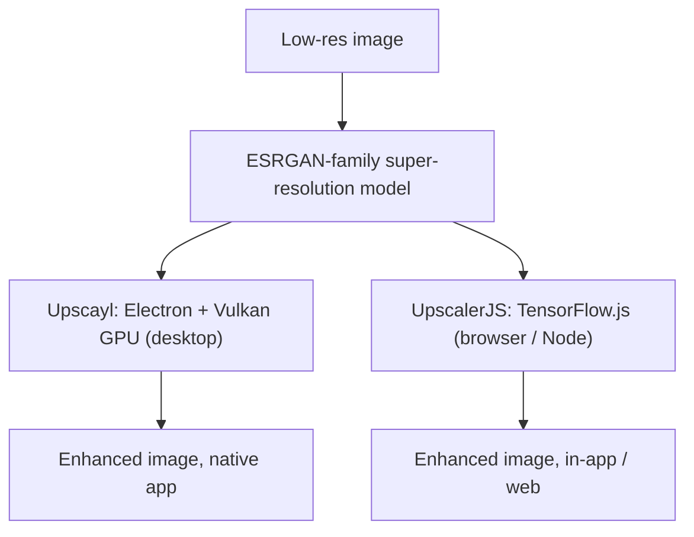

## Overview

Two open-source projects solve the same problem — enlarge and enhance low-resolution images with AI — from opposite ends. [Upscayl](https://github.com/upscayl/upscayl) (46.5k★) is a polished cross-platform desktop app; [UpscalerJS](https://github.com/thekevinscott/upscalerjs) (890★) is a JavaScript library that runs in the browser or Node. Both lean on the ESRGAN family of super-resolution models, but the delivery vehicle shapes everything about who uses them and how.

<!--more-->



---

## Upscayl: The Desktop Powerhouse

[Upscayl](https://github.com/upscayl/upscayl) is the "#1 free and open-source AI image upscaler" for Linux, macOS, and Windows, and the 46,480 stars reflect how well the desktop-app formula works for this use case. It's built in **TypeScript on Electron**, ships through every channel that matters (Flathub, AppImage, AUR, Snap on Linux; Mac App Store and Homebrew `brew install --cask upscayl` on macOS), and the distribution breadth is itself a feature — non-technical users can install it the way they install anything else.

The one hard requirement is a **Vulkan-compatible GPU**, which signals the architecture: this runs the upscaling models natively against your graphics card, not in a sandbox. That's what lets it handle gigapixel-scale enlargement (its topics list reads `gigapixel`, `esrgan`, `topaz` — positioning it as a free alternative to paid tools like Topaz Gigapixel). The recent commit log is mostly the unglamorous maintenance that keeps a mass-market app healthy: localization additions (Polish), electron-updater fixes, README and language-switcher polish. That's the tax of serving a large non-developer audience well.

---

## UpscalerJS: Super-Resolution as a Dependency

[UpscalerJS](https://github.com/thekevinscott/upscalerjs) attacks the same problem as a **library, not an app**. It's MIT-licensed, browser- and Node-compatible, and built on **TensorFlow.js**. The entire API surface is small enough to fit in a snippet:

```javascript
import Upscaler from 'upscaler';
const upscaler = new Upscaler();
upscaler.upscale('/path/to/image').then(upscaledImage => {
  console.log(upscaledImage); // base64 representation of image src
});
```

That `new Upscaler().upscale(...)` ergonomics is the whole pitch: super-resolution becomes a dependency you `npm install`, not a program your users launch. It ships **pretrained models** for different jobs — not just resolution increase but denoising, deblurring, dehazing, deraining, low-light enhancement, retouching (the topics list is a catalog of restoration tasks) — and supports custom model integration. A notable engineering detail is **patch-based processing**: images are upscaled in tiles so the UI stays responsive and large images don't blow up memory, which matters a lot when you're running inference on the user's own device inside a web page.

The trade-offs are the mirror image of Upscayl's. UpscalerJS reaches anywhere JavaScript runs — embed it in a web app and users upscale without installing anything — but it's bounded by TensorFlow.js performance and the browser's compute, so it won't match a native Vulkan app on gigapixel work. Its recent commits (pinning Node 20–22, moving `shared/` to `core/`, Dependabot cooldowns) are the maintenance signature of a *library* — dependency hygiene and module boundaries, not installers and localization.

---

## Insights

The same model family, two delivery decisions, two entirely different products. **Upscayl optimizes for the end user**: install it, point it at a folder, get gigapixel results — at the cost of requiring a capable GPU and platform-specific packaging. **UpscalerJS optimizes for the developer**: drop it into any JS project and ship upscaling as a feature — at the cost of browser-bound performance. The split is a clean reminder that in applied AI, the model is rarely the differentiator; the *delivery surface* is. Choosing between a native app with GPU access and a portable library running on TensorFlow.js is really a choice about who your user is and where the compute lives — and that decision cascades into everything from distribution channels to the shape of your commit log.
