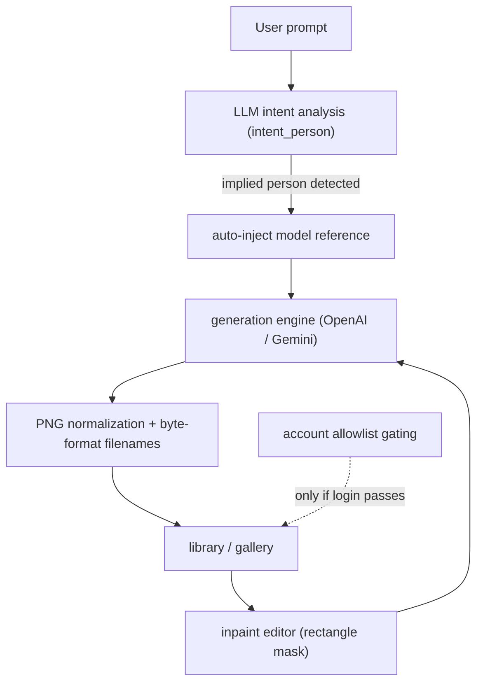
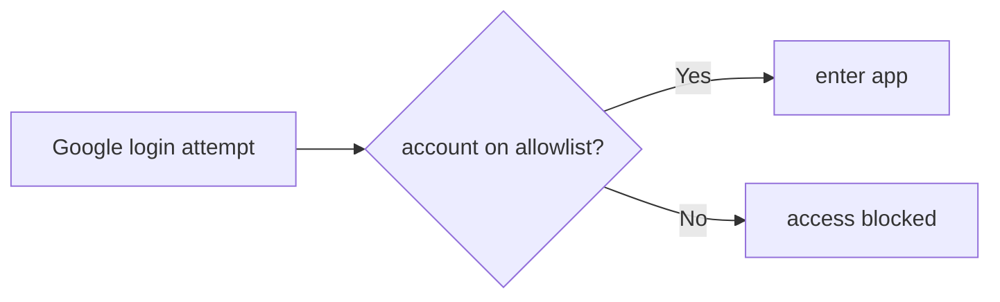

## Overview

This cycle pushed the image-generation demo from a "one-shot generator" toward an "editable workstation." I added a rectangle mask tool to the inpaint editor, taught the LLM to detect people the user only *implied* (not named) and auto-inject the right model reference, and introduced allowlist-based login gating so the demo could be opened to external users. These 54 commits group into six threads: inpaint, model injection, block prompts, auth, library UX, and infra.

[Previous: #21 — hybrid-image-search-demo dev21](/posts/2026-05-29-hybrid-search-dev21/)

<!--more-->

---

## Inpaint Editor: A Mask Tool for Partial Regeneration

The biggest feature was the inpaint editor. Redrawing only part of a generated image requires a mask that says *where* to redraw, so this cycle added a **rectangle mask tool**. I also placed an inpaint entry button in the action bar, so you can pick an image from the gallery and jump straight into the partial-edit flow.

### Debugging

Wiring up the inpaint entry button also surfaced a **re-upload bug** — re-uploading an image didn't cleanly reset the previous state. At one point an unbalanced JSX block in `InpaintEditor` broke the build (`fix(frontend): close unbalanced InpaintEditor JSX block`), a side effect of the component growing more conditional render branches. I then refined the inpaint comparison view and gallery controls so the original and the inpainted result sit side by side as an A/B pair.

---

## Implied-Person Model Injection: Trusting LLM Intent

The most "AI-native" work this cycle was **implied-person model injection**. When a user doesn't explicitly name a model — saying "sitting in a café" rather than "place this person in…" — the LLM reads that intent (`intent_person`) and automatically injects the appropriate model reference into the prompt.

### Implementation

It evolved in three steps. First, the base logic to auto-inject a model reference for implied-person prompts (`feat: auto-inject model ref for implied-person prompts`). Then I changed it to **trust the LLM's `intent_person` verdict directly** (`fix: trust LLM intent_person for model injection`) — an early heuristic re-check was occasionally overriding the LLM, so I leaned on trust instead. Finally I broadened the `intent_person` definition itself so more phrasings of an implied person get recognized (`fix: broaden LLM intent_person definition`).

The lesson was the trade-off between trusting an LLM's structured output versus filtering it again with rules. Trusting the model's intent verdict — while widening the definition — produced the more natural UX.

---

## Block-Based Prompts and Dual-Engine Preview

Prompt authoring changed substantially too. **Block-based prompts** treat a prompt not as one long string but as a composition of reusable blocks (`feat(model-gen): block-based prompts + dual-engine preview/select`), with simultaneous OpenAI and Gemini previews the user chooses between.

Follow-ups added a block-as-template UX, Korean localization, and a background generation lifecycle (`block-as-template UX + KO localization + bg lifecycle`), surfaced the fully *resolved* prompt on the preview wait screen (`show resolved prompt on preview wait screen`), grouped resumed previews into per-pair summary blocks, and made each pair's resolved blocks a collapsible summary.

---

## Login Gating: Opening the Demo to Outsiders

To open the demo to external users, I reworked auth. The core is **allowlist-based login gating**: Google login itself is allowed, but only accounts on an explicit allowlist actually enter the app (`feat(auth): gate Google login behind an explicit account allowlist`). Adding a specific designer account (joonghodesign) to the allowlist came along with it.

Alongside, I collapsed a two-account structure (`get rid of two accounts`), added a confirmed logout flow (`feat(ui): add confirmed logout flow`), and removed a default Korean race directive baked into the UI (`chore: remove default Korean race directive`) so the demo no longer assumes a particular region/race as the default.

---

## Library / Gallery UX and Infra Cleanup

The library moved out of a separate panel into a **tab switcher inside General mode** (`merge library panel into General mode with tab switcher`), letting model and product references coexist in one General tab. I added prompt search over generated images and a flow to regenerate failed model generations in place from the library.

On infra, I made the S3 reference-key cache build in the background at startup so the **app no longer hangs on launch** (`build S3 ref-key cache in background so startup doesn't hang`), and added telemetry instrumenting the Gemini semaphore's acquire-wait time. Generated images are now named by their real byte format rather than a hardcoded extension, and all are normalized to PNG. On cost, I lowered OpenAI image quality from high to medium to tune cost/latency.

---

## Commit Log

| Area | Key work |
|------|----------|
| Inpaint | rectangle mask tool, action-bar entry + re-upload fix, comparison/gallery controls |
| Model injection | auto-inject model ref for implied persons, trust LLM `intent_person`, broaden definition |
| Block prompts | block-based prompts + dual-engine preview, template UX, per-pair summaries |
| Auth | allowlist-based Google login gating, confirmed logout, remove default race directive |
| Library UX | General-tab consolidation, prompt search, regenerate failed gens, liked-gallery sync |
| Infra | background S3 cache build, Gemini semaphore telemetry, PNG normalization, OpenAI quality tuning |

---

## Insights

Two currents run through this cycle. One is **editability**: inpaint masks, block prompts, in-place regeneration of failures — all moving away from "generate once, done" toward "grab the result and keep refining it." That mirrors how the value of generative tools shifts from single-shot quality to the smoothness of the iterative edit loop.

The other is **robustness for going public**: allowlist gating, confirmed logout, non-blocking background S3 caching, and semaphore-wait instrumentation are exactly what you need crossing from "a demo I use" to "a demo I show others." The decision to trust the LLM's `intent_person` — accepting the model's structured verdict instead of re-filtering with a heuristic — is a clean example of a trade-off you keep meeting in modern agent design.
