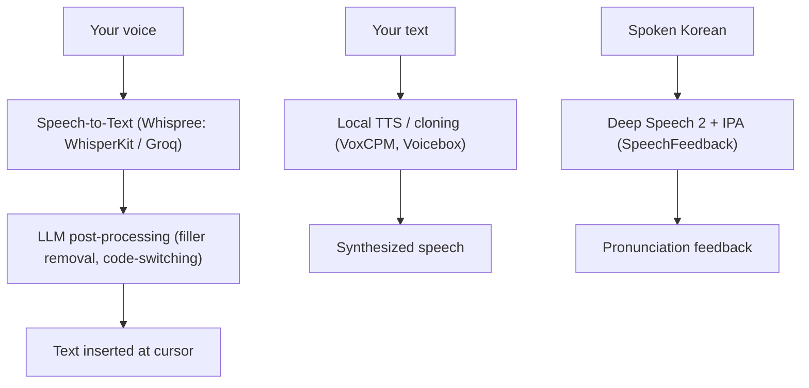

## Overview

A cluster of speech projects I came across share one premise: run the model on your own machine, not someone else's server. Whispree turns your voice into AI prompts on macOS; VoxCPM and Voicebox do TTS and voice cloning locally; SpeechFeedback builds a Korean pronunciation-correction system on top of a Deep Speech 2 ASR model. Together they show how far local speech has come — and where the cloud still wins.

<!--more-->

---

## Whispree: Voice-to-Prompt for Apple Silicon

[Whispree](https://github.com/Arsture/whispree) (113★, mostly Swift) is a fully local macOS menu-bar app positioned as an open-source SuperWhisper alternative. The pitch is "talk to AI instead of typing": place your cursor in any prompt input — Cursor, Claude, ChatGPT — hit `Ctrl+Shift+R`, speak, and corrected text is pasted exactly where the cursor was. It even remembers the original focus position if you switch windows mid-recording.

What makes it more than dictation is the **LLM post-processing layer**. Four correction modes — Standard (fix STT errors), Filler Removal (strip "um/uh"), Structured (organize rambling speech into bullet points for a prompt), and Custom — sit between the raw transcription and the paste. The standout for Korean developers is **code-switching optimization**: it correctly rewrites mixed Korean-English tech speech, e.g. `"밸리데이션 해야 되거든"` → `"validation 해야 되거든"`, `"깃허브에 PR 올려놨어"` → `"GitHub에 PR 올려놨어"`. It also auto-captures a screenshot of the focused screen and attaches it, so vision-capable models can correct formulas and technical terms from context.

The provider architecture is the clever part. STT uses Groq (free) and LLM correction borrows your existing **Codex CLI OAuth tokens** — so "if you have an OpenAI account, you get high-quality STT + LLM correction with virtually no additional cost." Local options exist too (WhisperKit on CoreML+ANE, MLX Audio, six local LLMs). There's even a URL scheme (`whispree://toggle`) for triggering from Raycast, Stream Deck, or AppleScript. One notable bit of release discipline visible in the commit log: a Claude subscription provider was reverted before release and preserved on a feature branch — a reminder that "what you ship" and "what you built" aren't the same.

---

## VoxCPM and Voicebox: TTS and Cloning, Entirely Local

On the synthesis side, two projects stood out. **VoxCPM** (the project behind the "open-source TTS that nails morning-drama dialogue" Short) is a multilingual speech model doing voice design and cloning under Apache 2.0, and the demo's point was its emotional range — Korean dialogue delivered with convincing melodramatic affect, not flat robotic TTS.

**Voicebox** is framed as "ElevenLabs downloaded onto your PC": free, open-source, everything runs locally with no internet. Its identity is *local-first*, and the architecture is a Swiss-army-knife of **five swappable engines** — pick Qwen-TTS-style models for multilingual, instruction-following voices ("speak a little slower"), or Chatterbox Turbo for fast, emotion-tagged synthesis (write `(laughs)` or `(sighs)` inline). It's not just text-to-speech but a full audio production studio: multi-character scenes, reverb effects, editing, and an API for automation.

The honest trade-off, as the reviewer put it, is that local synthesis is "a manual-transmission car" — more control, but you handle setup, GPU requirements, and a learning curve. If you need a result in one minute and don't have a fast GPU, a cloud subscription is still the saner choice. Where local *clearly* wins: game developers generating thousands of NPC lines without per-use fees, content creators keeping scripts off external servers, and companies wiring TTS into pipelines that handle sensitive data.

---

## SpeechFeedback: ASR as a Pronunciation Tutor

[SpeechFeedback](https://github.com/DevTae/SpeechFeedback) takes ASR in a different direction — not transcription for its own sake, but **Korean pronunciation correction**. It's a Docker + FastAPI system built on the KoSpeech toolkit, implementing a Deep Speech 2 architecture (3-layer CNN + 7 bidirectional GRU layers + CTC loss, per the Baidu paper).

The clever design choice is **IPA (International Phonetic Alphabet) conversion**. Instead of recognizing standard orthography, the model recognizes pronunciation as actually spoken, which collapsed the output vocabulary from **2000 classes down to 44** — a dramatically smaller, more learnable target. That's what lets it give feedback on *how* a word was pronounced versus how it should be. The project's engineering log is a nice case study in data-bound ML: scaling labeled data from 10k to 600k examples (by porting an R-based hangul-to-IPA converter to Python) grew the per-epoch step count ~60×, and switching the source dataset from lecture audio to conversational Korean made the model generalize better to everyday speech.

---

## Insights

The common thread is that **speech is following the same local-first arc that image and text models took**: capable open models, on-device inference, and privacy as the headline feature rather than an afterthought. But the four projects also map the spectrum cleanly. Whispree is pragmatic-hybrid — local app, but happy to borrow Groq and Codex tokens because that's where quality-per-cost is best right now. Voicebox is purist-local, trading convenience for control and zero data egress. VoxCPM shows the synthesis quality bar (emotional, multilingual) has risen enough that "local" no longer means "obviously worse." And SpeechFeedback is a reminder that ASR isn't only for transcription — reframed with IPA, the same model becomes a tutor. The recurring lesson for builders: the interesting work increasingly sits in the *layer around* the speech model — LLM post-processing, provider routing, IPA reframing, multi-engine selection — not the model itself.
