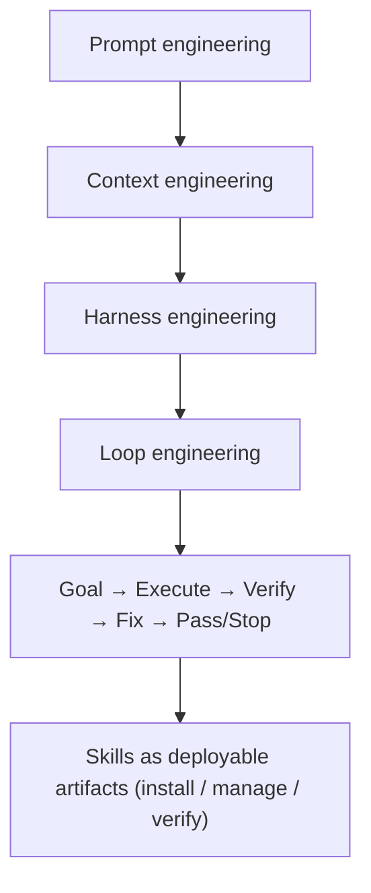
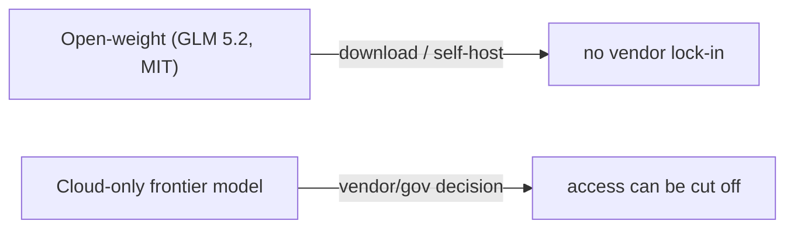

## Overview

Three videos from the Korean dev-YouTube scene converge on the same question: now that frontier models can actually carry long, autonomous work, *how should we drive them?* One argues the prompt era is ending in favor of "loop engineering." One benchmarks GLM 5.2 — an open-weight model — inside Claude Code against Opus 4.8. One reframes Skills as deployable artifacts you must install, manage, and verify. Together they sketch the shape of agentic coding after the model stopped being the bottleneck.

<!--more-->

---

## Loop Engineering: When the Agent Writes the Prompts

The framing comes from a clip of Claude Code's creator, Boris Cherny, saying *"I no longer write prompts in Claude — my job is now to write loops."* Two days later Fable 5 shipped, and Anthropic engineer Lance Martin posted "Loop design with Fable 5." The video stacks these together to argue the unit of agentic work has shifted again: **prompt engineering → context engineering → harness engineering → loop engineering.**

A loop is simple in principle: (1) define a goal, (2) the agent executes, (3) the agent verifies, (4) if it fails, fix, (5) if it passes, stop. The difference from manual prompting is that you no longer hand-drive each "make this → check it → fix it" step. You design the loop and the whole cycle runs without a human in the middle. The video offers two tests for whether your loop is real: *can the AI reliably evaluate its own results?* (if not, the loop is an illusion), and *does each iteration leave the agent with something?* (otherwise it's just repetitive automation).

Martin's two small experiments map onto exactly those tests. In **parameter golf** (an OpenAI open challenge: train a model that fits in 16MB within 10 minutes), Fable 5 improved the benchmark ~6× over Opus 4.7, and — more interesting than the number — it pursued larger *structural* changes and pushed through regressions, where Opus 4.7 tuned scalars conservatively and kept only positive results. The standout finding: a **separate verifier sub-agent outperformed self-evaluation**. Like people, a model grades its own work generously; splitting the verifier from the generator matters. In the second experiment (a continual-learning bench measuring whether a model learns across sessions), Fable 5 ran all five stages of failure-handling to completion with ~73% verification coverage, versus Opus 4.7's ~17% (and Sonnet 4.6 stalling at stage one).

The honest caveat: loops are token furnaces. The video's own demo — "invent a new language and build a 3D Minecraft game in it" — finished but quietly used `pygame` despite a constraint forbidding it, a reminder that a loop without clear termination and verification criteria is "not self-regulation, it's a token incinerator." The practical advice is to make Fable 5 the *lead engineer* only — fan-out and simple work on Opus/Sonnet, complex design and long verification loops on Fable 5 — cutting cost to roughly a third or less.

---

## GLM 5.2 in Claude Code: A Usable Open-Weight Model

The second video runs the same Claude Code harness, same prompts, same tasks against **Opus 4.8 vs GLM 5.2**, and the blunt conclusion is "finally, a usable open-weight model." On frontend design — landing pages, SVG-only loading spinners, climate dashboards, an ER-diagram-from-DDL tool, 3D scenes, a Minecraft clone — the two were often indistinguishable; GLM sometimes applied *more* hover/animation polish.

The gaps showed on complexity and detail: GLM's dashboard failed to render data from an external API one-shot, and its FK-chain view dropped relationships that Opus rendered correctly (though follow-up prompts could fix these). It was also consistently slower and more token-hungry on the same harness — the climate dashboard took Opus 5m03s / ~85.4k tokens vs GLM 9m24s / ~99k; the SVG spinner 2m34s / 68k vs 6m55s / 83k — with the caveat that GLM may simply pair less well with Claude Code's harness.

The real argument is **strategic, not benchmark**. GLM 5.2 is open-*weight* (MIT licensed) — not open-*source*, since the training data isn't released, but you can download it, self-host, fine-tune, and redeploy commercially. On LMArena's agent ladder it's the top open-weight model (Fable 5 leads overall); on web-dev it ranks above Opus 4.7/4.8. Pricing is roughly 6× cheaper on output (GLM ~$1.4 in / $4.4 out vs Opus $5 / $25), and Z.ai's coding plan ($12.6–16.2/mo lite tier) plugs straight into Claude Code with 5-hour and weekly limits. The video's point: when a model lives only on someone else's server, a single corporate or government decision (e.g. the export-control restriction that hit Fable 5 / Mythos days after launch) can cut you off entirely. Open-weight is insurance against vendor lock-in — even if running frontier-class models locally (the "GLM 5.2 100% local on a Mac Studio, 2-bit quantized" thread) is still expensive and slow enough that cloud remains the default.

---

## Skills as Deployable Artifacts: "Thick Skills, Thin Harness"

The third video starts from the slogan *"thick skills, thin harness"* and asks the under-discussed question: how do you *manage* skills? Its answer leans on three 2026 papers. Microsoft Research showed that delegating long tasks **contaminates the working document** — even frontier models (Claude 4.6 Opus, GPT 5.4) averaged ~25% document contamination by task end, driven by bigger documents, longer conversations, and *irrelevant files sitting nearby*. The mental model: context is a workbench, not a reference shelf — the more clutter, the harder to find what you need. A second paper found that giving agents *more* memory hurt cooperation in 18 of 28 settings, but replacing the content with a curated synthetic record restored it: what you remember matters more than how much.

A security paper ("skills in the wild") analyzed ~31,000 skills and found **26.1% contained vulnerabilities** — prompt injection, data exfiltration, privilege escalation, supply-chain risk — with skills that bundle executable scripts 2.12× more likely to be vulnerable than instruction-only ones. The takeaway: a skill isn't a nice prompt bundle, it's a **deployment artifact** you install, manage, and verify.

The control surface in Claude Code is concrete: both Claude Code and Codex use **progressive disclosure** — only a skill's name and description load until the model decides it's needed, then the full markdown loads. So the description *is* the auto-invocation criterion; vague descriptions mean vague triggering. Claude Code adds three controls Codex lacks fine-grained equivalents for: `disable-model-invocation` (front-matter flag so a skill only runs on explicit `/skill` call), skill overrides (per-skill exposure levels in `settings.json`, v2.16+), and context fork (run a skill in a sub-agent context and bring only the result back). Crucially, once a skill's body enters the conversation you can't surgically remove it — "it's paper, not a whiteboard."

The proposed answer is a **sidecar**: a layer that tracks installed skills' lifecycle (a registry file of state/provenance/trust, plus a log of when explicit skills were used), restricts auto-invocation of risky skills, and retires skills you haven't used in months. The deciding rule for *what* should be a skill: "does this task need the same result every time?" Yes → skill candidate (release notes, API conventions, security scans). No → leave it to model judgment (architecture decisions, nuanced code review). It's backed by a fourth paper, Microsoft's **SkillUp**: optimizing only the skill *files* (not model weights) — rollout, reflect with a separate optimizer model, gate edits that don't raise the score — hit best-or-tied across 6 benchmarks × 7 models × 3 harnesses (52 combos), and a skill optimized in Codex kept its gains when moved to Claude Code. Skills transfer across harnesses, which is the empirical proof they're artifacts.

---

## Insights

The through-line across all three is that **the model stopped being the bottleneck, so the engineering moved up a level**. Loop engineering, harness design, and skill management are all answers to the same situation: a model now capable enough to run autonomously needs *structure* around it — clear goals, separate verifiers, clean context, vetted skills — or it burns tokens chasing illusions. The recurring motif is the split between *doing* and *judging*: Martin's verifier sub-agent beating self-evaluation, the sidecar separating skill execution from skill governance, even GLM-vs-Opus being a question of where you trust the model versus where you keep control. The open-weight thread adds the strategic dimension — all this structure is worth more if it isn't built on a foundation a vendor can revoke. If 2025 was about prompting models well, 2026 is about engineering the *loop, harness, and skill layer* around models that already work.
