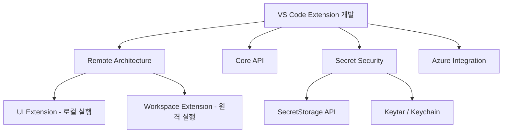

## 개요

VS Code 확장(Extension)을 개발할 때 단순히 로컬에서 동작하는 것만으로는 부족하다. Remote Development, GitHub Codespaces 환경에서도 정상 동작해야 하며, 확장이 다루는 시크릿(토큰, API 키)의 보안도 고려해야 한다. 오늘은 VS Code 확장의 원격 개발 아키텍처, 핵심 API, 시크릿 보안 리스크, 그리고 Azure 연동 패턴을 정리한다.



## VS Code Remote Extension 아키텍처

### UI Extension vs Workspace Extension

VS Code는 원격 개발 시 확장을 두 가지 종류로 구분한다:

| 종류 | 실행 위치 | 역할 | 예시 |
|------|-----------|------|------|
| **UI Extension** | 로컬 머신 | VS Code UI 기여 (테마, 키맵, 스니펫) | Color Theme, Vim keybinding |
| **Workspace Extension** | 원격 머신 | 파일 접근, 도구 실행, 언어 서버 | Python, ESLint, GitLens |

VS Code는 `package.json`의 내용을 분석하여 확장을 자동으로 올바른 위치에 설치한다. 자동 감지가 실패할 경우 `extensionKind` 속성을 명시적으로 지정할 수 있다:

```json
{
  "extensionKind": ["workspace"]
}
```

`Developer: Show Running Extensions` 명령을 사용하면 각 확장이 실제로 어디서 실행 중인지 확인할 수 있다.

### 원격 환경에서의 주요 이슈

**1. 시크릿 저장**

원격 환경에서는 로컬 Keychain에 접근할 수 없다. VS Code의 `SecretStorage` API를 사용하면 로컬/원격 여부에 관계없이 안전하게 시크릿을 관리할 수 있다.

**2. Webview 리소스 경로**

Webview에서 로컬 리소스를 참조할 때 반드시 `asWebviewUri()`를 사용해야 한다. 원격 환경에서는 파일 경로가 달라지기 때문에, 직접 경로를 하드코딩하면 리소스 로드에 실패한다.

**3. localhost 포워딩**

원격 머신의 localhost 포트에 접근하려면 VS Code의 포트 포워딩 기능을 활용해야 한다. Webview에서 localhost를 사용해야 할 경우:
- **Option 1**: `asExternalUri`로 URI를 변환
- **Option 2**: `portMapping` 옵션으로 포트 매핑 설정

**4. 확장 간 통신**

원격과 로컬에서 실행되는 확장끼리는 직접 API를 호출할 수 없다. 대신 VS Code의 `commands` API를 통해 통신해야 한다:

```json
{
  "api": "none"
}
```

이 설정을 `package.json`에 추가하면 API export를 비활성화하고, 명령 기반 통신으로 전환할 수 있다.

### 디버깅 환경

원격 확장을 테스트할 수 있는 네 가지 환경이 제공된다:
1. **GitHub Codespaces** — 클라우드 기반 개발 환경
2. **Dev Containers** — 커스텀 Docker 컨테이너
3. **SSH** — 원격 서버 연결
4. **WSL** — Windows Subsystem for Linux

미공개 확장을 테스트하려면 `vsce package`로 VSIX 파일을 생성한 후 수동 설치할 수 있다.

## VS Code API 핵심 네임스페이스

[VS Code API Reference](https://code.visualstudio.com/api/references/vscode-api)는 확장 개발에 사용할 수 있는 전체 API를 제공한다. 주요 네임스페이스를 정리한다:

| 네임스페이스 | 역할 |
|-------------|------|
| `vscode.authentication` | 인증 세션 관리 |
| `vscode.commands` | 명령 등록 및 실행 |
| `vscode.window` | 에디터, 터미널, 알림 UI |
| `vscode.workspace` | 파일 시스템, 설정, 워크스페이스 관리 |
| `vscode.languages` | 언어 기능 (자동완성, 진단, 심볼) |
| `vscode.debug` | 디버거 연동 |
| `vscode.env` | 환경 정보 (clipboard, URI 열기) |
| `vscode.chat` | AI/Chat 기능 통합 |

### 확장 개발에서 자주 쓰이는 패턴

**CancellationToken**: 장시간 실행되는 작업에는 항상 `CancellationToken`을 받아 취소 가능하게 만들어야 한다.

**Disposable**: 리소스 해제를 위해 `Disposable` 인터페이스를 구현하고, `context.subscriptions.push()`로 등록한다.

**EventEmitter**: 커스텀 이벤트를 발행하려면 `EventEmitter<T>`를 사용한다.

## VS Code 시크릿 보안 — 숨겨진 리스크

[Cycode의 보안 분석](https://cycode.com/blog/exposing-vscode-secrets/)에 따르면, VS Code 확장의 시크릿 관리에는 주의가 필요한 보안 리스크가 있다.

### 시크릿 저장 메커니즘

VS Code는 OS별 Keychain/Keyring을 통해 시크릿을 저장한다:
- **macOS**: Keychain
- **Windows**: Credential Manager
- **Linux**: libsecret (GNOME Keyring 등)

확장은 `context.secrets` (SecretStorage API)를 통해 이 저장소에 접근할 수 있다.

### 보안 리스크

**1. Electron 프로세스를 통한 추출**

VS Code는 Electron 기반이므로, 특정 플래그를 사용하면 시크릿에 접근할 수 있는 경로가 존재한다:

```bash
ELECTRON_RUN_AS_NODE=1 "${electronPath}" \
  --ms-enable-electron-run-as-node "${vscodeDecryptScriptPath}" ${machineId}
```

**2. 악성 확장을 통한 노출**

설치된 확장은 SecretStorage API에 접근할 수 있으므로, 검증되지 않은 확장 설치 시 저장된 토큰이 노출될 위험이 있다.

### 보안 모범 사례

- **항상 SecretStorage API 사용** — 환경 변수나 설정 파일에 시크릿을 저장하지 말 것
- **확장 권한 최소화** — 필요한 scope만 요청
- **검증된 확장만 설치** — Marketplace에서 게시자 인증 확인
- **정기적 토큰 교체** — 장기간 사용하는 토큰은 주기적으로 갱신

## Azure Resources 확장 — 인증 연동 패턴

[Azure Resources 확장](https://code.visualstudio.com/docs/azure/resourcesextension)은 VS Code 내에서 Azure 리소스를 관리하는 확장이다. 확장 개발 시 인증 패턴의 좋은 참고가 된다.

### 인증 흐름

1. Azure Resources 뷰에서 "Sign in to Azure..." 클릭
2. VS Code 내장 Microsoft 인증 프로바이더 사용
3. MFA(다단계 인증)가 필요한 테넌트는 Accounts & Tenants 뷰에서 별도 인증
4. 여러 Azure 계정을 동시에 사용 가능

### 주요 설정

- `azureResourceGroups.selectedSubscriptions` — 표시할 구독 필터링
- `Microsoft-sovereign-cloud.environment` — 소버린 클라우드(정부용 Azure 등) 접속 시 자동 설정

이 패턴은 자체 확장에서 외부 서비스 인증을 구현할 때 참고할 수 있는 좋은 레퍼런스다.

## 빠른 링크

- [VS Code Remote Extensions 가이드](https://code.visualstudio.com/api/advanced-topics/remote-extensions) — 원격 개발 확장 완전 가이드
- [VS Code API Reference](https://code.visualstudio.com/api/references/vscode-api) — 전체 API 레퍼런스
- [Cycode: VS Code 시크릿 보안](https://cycode.com/blog/exposing-vscode-secrets/) — 시크릿 추출 리스크 분석
- [Azure Resources Extension](https://code.visualstudio.com/docs/azure/resourcesextension) — Azure 연동 가이드

## 인사이트

VS Code 확장 개발은 단순히 "로컬에서 동작하는 플러그인"을 만드는 것이 아니다. Remote Development와 Codespaces가 표준이 된 지금, 확장은 **"어디서 실행되든 동작하는 분산 컴포넌트"**로 설계해야 한다. UI Extension과 Workspace Extension의 구분을 이해하는 것이 첫걸음이고, 시크릿 관리는 처음부터 SecretStorage API를 사용하는 것이 정답이다. 보안은 나중에 추가하는 것이 아니라 설계 단계에서 내장해야 하며, Cycode의 분석처럼 Electron 기반 앱에서의 시크릿 추출 경로를 인지하고 있어야 한다.
