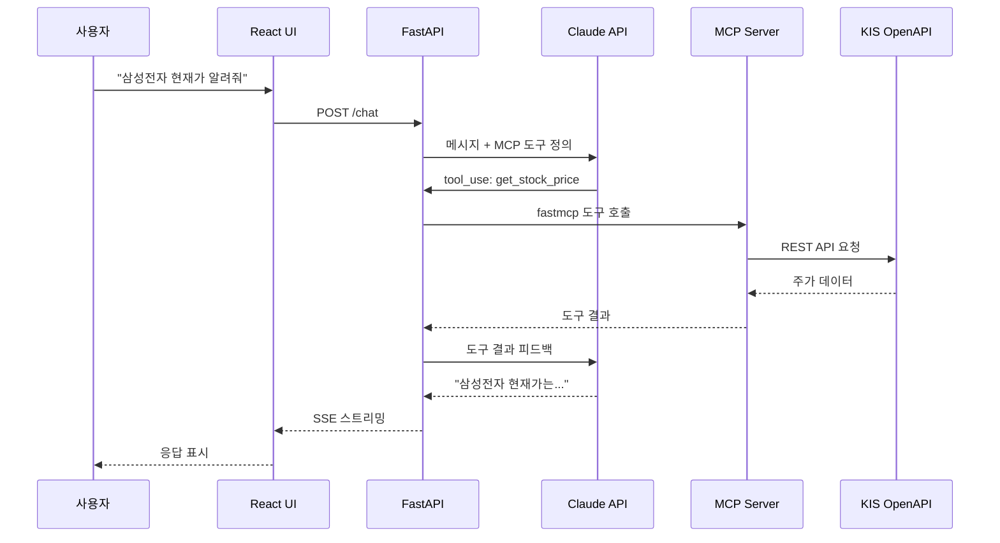
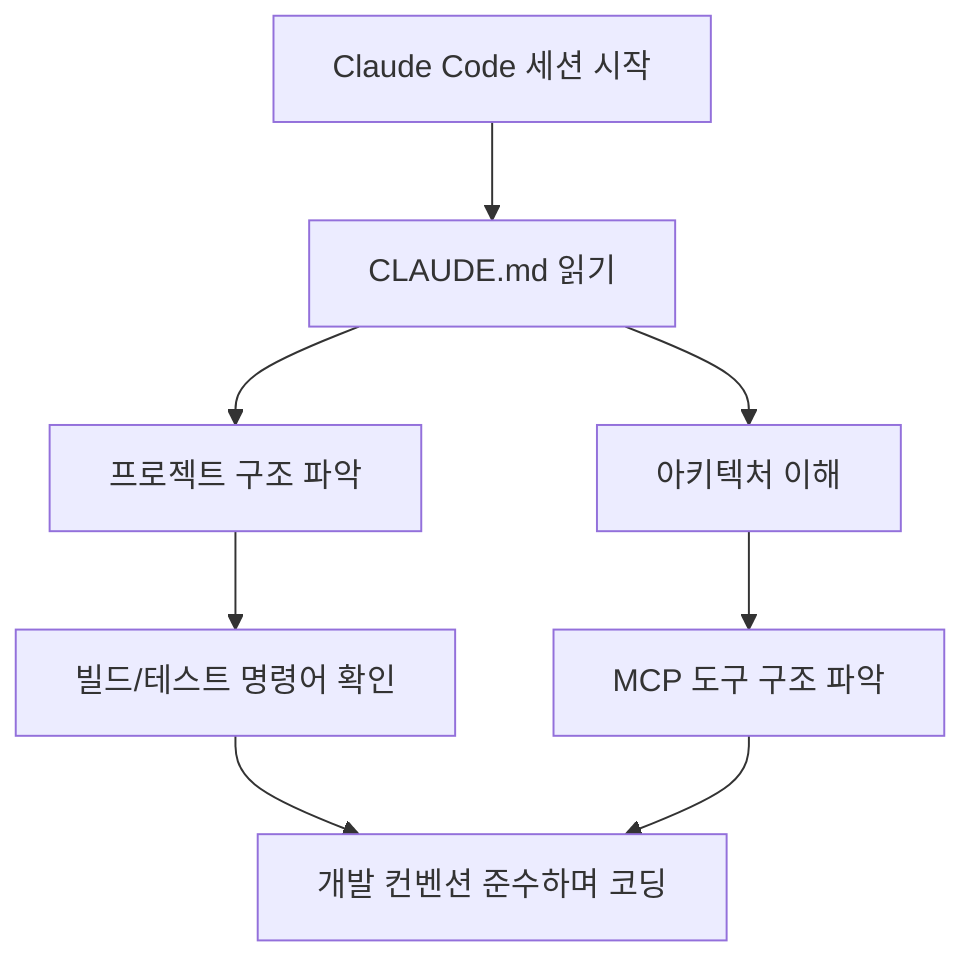

## 개요

자연어로 주식 시세를 조회하고 모의투자 주문까지 넣을 수 있는 웹앱, [trading-agent](https://github.com/ice-ice-bear/trading-agent)를 개발 중이다. 한국투자증권(KIS) OpenAPI를 MCP(Model Context Protocol)로 감싸고, Claude API가 도구 호출을 결정하는 구조다. 오늘은 이 프로젝트의 아키텍처와 PR #1에서 추가한 CLAUDE.md의 역할을 정리한다.

## 아키텍처

전체 시스템은 세 개의 서비스로 구성된다. React 프론트엔드(Vite, :5173), FastAPI 백엔드(:8000), 그리고 KIS Trading MCP Server(SSE, :3000)다.

```
React (Vite, :5173) <--> FastAPI (:8000) <--> Claude API
                              |
                       MCP Client (fastmcp)
                              |
                  KIS Trading MCP Server (SSE, :3000)
                              |
                      KIS OpenAPI (paper trading)
```

사용자가 "삼성전자 현재가 알려줘"라고 입력하면 다음 플로우로 처리된다:



핵심은 FastAPI가 Claude API를 호출할 때 MCP 도구 정의를 함께 전달한다는 것이다. Claude가 사용자 의도를 파악해 적절한 도구 호출을 결정하면, FastAPI가 MCP Client(fastmcp)를 통해 실행하고 결과를 다시 Claude에게 피드백한다. 최종 응답은 SSE로 React UI에 스트리밍된다.

## 기술 스택과 설정

필수 요구사항은 Python 3.12+(uv), Node.js 22+, Anthropic API 키, KIS 모의투자 인증 정보다. 기본 모델은 `claude-sonnet-4-5-20250929`을 사용하며, `make install && make start`로 세 서비스를 동시에 기동한다.

주요 환경변수 구성:

| 변수 | 설명 |
|---|---|
| `ANTHROPIC_API_KEY` | Anthropic API 키 |
| `MCP_SERVER_URL` | MCP 서버 SSE 엔드포인트 (기본: `http://localhost:3000/sse`) |
| `CLAUDE_MODEL` | 사용할 Claude 모델 |
| `KIS_PAPER_APP_KEY` | KIS 모의투자 앱 키 |
| `KIS_PAPER_APP_SECRET` | KIS 모의투자 앱 시크릿 |
| `KIS_PAPER_STOCK` | 모의투자 계좌번호 (8자리) |

`make` 타겟으로 `install`, `start`, 개별 서비스 시작 등이 제공되어 개발 편의성을 높였다.

## CLAUDE.md — Claude Code를 위한 프로젝트 가이드

[PR #1](https://github.com/ice-ice-bear/trading-agent/pull/1)에서 CLAUDE.md를 추가했다. 이 파일은 Claude Code가 프로젝트에 진입할 때 가장 먼저 읽는 컨텍스트 문서다. 빌드 명령어, 아키텍처 개요, 개발 컨벤션을 정리해두면 Claude Code가 코드 수정 시 일관성을 유지할 수 있다.



CLAUDE.md를 두는 것은 단순한 문서화가 아니라, AI 에이전트와의 협업 인터페이스를 설계하는 것이다. 프로젝트별로 빌드 명령어가 다르고, 테스트 컨벤션이 다르고, 코드 스타일이 다른데, 이걸 매번 대화로 설명하는 대신 파일 하나로 정의해두면 Claude Code의 첫 번째 행동부터 정확해진다.

## 인사이트

이 프로젝트에서 MCP의 가치가 명확히 드러난다. KIS OpenAPI는 REST 기반이지만, MCP Server로 감싸면 Claude가 자연어 의도에서 바로 도구 호출로 넘어갈 수 있다. 중요한 건 FastAPI가 MCP Client와 Claude API 사이의 오케스트레이터 역할을 한다는 점이다 — Claude가 "어떤 도구를 호출할지" 결정하고, FastAPI가 "실제로 실행"하는 분리가 깔끔하다. 모의투자(paper trading)로 시작해서 실제 API 전환도 환경변수 하나로 가능한 구조이며, `make start`로 전체 스택을 한 번에 올릴 수 있는 DX도 중요한 설계 포인트다.
