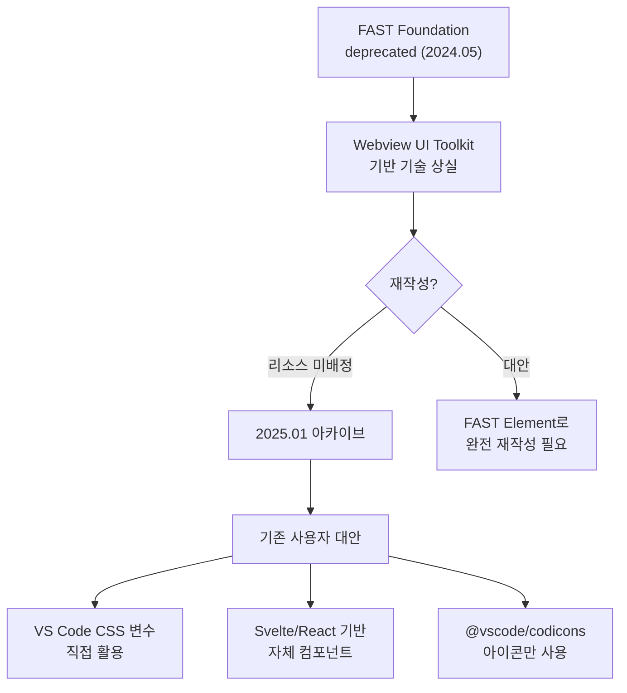
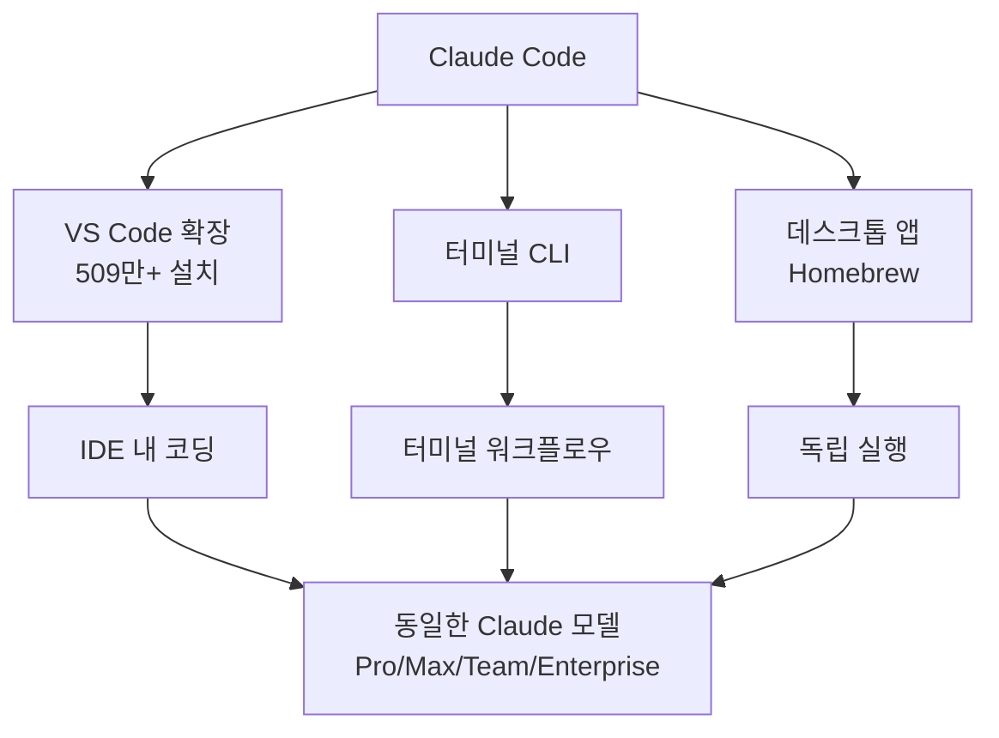

## 개요

VS Code 확장 생태계가 전환기를 맞고 있다. 한쪽에서는 Microsoft의 공식 [Webview UI Toolkit](https://github.com/microsoft/vscode-webview-ui-toolkit)이 deprecated되어 아카이브되었고, 다른 한쪽에서는 AI 코딩 어시스턴트가 필수 확장 카테고리로 자리 잡았다. 오늘은 이 두 흐름을 살펴본다.

## Webview UI Toolkit의 종료

[Issue #561](https://github.com/microsoft/vscode-webview-ui-toolkit/issues/561)에서 hawkticehurst가 종료를 발표했다. 2.1k 스타, 157 포크의 프로젝트가 2025년 1월 6일 아카이브되었다.

종료 원인은 핵심 의존성 FAST Foundation의 deprecation이다. 2024년 5월 FAST 프로젝트가 재편(re-alignment)을 발표하면서 여러 코어 패키지가 deprecated 목록에 올랐고, Webview UI Toolkit의 기반 기술이 사라진 것이다. 유일한 해결책은 FAST Element(저수준 웹 컴포넌트 라이브러리)로 완전 재작성이었지만 리소스가 배정되지 않았다.

이 라이브러리가 제공했던 가치는 세 가지였다:
- VS Code 디자인 언어를 따르는 UI 컴포넌트(버튼, 드롭다운, 데이터 그리드 등)
- 에디터 테마 자동 지원 (다크/라이트 모드 자동 전환)
- 웹 컴포넌트 기반이라 React, Vue, Svelte 등 프레임워크에 구애받지 않음

이제 이 역할을 대체할 공식 도구가 없다. VS Code의 CSS 변수(`--vscode-button-background`, `--vscode-input-border` 등)를 직접 사용하거나, `@vscode/codicons`로 아이콘만 가져오고 나머지는 자체 구현해야 한다.

## 2026년 추천 확장 — AI가 별도 카테고리가 되다

Builder.io의 [Best VS Code Extensions for 2026](https://www.builder.io/blog/best-vs-code-extensions-2026) 리뷰에서 눈에 띄는 변화는 **AI 확장이 독립 카테고리**로 분리되었다는 점이다. 2025년이 AI 에이전트의 해였고, 2026년에는 대부분의 개발자가 이미 Cursor나 Claude Code 같은 AI IDE를 사용한다는 전제로 글이 작성되었다.

추천된 AI 확장 세 가지:
- **Fusion**: 비주얼 편집 + AI 코드 수정을 실제 repo에서 PR로 생성
- **Claude Code**: 컨텍스트 인식 기반 IDE 내 코딩, 509만+ 설치
- **Sourcegraph Cody**: 코드 그래프 기반 크로스 리포 컨텍스트

그 외 주요 추천:
- **Thunder Client**: REST 클라이언트 (Postman 대체)
- **Error Lens**: 인라인 에러/경고 표시
- **Pretty TypeScript Errors**: TS 진단 메시지 가독성 향상
- **TODO Tree**: TODO/FIXME 한 곳에 수집
- **Git Graph**: 커밋 히스토리 시각화
- **CSS Peek**: 마크업/JSX에서 스타일 정의로 바로 점프
- **Import Cost**: 임포트 번들 사이즈 표시

확장 선택 기준으로 제시된 체크리스트도 실용적이다: 누가 만들었는지(verified publisher, 오픈소스), 최근 업데이트 여부, 성능 영향과 권한 요구사항 확인. 무거운 확장은 특정 워크스페이스에서만 설치하고, `node_modules` 같은 폴더를 제외하는 팁도 포함되어 있다.

## Claude Code for VS Code

[VS Code Marketplace](https://marketplace.visualstudio.com/items?itemName=anthropic.claude-code)에서 Claude Code는 509만 설치를 기록 중이다. Pro, Max, Team, Enterprise 구독 또는 종량제로 사용 가능하며, 터미널 기반 확장과 IDE 통합 두 가지 모드를 모두 지원한다. 별도 Homebrew로 데스크톱 앱을 설치할 수도 있다(`brew install --cask claude-code`).

## 인사이트

VS Code 확장 생태계의 두 가지 흐름이 교차하고 있다. Webview UI Toolkit 같은 기존 인프라가 의존성 체인 붕괴(FAST Foundation → Toolkit)로 종료되는 반면, AI 코딩 어시스턴트는 "없으면 안 되는" 필수 카테고리로 성장했다. 웹뷰 기반 확장을 개발한다면 이제 자체 UI 컴포넌트를 구축하거나 경량 프레임워크를 선택해야 하는데, 역설적으로 이때 Claude Code 같은 AI 도구가 보일러플레이트 생성을 도와줄 수 있다. 확장 생태계의 빈자리를 AI가 채우는 구도인 셈이다.
