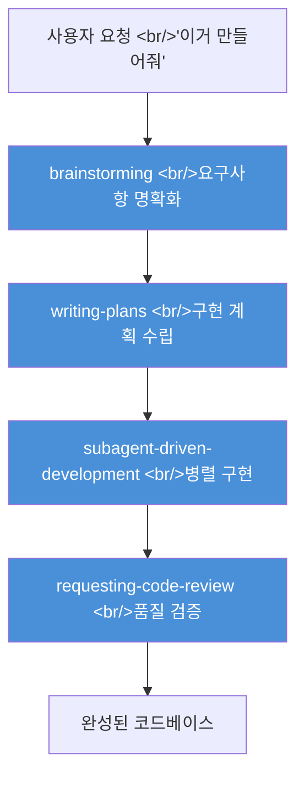
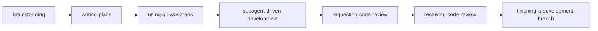
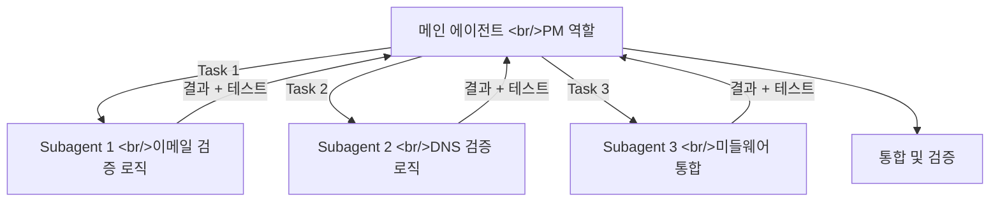
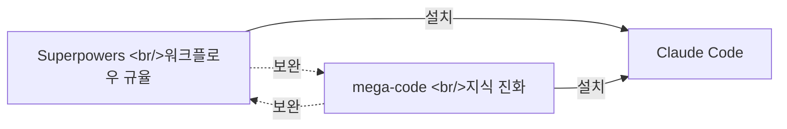

## 개요

Claude Code는 강력하다. 그런데 이상하게 결과물이 찜찜하다. "일단 돌아가기는 하는데…" 싶은 코드. 테스트는 없고, 구조는 엉성하고, 어제 쓴 코드를 오늘 AI가 기억 못 한다. **Superpowers**는 이 문제를 구조적으로 해결하는 Skills 프레임워크다. GitHub 스타 ⭐69k, Claude Code에서 설치 가능한 플러그인 중 압도적 1위다.

단순한 프롬프트 모음집이 아니다. "먼저 생각하고, 설계하고, 테스트하고, 구현하는" 엔지니어링 규율을 AI에게 **강제 주입**하는 시스템이다.



## Superpowers란

Superpowers는 Jesse Vincent([@obra](https://github.com/obra))가 만든 **오픈소스 Skills 프레임워크**다. Claude Code, Cursor, Codex, OpenCode 모두 지원한다.

핵심 아이디어는 단순하다: AI가 코딩 요청을 받았을 때 **즉시 코드를 쓰지 못하게** 한다. 대신 브레인스토밍 → 계획 수립 → TDD 구현 → 리뷰 순서를 강제한다. 급할수록 돌아가라는 소프트웨어 공학의 오래된 진리를 AI에게 가르치는 것이다.

### 설치 방법

```bash
# Claude Code에서 마켓플레이스 등록
/plugin marketplace add obra/superpowers-marketplace

# 플러그인 설치
/plugin install superpowers@superpowers-marketplace
```

설치 후 새 세션을 시작하면 즉시 동작한다. `/sup`을 입력해 `brainstorm`, `write-plan`, `execute-plan` 등이 나오면 설치 성공이다.

## 7가지 핵심 Skill 분석

Superpowers는 소프트웨어 개발 라이프사이클 전체를 커버하는 7개 핵심 Skills로 구성된다.



### 1. brainstorming — 코딩 전에 '멈추는' 기술

요청을 받으면 AI가 즉시 코드를 쓰지 않고 역질문을 던진다. "사용 시나리오는?", "배포 환경은?", "성능 요구사항은?" 마치 베테랑 아키텍트가 주니어 개발자의 코딩을 잠시 멈추는 것처럼.

이 과정 끝에 AI는 요구사항 문서를 생성한다. 사용자가 승인하면 다음 단계로 넘어간다.

> **심리학적 배경**: Superpowers 제작자는 심리학 전공자다. "목표를 먼저 선언하면 행동이 바뀐다"는 인지심리학 원리를 AI 워크플로우에 적용한 것이다.

### 2. writing-plans — 주니어도 따를 수 있는 계획서

브레인스토밍이 끝나면 구현 계획을 수립한다. 이 계획서의 기준이 독특하다: **"판단력 없고, 맥락 없고, 테스트를 싫어하는 열정적인 주니어 개발자도 따를 수 있을 만큼 명확하게."**

계획서는 원자 단위 태스크로 분해된다. 각 태스크는 독립적으로 실행 가능하고, 완료 여부를 명확히 판단할 수 있다.

```
├── Task 1: validators/ 모듈 구조 생성 (파일만)
├── Task 2: 이메일 형식 검증 로직 + 테스트 작성
├── Task 3: DNS MX 레코드 검증 로직 + 테스트 작성
└── Task 4: 미들웨어 레이어 통합
```

### 3. using-git-worktrees — 독립된 작업 공간 확보

각 개발 태스크를 Git Worktree(메인 브랜치를 건드리지 않는 독립된 파일시스템 복사본)에서 실행한다. 실험이 실패해도 메인 코드베이스는 안전하다.

```bash
# Superpowers가 자동으로 실행하는 worktree 생성
git worktree add .claude/worktrees/feature-auth feature/auth
```

### 4. subagent-driven-development — AI 팀으로 병렬 개발

계획서의 각 태스크를 독립된 Subagent에게 할당한다. 각 Subagent는:
- 깨끗한 컨텍스트에서 시작 (이전 실패 기억 없음)
- 단 하나의 태스크만 집중
- 완료 후 결과만 메인에 보고



> "이 구조를 생각한 사람은 천재인 것 같다." — velog 실전 체험기

### 5. requesting-code-review / 6. receiving-code-review — 완성 전 검증

구현이 끝나면 자동으로 코드 리뷰를 요청한다. 리뷰 결과를 받았을 때 AI가 무조건 동의하지 않도록 `receiving-code-review` Skill이 제동을 건다. 기술적으로 타당한지 검증한 뒤에만 반영한다.

### 7. finishing-a-development-branch — 안전한 머지

개발 완료 후 머지 전략을 제시한다. PR 생성, 브랜치 정리, 릴리즈 노트 등 마무리 단계를 체계적으로 안내한다.

## 실전 데모: 이메일 검증 서비스 만들기

다음 프롬프트를 Superpowers가 설치된 Claude Code에 입력했을 때의 실제 흐름이다.

```
Python으로 엔터프라이즈급 이메일 검증 서비스를 만들어줘.
RFC 표준 (sub-addressing 포함), IDN, DNS MX 레코드 체크 지원.
```

**Step 1: brainstorm 자동 발동**

AI가 코드 대신 질문을 던진다:
- "단일 이메일 검증인가요, 배치 처리인가요?"
- "DNS 검증 레벨은? (기본/심화)"
- "캐싱 전략이 필요한가요?"

**Step 2: 프로젝트 구조 제안**

```
email_validator/
├── validators/      # 검증 로직
├── middleware/      # 속도 제한
├── cache/          # 결과 캐싱
└── tests/          # 선-실패 테스트
```

**Step 3: TDD로 구현**

먼저 실패하는 테스트를 작성하고, 그걸 통과하도록 코드를 짠다. AI가 흔히 생산하는 "돌아가지만 테스트 없는 스파게티 코드"의 근본 원인을 차단한다.

## Superpowers가 강제하는 엔지니어링 원칙

| 원칙 | 의미 | Superpowers의 구현 |
|---|---|---|
| **TDD** | 테스트 먼저, 구현 나중 | `subagent-driven-development` Skill에 명시 |
| **YAGNI** | You Aren't Gonna Need It — 지금 필요한 것만 | `writing-plans`에서 범위 제한 |
| **DRY** | Don't Repeat Yourself | 코드 리뷰 단계에서 중복 감지 |
| **깨끗한 컨텍스트** | 이전 실패에 오염되지 않은 새 시작 | Subagent 구조로 보장 |

## mega-code와의 비교

비슷한 시기에 등장한 **[wisdomgraph/mega-code](https://github.com/wisdomgraph/mega-code)** (⭐15)도 주목할 만하다. Superpowers가 "엔지니어링 워크플로우 강제"에 집중한다면, mega-code는 "세션 간 지식 축적"에 집중한다.



- **Superpowers**: 매 세션의 개발 품질을 높임. Skills가 자동 트리거.
- **mega-code**: 세션 간 실수를 기억해 점진적으로 개선. BYOK(자체 API 키) 방식.

둘을 함께 쓰면 개발 품질과 세션 간 학습을 동시에 챙길 수 있다.

## 빠른 링크

- [obra/superpowers GitHub](https://github.com/obra/superpowers) — ⭐69k, 소스코드 및 설치 문서
- [Claude Code × Superpowers 체험기 (velog)](https://velog.io/@takuya/claude-code-superpowers-guide) — 실전 이메일 검증 서비스 데모
- [하리아빠 Superpowers 완벽 가이드 (YouTube)](https://www.youtube.com/watch?v=308zzinIVSA) — 7가지 Skill 실전 데모 30분
- [wisdomgraph/mega-code GitHub](https://github.com/wisdomgraph/mega-code) — 자기 진화 AI 코딩 인프라

## 인사이트

Superpowers가 보여주는 핵심 통찰은 "AI의 문제는 능력 부족이 아니라 **규율 부족**"이라는 것이다. Claude Code는 이미 충분히 똑똑하다. 문제는 "이거 만들어줘"라는 지시를 받으면 즉시 코드를 뱉어내는 본능이다. 베테랑 개발자가 요구사항을 받으면 먼저 질문하고, 설계하고, 테스트 시나리오를 구상하듯이, AI도 그렇게 행동하도록 강제하는 것이 Superpowers의 본질이다. 특히 `subagent-driven-development` 패턴에서 각 Subagent가 깨끗한 컨텍스트를 갖는다는 설계는 AI 환각(hallucination) 문제를 구조적으로 해결한다. 긴 대화에서 이전 실패가 다음 응답을 오염시키는 문제를 Subagent 격리로 차단하는 것이다. 69k 스타가 보여주듯, 이 접근법은 이미 수많은 개발자에게 검증되었다.
