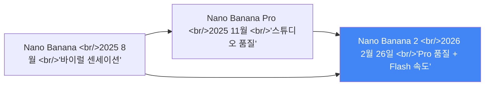
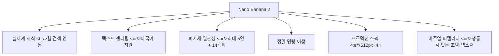

## 개요

2026년 2월 26일, Google이 이미지 생성 모델 역사를 다시 썼다. **Nano Banana 2** (`gemini-3.1-flash-image-preview`) — Pro 수준의 지능과 Flash의 속도를 동시에 갖춘 새로운 스탠다드다. Nano Banana가 바이럴 센세이션을 일으켰고, Nano Banana Pro가 스튜디오급 품질을 제공했다면, Nano Banana 2는 그 둘의 정수를 합쳐 모든 사용자에게 개방했다.



## Nano Banana 2가 바꾼 것들

### Pro 기능의 대중화

기존에 Nano Banana Pro 전용이었던 기능들이 Nano Banana 2에서 전체 사용자에게 개방됐다:

**실제 세계 지식 기반 생성** — Gemini의 실시간 웹 검색을 활용해 특정 인물, 장소, 제품을 정확하게 렌더링한다. 인포그래픽, 다이어그램, 데이터 시각화 생성이 더 정교해졌다.

**정밀 텍스트 렌더링** — 이미지 안에 선명하고 정확한 텍스트를 생성한다. 마케팅 목업, 그리팅 카드, 다국어 번역 및 현지화까지 지원한다.

### 새로운 핵심 기능

**피사체 일관성 유지** — 단일 워크플로우에서 최대 5명의 캐릭터와 14개 오브젝트의 외형을 일관되게 유지한다. 스토리보드나 연속 이미지 시리즈 제작이 가능해졌다.

**정확한 명령 이행** — 복잡한 프롬프트의 구체적인 뉘앙스까지 캡처한다. "원하는 이미지를 얻었다"는 경험이 이전보다 훨씬 일관적이다.

**프로덕션 레디 스펙** — 512px부터 4K까지, 4:1/1:4/8:1/1:8 등 극단적 비율을 포함한 다양한 종횡비 지원. 세로형 소셜 포스트부터 와이드스크린 배경까지 커버한다.



## API 접근법 3가지

### 전제 조건: 유료 API 키 필수

이것이 많은 개발자가 처음에 막히는 지점이다. 이미지 생성은 무료 티어에서 불가능하다. 다음 오류가 발생하면 유료 키가 없는 것이다:

```
Quota exceeded for metric: generativelanguage.googleapis.com/
generate_content_free_tier_input_token_count, limit: 0
```

### Method 1: Google AI Studio (코드 없이 테스트)

1. [AI Studio](https://aistudio.google.com) 접속
2. 모델 드롭다운에서 `gemini-3.1-flash-image-preview` 선택
3. 프롬프트 입력 후 Run

프로덕션 코드 작성 전 프롬프트 실험에 최적이다.

### Method 2: Gemini API 직접 호출

**Python:**

```python
import google.generativeai as genai
import base64

genai.configure(api_key="YOUR_PAID_API_KEY")
model = genai.GenerativeModel("gemini-3.1-flash-image-preview")

response = model.generate_content(
    "A photorealistic golden retriever puppy in a sunlit meadow, "
    "soft bokeh background, warm afternoon light",
    generation_config=genai.GenerationConfig(
        response_modalities=["image", "text"],
    ),
)

for part in response.parts:
    if part.inline_data:
        image_data = base64.b64decode(part.inline_data.data)
        with open("output.png", "wb") as f:
            f.write(image_data)
```

**Node.js:**

```javascript
const { GoogleGenerativeAI } = require("@google/generative-ai");
const fs = require("fs");

const genAI = new GoogleGenerativeAI("YOUR_PAID_API_KEY");

async function generateImage() {
  const model = genAI.getGenerativeModel({
    model: "gemini-3.1-flash-image-preview",
  });

  const result = await model.generateContent({
    contents: [{ role: "user", parts: [{ text: "a photorealistic cat" }] }],
    generationConfig: { responseModalities: ["image", "text"] },
  });

  const imageData = result.response.candidates[0].content.parts[0].inlineData;
  fs.writeFileSync("output.png", Buffer.from(imageData.data, "base64"));
}

generateImage();
```

### Method 3: OpenAI 호환 게이트웨이

기존 OpenAI SDK를 사용하는 프로젝트라면 게이트웨이를 통해 최소한의 코드 변경으로 접근할 수 있다:

```python
from openai import OpenAI

client = OpenAI(
    api_key="YOUR_GATEWAY_KEY",
    base_url="https://gateway.example.com/v1",
)

response = client.images.generate(
    model="gemini-3.1-flash-image-preview",
    prompt="A minimalist workspace with a MacBook and plant",
    n=1,
)
```

## 가격 구조

| 해상도 | Google 공식 | 서드파티 게이트웨이 |
|---|---|---|
| **2K 이미지** | $0.101/장 | ~$0.081/장 (약 20% 저렴) |
| **4K 이미지** | $0.150/장 | ~$0.120/장 |

프로덕션 볼륨이 크다면 게이트웨이 옵션이 비용 절감에 유효하다.

## Nano Banana 2 vs Nano Banana Pro

| 항목 | Nano Banana 2 | Nano Banana Pro |
|---|---|---|
| **모델 ID** | `gemini-3.1-flash-image-preview` | `gemini-3-pro-image-preview` |
| **속도** | Flash (빠름) | Pro (느림) |
| **화질** | 고품질 (Pro에 근접) | 최고 품질 |
| **적합한 용도** | 빠른 반복, 대량 생성 | 최고 충실도가 필요한 전문 작업 |
| **Gemini 앱 기본값** | ✅ (현재 기본) | 3점 메뉴로 전환 가능 |

## 출시 플랫폼

Nano Banana 2는 Google 전체 에코시스템에 동시 출시됐다:

- **Gemini 앱**: Fast, Thinking, Pro 모드 전체에서 기본 모델
- **Google 검색**: AI Mode, Lens, 모바일/데스크톱 브라우저 (141개국)
- **AI Studio + Gemini API**: 미리보기로 제공
- **Google Cloud (Vertex AI)**: 미리보기
- **Flow**: 기본 이미지 생성 모델 (크레딧 소모 없음)
- **Google Ads**: 캠페인 생성 시 제안 기능에 탑재

## 프롬프트 엔지니어링 팁

**구체적으로 쓰기** — "강아지" 보다 "황금빛 털의 리트리버 강아지, 햇빛이 비치는 초원, 부드러운 보케 배경"이 훨씬 낫다.

**스타일 키워드 활용** — `photorealistic`, `cinematic lighting`, `studio quality`, `minimalist`, `watercolor` 등을 조합하면 원하는 미적 방향으로 유도할 수 있다.

**생각 수준 설정** — 복잡한 구성에는 `Thinking: High` 또는 `Thinking: Dynamic`을 지정하면 더 정교한 결과를 얻을 수 있다.

**멀티턴 편집** — 단일 요청으로 완벽한 결과를 기대하지 말자. "배경을 더 어둡게 해줘", "캐릭터의 옷 색을 파란색으로 바꿔줘" 같은 반복적 수정이 최종 품질을 높인다.

## 출처 표시 기술: SynthID + C2PA

AI 생성 이미지임을 명확히 표시하는 두 가지 기술이 적용됐다:

- **SynthID**: 이미지에 눈에 보이지 않는 워터마크를 삽입. AI 생성 여부를 기계적으로 검증 가능.
- **C2PA Content Credentials**: 이미지 생성 정보를 메타데이터로 포함. 출처 추적 가능.

생성형 AI 시대의 미디어 신뢰성 문제에 대한 Google의 기술적 답변이다.

## 빠른 링크

- [Nano Banana 2 공식 발표 (blog.google)](https://blog.google/innovation-and-ai/technology/ai/nano-banana-2/) — 기능 상세 및 프롬프트 예시
- [Nano Banana 2 API 튜토리얼 (evolink.ai)](https://evolink.ai/blog/how-to-use-nano-banana-2-api-complete-tutorial) — Python/Node.js 코드 예제 및 가격 가이드
- [Google AI Studio](https://aistudio.google.com) — 코드 없이 바로 테스트
- [Gemini API 가격 페이지](https://ai.google.dev/pricing) — 최신 이미지 생성 요금

## 인사이트

Nano Banana 2의 등장이 의미하는 바는 단순히 "더 좋은 이미지 생성"이 아니다. Pro 수준의 기능을 Flash 속도와 합치면서 이미지 생성의 경제성이 근본적으로 달라졌다. 스튜디오급 품질을 위해 느린 Pro 모델을 써야 했던 트레이드오프가 사라진다. 특히 피사체 일관성(최대 5인 캐릭터 + 14 오브젝트)과 실세계 지식 연동은 마케팅, 컨텐츠 제작, 게임 에셋 파이프라인의 프로덕션 워크플로우를 직접적으로 타겟한다. 실시간 웹 검색 기반의 이미지 생성은 "지식과 시각의 통합"이라는 방향성을 보여준다 — AI가 단순히 패턴을 생성하는 것이 아니라 세계를 이해하고 시각화하는 방향으로 진화하고 있다. SynthID와 C2PA를 통한 출처 표시 기술을 기본 탑재한 것도 주목할 점이다. 생성형 AI에 대한 신뢰성 논쟁이 커지는 상황에서 "우리가 만든 것임을 증명할 수 있는" 기술을 처음부터 심어두는 접근은, 앞으로 이 기술이 얼마나 진지하게 프로덕션 환경에서 쓰일 것인지를 보여주는 신호다.
