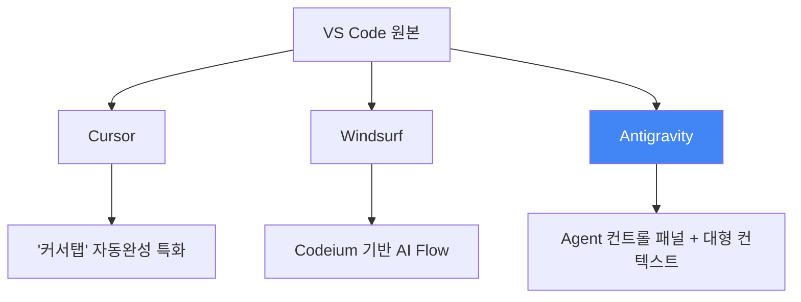
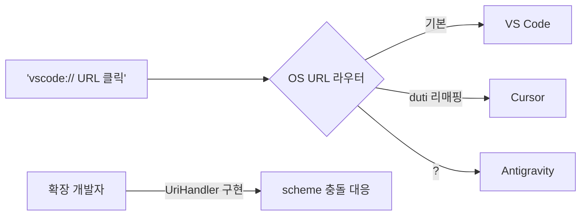

## 개요

Google이 VS Code를 포크하여 만든 Agentic IDE, **Antigravity**가 등장했다. Cursor, Windsurf에 이어 AI IDE 시장의 세 번째 주자로 떠오르고 있는 Antigravity를 YouTube 데모, 실사용 블로그, Reddit 커뮤니티 반응, 그리고 URL scheme 호환성 이슈까지 종합적으로 분석한다.



## Antigravity 첫인상 — Agent 컨트롤 패널

YouTube 데모 영상에서 확인할 수 있는 Antigravity의 핵심 차별점은 "IDE가 아니라 Agent 컨트롤 패널에 가깝다"는 점이다.

중국어권 개발자 Jimmy Song의 실사용 리뷰에 따르면:

- **인터페이스 구조**: Agent 관리 뷰 + 에디터 뷰로 분리되어, AgentHQ + VS Code를 합친 느낌
- **Agent 실행 속도**: 코드 수정 한 번에 완료되는 비율이 일반 챗봇형 보조보다 높음
- **컨텍스트 윈도우**: 에디터와 컨텍스트 영역이 모두 넓어 긴 diff/로그 분석에 유리
- **확장 마켓**: 기본값이 OpenVSX Gallery라서 VS Code 공식 Marketplace와 불일치

## VS Code처럼 쓰기 — 마이그레이션 가이드

Jimmy Song이 공유한 실전 마이그레이션 단계는 VS Code 유저가 Antigravity로 넘어갈 때 바로 적용 가능하다.

### 1단계: 확장 마켓 교체

Settings → Antigravity Settings → Editor에서 두 URL을 VS Code 공식으로 변경:

```
Marketplace Item URL:
https://marketplace.visualstudio.com/items

Marketplace Gallery URL:
https://marketplace.visualstudio.com/_apis/public/gallery
```

이 한 줄로 VS Code의 전체 확장 생태계에 접근할 수 있게 된다.

### 2단계: 외부 확장 설치

- **AMP**: 무료 모드 지원, 문서 작성/스크립트 실행에 강점. 다만 Antigravity에서는 API 키 로그인만 가능 (OAuth 미지원)
- **CodeX**: 직접 VSIX 다운로드 불가 → VS Code에서 먼저 설치 후 `.vsix` 파일로 익스포트 → Antigravity에 `Install from VSIX`

### 3단계: TUN 모드 프록시 이슈 해결

VPN이나 TUN 모드를 사용하는 경우, Antigravity의 Chrome DevTools Protocol 디버깅이 깨진다. Settings → HTTP: No Proxy에 `localhost`, `127.0.0.1` 추가로 해결.

## 커뮤니티 반응 — Reddit의 솔직한 평가

Reddit r/ChatGPTCoding에서의 Antigravity 리뷰 제목 자체가 분위기를 말해준다: *"I tried Google's new Antigravity IDE so you don't have to"*

커뮤니티에서 지적하는 핵심 문제:

1. **안정성**: "Agent terminated due to error" 에러가 빈번. 수동 재시도 필요
2. **모델 생태계**: OpenAI, Anthropic, xAI 등 외부 모델 네이티브 통합 부재
3. **커스터마이징**: Copilot Chat처럼 커스텀 prompt/agent 불가, rules 설정만 가능
4. **가격**: 무료 모델 미지원 (월 $20+ 예상), GitHub Copilot Free tier와 대비

## URL Scheme 전쟁 — vscode:// vs cursor:// vs antigravity://

AI IDE가 VS Code를 포크할 때 발생하는 흥미로운 문제가 있다. OS 수준에서 `vscode://` URL scheme이 어떤 에디터로 라우팅되느냐 하는 충돌이다.

Cursor 포럼의 논의에 따르면:

> "VS Code는 `vscode://` URI scheme을 등록하여 파일 열기, 특정 액션 트리거 등에 사용한다. Cursor도 같은 방식의 고유 scheme이 있는가?"

실전 해결책으로 **duti**라는 macOS 도구를 활용한 URL scheme 리매핑이 공유되었다:

```bash
# Cursor의 번들 ID 확인
osascript -e 'id of application "Cursor"'

# vscode:// → Cursor로 리매핑
duti -s com.todesktop.230313mzl4w4u92 vscode

# 테스트
open "vscode://file/somefile.text:123"
```

이 문제는 Antigravity 등장으로 더 복잡해진다. 세 IDE가 모두 `vscode://`를 claim할 수 있기 때문이다. VS Code API의 `UriHandler` 인터페이스를 통한 커스텀 URI 처리가 확장 개발자에게는 필수 고려사항이 되었다.



## 빠른 링크

- [Google Antigravity YouTube Demo](https://www.youtube.com/watch?v=9C0ZG8xV8p4) — 9분짜리 핸즈온 데모 영상
- [Antigravity를 VS Code처럼 쓰기 (Jimmy Song)](https://jimmysong.io/zh/blog/antigravity-vscode-style-ide/) — 마이그레이션 실전 가이드 (중문)
- [duti를 이용한 URL scheme 리매핑](https://gist.github.com/eduwass/e04da7e635e4ef731a2148c86127d42a) — macOS 전용 해결책
- [Cursor Forum: URL scheme 논의](https://forum.cursor.com/t/does-cursor-have-a-unique-open-scheme/3659) — 커뮤니티 토론
- [VS Code UriHandler API](https://code.visualstudio.com/api/references/vscode-api#UriHandler) — 확장 개발자용 레퍼런스

## 인사이트

AI IDE 전쟁은 이제 "AI가 코드를 얼마나 잘 쓰나"를 넘어 **플랫폼 락인** 싸움으로 진화하고 있다. VS Code 포크라는 전략은 기존 확장 생태계를 빌려올 수 있다는 장점이 있지만, URL scheme 충돌, 인증 호환성, 마켓플레이스 정책 등 예상치 못한 마찰이 발생한다.

Antigravity의 Agent 컨트롤 패널 접근법은 "코드 에디터에 AI를 붙인다"가 아니라 "AI 에이전트 환경에 에디터를 붙인다"는 역발상이다. 이 철학적 차이가 장기적으로 승부를 가를 수 있다. 다만 현재의 안정성 문제와 모델 생태계 제한은 프로덕션 환경에서의 채택을 어렵게 만든다.

`duti`를 활용한 URL scheme 리매핑은 당장 실전에서 쓸 수 있는 팁이며, 확장 개발자라면 `UriHandler`를 통한 multi-IDE 호환성을 반드시 고려해야 할 시점이다.
