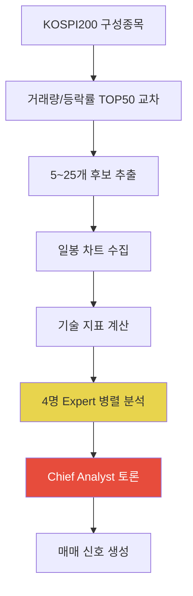

## 개요

KIS OpenAPI 기반 AI 트레이딩 시스템에 **Expert Agent Team** 아키텍처를 도입한 하루의 기록이다. 4명의 전문가 AI + Chief Analyst 토론 시뮬레이션, 순수 Python 기술 지표 계산기, 그리고 KOSPI200 데이터 소스를 3번이나 갈아치운 삽질기를 정리한다.



## Expert Agent Team 아키텍처

기존 `MarketScanner`는 단일 Claude 호출로 종목을 분석했다. 이를 4명의 전문가가 각자 관점에서 분석하고, Chief Analyst가 의견을 종합하는 토론 구조로 교체했다.

### 4명의 전문가

| 전문가 | 분석 관점 |
|---|---|
| 기술적 분석가 | MA 정배열/역배열, RSI 구간, MACD 크로스, 볼린저 밴드 |
| 모멘텀 트레이더 | 거래량 급등 배율, Stochastic K/D, 단기 돌파 패턴 |
| 리스크 평가자 | ATR 기반 위험도, RSI 과매수, 포트폴리오 집중도 |
| 포트폴리오 전략가 | 현금 비중, 섹터 분산, 기회비용 |

핵심은 `asyncio.gather`로 4명을 **병렬 호출**하는 것이다:

```python
async def run_expert_panel(data_package: dict) -> list[dict]:
    experts = [
        ("기술적 분석가", "MA 정배열/역배열, RSI, MACD ..."),
        ("모멘텀 트레이더", "거래량 급등, Stochastic K/D ..."),
        ("리스크 평가자", "ATR 기반 위험도, RSI 과매수 ..."),
        ("포트폴리오 전략가", "현금 비중, 섹터 집중도 ..."),
    ]
    tasks = [_call_expert(persona, focus, data_package)
             for persona, focus in experts]
    return await asyncio.gather(*tasks, return_exceptions=True)
```

### Chief Analyst 토론 시뮬레이션

4명의 의견이 모이면, Chief Analyst가 bullish/bearish 비율을 보고 최종 판단을 내린다. 단순 다수결이 아니라 **반대 의견의 근거까지 평가**하도록 프롬프트를 설계했다:

```python
# bullish 3 vs bearish 1이라도 bearish의 근거가 강하면 hold 가능
prompt = f"""
전문가 의견 요약:
{analyses_text}

만장일치가 아닌 경우, 소수 의견의 우려사항을 특히 주의 깊게 검토하세요.
"""
```

## 순수 Python 기술 지표 계산기

외부 라이브러리(TA-Lib, pandas-ta) 의존을 제거하기 위해 RSI, MACD, Stochastic, Bollinger Bands, ATR을 직접 구현했다.

```python
def calculate_rsi(closes: list[float], period: int = 14) -> float | None:
    gains, losses = [], []
    for i in range(1, len(closes)):
        diff = closes[i] - closes[i - 1]
        gains.append(max(diff, 0))
        losses.append(max(-diff, 0))

    avg_gain = sum(gains[:period]) / period
    avg_loss = sum(losses[:period]) / period

    # Wilder's smoothing — SMA가 아닌 지수 평활법
    for i in range(period, len(gains)):
        avg_gain = (avg_gain * (period - 1) + gains[i]) / period
        avg_loss = (avg_loss * (period - 1) + losses[i]) / period

    rs = avg_gain / avg_loss if avg_loss != 0 else float('inf')
    return round(100 - (100 / (1 + rs)), 2)
```

Wilder's Smoothing을 사용한 이유는 일반 SMA 대비 최근 값에 더 민감하게 반응하여 트레이딩 신호의 적시성이 높아지기 때문이다.

## KOSPI200 데이터 소스 삽질기

하루 동안 데이터 소스를 **세 번** 교체했다. 각 단계의 실패 원인과 해결 과정을 정리한다.


### 1차: KIS API `inquire_index_components`

```
❌ domestic_stock.json에 미등록 → API 호출 자체가 불가
```

KIS OpenAPI의 `inquire_index_components`는 문서에는 있지만 실제 SDK에 등록되지 않은 유령 API였다.

### 2차: KIS API `market_cap` (fid_input_iscd=2001)

```
⚠️ 호출은 성공하지만 최대 30개만 반환
```

KOSPI200 필터(`2001`)를 걸어도 상위 30개 시가총액 종목만 내려온다. 200개 전체가 필요한 스크리닝에는 부족했다.

### 3차: pykrx

KRX 공식 데이터를 Python으로 가져올 수 있는 인기 라이브러리. 하지만:

```
❌ KRX 엔드포인트가 세션 쿠키 없이 LOGOUT을 반환
```

pykrx의 내부 HTTP 세션이 KRX 서버의 인증 쿠키를 제대로 관리하지 못하는 경우가 있어, 서버가 `LOGOUT`이라는 텍스트 응답만 반환했다.

### 최종 해결: NAVER Finance 스크래핑

결국 가장 안정적인 소스는 NAVER Finance였다:

```python
def _fetch_kospi200_via_naver() -> dict[str, str]:
    session = requests.Session()
    session.headers["User-Agent"] = "Mozilla/5.0"
    session.get("https://finance.naver.com/")  # 세션 쿠키 획득

    codes: dict[str, str] = {}
    for page in range(1, 25):  # 24페이지 순회
        resp = session.get(
            "https://finance.naver.com/sise/entryJongmok.naver",
            params={"indCode": "KPI200", "page": str(page)},
        )
        pairs = re.findall(
            r"item/main\.naver\?code=(\d{6})[^>]*>([^<]+)",
            resp.text,
        )
        if not pairs:
            break
        for code, name in pairs:
            codes[code] = name.strip()
    return codes  # 199개 정확히 반환
```

핵심 포인트:
- `session.get("https://finance.naver.com/")`으로 **세션 쿠키를 먼저 획득**해야 함
- `entryJongmok.naver`의 `indCode=KPI200`이 KOSPI200 필터
- 24페이지를 순회하면 199개 전체 구성종목을 정확히 가져옴
- 결과는 SQLite에 upsert하여 당일 캐시, 다음날 자동 갱신

## 마켓 스캐너 파이프라인

최종 완성된 파이프라인은 4단계로 동작한다:

| Stage | 작업 | 결과 |
|---|---|---|
| 1 | KOSPI200 × (거래량 TOP50 + 등락률 TOP50) 교차 | ~5개 후보 |
| 2 | 후보 종목 일봉 차트 수집 + 기술 지표 계산 | enriched data |
| 3 | 4명 Expert 병렬 Claude 분석 | 각자 bullish/bearish/neutral |
| 4 | Chief Analyst 토론 → 최종 신호 생성 | BUY/SELL/HOLD |

하루 커밋 10개, 2,689줄 추가로 전체 아키텍처를 단일 Claude 호출에서 Expert Team 토론 시스템으로 전환했다.

## 빠른 링크

- [sharebook-kr/pykrx](https://github.com/sharebook-kr/pykrx) — KRX 주식 정보 스크래핑 라이브러리 (세션 이슈로 채택하지 않음)
- [NAVER Finance KOSPI200](https://finance.naver.com/sise/entryJongmok.naver?&indCode=KPI200) — 최종 채택한 데이터 소스

## 인사이트

이번 작업에서 가장 큰 교훈은 **금융 데이터 API의 신뢰성은 문서가 아니라 실행으로만 검증 가능**하다는 점이다. KIS API는 문서에 있지만 SDK에 없는 API가 있었고, pykrx는 세션 관리 버그로 인해 프로덕션에서 사용하기 어려웠다.

Expert Agent Team 패턴은 주식 분석뿐 아니라 **의사결정이 필요한 모든 AI 시스템**에 적용 가능하다. 핵심은 단순 다수결이 아니라 소수 의견의 근거까지 평가하는 Chief Analyst의 토론 프롬프트 설계다. bullish 3 vs bearish 1이라도 bearish의 근거가 ATR 기반 변동성 경고라면, Chief가 hold 판단을 내릴 수 있다.

순수 Python 기술 지표 구현은 TA-Lib 설치 이슈(C 라이브러리 의존)를 완전히 제거하면서도 Wilder's Smoothing 같은 정확한 알고리즘을 유지할 수 있음을 보여준다. 배포 환경의 제약이 있는 프로젝트에서 유용한 접근법이다.
