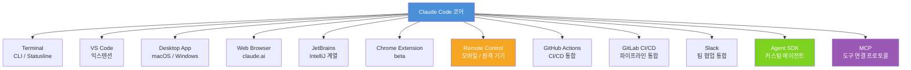

## 개요

Claude Code는 Anthropic이 만든 에이전트 코딩 도구다. 단순히 코드 자동완성을 제공하는 수준이 아니라, 코드베이스 전체를 읽고, 파일을 편집하고, 터미널 명령을 직접 실행하며, 개발 도구와 깊게 통합되는 방식으로 동작한다. 2026년 초 기준으로 Claude Code는 Terminal, VS Code, Desktop app, Web, JetBrains, Chrome extension(beta)에 이르기까지 개발자가 일하는 거의 모든 환경을 지원하고 있다.

최근 유튜브 채널 `@codefactory_official`이 올린 쇼트 영상("클로드 코드 최신 업데이트 Statusline")이 246개의 좋아요를 받으며 주목받았다. 제목의 핵심 키워드인 **Statusline** — 터미널 하단에 표시되는 상태표시줄 — 이 추가되면서 터미널 UI가 한층 더 스마트해졌다는 것이 영상의 요지다. 이 글에서는 Statusline 업데이트를 시작으로, Claude Code가 구축하고 있는 멀티 환경 AI 코딩 생태계 전체를 정리한다.

## Statusline — 터미널이 더 스마트해졌다

Statusline은 Claude Code가 터미널 인터페이스에 추가한 상태표시줄 UI 컴포넌트다. 기존에는 Claude Code를 터미널에서 실행할 때 어떤 작업이 진행 중인지, 현재 컨텍스트가 얼마나 소비되었는지 등을 한눈에 확인하기 어려웠다. Statusline이 추가되면서 터미널 하단에 현재 작업 상태, 사용 중인 모델 정보, 컨텍스트 사용량 등이 실시간으로 표시된다.

이 변화는 단순한 UX 개선 이상의 의미를 갖는다. 터미널 기반 개발 워크플로우를 선호하는 개발자들에게 Claude Code는 이제 IDE 수준의 시각적 피드백을 터미널 안에서 제공한다. `tmux`나 `zellij` 같은 멀티플렉서와 함께 사용할 때도 Statusline이 제 역할을 하며, 여러 세션을 동시에 관리할 때 각 세션의 상태를 명확하게 구분할 수 있게 되었다. "터미널이 이뻐졌다...?"는 영상 설명 문구가 가볍게 들릴 수 있지만, 실제로 이는 Claude Code가 터미널을 1등 시민(first-class citizen)으로 대우하겠다는 방향성을 명확히 보여준다.

Statusline의 도입은 Claude Code가 단순한 CLI 도구를 넘어 완성도 높은 터미널 개발 환경으로 진화하고 있음을 보여준다. 기존 AI 코딩 도구들이 주로 GUI IDE 플러그인 형태로 제공되었던 것과 달리, Claude Code는 터미널을 중심에 두고 다른 환경들을 확장으로 지원한다는 독특한 포지셔닝을 갖고 있다. 이 방향성은 서버 접속, CI/CD 파이프라인, Docker 컨테이너 내부 등 GUI가 없는 환경에서 AI 코딩 어시스턴트를 활용해야 하는 수요를 정확히 겨냥한 것이다.

## Claude Code가 지원하는 모든 환경

Claude Code가 지원하는 환경은 크게 두 축으로 나눌 수 있다. 첫째는 개발자가 직접 인터랙션하는 인터페이스 계층으로, Terminal(CLI), VS Code 익스텐션, Desktop App, Web(claude.ai), JetBrains 계열 IDE, Chrome Extension(beta)이 여기에 해당한다. 둘째는 자동화 및 통합 계층으로, GitHub Actions, GitLab CI/CD, Slack 통합, Remote Control, Agent SDK가 포함된다.

VS Code 익스텐션은 에디터 내에서 Claude Code를 직접 호출할 수 있게 해준다. 파일을 열어놓은 상태에서 "이 함수를 리팩터링해줘", "이 모듈에 대한 테스트를 작성해줘" 같은 자연어 명령을 내리면 Claude Code가 현재 열려 있는 파일의 컨텍스트를 파악하고 편집을 수행한다. JetBrains 지원은 IntelliJ IDEA, PyCharm, GoLand, WebStorm 등 JetBrains 계열 IDE 전체를 커버하며, Java/Kotlin/Python 등 JetBrains 생태계를 주로 사용하는 백엔드 개발자들도 Claude Code를 자신의 IDE 안에서 사용할 수 있다.

Chrome Extension은 현재 beta 상태이지만 흥미로운 가능성을 열어준다. 브라우저에서 코드가 표시된 웹페이지(GitHub, GitLab, 문서 사이트 등)를 보면서 바로 Claude Code와 상호작용할 수 있다. 이는 PR 리뷰나 오픈소스 코드 탐색 시 특히 유용하다. 설치 방법은 macOS/Linux 기준으로 `curl -fsSL https://claude.ai/install.sh | bash` 한 줄로 가능하며, Windows에서는 PowerShell 스크립트를 통해 설치한다.

## Remote Control과 비동기 코딩의 미래

Remote Control은 Claude Code의 기능 중 가장 혁신적인 것 중 하나다. 로컬 개발 세션을 실행해 두고 휴대폰이나 다른 기기에서 그 세션을 계속 이어갈 수 있다. 예를 들어, 사무실에서 복잡한 리팩터링 작업을 Claude Code에 맡겨두고 퇴근한 뒤 스마트폰에서 진행 상황을 확인하고 다음 지시를 내릴 수 있다. 이는 AI 코딩의 패러다임을 동기식(synchronous) 인터랙션에서 비동기식(asynchronous) 협업으로 전환시키는 핵심 기능이다.

Remote Control의 기술적 기반은 Claude Code의 세션 영속성(session persistence)에 있다. 로컬 머신에서 실행 중인 Claude Code 인스턴스는 세션 상태를 서버에 동기화하며, 권한을 부여받은 다른 기기는 이 세션에 연결하여 지시를 전달하거나 결과를 확인할 수 있다. 이 구조 덕분에 장시간 실행되는 작업(대규모 코드베이스 마이그레이션, 전체 테스트 스위트 실행 등)을 맡겨두고 필요할 때만 개입하는 방식이 가능해진다.

GitHub Actions 및 GitLab CI/CD 통합은 Remote Control의 자동화 확장판이라 볼 수 있다. PR이 열리면 Claude Code가 자동으로 코드를 리뷰하고, 테스트가 실패하면 원인을 분석하고 수정안을 제안한다. 이는 CI/CD 파이프라인을 단순한 빌드/테스트 자동화를 넘어 AI 지원 코드 품질 게이트로 격상시킨다. Slack 통합을 통해서는 팀 채널에서 Claude Code에게 작업을 할당하고 결과 리포트를 받을 수 있어, 개발팀의 비동기 협업 워크플로우에 자연스럽게 녹아든다.

## 에이전트 생태계 확장 — MCP, Skills, Hooks

MCP(Model Context Protocol)는 Claude Code가 외부 도구와 연결되는 표준 프로토콜이다. 데이터베이스, API, 파일 시스템, 다른 AI 서비스 등 어떤 도구든 MCP 서버로 구현하면 Claude Code가 자연어 명령으로 해당 도구를 사용할 수 있게 된다. Anthropic은 MCP를 오픈 스펙으로 공개했으며, 이미 다수의 서드파티 MCP 서버가 생태계를 구성하고 있다. 이 저장소(log-blog)도 Claude Code skill로 Claude AI를 지능 계층으로 활용하는 구조를 채택하고 있다.

Skills와 Hooks는 Claude Code의 커스터마이징 레이어다. Skills는 Claude Code가 특정 도메인이나 프로젝트에 특화된 행동을 학습하게 하는 방법으로, SKILL.md 파일에 도메인 지식과 작업 패턴을 정의하면 Claude Code가 이를 참조하여 더 정확한 결과를 낸다. Hooks는 특정 이벤트(파일 저장, 명령 실행 전후 등)에 커스텀 스크립트를 연결하는 메커니즘으로, 프로젝트별 규칙 강제나 자동화 파이프라인 구축에 활용된다.

Agent SDK는 Claude Code의 가장 확장성 높은 기능이다. 개발자가 직접 커스텀 에이전트를 구축할 수 있게 해주며, 여러 에이전트가 팀을 이루어 복잡한 작업을 분업하는 "에이전트 팀" 실행도 지원한다. 예를 들어, 하나의 에이전트가 요구사항을 분석하고, 다른 에이전트가 코드를 작성하며, 세 번째 에이전트가 테스트를 실행하고 검증하는 파이프라인을 구성할 수 있다. 이는 단일 AI 어시스턴트의 한계를 넘어 실질적인 멀티 에이전트 소프트웨어 개발의 가능성을 열어준다.

경쟁 시장도 빠르게 움직이고 있다. Amazon은 최근 **Kiro IDE**(`app.kiro.dev`)를 출시했다. AWS Cognito 기반 인증을 사용하는 Kiro는 Amazon의 AI 코딩 생태계를 중심으로 개발자를 끌어들이려는 전략적 움직임이다. GitHub Copilot, Cursor, Windsurf에 이어 Kiro까지 가세하면서 AI 코딩 도구 시장의 경쟁은 더욱 치열해지고 있다. Claude Code가 이 경쟁에서 차별화하는 요소는 에이전트 수준의 자율성, 멀티 환경 지원의 폭, 그리고 MCP를 통한 개방적 확장성이다.

## 빠른 링크

- [Claude Code 공식 문서 (한국어)](https://code.claude.com/docs/ko/overview) — 설치부터 Agent SDK까지 전체 가이드
- [Claude Code 설치 스크립트](https://claude.ai/install.sh) — `curl -fsSL https://claude.ai/install.sh | bash`로 즉시 설치
- [Anthropic Academy — Claude Code in Action](https://www.anthropic.com/learn) — 공식 실습 코스
- [YouTube: 클로드 코드 최신 업데이트 Statusline](https://www.youtube.com/shorts/1oLIsWs5vqc) — @codefactory_official 쇼트 영상
- [Kiro IDE](https://app.kiro.dev) — Amazon의 새 AI IDE, 경쟁 제품

## 인사이트

Claude Code의 Statusline 업데이트는 사소한 UI 개선처럼 보이지만, Anthropic이 터미널을 AI 코딩의 핵심 인터페이스로 진지하게 투자하고 있다는 신호다. Terminal, VS Code, JetBrains, Web, Chrome Extension까지 아우르는 멀티 환경 지원은 개발자가 어떤 도구를 쓰든 Claude Code를 선택할 수 있게 하려는 전략이며, 특정 IDE 생태계에 lock-in하지 않겠다는 메시지이기도 하다. Remote Control과 GitHub Actions/GitLab 통합이 의미하는 바는 더 깊다 — AI 코딩이 "내가 앞에 앉아서 대화하는 도구"에서 "백그라운드에서 일하고 결과를 보고하는 에이전트"로 전환되고 있다. MCP의 오픈 스펙 공개와 Agent SDK의 제공은 Claude Code를 단독 도구가 아닌 플랫폼으로 만들려는 시도이며, 이는 경쟁사 대비 중요한 해자(moat)가 될 수 있다. Amazon Kiro, GitHub Copilot Workspace, Cursor 등 경쟁 제품들도 빠르게 에이전트 기능을 강화하고 있어, 2026년은 AI 코딩 도구가 진정한 자율 에이전트로 도약하는 원년이 될 것으로 보인다. 이 경쟁에서 승자는 단순한 코드 생성 품질이 아니라, 개발자의 전체 워크플로우에 얼마나 자연스럽게 녹아드는가로 결정될 가능성이 높다.
