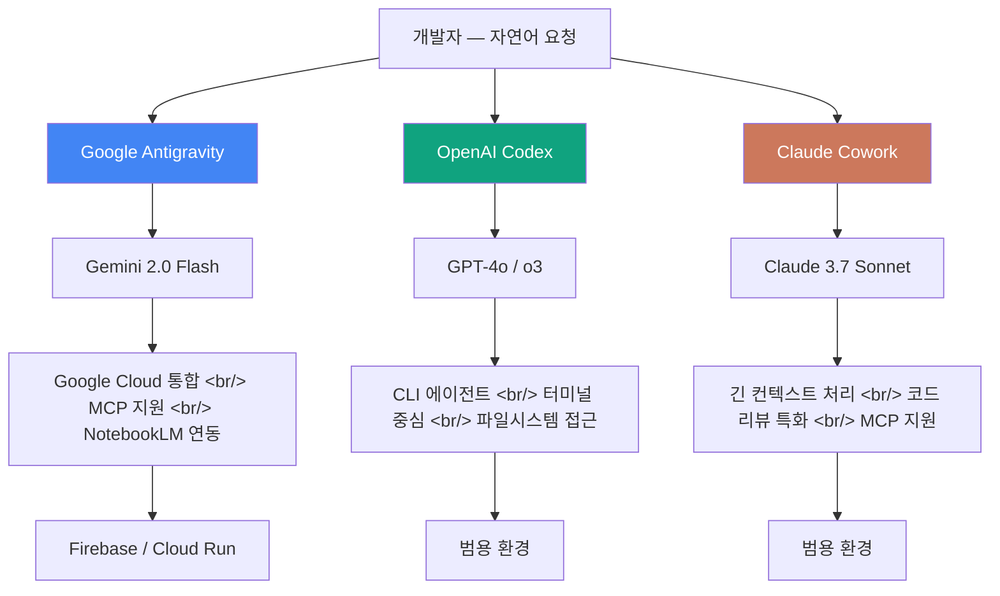

## 개요

Google Antigravity는 Gemini AI를 핵심 엔진으로 탑재한 구글의 AI IDE로, OpenAI Codex, Anthropic Claude Cowork와 함께 AI 주도 개발 환경 시장을 3분하는 신규 플레이어다. 단순한 코드 자동완성을 넘어 자연어 명령만으로 전체 프로젝트를 구성하는 바이브 코딩(vibe coding) 패러다임을 지향하며, Google NotebookLM과 연동해 전문화된 서브에이전트 아키텍처까지 구축할 수 있다는 점이 경쟁 도구와의 핵심 차별점이다.

---

## Antigravity 기본 설정과 UI 구조

Antigravity를 처음 실행하면 Cursor나 VS Code와 유사한 웹 기반 IDE 레이아웃이 나타나지만, 인터페이스의 주도권이 코드 에디터가 아닌 AI 채팅 패널에 있다는 점에서 근본적으로 다르다. 좌측 사이드바에는 파일 트리와 프로젝트 네비게이터가 위치하고, 중앙 영역은 코드 편집기가 차지하지만, 우측의 Gemini 채팅 패널이 실질적인 작업의 시작점 역할을 한다. UI 버튼 하나하나가 특정 Gemini 기능에 매핑되어 있어, 툴바를 읽는 것 자체가 이 도구의 설계 철학을 이해하는 경로다.

기본 설정 단계에서 가장 중요한 작업은 Google 계정 연동과 프로젝트 초기화다. 계정 연동 후 새 프로젝트를 생성하면 Gemini가 프로젝트 컨텍스트를 자동으로 파악하고, 이후 모든 채팅 요청은 해당 컨텍스트를 기반으로 처리된다. 특히 MCP(Model Context Protocol) 연결 설정 옵션이 기본 세팅 화면에 노출되어 있다는 점이 주목할 만하다 — 구글이 MCP를 외부 도구 연동의 표준 인터페이스로 공식 채택했다는 신호로 읽힌다.

바이브 코딩 관점에서 Antigravity의 진입 장벽은 다른 AI IDE보다 낮은 편이다. "React로 할 일 관리 앱 만들어줘"라고 입력하면 Gemini가 파일 구조를 제안하고, 승인하면 곧바로 코드를 생성하며, 결과물은 내장 미리보기 창에서 즉시 확인할 수 있다. 이 흐름은 Claude Cowork나 Codex와 표면적으로 유사하지만, Google Cloud 인프라와의 직접 통합(Cloud Run 배포, Firebase 연동 등)이 원클릭 수준으로 지원된다는 점에서 구글 생태계 내 개발자에게는 명확한 이점이 존재한다.

---

## AI IDE 3파전 비교 — Antigravity vs Codex vs Claude Cowork

세 도구는 모두 자연어 기반 코드 생성을 표방하지만, 설계 철학과 실제 사용 경험은 뚜렷하게 갈린다. OpenAI Codex는 터미널 친화적인 CLI 에이전트에 가깝고, Anthropic Claude Cowork는 긴 컨텍스트 처리와 정교한 코드 리뷰에 강점을 보이며, Google Antigravity는 시각적 UI와 Google 서비스 에코시스템 통합을 전면에 내세운다. 어느 도구가 우월하다기보다는, 개발자의 작업 스타일과 사용하는 클라우드 환경에 따라 선택지가 달라지는 구조다.

코드 품질 측면에서 세 도구의 차이는 복잡한 로직을 다룰 때 두드러진다. Claude Cowork는 긴 컨텍스트 윈도우 덕분에 대형 코드베이스 전체를 참조하는 리팩터링에서 두각을 나타내고, Codex는 테스트 작성과 자동화 스크립트 생성에서 일관된 성능을 보인다. Antigravity는 UI 컴포넌트 생성과 Google Cloud 관련 보일러플레이트 코드에서 가장 빠른 결과물을 제공하지만, 도메인 특화 로직이 복잡해질수록 다른 두 도구에 비해 수정 사이클이 늘어나는 경향이 관찰된다.

MCP 지원 여부는 세 도구 비교에서 점점 더 중요한 축이 되고 있다. Claude Cowork는 MCP의 원조 지지자였고, Antigravity도 이를 빠르게 채택했으며, Codex 역시 유사한 외부 도구 연동 메커니즘을 갖추어 가고 있다. 이는 AI IDE 경쟁의 다음 전선이 모델 품질 벤치마크보다 에코시스템 연동 깊이로 이동하고 있음을 시사한다 — 어떤 외부 데이터 소스와 서비스를 얼마나 자연스럽게 연결할 수 있는가가 실질적인 생산성 차이를 결정하는 시대가 오고 있다.

---

## NotebookLM 연동 서브에이전트 구축

Google NotebookLM은 원래 문서 분석과 지식 관리 도구로 알려져 있지만, Antigravity와 연동하면 도메인 특화 지식을 가진 서브에이전트로 변신한다. 연동 방법은 두 가지 경로가 있다. 첫 번째는 NotebookLM의 공유 링크를 Antigravity의 MCP 설정에 등록하는 방식으로, NotebookLM이 보유한 문서 지식을 Antigravity의 채팅 컨텍스트로 직접 주입할 수 있다. 두 번째는 NotebookLM의 API 엔드포인트를 커스텀 MCP 서버로 래핑하는 방식으로, 더 정교한 쿼리 제어가 가능하지만 초기 설정 비용이 상대적으로 높다.

서브에이전트 아키텍처의 실용적 가치는 명확하다. 예를 들어 레거시 시스템의 내부 문서 수백 페이지를 NotebookLM에 업로드하고, 이를 Antigravity에 연결하면 "이 레거시 API를 호출하는 새 Python 클라이언트 작성해줘"라는 요청에 Antigravity가 NotebookLM에서 관련 스펙을 검색해 근거 있는 코드를 생성한다. 일반적으로 AI IDE가 환각(hallucination)에 빠지기 쉬운 내부 도메인 지식 영역에서 정확도를 크게 높일 수 있다는 점이 핵심 가치다.

서브에이전트 구축 과정에서 핵심 개념은 역할 분담이다. Antigravity는 코드 생성과 실행을 담당하는 오케스트레이터 역할을 하고, NotebookLM은 도메인 지식을 제공하는 리트리버 역할을 한다. 이 패턴은 RAG(Retrieval-Augmented Generation) 아키텍처와 본질적으로 동일하지만, 개발자가 별도의 벡터 데이터베이스를 구축하거나 임베딩 파이프라인을 관리할 필요 없이 GUI 수준의 설정만으로 동일한 효과를 얻을 수 있다는 점이 혁신적이다.

실제 데모에서 확인된 한계도 있다. NotebookLM과 Antigravity 간의 컨텍스트 전달 지연이 체감될 만큼 존재하며, NotebookLM의 응답이 길어질수록 Antigravity의 코드 생성 품질이 다소 저하되는 경향이 보고된다. 또한 현재는 NotebookLM의 특정 노트북에 대한 접근 권한 관리가 세밀하지 않아, 팀 환경에서 사용할 때는 정보 보안 측면에서 추가적인 고려가 필요하다. 그럼에도 불구하고 이 연동 패턴이 보여주는 가능성 — 도메인 지식 베이스를 AI IDE에 플러그인하는 방식 — 은 향후 엔터프라이즈 AI 개발 환경의 핵심 아키텍처가 될 가능성이 높다.

---

## 빠른 링크

- [구글 안티그래비티 기본 설정 및 사용방법, 코덱스 앱, 클로드 코워크와 비교](https://www.youtube.com/watch?v=v3m-QXMCZ6M) — 오늘코드todaycode 채널, 29분 43초. UI 버튼별 기능 소개와 3파전 비교 실습
- [안티그래비티 + 노트북 LM으로 만드는 서브 에이전트](https://www.youtube.com/watch?v=IMFiasVnc0o) — 투쏠 AI 에이전트 채널, 14분 20초. NotebookLM 연동 두 가지 방법과 에이전트 구축 실전

---

## 인사이트

Google Antigravity의 등장이 의미하는 바는 단순히 경쟁자가 하나 더 늘었다는 것 이상이다. Google이 Gemini를 단독 제품이 아닌 IDE라는 개발자 도구 내에 통합한 것은, AI 모델 경쟁의 주 전장이 API 성능 벤치마크에서 개발자 워크플로우 통합으로 이동했음을 명확히 보여준다. NotebookLM 서브에이전트 연동은 특히 흥미로운데, 이는 AI IDE가 단일 모델의 한계를 여러 전문화된 에이전트로 보완하는 방향으로 진화하고 있음을 시사한다. MCP가 이 에코시스템을 연결하는 표준 프로토콜로 자리잡아 가는 흐름도 뚜렷하다 — Anthropic이 제안하고, Google이 채택하고, OpenAI도 호환 방향으로 움직이는 수렴이 일어나고 있다. 바이브 코딩이라는 개념 자체도 점점 현실화되고 있지만, 현 시점에서는 설계 단계의 빠른 프로토타이핑과 보일러플레이트 생성에서 가장 실용적이며, 복잡한 비즈니스 로직 구현에서는 여전히 개발자의 판단과 검증이 필수다. AI IDE 3파전의 진짜 승자는 특정 모델이 아니라, 개발자의 기존 스택과 가장 자연스럽게 통합되는 도구가 될 가능성이 높다.
