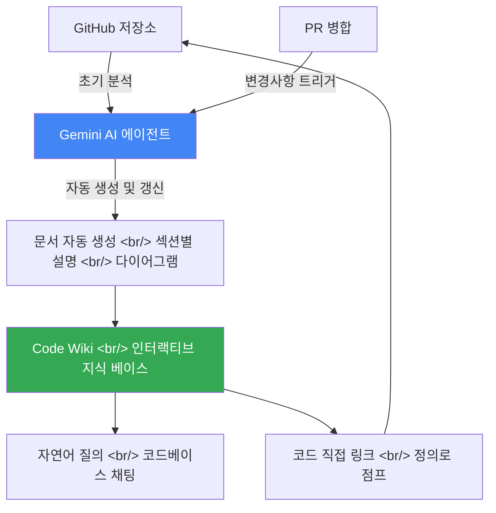

## 개요

Google Code Wiki는 codewiki.google에서 공개된 구글의 새로운 AI 문서화 도구로, Gemini가 코드베이스를 분석해 인터랙티브한 지식 베이스를 자동으로 생성하고 PR 병합 시마다 관련 문서를 실시간으로 갱신한다. "Stop documenting. Start understanding."이라는 슬로건이 압축하듯, 이 도구는 문서화를 개발자가 직접 작성하는 부담에서 AI가 자동으로 유지하는 인프라로 전환하려는 시도다.

---

## Code Wiki란 무엇인가

Code Wiki는 표면적으로는 자동 문서화 도구처럼 보이지만, 그 본질은 코드베이스를 살아있는 지식 그래프로 변환하는 에이전트 시스템이다. 기존의 문서화 도구들 — Confluence, Notion, GitBook — 은 개발자가 내용을 직접 작성하고, 코드가 변경되어도 문서는 자동으로 따라가지 않는다는 구조적 한계를 가진다. 코드와 문서 사이의 이 "드리프트(drift)"는 대형 코드베이스에서 만성적인 문제다. Code Wiki는 Gemini AI 에이전트가 코드를 직접 읽고 문서를 생성하기 때문에, 코드가 진실의 원천(source of truth)이 되고 문서는 그 파생물이 된다.

도구의 핵심 포지셔닝은 "agentic era를 위한 새로운 개발 관점(A new perspective on development for the agentic era)"이라는 문구에 담겨 있다. 에이전트 시대란 AI가 단순히 도구를 보조하는 것이 아니라 스스로 판단하고 행동하는 시대를 뜻하는데, Code Wiki는 문서화라는 영역에서 그 에이전트적 역할을 맡겠다고 선언하는 것이다. Gemini-generated documentation이 항상 최신 상태(always up-to-date)를 유지한다는 약속은, 인간이 문서를 유지보수해야 하는 의무에서 해방될 수 있다는 가능성을 제시한다.

현재 Code Wiki는 초대 기반(invite only)으로 운영되며, 일부 주목할 만한 오픈소스 저장소들을 피처드 리포(featured repos)로 공개 데모하고 있다. 프라이빗 리포지토리 지원은 "Coming Soon" 상태다. 이 단계적 공개 전략은 AI 생성 문서의 품질을 공개 검증하면서 인프라를 확장하려는 신중한 접근으로 읽힌다.

---

## 핵심 기능 분석

Code Wiki의 첫 번째 핵심 기능은 섹션별 심층 탐색(Understand your code section by section)이다. 단순히 전체 코드베이스의 개요를 생성하는 것이 아니라, 특정 섹션을 선택해 해당 섹션이 어떻게 동작하는지 드릴다운할 수 있다. 이는 신규 팀원이 대형 프로젝트에 온보딩할 때, 또는 오랜만에 돌아온 개발자가 특정 서비스의 동작을 파악할 때 기존 방식 — 코드를 직접 읽거나 동료에게 물어보거나 — 을 대체할 수 있는 기능이다. Gemini가 생성한 설명이 얼마나 정확하고 유용한지가 관건이지만, 이 인터랙티브한 탐색 경험 자체는 문서화의 새로운 UX를 제안한다.

자동 업데이트 메커니즘은 Code Wiki에서 기술적으로 가장 흥미로운 부분이다. PR이 병합될 때마다 Gemini 에이전트가 변경된 코드를 분석하고 관련 문서를 자동으로 갱신한다. 이 파이프라인이 제대로 동작하려면 diff 분석, 연관 문서 식별, 기존 문서와의 정합성 유지라는 세 가지 어려운 문제를 동시에 풀어야 한다. 특히 리팩터링처럼 코드 구조 자체가 크게 바뀌는 경우, AI가 이전 문서의 어느 부분을 수정하고 어느 부분을 폐기해야 하는지 판단하는 것은 상당한 추론 능력을 요구한다.

코드와 문서 사이의 양방향 링크(Linked back to your code) 기능은 실용적 가치가 높다. 아키텍처 개요를 읽다가 특정 서비스에 대한 설명을 클릭하면 해당 서비스의 소스 파일로 이동하고, 함수 설명에서 그 함수의 정의 위치로 바로 점프할 수 있다. 이는 문서와 코드가 별도의 사일로(silo)에 존재하던 기존 방식에서 벗어나, 문서가 코드의 네비게이션 레이어로 기능하는 새로운 패턴을 제시한다. JetBrains의 코드 내비게이션이나 GitHub의 코드 검색이 코드 레벨에서 이 경험을 제공했다면, Code Wiki는 자연어 설명 레벨에서 같은 경험을 시도한다.

다이어그램 자동 생성 기능도 주목할 만하다. 복잡한 시스템을 머릿속에서 조각을 맞추는 대신, 코드가 명확하고 직관적인 시각적 다이어그램으로 변환된다는 약속이다. 대형 마이크로서비스 아키텍처에서 서비스 간 의존성을 파악하거나, 복잡한 데이터 흐름을 이해하는 데 이 다이어그램이 실제로 얼마나 정확한지는 더 많은 실사용 사례가 필요하다. 다만 AI가 코드에서 직접 추출한 다이어그램이라면, 사람이 수동으로 그린 다이어그램보다 최신 상태를 더 잘 반영할 가능성이 높다.

코드베이스와의 자연어 채팅(Talk to your codebase) 기능은 "24/7 온콜 엔지니어" 경험을 제공한다는 설명이 붙어 있다. 이는 단순한 문서 검색이 아니라, 코드베이스를 이해하는 AI와 실시간으로 대화하는 경험을 의미한다. "이 API 엔드포인트는 어떤 인증 방식을 사용하나요?", "결제 서비스와 주문 서비스 사이에 어떤 이벤트가 오가나요?" 같은 질문에 즉시 답변을 받을 수 있다면, 신규 팀원의 온보딩 시간과 시니어 개발자의 컨텍스트 공유 부담을 동시에 줄일 수 있다.

---

## 에이전트 시대의 문서화 패러다임 변화

전통적인 문서화 철학은 "코드가 변경되면 문서도 업데이트해야 한다"는 규범에 기반한다. 그러나 현실에서 이 규범은 대부분 지켜지지 않는다. 개발 속도가 빠를수록, 팀 규모가 클수록, 그리고 문서화에 직접적인 비즈니스 가치를 느끼기 어려울수록 문서는 뒤처진다. Code Wiki의 접근법은 이 인간적 한계를 규범이 아닌 자동화로 해결하려는 시도다. 문서화 의무를 개발자에게 부과하는 대신, 코드 변경이라는 이벤트를 자동화 파이프라인의 트리거로 만드는 것이다.

이 패러다임 전환이 가져오는 더 깊은 함의는 개발자의 역할 변화다. 지금까지 시니어 개발자의 중요한 기여 중 하나는 암묵지(tacit knowledge) — 코드에 명시되지 않은 설계 결정, 역사적 맥락, 트레이드오프 — 를 문서로 남기거나 후배에게 전달하는 것이었다. AI가 코드에서 명시적 지식을 자동으로 추출할 수 있게 되면, 개발자의 가치 있는 지식 기여는 점점 더 이 암묵지 영역으로 이동할 것이다. 그리고 아이러니하게도, AI가 이 암묵지까지 포착하려면 개발자가 커밋 메시지, PR 설명, 코드 주석에 더 풍부한 컨텍스트를 남겨야 한다 — AI 도구가 더 좋아질수록 개발자가 남겨야 하는 구조화된 정보의 질도 높아지는 역설이 생긴다.

Code Wiki가 장기적으로 의미 있는 도구가 되려면 AI 생성 문서에 대한 신뢰 문제를 해결해야 한다. 개발자가 문서를 직접 작성할 때는 그 문서에 책임 소재가 명확하지만, AI가 생성한 문서가 틀렸을 때 누가 책임지는가, 그리고 개발자가 AI 문서를 얼마나 신뢰하고 행동할 것인가는 기술적 문제가 아닌 문화적 문제다. 특히 미션 크리티컬한 시스템에서 AI 문서를 기반으로 유지보수 결정을 내리는 것은, 문서의 정확도에 대한 높은 신뢰가 전제되어야 한다.

또한 Code Wiki는 현재 공개 오픈소스 리포지토리에서만 동작하며 프라이빗 리포 지원은 준비 중이다. 엔터프라이즈 환경에서 채택되려면 코드 보안, 데이터 주권, 온프레미스 배포 옵션 같은 거버넌스 요건을 충족해야 한다. Google이 이미 Google Cloud의 기업 고객들을 보유하고 있다는 점은 이 문제에서 유리한 출발점이 될 수 있지만, 코드베이스를 외부 AI 서비스에 노출하는 데 대한 기업의 보수적 태도를 극복하는 것은 별개의 도전이다.

---

## 빠른 링크

- [[Product Review] Google의 Code Wiki, 코드베이스 설명서](https://www.youtube.com/watch?v=JXTPHsN4rcE) — LOADING_ 채널, 9분 12초. codewiki.google 실사용 리뷰
- [Code Wiki 공식 사이트](https://codewiki.google) — 피처드 리포 데모 및 초대 신청

---

## 인사이트

Code Wiki는 단순한 문서화 도구가 아니라, AI 에이전트가 소프트웨어 개발 생명주기의 일부를 자율적으로 담당하기 시작하는 전환점의 상징이다. PR 병합이라는 개발자의 행동이 AI 에이전트의 작업을 자동 트리거하고, 그 결과가 팀 전체에 즉시 공유되는 흐름은 에이전트와 인간이 협업하는 방식의 초기 모델을 보여준다. Google이 Antigravity(코드 작성)와 Code Wiki(코드 문서화)를 동시에 출시하고 있다는 점은 의도적인 전략처럼 보인다 — AI가 코드를 쓰고, AI가 그 코드를 설명하는 완전한 루프를 만들려는 시도다. NotebookLM이 지식 저장소 역할을 하고, Antigravity가 코드를 생성하며, Code Wiki가 결과를 문서화한다면, 이 세 도구의 통합은 구글이 그리는 AI 개발 환경의 큰 그림일 수 있다. 개발자에게 실질적인 함의는, 좋은 커밋 메시지와 잘 구조화된 PR 설명이 단순한 팀 협업 예절을 넘어 AI 문서화 품질을 결정하는 핵심 입력값이 된다는 것이다.
