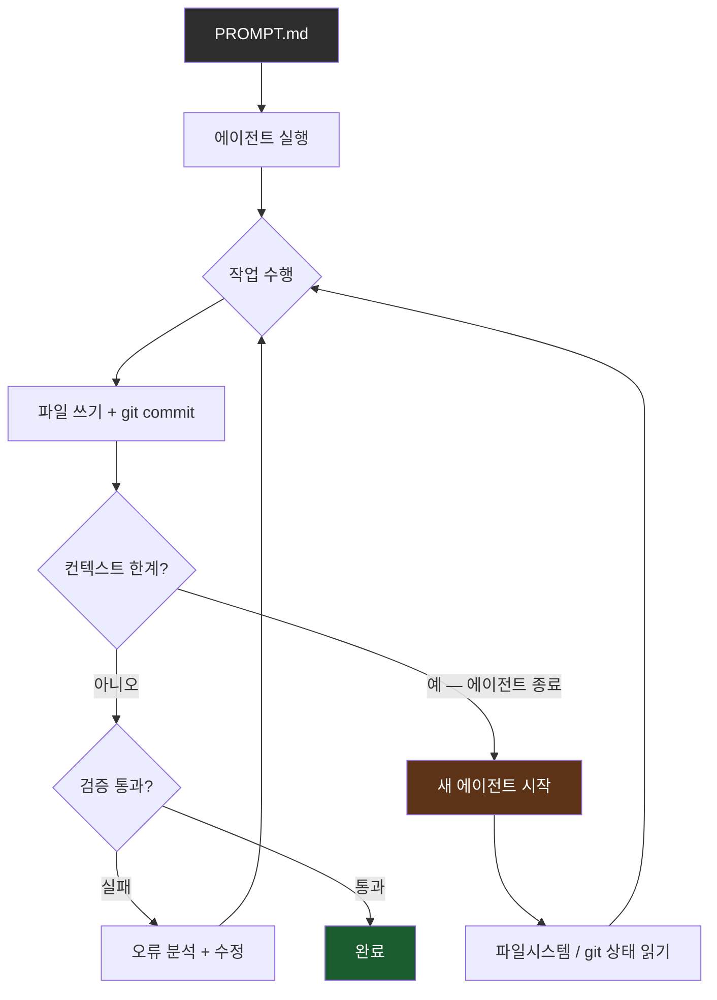

## 개요

Claude Code에게 작업을 시키면 "성공적으로 완료했습니다"라는 메시지가 뜬다. 하지만 실제로 테스트를 돌려보면 에러가 터진다. 이 불일치는 AI 코딩 도구가 가진 구조적 한계에서 비롯된다. AI는 자신이 작업을 완료했다고 판단하는 순간 멈추지만, 그 판단이 틀릴 수 있다는 사실을 스스로 검증하지 않는다.

Ralph Loop는 이 문제를 정면으로 해결하는 패턴이다. 핵심 아이디어는 단순하다. AI가 "완료"라고 말해도 자동으로 다시 시작해서 스스로 검증하게 만든다. 끝없이 반복하는 루프 안에 AI 에이전트를 가두면, 에이전트는 실패를 감지하고 수정하기를 반복하다가 진짜로 통과할 때까지 멈추지 않는다. 이 아이디어는 2025-2026년에 걸쳐 AI 개발 커뮤니티에서 가장 주목받는 자동화 패턴 중 하나로 부상했다.

---

## Ralph Loop의 탄생 배경

Ralph Loop라는 이름은 미국 애니메이션 심슨 가족의 등장인물 Ralph Wiggum에서 왔다. Ralph는 특별히 똑똑하지는 않지만 절대 포기하지 않는 캐릭터다. Geoffrey Huntley가 이 비유에서 영감을 받아 가장 단순한 형태의 에이전트 루프 패턴을 제안했고, 그 원본 구현은 단 한 줄의 bash 명령어다.

```bash
while :; do cat PROMPT.md | agent; done
```

이게 전부다. `PROMPT.md`에 작업 지시를 적어두면, 이 루프는 에이전트가 종료될 때마다 즉시 새 에이전트를 띄워 같은 프롬프트로 다시 시작한다. 컨텍스트 창이 가득 차도, 에이전트가 중간에 멈춰도, 오류가 발생해도 루프는 계속 돌아간다. 새 에이전트는 파일시스템과 git 히스토리를 읽어 이전 에이전트가 어디까지 했는지 파악하고 이어서 작업한다.

이 패턴이 주목받게 된 결정적 계기는 Y Combinator 해커톤 사례다. 참가자들이 GCP 인스턴스에 Ralph Loop를 돌려놓고 잠자리에 들었더니, 아침에 확인해보니 6개 레포지토리에 걸쳐 1,100개의 커밋이 쌓여 있었다. Browser Use 라이브러리를 Python에서 TypeScript로 거의 완전히 포팅하는 작업이 하룻밤 사이에 완료된 것이다. 총 비용은 800달러였는데, 이는 시간당 10.50달러짜리 개발자를 고용한 것과 같은 단가다. 이 사례는 Ralph Loop의 현실적 효용을 증명하면서 커뮤니티 전체에 퍼져나갔다.

파생 프로젝트들도 빠르게 등장했다. `snarktank/ralph` 레포지토리는 9,200개 이상의 GitHub 스타를 받았고, `oh-my-opencode` 프로젝트는 `/ralph-loop` 명령어를 내장 기능으로 포함했다. 원래는 실험적 해킹에 가까웠던 이 패턴이 점차 표준화된 도구로 자리를 잡아가는 과정이 빠르게 진행됐다.

---

## 왜 효과적인가 — 컨텍스트 vs 파일시스템

전통적인 AI 코딩 도구의 문제는 진행 상황을 컨텍스트 창 안에만 저장한다는 점이다. LLM의 컨텍스트 창은 유한하고, 한 번 가득 차면 이전 내용이 잊힌다. 장시간 작업에서는 에이전트가 앞서 무엇을 했는지 기억하지 못하거나, 컨텍스트 한계에 도달해 강제로 종료되는 문제가 발생한다.

Ralph Loop의 핵심 통찰은 상태를 컨텍스트가 아니라 외부 파일시스템과 git에 저장한다는 것이다. 에이전트가 코드를 작성하면 파일에 저장된다. 에이전트가 git commit을 하면 히스토리가 남는다. 컨텍스트가 가득 차서 에이전트가 종료되더라도 루프는 새 에이전트를 띄운다. 새 에이전트는 파일시스템을 읽고 git log를 확인해서 이전 에이전트가 어디까지 진행했는지 파악하고 작업을 이어간다.



이 아키텍처가 중요한 이유는 에이전트 루프의 지속성을 컨텍스트 창의 한계에서 완전히 분리했다는 점이다. 컨텍스트는 언제든 리셋될 수 있지만, 파일시스템과 git은 영속적이다. 새 에이전트는 항상 "fresh"한 상태로 시작하면서도 이전 작업의 결과물을 온전히 이어받는다. 이 패턴은 특히 대규모 리팩토링, 라이브러리 포팅, 레거시 코드 마이그레이션처럼 맥락이 긴 작업에서 강력하게 작동한다.

---

## 프로덕션 수준으로 진화한 패턴들

단순한 bash 루프에서 출발한 Ralph Loop는 프로덕션 환경에서 요구되는 복잡도를 반영하며 여러 방향으로 진화했다. Peter Steinberger가 공개한 OpenClaw 프로젝트(152,000개 이상의 GitHub 스타)는 에이전트 루프를 실제 서비스 수준으로 끌어올린 사례다. OpenClaw는 WhatsApp, Slack, Discord, iMessage, Telegram 등 12개 이상의 채널을 연결하고, "soul document"라는 개념으로 에이전트의 성격과 행동 원칙을 정의 문서로 관리한다. Gateway 기반 세션 라우팅과 사용량 모니터링까지 갖추고 있으며, 총 커밋 수가 8,700개를 넘는다.

Nanobot 프로젝트는 에이전트 루프의 핵심을 330줄로 증류해서 보여준다. 복잡한 인프라 없이 루프의 본질만 남긴 이 코드는 Ralph Loop의 기계적 구조를 가장 명확하게 드러낸다.

```python
while iteration < self.max_iterations:
    iteration += 1
    response = await self.provider.chat(
        messages=messages,
        tools=self.tools.get_definitions()
    )
    if response.has_tool_calls:
        for tool_call in response.tool_calls:
            result = await self.tools.execute(
                tool_call.name, tool_call.arguments)
            messages = self.context.add_tool_result(
                messages, tool_call.id, tool_call.name, result)
    else:
        final_content = response.content
        break
```

이 코드의 구조를 보면 Ralph Loop가 얼마나 오래된 컴퓨터 과학 개념에 기반하는지 명확해진다. `while`문, 도구 호출 응답 처리, 메시지 히스토리 누적, 탈출 조건. 새로운 것은 없다. 달라진 점은 루프 안에서 LLM이 "다음에 무엇을 할지"를 결정한다는 것, 그리고 탈출 조건인 "완료"를 어떻게 정의하느냐다. `max_iterations`는 무한 루프를 막는 안전장치로, 그 한계에 도달하면 루프를 강제 종료하는 대신 `MaxReachedAgent`를 호출해 지금까지의 작업을 요약하고 다음 방향을 안내한다.

---

## 채널톡 FrontALF가 구현한 실전 설계

채널톡의 AI 상담 시스템 FrontALF는 Ralph Loop 패턴을 실제 B2B 서비스에 적용한 사례로, 두 가지 루프를 목적에 따라 분리해 설계했다. 이 설계는 단순한 반복 루프를 넘어 에이전트 루프를 상황에 맞게 전문화하는 아키텍처 관점을 보여준다.

첫 번째는 Stateless Agent Loop다. 고객 Q&A, RAG 검색, 빠른 응답이 필요한 상황에서 사용한다. 각 턴은 독립적으로 실행되고 상태를 외부에 저장하지 않는다.

```go
for i := 0; i < maxTurns; i++ {
    response := llm.Request(currentHistory)
    currentHistory = append(currentHistory, response.Events...)
    if !checkShouldContinue(response.Events) { break }
}
```

RAG Handler 내부에서 검색 결과의 충분성을 판단해 필요하면 재검색하는 미니 루프가 내포되어 있다. 바깥 루프는 단순하지만 안쪽에서 필요에 따라 자율적으로 보완하는 구조다.

두 번째는 Stateful Task Loop다. 환불 처리처럼 여러 단계를 거치는 워크플로우, 외부 시스템 승인을 기다려야 하는 작업에 사용한다.

```go
type TaskSession struct {
    CurrentNodeID string
    TaskMemory    map[string]any  // 노드 간 공유 상태
    NodeTrace     []string        // 실행 경로 추적
}
```

`TaskMemory`가 노드 간 공유 상태를 담당하고, `NodeTrace`가 실행 경로를 기록해 디버깅과 재실행을 지원한다. 특정 노드에서 실패하면 그 노드부터 재실행할 수 있고, 외부 승인을 기다리는 동안 세션을 일시 정지했다가 재개하는 것도 가능하다. 두 루프의 분리는 요구사항이 다를 때 억지로 단일 패턴에 맞추려 하지 않는 실용적 판단이다.

---

## 빠른 링크

- [클로드 코드 랄프 루프 — 잠자는 동안 AI가 코딩하게 만드는 법](https://www.youtube.com/watch?v=UqbUpxdLsng) — 오늘노트 채널, Ralph Loop 개념 소개와 실습 (8분 16초)
- [클로드가 알아서 테스트하고 수정하게 만드는 방법 | Ralph Loop](https://www.youtube.com/watch?v=wz7oFfIR7LA) — 딩코딩코 채널, 직접 실습 위주 튜토리얼 (6분 29초, 32,000 views)
- [Ralph Loop, OpenClaw - 새로운건 없었다](https://channel.io/blog) — 채널톡 엔지니어 몽의 심층 분석, FrontALF 실전 설계 포함

---

## 인사이트

Ralph Loop가 흥미로운 이유는 기술적 혁신이 아니라 관점의 전환 때문이다. `while`문, 상태 머신, 재시도 패턴, graceful shutdown — 이 모든 것은 수십 년 전부터 존재했다. 달라진 것은 루프 안의 의사결정자가 규칙 기반 로직에서 LLM으로 바뀌었다는 것, 그리고 "완료"의 정의가 미리 프로그래밍된 조건이 아니라 AI가 판단하는 맥락적 기준이 되었다는 것이다. Y Combinator 사례의 800달러, 시간당 10.50달러라는 수치는 이 패턴이 이미 현실적인 경제적 단위로 작동하고 있음을 보여준다. 채널톡의 두 루프 분리 — Stateless와 Stateful — 는 에이전트 루프를 도입할 때 요구사항의 차이를 무시하고 단일 패턴을 강요하지 말라는 실용적 교훈을 남긴다. OpenClaw의 soul document 개념, 즉 에이전트의 성격과 행동 원칙을 명시적 문서로 정의하는 접근은 단순한 루프 반복을 넘어 에이전트를 어떻게 제어하고 신뢰할 수 있게 만드는지에 대한 더 깊은 설계 문제를 제기한다. Ralph Loop를 실제로 프로덕션에 도입하려면 `max_iterations` 같은 안전장치와 비용 모니터링이 반드시 필요하다. 루프가 의도한 대로 수렴하지 않으면 비용이 선형이 아닌 속도로 늘어날 수 있기 때문이다.
