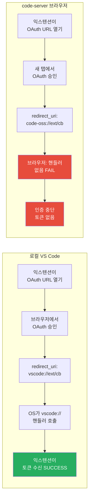

## 개요

`code-server`는 VS Code를 브라우저에서 실행할 수 있게 해주는 오픈소스 프로젝트다 (GitHub 76,491 stars, TypeScript 주요 언어). 서버에 code-server를 설치하고 브라우저로 접속하면 완전한 VS Code 개발 환경을 어디서든 사용할 수 있다는 것이 핵심 가치다. 그런데 바로 이 "브라우저에서 실행"이라는 특성이 OAuth 기반 인증을 사용하는 VSCode 익스텐션들에게 치명적인 문제를 일으킨다.

문제의 핵심은 URI 스킴이다. 로컬 VS Code는 `vscode://` 스킴을 통해 OAuth 리다이렉트를 처리한다. OS 레벨에서 `vscode://`로 시작하는 URL을 VS Code 프로세스로 라우팅하는 핸들러가 등록되어 있기 때문이다. 그러나 code-server 환경에서는 VS Code가 브라우저 탭으로 실행된다. 브라우저는 `code-oss://` 스킴을 알지 못하고, OS 레벨 핸들러도 없다. 결과적으로 OAuth 인증 완료 후 리다이렉트 단계에서 인증 플로우가 완전히 중단된다. 이 글에서는 이 문제의 기술적 구조를 분석하고 올바른 해결책을 정리한다.

## 문제의 본질 — vscode:// vs code-oss:// URI 스킴

로컬 VS Code에서 OAuth를 사용하는 익스텐션은 보통 다음과 같은 흐름으로 인증을 처리한다. 익스텐션이 OAuth 제공자의 인증 URL을 브라우저로 열고, 사용자가 로그인 및 권한 승인을 완료하면 제공자가 미리 등록된 `redirect_uri`로 리다이렉트한다. 이때 `redirect_uri`는 `vscode://extension-name/auth-callback` 형태이고, OS가 이 스킴을 인식해 VS Code 프로세스를 깨워 해당 URI를 전달한다. 익스텐션은 이 URI에서 authorization code를 추출해 액세스 토큰을 교환한다.

code-server 환경에서는 VS Code 자체의 URI 스킴이 `code-oss://`로 바뀐다. 이는 code-server가 사용하는 VS Code 포크(fork)인 Code-OSS의 기본 스킴이다. 문제는 이 스킴이 브라우저나 OS에 전혀 등록되어 있지 않다는 것이다. `code-oss://augment.vscode-augment/auth/...` 같은 URL로 리다이렉트가 발생하면 브라우저는 다음과 같은 에러를 표시한다.

```
Failed to launch 'code-oss://{extension_name}?{params}'
because the scheme does not have a registered handler
```

code-server Issue #6584에서 Augment Code 익스텐션 사용자 `@tianze0926`이 정확히 이 증상을 보고했다. 인증 완료 후 `code-oss://augment.vscode-augment/auth/...` URI가 자동으로 열리지 않아 수동으로 복사해야 하는 상황이었다. 이 이슈는 code-server 고유의 문제가 아니라 브라우저 기반 VS Code 환경 전반의 구조적 한계에서 비롯된 것이다.

## 브라우저 환경에서 OAuth가 실패하는 이유



로컬 VS Code와 code-server의 OAuth 플로우 차이를 도식화하면 위와 같다. 로컬 환경에서는 OS 레벨 URI 스킴 핸들러가 중간에서 브릿지 역할을 해준다. macOS는 Info.plist에 등록된 URL scheme으로, Windows는 레지스트리를 통해, Linux는 XDG 설정을 통해 `vscode://` URL을 VS Code 프로세스로 전달한다. 이것이 가능한 이유는 VS Code 설치 시 OS에 해당 스킴 핸들러를 등록하기 때문이다.

반면 code-server는 브라우저 탭으로 실행된다. 브라우저 내에서 새로운 탭이나 팝업으로 OAuth 인증을 진행하고, 인증이 완료되면 OAuth 제공자는 등록된 redirect_uri로 리다이렉트를 시도한다. 그런데 `code-oss://` 스킴은 브라우저의 커스텀 프로토콜 핸들러 목록에 없다. 브라우저는 이 URL을 어떻게 처리해야 할지 모르고 에러를 반환한다. code-server maintainer `@code-asher`의 분석처럼, 이 문제를 해결하려면 VS Code 자체를 수정하거나, 익스텐션이 다른 인증 방식을 택해야 한다.

polling 방식은 이 문제에 대한 초기 해결책으로 자주 언급되었다. OAuth 리다이렉트 대신 익스텐션이 자체 서버 엔드포인트를 열고, 클라이언트 측에서 주기적으로 해당 엔드포인트를 폴링해 토큰이 전달되었는지 확인하는 방식이다. 이는 redirect_uri를 `https://extension-server.com/callback` 형태의 일반 HTTPS URL로 바꿀 수 있어 브라우저 스킴 문제를 우회한다. 그러나 별도 서버 인프라가 필요하고, 토큰이 중간 서버를 거친다는 보안 우려가 있어 완전한 해결책은 아니다.

## registerUriHandler — 올바른 해결책

VSCode Extension API의 `vscode.window.registerUriHandler`는 이 문제의 공식적인 해결책이다. 익스텐션이 `vscode://publisher.extension-name/path` 형태의 URI에 대한 핸들러를 직접 등록할 수 있게 해주는 API다. code-server 환경에서 이 API를 사용하면, code-server 서버 측이 외부에서 들어오는 해당 URI 요청을 가로채 익스텐션 핸들러로 라우팅해준다.

동작 원리는 다음과 같다. code-server는 웹 서버 형태로 실행되므로, OAuth redirect_uri를 `https://your-code-server.com/vscode-extension/callback` 같은 일반 HTTPS URL로 설정할 수 있다. 인증이 완료되면 이 HTTPS 엔드포인트가 호출되고, code-server는 이를 내부적으로 `vscode://` URI 이벤트로 변환해 익스텐션 핸들러에 전달한다. 즉, 브라우저의 커스텀 스킴 문제를 HTTP/HTTPS 레이어에서 우회하는 것이다.

```typescript
// 올바른 방법 — registerUriHandler 사용
import * as vscode from 'vscode';

export function activate(context: vscode.ExtensionContext) {
    // vscode://publisher.my-extension/auth-callback URI 핸들러 등록
    const uriHandler = vscode.window.registerUriHandler({
        handleUri(uri: vscode.Uri): void {
            if (uri.path === '/auth-callback') {
                const params = new URLSearchParams(uri.query);
                const code = params.get('code');
                const state = params.get('state');

                if (code && state) {
                    // authorization code로 토큰 교환
                    exchangeCodeForToken(code, state);
                }
            }
        }
    });

    context.subscriptions.push(uriHandler);
}

// OAuth 시작 시 redirect_uri 설정
function startOAuthFlow() {
    // code-server 환경에서는 HTTPS로 변환되어 라우팅됨
    const redirectUri = vscode.env.uriScheme + '://publisher.my-extension/auth-callback';
    const authUrl = buildOAuthUrl({ redirect_uri: redirectUri });
    vscode.env.openExternal(vscode.Uri.parse(authUrl));
}
```

```typescript
// 잘못된 방법 — 하드코딩된 code-oss:// 스킴
function startOAuthFlowBroken() {
    // code-server 브라우저 환경에서는 이 URL을 열 수 없음
    const redirectUri = 'code-oss://extension-name/auth-callback';
    const authUrl = buildOAuthUrl({ redirect_uri: redirectUri });
    vscode.env.openExternal(vscode.Uri.parse(authUrl));
    // 브라우저: "the scheme does not have a registered handler" 에러
}
```

`vscode.env.uriScheme`을 사용하는 것이 핵심이다. 이 값은 로컬 VS Code에서는 `vscode`, code-server에서는 `code-oss` 또는 환경에 따른 적절한 값을 반환한다. 하드코딩 없이 동적으로 현재 환경의 스킴을 감지해 redirect_uri를 구성할 수 있다. GitLens가 이 패턴을 성공적으로 구현했으며, code-server maintainer가 GitLens 소스코드를 참조 구현으로 언급했다. 커뮤니티 확인 결과 GitLens는 code-server 환경에서도 OAuth 인증이 정상 동작한다.

## 팝업 창 API 요청 (VSCode #142080)

VSCode 이슈 #142080은 OAuth2 인증을 팝업 창으로 처리하는 Extension API 추가를 요청한다. 현재는 새 탭(new tab)으로만 OAuth 창을 열 수 있는데, 팝업 창을 사용하면 인증 완료 후 스크립트로 창을 자동으로 닫을 수 있어 사용자 경험이 훨씬 개선된다.

VSCode 팀의 `@TylerLeonhardt`는 `vscode.dev`에서 GitHub Authentication 익스텐션이 팝업 처리를 받는 것은 하드코딩된 URI 화이트리스트를 통해서라고 설명했다. 즉, 일반 익스텐션이 사용할 수 있는 공식 API가 아닌 특별 처리다. Electron 담당자 `@deepak1556`은 데스크톱 환경에서는 OS 플랫폼 핸들러(XDGOpen, OpenURL, ShellExecuteW)에 위임하는 방식이라 범용 팝업 API 구현이 복잡하다고 밝혔다. 웹 임베딩 환경에서는 구현 가능성이 있다는 의견도 나왔다.

이 이슈는 현재 OPEN 상태이며 커뮤니티 업보트 대기 중(20 upvotes 필요)이다. GitHub Authentication 익스텐션만 특별 팝업 처리를 받는 현 상황은 커뮤니티의 불만 사항 중 하나다. 일반 익스텐션도 동일한 사용자 경험을 제공할 수 있는 공식 API가 제공되어야 한다는 것이 이슈의 핵심 요구사항이다.

## window.close()의 브라우저 제약

OAuth 팝업 창을 사용하려면 `window.close()`로 인증 완료 후 창을 닫아야 한다. 그런데 브라우저에는 `window.close()`에 대한 중요한 제약이 있다. MDN 스펙에 따르면 스크립트로 창을 닫을 수 있는 것은 스크립트로 열린 창(via `window.open()`)과 링크/폼으로 열렸지만 사용자 수정 동작 없이 열린 창에 한정된다.

사용자가 Ctrl+Click이나 마우스 중간 버튼으로 직접 새 탭을 연 경우는 스크립트로 닫을 수 없다. Chrome은 이 경우 콘솔에 다음 메시지를 출력한다.

```
Scripts may not close windows that were not opened by script.
```

OAuth 팝업 패턴이 올바르게 동작하려면 반드시 `window.open()`으로 팝업 창을 열어야 한다. 인증 완료 페이지에서 `window.opener`를 통해 부모 창에 메시지를 전달하고 (`window.opener.postMessage()`), 그 후 `window.close()`를 호출하는 방식이다. 이 패턴은 OAuth 팝업 구현의 표준적인 접근법이다.

```javascript
// OAuth 시작 측 (익스텐션/앱)
const popup = window.open(authUrl, 'oauth-popup', 'width=600,height=700');

window.addEventListener('message', (event) => {
    if (event.source === popup && event.data.type === 'oauth-success') {
        const { code, state } = event.data;
        // 토큰 교환 진행
        exchangeCodeForToken(code, state);
    }
});

// OAuth 콜백 페이지 (redirect_uri)
// 인증 완료 후 부모 창에 코드 전달하고 팝업 닫기
window.opener.postMessage({
    type: 'oauth-success',
    code: new URLSearchParams(location.search).get('code'),
    state: new URLSearchParams(location.search).get('state')
}, '*');
window.close(); // window.open()으로 열렸으므로 닫기 가능
```

## WSL1에서의 디버거 Detach 이슈

VSCode 이슈 #1650(vscode-js-debug)은 언뜻 OAuth 문제처럼 보이지만 실제로는 다른 원인이었다. Chrome 디버그 세션이 OAuth 리다이렉트(크로스 도메인 탐색) 시 연결이 끊어진다는 보고였다. vscode-js-debug maintainer `@connor4312`는 "일단 연결되면 연결이 유지되어야 하며 알려진 이슈가 없다"고 응답했다.

실제 원인을 조사한 결과 **WSL1의 네트워크 격리**가 문제였다. WSL1은 Linux 커널 없이 Windows 커널 위에서 Linux 시스템 콜을 번역하는 방식으로 동작하는데, 이 구조 때문에 네트워크 인터페이스가 제대로 공유되지 않는 케이스가 있다. Chrome DevTools Protocol 연결이 WSL1의 네트워크 레이어를 거치면서 OAuth 리다이렉트 시 끊어지는 것이었다. 해결책은 VSCode를 WSL1이 아닌 Windows에서 직접 실행하거나, WSL2로 마이그레이션하는 것이다. WSL2는 실제 Linux 커널을 사용해 네트워크 격리 문제가 없다.

이 이슈는 code-oss 스킴 문제와 별개로 "브라우저/원격 환경에서 VSCode 익스텐션 개발이 로컬 환경과 다른 맥락에서 동작한다"는 더 넓은 패턴의 사례다. WSL, Docker, code-server, vscode.dev 등 다양한 환경에서 익스텐션이 사용되는 현실에서 익스텐션 개발자는 각 환경의 차이를 깊이 이해해야 한다.

## 빠른 링크

- [code-server GitHub](https://github.com/coder/code-server) — 76,491 stars, TypeScript 오픈소스 프로젝트
- [code-server Issue #6584](https://github.com/coder/code-server/issues/6584) — code-oss:// 스킴 OAuth 실패 이슈 (CLOSED)
- [VSCode Issue #142080](https://github.com/microsoft/vscode/issues/142080) — OAuth2 팝업 창 Extension API 요청 (OPEN)
- [VSCode API: registerUriHandler](https://code.visualstudio.com/api/references/vscode-api#window.registerUriHandler) — 공식 API 문서
- [MDN: window.close()](https://developer.mozilla.org/en-US/docs/Web/API/Window/close) — 브라우저 창 닫기 제약 설명
- [GitLens Extension](https://github.com/gitkraken/vscode-gitlens) — registerUriHandler 참조 구현

## 인사이트

code-server의 OAuth 문제는 "브라우저에서 실행되는 VS Code"라는 개념이 얼마나 복잡한 호환성 도전을 수반하는지 잘 보여준다. 로컬 환경에서 당연하게 동작하는 OS 레벨 URI 스킴 핸들러가 브라우저 샌드박스 안에서는 존재하지 않으며, 이 간극을 메우는 것은 code-server 팀이 단독으로 해결할 수 없는 VS Code 코어 레벨의 문제다. `registerUriHandler` API가 해결책으로 존재하지만, 모든 익스텐션 개발자가 이 API를 알고 올바르게 사용하는 것은 아니다 — Augment Code 같은 상용 제품조차 이 문제에 부딪혔다. GitLens가 성공적인 참조 구현을 제공했다는 점은 오픈소스 커뮤니티의 지식 공유 가치를 다시 한번 증명한다. `vscode.env.uriScheme`을 사용해 환경을 동적으로 감지하는 패턴은 로컬/원격/브라우저 환경을 모두 지원해야 하는 모든 VSCode 익스텐션 개발자가 반드시 숙지해야 하는 기법이다. 팝업 창 API(#142080)가 정식 API로 표준화된다면 OAuth UX가 크게 개선되겠지만, GitHub Auth만 특별 대우받는 현 상황이 개선될지는 불투명하다. WSL1 디버거 이슈는 별도의 교훈을 준다 — 네트워킹 문제는 코드 버그가 아닌 실행 환경의 구조적 차이에서 비롯될 수 있으므로, 환경 진단이 디버깅의 첫 단계가 되어야 한다.
