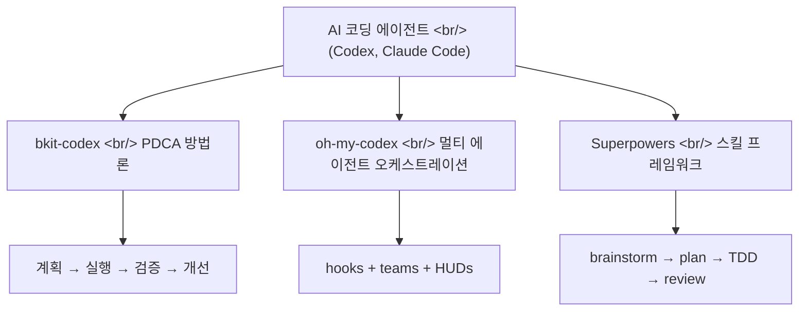
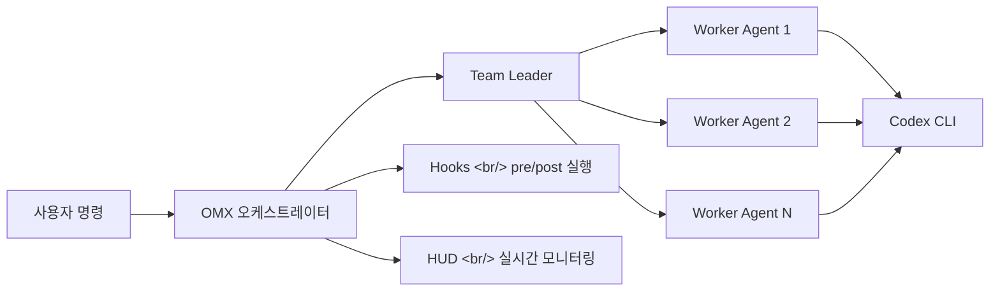

## 개요

AI 코딩 에이전트를 "그냥 쓰는" 시대에서 "구조화해서 쓰는" 시대로 넘어가고 있다. OpenAI Codex와 Claude Code 위에 얹어서 에이전트의 행동을 제어하고, 팀 워크플로우를 구성하고, 개발 방법론을 강제하는 확장 프레임워크 3종을 비교한다.

<!--more-->

## bkit-codex — PDCA + Context Engineering

[bkit-codex](https://github.com/popup-studio-ai/bkit-codex)는 OpenAI Codex CLI 확장으로, PDCA(Plan-Do-Check-Act) 방법론과 Context Engineering 아키텍처를 통해 AI 네이티브 개발 워크플로우를 제공한다.

### Context Engineering이란

AI에게 전달되는 컨텍스트 토큰을 체계적으로 큐레이션하는 방법론이다. 단순히 프롬프트를 잘 쓰는 것을 넘어, 어떤 정보를 어떤 순서로 AI에게 제공할지를 구조화한다.

### 핵심 구성

- **PDCA 사이클**: Plan(계획서 작성) → Do(코드 생성) → Check(테스트/검증) → Act(개선/배포)
- **Skills**: 재사용 가능한 에이전트 행동 모듈
- **Pipeline**: 여러 스킬을 체이닝하여 복잡한 워크플로우 구성
- **MCP 통합**: Model Context Protocol을 통한 도구 연동

### 기술 스택

JavaScript 기반, Apache 2.0 라이센스, 10 Stars

## oh-my-codex (OMX) — 멀티 에이전트 오케스트레이션

[oh-my-codex](https://github.com/Yeachan-Heo/oh-my-codex)는 OpenAI Codex CLI 위에 멀티 에이전트 오케스트레이션 레이어를 추가한다. 1,744 Stars로 이 분야에서 가장 활발한 커뮤니티를 보유하고 있다.

### 핵심 기능

- **Agent Teams**: 여러 에이전트가 역할을 분담하여 협업 (리더/워커 구조)
- **Hooks**: 에이전트 실행 전/후에 커스텀 로직 삽입
- **HUDs (Head-Up Displays)**: 에이전트 상태를 실시간 모니터링
- **Harness**: 에이전트 실행 환경을 표준화하고 패키징
- **OpenClaw 통합**: 알림 게이트웨이를 통한 에이전트 상태 알림

### 아키텍처

### 기술 스택

TypeScript 기반, MIT 라이센스, 1,744 Stars, v0.8.12

## Superpowers — 스킬 기반 개발 방법론

[Superpowers](https://github.com/obra/superpowers)는 76,619 Stars라는 압도적인 인기를 자랑하는 에이전트 스킬 프레임워크다. 단순한 도구가 아니라 **완전한 소프트웨어 개발 방법론**을 제공한다.

### 철학

코딩 에이전트가 "코드부터 쓰지 않는다"는 원칙에서 출발한다. 대신:

1. **Brainstorming**: 무엇을 만들려는지 사용자에게 질문
2. **Spec Review**: 스펙을 소화 가능한 단위로 쪼개어 검토
3. **Implementation Plan**: "열정적이지만 경험 부족한 주니어 엔지니어"도 따를 수 있는 구현 계획
4. **Subagent-Driven Development**: 서브에이전트가 각 태스크를 수행, 메인 에이전트가 검수
5. **TDD + YAGNI + DRY**: 테스트 주도 개발과 간결함을 강제

### 주요 스킬

- `brainstorming` — 기능 구현 전 요구사항 탐색
- `writing-plans` — 구현 계획 수립
- `test-driven-development` — Red/Green TDD 강제
- `systematic-debugging` — 체계적 디버깅 워크플로우
- `dispatching-parallel-agents` — 독립 태스크 병렬 처리
- `verification-before-completion` — 완료 전 검증 강제

### 기술 스택

Shell + JavaScript, v5.0.0, 76,619 Stars

## 3종 비교

| 기준 | bkit-codex | oh-my-codex | Superpowers |
|------|-----------|------------|-------------|
| **대상 에이전트** | Codex CLI | Codex CLI | Claude Code + 범용 |
| **핵심 가치** | PDCA 방법론 | 멀티 에이전트 협업 | 개발 방법론 강제 |
| **Stars** | 10 | 1,744 | 76,619 |
| **언어** | JavaScript | TypeScript | Shell |
| **팀 기능** | Pipeline | Agent Teams | Subagent |
| **모니터링** | 리포트 | HUD 실시간 | 검증 체크리스트 |

## 빠른 링크

- [Claude Code 제대로 쓰고 싶다면 — bkit으로 AI 코딩 완전 정복](https://www.youtube.com/watch?v=NZGONJIWmj8) — 58분 분량의 bkit 활용 실습 영상

## 인사이트

세 프레임워크의 공통점은 "AI에게 구조를 부여한다"는 것이다. 이것이 2026년 AI 코딩의 핵심 트렌드다.

bkit-codex는 제조업의 PDCA를 소프트웨어에 접목한 실험적 시도, oh-my-codex는 Codex를 팀으로 확장하려는 실용적 접근, Superpowers는 76K Stars가 증명하듯 가장 검증된 방법론이다.

특히 Superpowers의 "코딩 에이전트가 코드부터 쓰지 않게 만든다"는 철학은 인상적이다. 인간 개발자에게도 좋은 교훈 — 설계 없이 코딩에 뛰어드는 것은 AI든 사람이든 비효율적이라는 것.

AI가 코드를 "짜는" 능력은 이미 충분하다. 이제 필요한 것은 AI가 코드를 "잘 짜게" 만드는 프레임워크이며, 이 세 프로젝트가 그 방향을 선도하고 있다.
