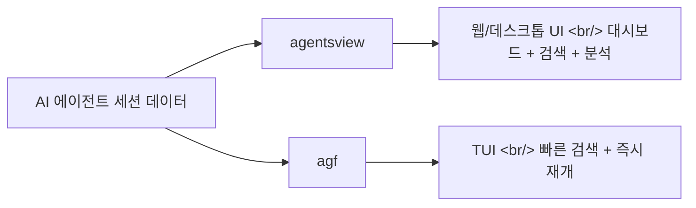
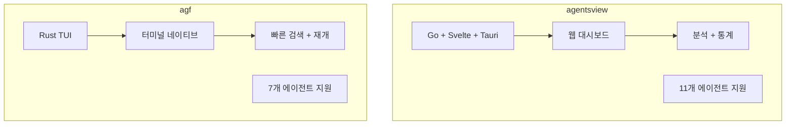

## 개요

AI 코딩 에이전트를 본격적으로 사용하다 보면 세션이 수십 개씩 쌓인다. 어떤 프로젝트에서 어떤 작업을 했는지, 어디서 중단했는지 기억하기 어렵다. 이 문제를 해결하기 위해 등장한 두 도구 — **agentsview**와 **agf** — 를 비교 분석한다.

<!--more-->



## agentsview — 세션 분석 대시보드

[agentsview](https://github.com/wesm/agentsview)는 AI 에이전트 코딩 세션을 브라우징, 검색, 분석하는 로컬 퍼스트 데스크톱/웹 애플리케이션이다. Go 백엔드 + Svelte 프론트엔드 + Tauri 데스크톱 앱으로 구성되어 있다.

### 지원 에이전트

Claude Code, Codex, OpenCode를 포함해 **11개 이상의 AI 코딩 에이전트**를 지원한다. 각 에이전트의 세션 로그를 파싱하여 통합된 뷰를 제공한다.

### 주요 특징

- **대시보드**: 프로젝트별, 에이전트별 사용량 통계와 시각화
- **전문 검색**: 세션 내용을 텍스트 검색하여 "그때 뭘 했더라?" 질문에 답할 수 있음
- **로컬 퍼스트**: 모든 데이터가 로컬에 저장되어 프라이버시 보장
- **데스크톱 앱**: macOS/Windows 인스톨러 제공, 자동 업데이트 지원

### 설치

```bash
# CLI
curl -fsSL https://agentsview.io/install.sh | bash

# 데스크톱 앱
# GitHub Releases에서 다운로드
```

### 기술 스택

| 구성 | 기술 |
|------|------|
| 백엔드 | Go 1.25+ |
| 프론트엔드 | Svelte + TypeScript |
| 데스크톱 | Tauri (Rust) |
| Stars | 453 |

## agf — 터미널 세션 파인더

[agf](https://github.com/subinium/agf)는 한국 개발자 subinium이 만든 TUI 기반 에이전트 세션 관리 도구다. Rust로 작성되어 빠르고, 설치가 간단하다.

### 해결하려는 문제

에이전트 사용자들의 전형적인 경험을 이렇게 설명한다:

1. 어떤 프로젝트에서 작업하고 있었는지 기억나지 않음
2. 잘못된 디렉토리로 `cd`
3. 세션 ID를 기억하려고 시도
4. 포기하고 새 세션 시작

### 주요 특징

- **통합 뷰**: Claude Code, Codex, OpenCode, pi, Kiro, Cursor CLI, Gemini 지원
- **퍼지 검색**: 프로젝트 이름으로 즉시 검색
- **원키 재개**: 선택한 세션을 Enter 한 번으로 재개
- **Resume Mode Picker**: Tab으로 재개 모드 선택 (v0.5.5)
- **Worktree 스캔**: 병렬화된 worktree 스캔으로 삭제된 프로젝트도 추적

### 설치

```bash
brew install subinium/tap/agf
agf setup
# 이후 셸 재시작하고 agf 입력
```

### Quick Resume

```bash
agf resume project-name   # 퍼지 매칭으로 바로 재개
```

## 두 도구 비교



| 기준 | agentsview | agf |
|------|-----------|-----|
| **인터페이스** | 웹/데스크톱 GUI | TUI (터미널) |
| **주요 용도** | 세션 분석 + 검색 | 빠른 세션 재개 |
| **언어** | Go + Svelte | Rust |
| **설치** | curl or 데스크톱 앱 | Homebrew |
| **Stars** | 453 | 99 |
| **지원 에이전트** | 11개+ | 7개 |

## 인사이트

AI 코딩 에이전트의 세션 관리 도구가 등장했다는 것 자체가 이 생태계의 성숙도를 보여준다. 에디터 플러그인처럼, 에이전트도 이제 "사용하는 것" 자체보다 "잘 관리하는 것"이 생산성의 핵심이 되고 있다.

agentsview는 "이번 주에 AI와 뭘 했지?"라는 회고적 질문에 강하고, agf는 "방금 하던 거 이어서"라는 즉시적 니즈에 강하다. 두 도구 모두 로컬 퍼스트라는 점이 인상적이다 — AI 세션 데이터가 클라우드로 빠져나갈 걱정 없이 사용할 수 있다. 결국 두 도구는 경쟁이 아니라 보완 관계에 있다.
