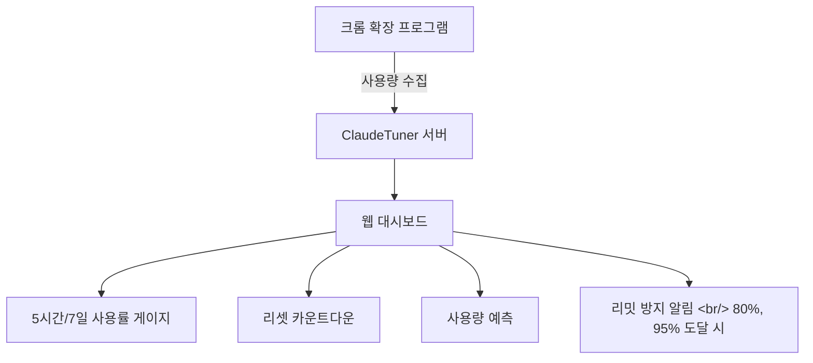

## 개요

Claude Opus 4.6의 품질 향상으로 업무에 Claude를 더 많이 사용하게 되면서, "내가 이 플랜을 제대로 활용하고 있나?", "리밋까지 얼마나 남았지?"라는 질문이 자연스럽게 생긴다. [ClaudeTuner](https://news.hada.io/topic?id=27171)는 이 문제를 해결하는 크롬 확장 + 웹 대시보드다.

<!--more-->

## 주요 기능

### 개인 사용량 모니터링

크롬 확장을 설치하고 Claude에서 로그인하면 사용량이 자동 수집된다. Claude Code 사용량도 합산 추적된다.

- **5시간/7일 사용률 게이지바**: 현재 사용 상태를 한눈에 확인
- **리셋 카운트다운**: 다음 리셋까지 남은 시간 표시
- **사용량 예측**: 현재 속도 기준으로 리셋 시점의 예상 사용률 계산
- **리밋 방지 알림**: 80%, 95% 도달 시 브라우저 알림으로 속도 조절 유도
- **시간대별 사용 패턴**: 언제 가장 많이 사용하는지 분석

### B2B 비용 최적화

Claude Team 플랜을 사용하는 조직을 위한 관리 기능도 제공한다. 팀원별 사용량을 추적하고, 실제 사용 패턴에 맞는 최적 플랜을 추천한다.

## 데이터 수집 방식

크롬 확장이 Claude 웹사이트에서 사용량 데이터를 주기적으로 읽어온다. 최초 로그인 이후에는 자동 수집되므로 별도 작업이 필요 없다.

## 인사이트

AI 도구의 사용량 관리가 하나의 독립된 소프트웨어 카테고리가 되고 있다는 점이 흥미롭다. 구독 비용 대비 실제 사용량을 데이터로 보여주는 도구의 등장은, AI 도구가 이제 "써보는 것"에서 "관리하는 것"으로 전환되고 있음을 의미한다. 팀 관리 기능까지 제공하는 것은 기업에서 AI 도구 비용 최적화가 현실적 이슈가 되었다는 반증이기도 하다.
