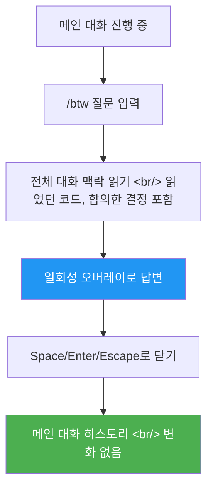

## 개요

Claude Code로 복잡한 리팩토링을 진행하다가 문득 궁금한 게 생긴다. "이 함수가 deprecated된 이유가 뭐였지?" 이걸 메인 프롬프트에 입력하면 대화 히스토리가 더러워지고, 에이전트가 맥락을 잃을 수도 있다. `/btw`는 이 문제를 해결하는 **사이드 질문** 기능이다.

<!--more-->

## /btw의 동작 원리



핵심 특징:

- **맥락 접근**: 현재 대화의 전체 맥락을 그대로 볼 수 있다. 이미 읽었던 코드, 앞에서 합의한 결정, 방금까지의 논의 내용을 기반으로 답한다.
- **히스토리 비오염**: 질문과 답변은 일회성 오버레이로 처리되고, 메인 대화 기록에는 남지 않는다.
- **비간섭 실행**: Claude가 메인 답변을 생성 중인 상황에서도 `/btw`를 실행할 수 있다. 메인 응답을 중단시키지 않는다.

## /btw vs 서브에이전트: 용도 분리

| 특성 | /btw | 서브에이전트 |
|------|------|-------------|
| **맥락** | 전체 대화 맥락 접근 ✓ | 새 세션, 맥락 없음 |
| **도구 사용** | 불가 ✗ | 가능 ✓ |
| **대화 형태** | 단발성 (1회 응답) | 멀티턴 가능 |
| **히스토리** | 남지 않음 | 결과만 반환 |
| **비용** | 프롬프트 캐시 재사용 (저비용) | 새 세션 비용 |

정리하면:

- **"이미 알고 있을 법한 것"을 확인** → `/btw`
- **"새로 조사/탐색이 필요한 것"을 수행** → 서브에이전트

## 제약사항

### 도구 접근 불가

`/btw`는 파일 읽기, 명령 실행, 웹 검색 등 **일체의 도구를 사용할 수 없다**. 현재 대화 맥락에 이미 들어 있는 정보만으로 답한다. 이 제약은 의도적이다 — 도구 호출이 끼어들면 사이드 질문이 메인 작업에 영향을 줄 수 있기 때문이다.

### 단발성 대화

후속 질문으로 이어지는 핑퐁 대화가 필요하면 `/btw`가 아니라 일반 프롬프트를 사용해야 한다. `/btw`는 말 그대로 "by the way(참고로)" — 한 번 물어보고 넘어가는 용도다.

## 비용 관점

`/btw`는 부모 대화의 **프롬프트 캐시를 재사용**하도록 설계되어 있다. 새로운 컨텍스트를 구성하지 않으니 추가 비용이 최소화된다. Claude Code의 토큰 비용이 신경 쓰이는 상황에서, 빠른 확인성 질문은 `/btw`가 경제적이다.

## 실전 활용 패턴

```
# 리팩토링 중 빠른 확인
/btw 이 파일에서 아까 deprecated라고 했던 메서드가 정확히 어떤 거였지?

# 코드 리뷰 중 컨벤션 확인
/btw 우리 프로젝트에서 에러 핸들링 패턴이 try-catch였나 Result 타입이었나?

# 설계 논의 중 이전 결정 참조
/btw 아까 데이터베이스 선택할 때 PostgreSQL로 가기로 한 이유가 뭐였지?
```

## 인사이트

`/btw`는 작은 기능처럼 보이지만, Claude Code의 대화 모델에서 중요한 빈 공간을 채운다. 메인 대화를 오염시키지 않으면서 맥락을 활용하는 방법이 없었다. 이는 개발자가 실제로 작업할 때의 사고 패턴 — "잠깐, 이거 뭐였더라?" — 을 반영한 설계다. 도구 접근 제한과 단발성이라는 제약도, 사이드 질문이 메인 워크플로우를 방해하지 않도록 하는 의도적인 가드레일이다.
