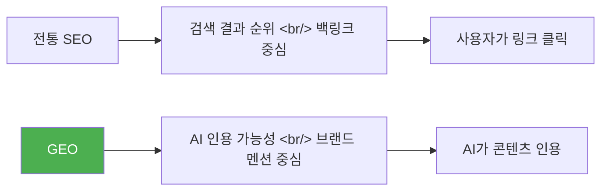
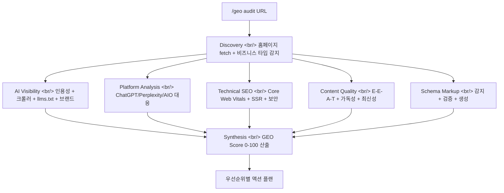

## 개요

Google 검색 트래픽이 2028년까지 50% 감소할 것이라는 Gartner 예측, AI 추천 트래픽의 전년 대비 527% 성장, AI 트래픽의 오가닉 대비 4.4배 높은 전환율 — 이 숫자들이 말하는 건 분명하다. SEO의 무게중심이 **GEO(Generative Engine Optimization)**로 이동하고 있다. [geo-seo-claude](https://github.com/zubair-trabzada/geo-seo-claude)는 이 전환을 Claude Code 스킬 하나로 대응하는 도구다.

<!--more-->

## GEO란 무엇인가

GEO는 ChatGPT, Claude, Perplexity, Gemini, Google AI Overviews 같은 **AI 검색 엔진에 최적화**하는 것을 말한다. 전통 SEO가 "검색 결과 페이지에서 링크를 클릭하게 만드는 것"이었다면, GEO는 "AI가 내 콘텐츠를 인용하게 만드는 것"이다.



핵심 지표의 변화:

| 지표 | 값 |
|------|-----|
| GEO 서비스 시장 | $850M+ (2031년 $7.3B 전망) |
| 백링크 vs 브랜드 멘션 (AI 가시성) | 브랜드 멘션이 **3배** 더 강한 상관관계 |
| ChatGPT와 Google AIO 동시 인용 도메인 | **11%** 뿐 |
| GEO에 투자 중인 마케터 | **23%** 뿐 |

## 아키텍처: 5개 병렬 서브에이전트

geo-seo-claude의 설계가 흥미로운 건 Claude Code의 **스킬 + 서브에이전트** 패턴을 교과서적으로 보여주기 때문이다.



`/geo audit` 명령 하나로 5개 서브에이전트가 **동시에** 돌아간다:
1. **AI Visibility** — 인용성 점수, 크롤러 접근, llms.txt, 브랜드 멘션
2. **Platform Analysis** — ChatGPT, Perplexity, Google AIO별 최적화
3. **Technical SEO** — Core Web Vitals, SSR, 보안, 모바일
4. **Content Quality** — E-E-A-T, 가독성, 콘텐츠 최신성
5. **Schema Markup** — 감지, 검증, JSON-LD 생성

## 주요 기능

### AI 인용성(Citability) 점수

AI가 인용하기 좋은 텍스트 블록의 조건을 수치화한다. 최적 인용 패시지는 **134-167 단어**, 자기 완결적이고, 팩트 밀도가 높으며, 질문에 직접 답하는 형태다.

### AI 크롤러 분석

`robots.txt`에서 GPTBot, ClaudeBot, PerplexityBot 등 **14개 이상의 AI 크롤러** 접근 상태를 점검하고, 허용/차단 권장사항을 제공한다.

### 브랜드 멘션 스캔

백링크보다 AI 가시성에 **3배 더 강한 상관관계**를 보이는 브랜드 멘션을 YouTube, Reddit, Wikipedia, LinkedIn 등 7개 이상 플랫폼에서 스캔한다.

### llms.txt 생성

AI 크롤러가 사이트 구조를 이해할 수 있도록 하는 신규 표준인 `llms.txt` 파일을 분석하거나 생성한다.

## 점수 산출 방법론

| 카테고리 | 가중치 |
|----------|--------|
| AI 인용성 & 가시성 | 25% |
| 브랜드 권위 시그널 | 20% |
| 콘텐츠 품질 & E-E-A-T | 20% |
| 기술적 기반 | 15% |
| 구조화 데이터 | 10% |
| 플랫폼 최적화 | 10% |

## 설치와 사용

```bash
# 원커맨드 설치
curl -fsSL https://raw.githubusercontent.com/zubair-trabzada/geo-seo-claude/main/install.sh | bash

# Claude Code에서 사용
/geo audit https://example.com    # 전체 감사
/geo quick https://example.com    # 60초 스냅샷
/geo citability https://example.com  # 인용성 점수
/geo report-pdf                   # PDF 리포트 생성
```

Python 3.8+, Claude Code CLI, Git이 필요하고, Playwright는 선택 사항이다.

## 비즈니스 관점

도구 자체는 MIT 라이선스 무료다. 흥미로운 건 이 도구를 기반으로 한 **GEO 에이전시 비즈니스 모델**을 함께 제시한다는 점이다. GEO 에이전시의 월 과금 범위는 $2K~$12K. 도구가 감사를 수행하고, 커뮤니티에서 영업 방법을 가르치는 구조다. 스타 2,264개에 포크 369개 — Claude Code 스킬 중 상당한 규모다.

## 인사이트

geo-seo-claude가 보여주는 건 두 가지다. 첫째, Claude Code 스킬이 단순한 프롬프트 래퍼를 넘어 **11개 서브스킬 + 5개 병렬 서브에이전트 + Python 유틸리티**로 구성된 본격적인 소프트웨어 제품이 될 수 있다는 것. 둘째, AI 검색이 전통 검색을 대체하면서 SEO → GEO 전환이 실질적인 비즈니스 기회가 되고 있다는 것. "AI search is eating traditional search" — 이 도구의 슬로건이 현실이 되는 속도가 빠르다.
