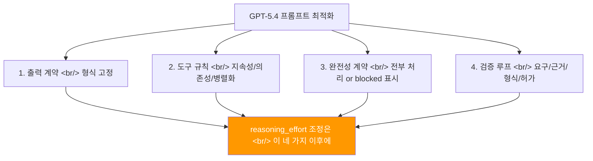
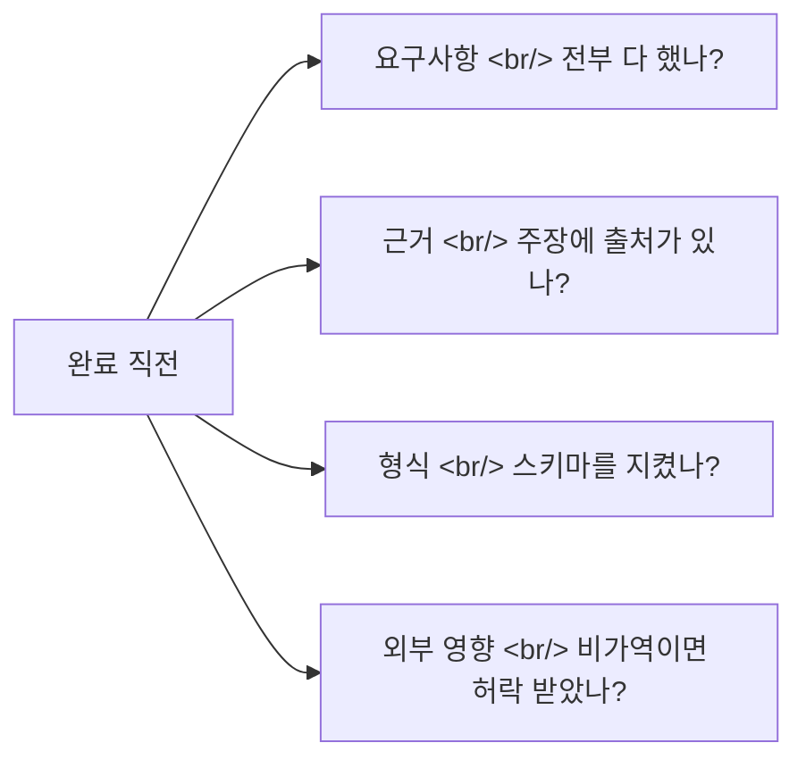

## 개요

GPT-5.4는 장문 유지, 멀티스텝 에이전트, 근거 기반 종합에 강하다. 하지만 이 장점은 자동으로 나오지 않는다. OpenAI의 공식 프롬프트 가이드가 제시하는 핵심 메시지는 명확하다 — **"더 생각하게 만들기"보다 "덜 흔들리게 만들기"가 먼저다**.

<!--more-->

## 네 가지 핵심 장치



추론 노력(`reasoning_effort`)을 올리는 건 **마지막 미세조정** 노브다. 대부분의 경우 위 네 가지 프롬프트 장치가 비용 대비 효과가 더 크다.

## 1. 출력 계약(Output Contract)

GPT-5.4가 "도움이 되려고" 중간 설명을 덧붙이며 형식을 깨는 걸 방지한다.

```xml
<output_contract>
- Return exactly the sections requested, in the requested order.
- If a format is required (JSON, Markdown, SQL, XML), output only that format.
</output_contract>
```

견적서처럼 작동한다. "결과물은 이 양식으로 납품"이라고 쓰면 과잉 친절이 줄고 파싱 실패도 감소한다.

## 2. 도구 지속성 규칙(Tool Persistence)

에이전트 실패의 가장 흔한 패턴: **"정답이 뻔해 보여서" 선행 조회를 건너뛰는 것**. 이를 막는 세 가지 원칙:

| 원칙 | 설명 |
|------|------|
| **강제 사용** | 정확도/근거/완성도를 올리면 도구를 써야 하고, 빈 결과면 다른 전략으로 재시도 |
| **의존성 체크** | 행동 전에 "선행 조회가 필요한지" 점검. "최종 상태가 obvious"여도 건너뛰기 금지 |
| **병렬/순차 분리** | 독립 조회는 병렬로 속도, 의존 단계는 순차로 정확성 확보 |

핵심: 도구 사용을 "선택"이 아니라 **"필요조건"**으로 만든다.

## 3. 완전성 계약(Completeness Contract)

긴 배치 작업에서 모델이 "대충 끝낸 것처럼" 마무리하는 문제를 해결한다.

- 요청 항목 **전부**를 처리했거나, 못 했으면 `[blocked]`로 표시
- 검색이 비었을 때 즉시 "없다"고 결론내리지 않고, **최소 1-2번 대체 전략** 시도
  - 다른 쿼리, 넓은 필터, 선행 조회, 다른 소스

이 두 규칙이 "긴 작업을 끝까지 가져가는 체력"을 프롬프트로 보강한다.

## 4. 검증 루프(Verification Loop)

완료 직전에 네 갈래 검증:



추가 게이팅 규칙: **"필요한 정보가 없으면 추측하지 말고, 가능하면 조회 도구를 쓰고, 불가하면 최소 질문만"**.

## 대화 중 요구 변경 대응

사용자는 중간에 방향을 자주 꺾는다. 이때의 기본 정책:

- **되돌릴 수 있고 저위험** → 묻지 말고 진행
- **외부 영향/비가역/민감정보** → 허락 요청
- **지시 우선순위**: 최신 사용자 지시가 기존 스타일 규칙을 덮되, 안전/정직/프라이버시는 예외 없이 유지

## 리서치 품질 고정

AI 리서치에서 가장 위험한 건 "어디까지가 근거이고 어디부터가 상상인지" 경계가 흐려지는 것.

- "이번 워크플로에서 실제로 가져온 소스만 인용" 규칙
- URL/ID/인용구 **지어내기 금지**
- 인용을 문서 끝에 몰지 말고 **해당 주장 바로 옆에** 배치
- 리서치 3단계 강제: 질문 쪼개기 → 각 질문 검색 + 2차 단서 → 모순 조정 후 인용 포함 결과 작성

## reasoning_effort 튜닝

| 작업 유형 | 권장 수준 |
|-----------|----------|
| 빠른 실행/추출/분류/짧은 변환 | `none` ~ `low` |
| 장문 종합/다문서 검토/전략 글쓰기 | `medium` 이상 |
| `xhigh` | 평가(evals)에서 확실히 이득이 보일 때만 |

마이그레이션 순서: 모델만 먼저 바꾸고 → 추론 노력 고정 → 평가 → 프롬프트 블록 추가 → 추론 노브 한 단계씩 조정.

## 인사이트

이 가이드의 교훈은 GPT-5.4에 국한되지 않는다. Claude, Gemini 등 모든 LLM 에이전트에 적용되는 보편적 패턴이다. **"규칙을 주면 규칙을 오래 기억하고 지키는"** 모델의 특성을 활용하는 것 — 출력 계약, 도구 강제, 완전성 계약, 검증 루프. 이 네 가지를 먼저 고정하고, 그래도 부족할 때만 추론 노력을 올리는 순서가 비용과 품질을 동시에 잡는 길이다. 결국 프롬프트 엔지니어링은 "AI에게 더 생각하라고 하는 것"이 아니라 "AI가 흔들릴 여지를 줄이는 것"이다.
