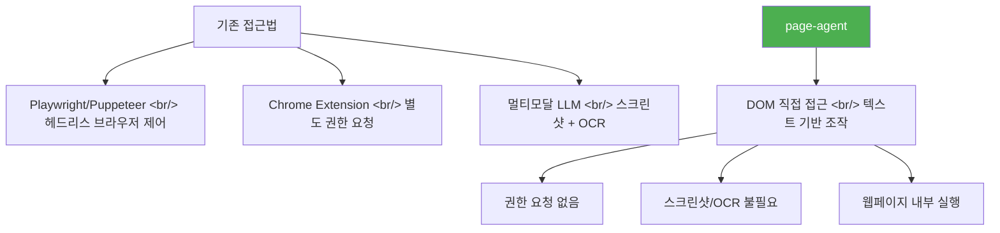

## 개요

웹페이지에 AI 에이전트를 붙이려면 보통 Playwright 같은 헤드리스 브라우저나 Chrome 확장 프로그램이 필요하다. 알리바바가 공개한 [page-agent](https://github.com/alibaba/page-agent)는 이 전제를 뒤집는다 — `<script src="page-agent.js"></script>` 한 줄이면 웹사이트가 AI 네이티브 앱으로 변한다.

<!--more-->

## 핵심 아키텍처: In-Page 실행 모델

page-agent의 가장 큰 차별점은 **in-page 실행 모델**이다. 기존 브라우저 자동화 도구들과의 차이를 보면:



모든 처리가 웹페이지 내부에서 수행된다. 별도 권한 요청 없이 DOM 요소를 직접 제어하고, 스크린샷이나 OCR, 멀티모달 LLM이 필요 없다. 텍스트 기반 DOM 조작이 핵심이라 속도도 빠르다.

## 사용 방법

### 코드에 직접 삽입

```html
<script src="page-agent.js"></script>
```

### 북마클릿으로 아무 사이트에 적용

코드에 넣지 않아도 북마클릿(bookmarklet)을 이용하면 **아무 웹사이트에나** 즉시 적용할 수 있다. 기본 북마클릿은 알리바바 서버를 거치지만, 원하는 LLM 엔드포인트로 변경 가능하다:

```javascript
javascript:(function(){
  import('https://cdn.jsdelivr.net/npm/page-agent@1.5.5/+esm')
    .then(module => {
      window.agent = new module.PageAgent({
        model: 'gpt-5.4',
        baseURL: '<your-api-url>',
        apiKey: '<your-api-key>'
      });
      if(window.agent.panel) window.agent.panel.show();
    })
    .catch(e => console.error(e));
})();
```

### 지원 모델

OpenAI, Claude, DeepSeek, Qwen 등 다양한 모델을 지원하며, Ollama를 통한 **완전 오프라인** 구동도 가능하다 (API 키 기반 통합).

## 활용 사례

| 사례 | 설명 |
|------|------|
| **SaaS AI Copilot** | 백엔드 수정 없이 제품 내 AI Copilot 구현 |
| **스마트 폼 자동화** | 다단계 클릭 과정을 한 문장으로 단축 (ERP/CRM/관리자 도구) |
| **접근성 강화** | 음성 명령과 스크린리더를 통한 웹 접근성 향상 |
| **관리자 도구 워크플로우** | CRUD만 만들고 순차적 지시로 워크플로우 자동 구성 |

GeekNews 커뮤니티에서는 특히 **관리자 도구**에 대한 반응이 뜨거웠다. "대충 CRUD만 만들고, 이거하고 저거하라고 순차적으로 시키면 워크플로우 만들어지는" 패턴이다. 실제로 토스증권에서 SOXL 30일 전 주가를 조회하는 데모에서 Playwright보다 훨씬 빠른 속도를 보였다는 후기도 있다.

## Chrome 확장 — 멀티 페이지 지원

단일 페이지 북마클릿 방식을 넘어, Chrome 확장을 설치하면 **멀티 페이지를 연결한 태스크**도 지원한다. 브라우저 레벨 제어와 외부 연동까지 가능해져, 단순 DOM 조작을 넘어선 복잡한 자동화 시나리오를 처리할 수 있다.

## 보안 고려사항

커뮤니티에서 지적된 핵심 우려는 보안이다. API 키가 클라이언트 사이드에 노출되는 구조이므로:

- 프로덕션 환경에서는 프록시 서버를 통한 API 키 관리 필수
- 내부 관리자 도구나 개발 환경에서의 활용이 가장 안전
- 기본 북마클릿의 알리바바 서버 경유가 우려되면 자체 LLM 엔드포인트 지정

MIT 라이선스로 공개되어 있어 포크 후 커스터마이징이 자유롭다.

## 인사이트

page-agent가 제시하는 "in-page 실행 모델"은 브라우저 자동화의 패러다임 전환이다. 기존에는 외부에서 브라우저를 제어했다면, 이제는 페이지 안에서 AI가 직접 DOM을 읽고 조작한다. 스크린샷 → OCR → 좌표 클릭의 무거운 파이프라인 대신, 텍스트 기반으로 DOM을 이해하니 속도와 정확도 모두 유리하다. 특히 SaaS 제품에 백엔드 변경 없이 AI Copilot을 삽입하는 시나리오는, 레거시 시스템 현대화의 새로운 경로가 될 수 있다.
