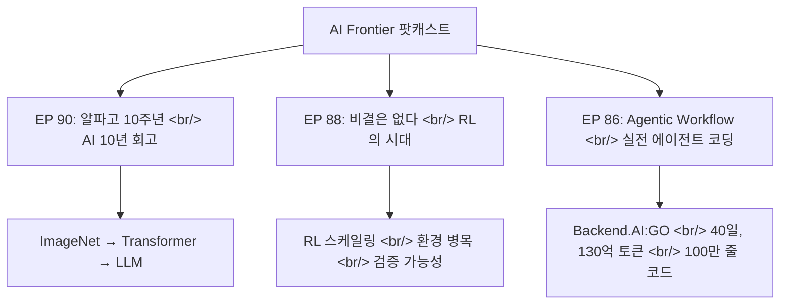
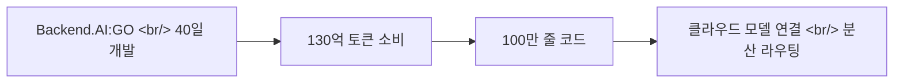

## 개요

한국 AI 커뮤니티의 대표 팟캐스트 AI Frontier에서 최근 공개한 3편의 에피소드를 정리한다. EP 90은 알파고 10주년 회고, EP 88은 RL 중심의 기술 혁신 트렌드, EP 86은 실전 에이전트 코딩 워크플로우를 다룬다. 세 편을 관통하는 키워드는 "검증 가능성"이다.

<!--more-->

## 탐색 맵

---

## EP 90: 알파고 이후, 10년

**게스트**: HyperAccel 이진원 CTO (추론 전용 AI 반도체 스타트업)

2026년 3월 14일(파이 데이)에 녹화된 이 에피소드는 알파고 대국 10주년을 계기로 딥러닝 10년사를 회고한다. 노정석, 최승준 호스트와 이진원 CTO가 함께했다.

**핵심 타임라인**:
- **ImageNet과 NPU 개발기**: 이진원 CTO가 삼성전자에서 딥러닝 NPU를 개발하던 시절의 이야기
- **프레임워크 변천**: Theano → Caffe → TensorFlow → PyTorch로 이어진 딥러닝 프레임워크의 진화
- **GAN에서 Transformer로**: GAN의 유행과 생성 AI의 시작, 그리고 Attention 메커니즘의 등장
- **BERT vs GPT**: 인코더(BERT)와 디코더(GPT)의 갈림길, GPT가 LLM으로 이어진 경로
- **한국 파운데이션 모델**: HyperCLOVA와 Stability AI 커뮤니티의 역할

Andrej Karpathy의 Autoresearch와 "검증 가능한 신호의 반복"이 키워드로 등장하며, Noam Brown이 알파고 10주년 포스팅에서 강조한 37수의 의미를 재조명한다.

---

## EP 88: 비결은 없다

**게스트**: 성현 (AI 연구자)

제목 그대로 — AI 기술에 단일한 "비밀 레시피"는 없다는 것이 핵심 메시지다.

**주요 논점**:
- **GLM 5 리포트와 RL**: Yao Shunyu의 "The Second Half" 논문이 제시한 RL 중심 패러다임. "비결은 없지만, 지금 가장 유력한 방향은 RL"이라는 결론
- **기본기의 시대**: 화려한 아키텍처 혁신보다 데이터 품질과 제품 감각이 중요해진 국면
- **Fog of Progress**: 미래 예측이 어려운 구조적 이유. 모델의 성능 곡선이 비선형이라 "올해 안에 될 것 같다"는 감각이 자주 틀림
- **환경 스케일링**: 에이전트 RL의 최대 병목은 모델이 아닌 "환경"의 확장. 시뮬레이션과 검증 가능한 환경을 얼마나 풍부하게 만드느냐가 핵심
- **컨텍스트 관리**: Sparse Attention과 멀티 에이전트 접근으로 컨텍스트 길이 한계를 우회하는 전략
- **하네스와 모델의 융합**: 제품과 모델의 경계가 흐려지는 현상. 좋은 하네스가 모델 성능을 끌어올림

---

## EP 86: 진짜 내 일을 위한 Agentic Workflow

**게스트**: 신정규 대표 (Lablup, Backend.AI)

가장 실전적인 에피소드다. Backend.AI:GO라는 제품을 **40일 만에, 130억 토큰을 사용해, 100만 줄의 코드**로 완성한 이야기를 중심으로 에이전트 코딩의 교훈을 풀어낸다.

**핵심 인사이트**:
- **토큰 경쟁력과 고속 inference**: 에이전트 코딩에서 inference 속도가 개발 생산성에 직결
- **바이오 토큰**: AI 시대에 "인간의 인지 부하"라는 개념. 사람이 처리할 수 있는 정보의 양에도 한계가 있다
- **소프트웨어 과잉 시대**: "인스턴트 앱"의 등장 — 코드의 가치가 0으로 수렴하는가?
- **Claude Code의 진짜 경쟁력은 harness다**: 모델 자체보다 모델을 감싸는 하네스(도구, 컨텍스트 관리, 워크플로우)가 차별화 요소
- **결과물이 아닌 생성 장치를 만든다**: 자동화의 핵심은 개별 결과가 아닌 결과를 만드는 시스템
- **AI에게 존댓말을 쓰는 이유**: (실제로 성능에 영향을 주는지는 불분명하지만) 프롬프트의 톤이 결과에 영향을 줄 수 있다는 경험적 관찰

Claude Code vs Codex의 철학 차이를 "사이버 포뮬러" 비유로 설명하는 부분이 인상적이다.

---

## 빠른 링크

- [AI Frontier EP 90](https://aifrontier.kr/ko/episodes/ep90) — 알파고 이후, 10년
- [AI Frontier EP 88](https://aifrontier.kr/ko/episodes/ep88) — 비결은 없다
- [AI Frontier EP 86](https://aifrontier.kr/ko/episodes/ep86) — 진짜 내 일을 위한 Agentic Workflow

## 인사이트

세 에피소드를 관통하는 키워드는 **"검증 가능성(verifiability)"**이다. EP 90에서 Karpathy가 강조한 "검증 가능한 신호의 반복", EP 88에서 RL 스케일링의 병목으로 지목된 "검증 가능한 환경", EP 86에서 신정규 대표가 말한 "결과물이 아닌 생성 장치" — 모두 같은 문제의 다른 단면이다. AI 모델이 강력해질수록 "이 결과가 맞는지 어떻게 아느냐"는 질문의 무게가 커진다. 기본기(데이터, 하네스, 환경)에 집중하라는 EP 88의 "비결은 없다"라는 결론이 가장 정직한 답일 것이다.
